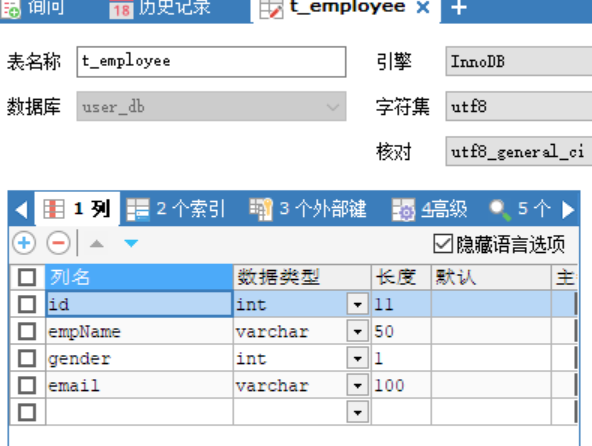
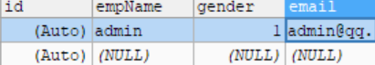
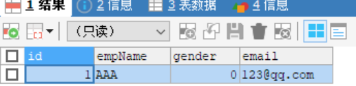
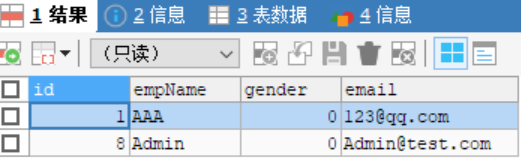

# 1.	HelloWorld

## 1.0	环境配置

### 1.0.1	导入依赖

```xml
<!--导入MyBatis框架-->
<!-- https://mvnrepository.com/artifact/org.mybatis/mybatis -->
<dependency>
    <groupId>org.mybatis</groupId>
    <artifactId>mybatis</artifactId>
    <version>3.4.6</version>
</dependency>

<!--导入log4j日志框架-->
<!-- https://mvnrepository.com/artifact/log4j/log4j -->
<dependency>
    <groupId>log4j</groupId>
    <artifactId>log4j</artifactId>
    <version>1.2.17</version>
</dependency>

<!--导入MySQL数据库驱动-->
<!-- https://mvnrepository.com/artifact/mysql/mysql-connector-java -->
<dependency>
    <groupId>mysql</groupId>
    <artifactId>mysql-connector-java</artifactId>
    <version>5.1.37</version>
</dependency>
```


### 1.0.2	配置log4j

log4j框架依赖类路径下对应的log4j.xml配置文件：

```xml
<?xml version="1.0" encoding="UTF-8" ?>
<!DOCTYPE log4j:configuration SYSTEM "log4j.dtd">
 
<log4j:configuration xmlns:log4j="http://jakarta.apache.org/log4j/">
 
 <appender name="STDOUT" class="org.apache.log4j.ConsoleAppender">
   <param name="Encoding" value="UTF-8" />
   <layout class="org.apache.log4j.PatternLayout">
    <param name="ConversionPattern" value="%-5p %d{MM-dd HH:mm:ss,SSS} %m  (%F:%L) \n" />
   </layout>
 </appender>
 <logger name="java.sql">
   <level value="debug" />
 </logger>
 <logger name="org.apache.ibatis">
   <level value="info" />
 </logger>
 <root>
   <level value="debug" />
   <appender-ref ref="STDOUT" />
 </root>
</log4j:configuration>
```


### 1.0.3	搭建测试环境

（1）创建测试表t_employee，属性id设为自增：



（2）创建测试数据：

（3）创建测试实体类Employee，并生成对应的set和get方法：

```java
public class Employee {
    private Integer id;
    private String empName;
    private String email;
    private Integer gender;
}
```

（4）创建EmployeeDao接口，用于操作数据库：

```java
public interface EmployeeDao {
    //按id查询员工
    public Employee getEmployeeById(Integer id);
}
```

（5）创建接口实现文件EmployeeDao.xml：

该配置文件用于编写每个方法如何向数据库发送SQL语句，如何执行：

```xml
<?xml version="1.0" encoding="UTF-8" ?>
<!DOCTYPE mapper
        PUBLIC "-//mybatis.org//DTD Mapper 3.0//EN"
        "http://mybatis.org/dtd/mybatis-3-mapper.dtd">
<!--namespace：名称空间 用于设置对应接口的全类名，
相当于告诉MyBatis这个配置文件用于实现哪个接口-->
<mapper namespace="com.example.dao.EmployeeDao">
    <!--select标签用来定义一个查询操作-->
    <!--id:对应方法名，相当于对应方法的实现-->
    <!--resultType:方法返回值类型，查询操作必须指定返回值类型-->
    <select id="getEmpById" resultType="com.example.dao.Employee">
        select * from t_employee where id = #{id}
    </select>
</mapper>
```

（6）创建MyBatis全局配置文件mybatis-config.xml：

```xml
<?xml version="1.0" encoding="UTF-8" ?>
<!DOCTYPE configuration
        PUBLIC "-//mybatis.org//DTD Config 3.0//EN"
        "http://mybatis.org/dtd/mybatis-3-config.dtd">
<configuration>
    <environments default="development">
        <environment id="development">
            <transactionManager type="JDBC"/>
            <!--配置连接池-->
            <dataSource type="POOLED">
                <property name="driver" value="com.mysql.jdbc.Driver"/>
                <property name="url" value="jdbc:mysql://localhost:3306/user_db"/>
                <property name="username" value="root"/>
                <property name="password" value="root"/>
            </dataSource>
        </environment>
    </environments>
    <!--注册接口实现文件-->
    <mappers>
        <mapper resource="EmployeeDao.xml"/>
    </mappers>
</configuration>
```


### 1.0.4	创建测试类

（1）创建测试类MyBatisTest：

```java
public class MyBatisTest {
    @Test
    public void test(){
        
    }
}
```

（2）创建SQLSessionFactory实例：

每个基于MyBatis的应用都以一个SqlSessionFactory实例为中心，因此要使用MyBatis交互数据库就要先创建SqlSessionFactory实例：

```java
 @Test
public void test() {
    //1.根据全局配置文件创建SqlSessionFactory
    //SqlSessionFactory是SQLSession的工厂，负责创建SQLSession对象
    //SQLSession是SQL会话，代表与数据库的一次对话
    String resource = "resources/mybatis-config.xml";
    InputStream inputStream = null;
    SqlSessionFactory sqlSessionFactory = null;
    SqlSession openSession = null;
    try {
        inputStream = Resources.getResourceAsStream(resource);
        sqlSessionFactory = new SqlSessionFactoryBuilder().build(inputStream);

        //2.获取与数据库的对话，即用SqlSessionFactory创建SqlSession对象，相当于getConnection()，
        openSession = sqlSessionFactory.openSession();

        //3.使用SqlSession对象操作数据库，获取到DAO接口的实现
        EmployeeDao employeeDao = openSession.getMapper(EmployeeDao.class);

        //4.调用定义的方法
        Employee emp = employeeDao.getEmpById(1);
        System.out.println(emp);
    } catch (IOException e) {
        e.printStackTrace();
    }finally {
        //5.释放资源
        if(openSession!=null){
            openSession.close();
        }
    }

}
```

运行程序：


程序出现错误：无法找到MySQL数据库驱动

问题出现原因：模块和项目的POM中都有mysql-java-connector，应屏蔽项目中的依赖，使用模块中的依赖

并在模块的POM文件中添加配置：

```xml
<build>
    <finalName>MyBatisDemo</finalName>
    <pluginManagement><!-- lock down plugins versions to avoid using Maven defaults (may be moved to parent pom) -->
      <plugins>
        <plugin>
          <artifactId>maven-clean-plugin</artifactId>
          <version>3.1.0</version>
        </plugin>
        <!-- see http://maven.apache.org/ref/current/maven-core/default-bindings.html#Plugin_bindings_for_war_packaging -->
        <plugin>
          <artifactId>maven-resources-plugin</artifactId>
          <version>3.0.2</version>
        </plugin>
        <plugin>
          <artifactId>maven-compiler-plugin</artifactId>
          <version>3.8.0</version>
        </plugin>
        <plugin>
          <artifactId>maven-surefire-plugin</artifactId>
          <version>2.22.1</version>
        </plugin>
        <plugin>
          <artifactId>maven-war-plugin</artifactId>
          <version>3.2.2</version>
        </plugin>
        <plugin>
          <artifactId>maven-install-plugin</artifactId>
          <version>2.5.2</version>
        </plugin>
        <plugin>
          <artifactId>maven-deploy-plugin</artifactId>
          <version>2.8.2</version>
        </plugin>
      </plugins>
    </pluginManagement>
    <resources>
      <resource>
        <directory>src/main/java</directory>
        <includes>
          <include>**/*.xml</include>
        </includes>
      </resource>
    </resources>
</build>
```


## 1.1	增删改查

（1）在EmployeeDao接口声明方法：

```java
public interface EmployeeDao {
    public Employee getEmpById(Integer id);
    public int updateEmp(Employee employee);
    public int insertEmp(Employee employee);
    public boolean deleteEmp(Integer id);
}
```

（2）在EmployeeDao.xml配置文件中实现方法：

```xml
<mapper namespace="com.example.dao.EmployeeDao">

    <select id="getEmpById" resultType="com.example.dao.Employee">
        select * from t_employee where id = #{id}
    </select>

    <!--增删改不需要返回值类型，MyBatis自动判断返回值类型-->
    <!--#{属性名}：从传入参数对象中自动取出对应属性的值-->
    <update id="updateEmp">
        update t_employee set empName=#{empName},gender=#{gender},email=#{email}
        where id = #{id}
    </update>

    <delete id="deleteEmp">
        delete from t_employee where id = #{id}
    </delete>

    <insert id="insertEmp">
        insert into t_employee(empName, gender, email) VALUES(#{empName},#{gender},#{email})
    </insert>
</mapper>
```

### 1.1.1	查询方法

```java
public class MyBatisTest {
    private SqlSessionFactory sqlSessionFactory;
    @Before
    public void initSqlSessionFactory() throws IOException {
        //1.根据全局配置文件获取SqlSessionFactory对象
        String resource = "config.xml";
        InputStream inputStream = Resources.getResourceAsStream(resource);
        sqlSessionFactory = new SqlSessionFactoryBuilder().build(inputStream);
    }
    @Test
    public void test() throws IOException {
        //2.获取SQLSession对象
        SqlSession sqlSession = sqlSessionFactory.openSession();

        //3.获取DAO接口实现
        EmployeeDao dao = sqlSession.getMapper(EmployeeDao.class);

        try{
            Employee employee = dao.getEmpById(1);
            System.out.println(employee);

        }catch (Exception e){

        }finally {
            sqlSession.close();
        }
    }
}
```

运行程序：


### 1.1.2	插入方法

```java
@Test
public void testInsert(){
    SqlSession sqlSession = sqlSessionFactory.openSession();
    EmployeeDao employeeDao = sqlSession.getMapper(EmployeeDao.class);
    try{
        Employee e = new Employee(null,"Admin","Admin@test.com",0);
        int result = employeeDao.insertEmp(e);
        System.out.println(result==1?"插入成功":"插入失败");
    } finally {
        sqlSession.close();
    }
}
```

运行程序：

刷新数据库：

发现数据并没有添加到数据库中


#### 1.1.2.1	log4j辅助解决问题

导入日志框架log4j：

```xml
<dependency>
  <groupId>commons-logging</groupId>
  <artifactId>commons-logging</artifactId>
  <version>1.2</version>
</dependency>

<dependency>
  <groupId>org.apache.logging.log4j</groupId>
  <artifactId>log4j-api</artifactId>
  <version>2.11.0</version>
</dependency>
<dependency>
  <groupId>org.apache.logging.log4j</groupId>
  <artifactId>log4j-core</artifactId>
  <version>2.11.0</version>
</dependency>
<dependency>
  <groupId>org.slf4j</groupId>
  <artifactId>slf4j-log4j12</artifactId>
  <version>1.7.25</version>
</dependency>
```

在log4j配置文件log4j.xml中name="org.apache.ibatis"的logger标签level改为debug：

```xml
<logger name="org.apache.ibatis">
   <level value="debug" />
</logger>
```

运行程序：

```java
DEBUG 12-16 08:12:42,133 Logging initialized using 'class org.apache.ibatis.logging.slf4j.Slf4jImpl' adapter.  (LogFactory.java:135) 
DEBUG 12-16 08:12:42,249 PooledDataSource forcefully closed/removed all connections.  (PooledDataSource.java:335) 
DEBUG 12-16 08:12:42,250 PooledDataSource forcefully closed/removed all connections.  (PooledDataSource.java:335) 
DEBUG 12-16 08:12:42,250 PooledDataSource forcefully closed/removed all connections.  (PooledDataSource.java:335) 
DEBUG 12-16 08:12:42,250 PooledDataSource forcefully closed/removed all connections.  (PooledDataSource.java:335) 
DEBUG 12-16 08:12:42,339 Opening JDBC Connection  (JdbcTransaction.java:137) 
DEBUG 12-16 08:12:42,574 Created connection 494586676.  (PooledDataSource.java:406) 
DEBUG 12-16 08:12:42,574 Setting autocommit to false on JDBC Connection [com.mysql.jdbc.JDBC4Connection@1d7acb34]  (JdbcTransaction.java:101) 
//注意这里JDBC连接关闭了事务自动提交 因此我们需要手动提交业务
DEBUG 12-16 08:12:42,574 ==>  Preparing: insert into t_employee(empName, gender, email) VALUES(?,?,?)   (BaseJdbcLogger.java:159) 
DEBUG 12-16 08:12:42,606 ==> Parameters: Admin(String), 0(Integer), Admin@test.com(String)  (BaseJdbcLogger.java:159) 
DEBUG 12-16 08:12:42,609 <==    Updates: 1  (BaseJdbcLogger.java:159) 
插入成功
DEBUG 12-16 08:12:42,609 Rolling back JDBC Connection [com.mysql.jdbc.JDBC4Connection@1d7acb34]  (JdbcTransaction.java:80) 
DEBUG 12-16 08:12:42,623 Resetting autocommit to true on JDBC Connection [com.mysql.jdbc.JDBC4Connection@1d7acb34]  (JdbcTransaction.java:123) 
DEBUG 12-16 08:12:42,623 Closing JDBC Connection [com.mysql.jdbc.JDBC4Connection@1d7acb34]  (JdbcTransaction.java:91) 
DEBUG 12-16 08:12:42,623 Returned connection 494586676 to pool.  (PooledDataSource.java:363) 
```

因此，我们要注意获取SQLSession对象时，默认事务自动提交为关闭，若不单独指定，则需要手动提交事务


在代码中手动提交事务：

```java
} finally {
    sqlSession.commit();
    sqlSession.close();
}
```

刷新数据库：


## 1.2	MyBatis细节

（1）在代码中：

```java
EmployeeDao employeeDao = sqlSession.getMapper(EmployeeDao.class);
```

这一步获取到了由MyBatis自动创建的接口的代理对象

（2）SqlSessionFactory和SqlSession

SqlSessionFactory用于创建SqlSession，只需要new一次

SqlSession是与数据库的交互，相当于Connection，每次会话都应当创建新的SqlSession

```java
//SqlSession重要的四个对象

//1）Execute：调度执行StatementHandler、ParmmeterHandler、ResultHandler执行相应的SQL语句；

//2）StatementHandler：使用数据库中Statement（PrepareStatement）执行操作，即底层是封装好了的PrepareStatement

//3）ParammeterHandler：处理SQL参数；

//4）ResultHandler：结果集ResultSet封装处理返回。

//可见，SqlSession可以理解为是对原始JDBC中Connection、PreparedStatement、ResultSet的简单封装
```