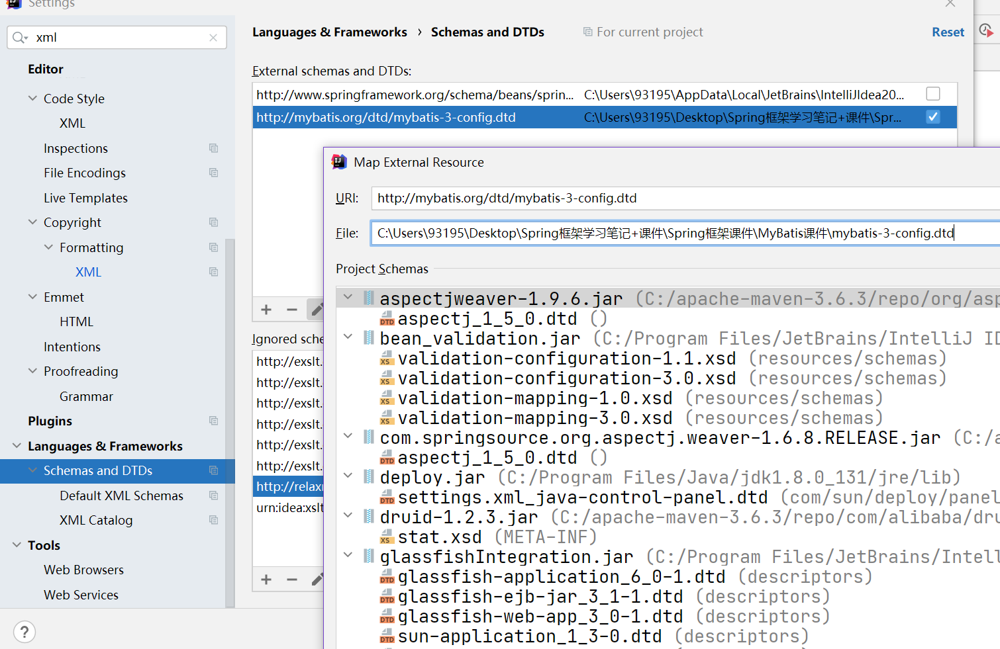
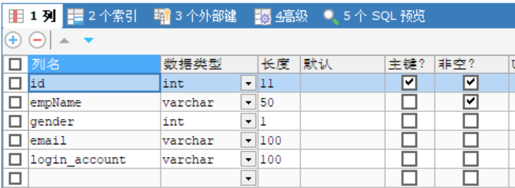

# 2.	XML文件配置

## 2.1	XML输入联想

在离线情况下，在输入XML时想获得输入联想需要绑定这个文件对应的dtd约束文件

（1）复制DTD引用网址：

```
"http://mybatis.org/dtd/mybatis-3-config.dtd"
```

（2）在IDEA中打开File - Settings - Languages&Frameworks - Schemas and DTDs - External Schemas and DTDs，

添加Map External Resource，URI为对应DTD引用网址，File为DTD文件所在路径：




## 2.2	引入外部配置文件

在MyBatis的全局配置文件中，可以使用<properties>标签引入外部配置文件：

创建外部配置文件dbconfig.properties：

```properties
driver=com.mysql.jdbc.Driver
url=jdbc:mysql://localhost:3306/user_db
username=root
password=root
```

在MyBatis的全局配置文件中引入外部配置文件：

```xml
<properties resource="dbconfig.properties"></properties>
```

在全局配置文件中，从外部配置文件取值，配置连接池：

```xml
<!--配置连接池-->
<dataSource type="POOLED">
    <property name="driver" value="${driver}"/>
    <property name="url" value="${url}"/>
    <property name="username" value="${username}"/>
    <property name="password" value="${password}"/>
</dataSource>
```


## 2.3	设置settings

在MyBatis全局配置文件中，可以使用<settings>标签设置MyBatis：

**设置（settings）**

这是 MyBatis 中极为重要的调整设置，它们会改变 MyBatis 的运行时行为。 下表描述了设置中各项设置的含义、默认值等。

|              设置名              |                             描述                             |                            有效值                            |                        默认值                         |
| :------------------------------: | :----------------------------------------------------------: | :----------------------------------------------------------: | :---------------------------------------------------: |
|           cacheEnabled           |   全局性地开启或关闭所有映射器配置文件中已配置的任何缓存。   |                        true \| false                         |                         true                          |
|        lazyLoadingEnabled        | 延迟加载的全局开关。当开启时，所有关联对象都会延迟加载。 特定关联关系中可通过设置 `fetchType` 属性来覆盖该项的开关状态。 |                        true \| false                         |                         false                         |
|      aggressiveLazyLoading       | 开启时，任一方法的调用都会加载该对象的所有延迟加载属性。 否则，每个延迟加载属性会按需加载（参考 `lazyLoadTriggerMethods`)。 |                        true \| false                         |     false （在 3.4.1 及之前的版本中默认为 true）      |
|    multipleResultSetsEnabled     |     是否允许单个语句返回多结果集（需要数据库驱动支持）。     |                        true \| false                         |                         true                          |
|          useColumnLabel          | 使用列标签代替列名。实际表现依赖于数据库驱动，具体可参考数据库驱动的相关文档，或通过对比测试来观察。 |                        true \| false                         |                         true                          |
|         useGeneratedKeys         | 允许 JDBC 支持自动生成主键，需要数据库驱动支持。如果设置为 true，将强制使用自动生成主键。尽管一些数据库驱动不支持此特性，但仍可正常工作（如 Derby）。 |                        true \| false                         |                         False                         |
|       autoMappingBehavior        | 指定 MyBatis 应如何自动映射列到字段或属性。 NONE 表示关闭自动映射；PARTIAL 只会自动映射没有定义嵌套结果映射的字段。 FULL 会自动映射任何复杂的结果集（无论是否嵌套）。 |                     NONE, PARTIAL, FULL                      |                        PARTIAL                        |
| autoMappingUnknownColumnBehavior | 指定发现自动映射目标未知列（或未知属性类型）的行为。`NONE`: 不做任何反应`WARNING`: 输出警告日志（`'org.apache.ibatis.session.AutoMappingUnknownColumnBehavior'` 的日志等级必须设置为 `WARN`）`FAILING`: 映射失败 (抛出 `SqlSessionException`) |                    NONE, WARNING, FAILING                    |                         NONE                          |
|       defaultExecutorType        | 配置默认的执行器。SIMPLE 就是普通的执行器；REUSE 执行器会重用预处理语句（PreparedStatement）； BATCH 执行器不仅重用语句还会执行批量更新。 |                      SIMPLE REUSE BATCH                      |                        SIMPLE                         |
|     defaultStatementTimeout      |     设置超时时间，它决定数据库驱动等待数据库响应的秒数。     |                          任意正整数                          |                     未设置 (null)                     |
|         defaultFetchSize         | 为驱动的结果集获取数量（fetchSize）设置一个建议值。此参数只可以在查询设置中被覆盖。 |                          任意正整数                          |                     未设置 (null)                     |
|       defaultResultSetType       |           指定语句默认的滚动策略。（新增于 3.5.2）           | FORWARD_ONLY \| SCROLL_SENSITIVE \| SCROLL_INSENSITIVE \| DEFAULT（等同于未设置） |                     未设置 (null)                     |
|       safeRowBoundsEnabled       | 是否允许在嵌套语句中使用分页（RowBounds）。如果允许使用则设置为 false。 |                        true \| false                         |                         False                         |
|     safeResultHandlerEnabled     | 是否允许在嵌套语句中使用结果处理器（ResultHandler）。如果允许使用则设置为 false。 |                        true \| false                         |                         True                          |
|     mapUnderscoreToCamelCase     | 是否开启驼峰命名自动映射，即从经典数据库列名 A_COLUMN 映射到经典 Java 属性名 aColumn。 |                        true \| false                         |                         False                         |
|         localCacheScope          | MyBatis 利用本地缓存机制（Local Cache）防止循环引用和加速重复的嵌套查询。 默认值为 SESSION，会缓存一个会话中执行的所有查询。 若设置值为 STATEMENT，本地缓存将仅用于执行语句，对相同 SqlSession 的不同查询将不会进行缓存。 |                     SESSION \| STATEMENT                     |                        SESSION                        |
|         jdbcTypeForNull          | 当没有为参数指定特定的 JDBC 类型时，空值的默认 JDBC 类型。 某些数据库驱动需要指定列的 JDBC 类型，多数情况直接用一般类型即可，比如 NULL、VARCHAR 或 OTHER。 |       JdbcType 常量，常用值：NULL、VARCHAR 或 OTHER。        |                         OTHER                         |
|      lazyLoadTriggerMethods      |             指定对象的哪些方法触发一次延迟加载。             |                    用逗号分隔的方法列表。                    |            equals,clone,hashCode,toString             |
|     defaultScriptingLanguage     |            指定动态 SQL 生成使用的默认脚本语言。             |                  一个类型别名或全限定类名。                  | org.apache.ibatis.scripting.xmltags.XMLLanguageDriver |
|      defaultEnumTypeHandler      |    指定 Enum 使用的默认 `TypeHandler` 。（新增于 3.4.5）     |                  一个类型别名或全限定类名。                  |        org.apache.ibatis.type.EnumTypeHandler         |
|        callSettersOnNulls        | 指定当结果集中值为 null 的时候是否调用映射对象的 setter（map 对象时为 put）方法，这在依赖于 Map.keySet() 或 null 值进行初始化时比较有用。注意基本类型（int、boolean 等）是不能设置成 null 的。 |                        true \| false                         |                         false                         |
|    returnInstanceForEmptyRow     | 当返回行的所有列都是空时，MyBatis默认返回 `null`。 当开启这个设置时，MyBatis会返回一个空实例。 请注意，它也适用于嵌套的结果集（如集合或关联）。（新增于 3.4.2） |                        true \| false                         |                         false                         |
|            logPrefix             |             指定 MyBatis 增加到日志名称的前缀。              |                          任何字符串                          |                        未设置                         |
|             logImpl              |    指定 MyBatis 所用日志的具体实现，未指定时将自动查找。     | SLF4J \| LOG4J \| LOG4J2 \| JDK_LOGGING \| COMMONS_LOGGING \| STDOUT_LOGGING \| NO_LOGGING |                        未设置                         |
|           proxyFactory           |      指定 Mybatis 创建可延迟加载对象所用到的代理工具。       |                      CGLIB \| JAVASSIST                      |            JAVASSIST （MyBatis 3.3 以上）             |
|             vfsImpl              |                       指定 VFS 的实现                        |         自定义 VFS 的实现的类全限定名，以逗号分隔。          |                        未设置                         |
|        useActualParamName        | 允许使用方法签名中的名称作为语句参数名称。 为了使用该特性，你的项目必须采用 Java 8 编译，并且加上 `-parameters` 选项。（新增于 3.4.1） |                        true \| false                         |                         true                          |
|       configurationFactory       | 指定一个提供 `Configuration` 实例的类。 这个被返回的 Configuration 实例用来加载被反序列化对象的延迟加载属性值。 这个类必须包含一个签名为`static Configuration getConfiguration()` 的方法。（新增于 3.2.3） |                 一个类型别名或完全限定类名。                 |                        未设置                         |
|      shrinkWhitespacesInSql      | 从SQL中删除多余的空格字符。请注意，这也会影响SQL中的文字字符串。 (新增于 3.5.5) |                        true \| false                         |                         false                         |
|      defaultSqlProviderType      | Specifies an sql provider class that holds provider method (Since 3.5.6). This class apply to the `type`(or `value`) attribute on sql provider annotation(e.g. `@SelectProvider`), when these attribute was omitted. |          A type alias or fully qualified class name          |                        Not set                        |


### 2.3.1	开启自动驼峰命名

引入：

> 在数据库中添加属性login_account：
>
> 
>
> 在JavaBean中添加属性loginAccount：
>
> ```java
> private String loginAccount;
> ```
>
> 此时MyBatis不能查询到数据库中的login_account信息：

我们发现，JavaBean属性名与数据库属性名无法对应会导致不能正常传递数据，为了解决这一问题，

在JDBC中，我们需要为数据库属性起别名才能实现对应，

而在MyBatis中，可以通过设置开启自动驼峰命名来解决这一问题：

```xml
<settings>
    <!--name：配置项 value：配置项的值-->
    <setting name="mapUnderscoreToCamelCase" value="true"/>
    <!--开启自动驼峰命名-->
    <!--JavaBean:loginAccount->数据库：login_account-->
</settings>
```

再次运行程序：


## 2.4	类型别名typeAlias

为了使用方便，我们可以在MyBatis配置文件中使用<typeAlias>标签为常用的JavaBean起别名，以替换冗长的全路径

```xml
<typeAliases>
        <!--type：对应的全类名，别名默认是类名（不区分大小写）-->
        <!--也可以用alias属性指定别名-->
        <typeAlias type="com.example.bean.Employee"/>
</typeAliases>
```

在接口映射配置文件中就可以使用对应的别名了：

```java
<select id="getEmpById" resultType="Employee">
    select * from t_employee where id = #{id}
</select>
```

运行程序：


### 2.4.1	批量别名

```xml
<typeAliases>
        <!--name指定包名，默认别名就是类名-->
        <package name="com.example.bean"/>
		<!--此时包路径下的类都可以使用类名替代全类名-->
    </typeAliases>
```

若需要对package中类指定别名，需要在要指定别名的类上使用@Alias注解，value为对应的别名

```java
@Alias("Emp")
public class Employee {
```

**在笔记中，为了路径清晰和便于路径追踪，我们暂时不使用别名，而是使用全类名**


## 2.5	类型处理器typeHandler

原生JDBC执行SQL语句的流程：

```java
Connection con = dataSource.getConnection();//建立连接
String sql = "insert into t_employee(empName,email,gender,login_account) values(?,?,?,?)";
PreparedStatement ps = con.prepareStatement(sql);//获取预编译数据库操作对象
//为SQL语句设置值
ps.setString(1,"Admin");
ps.setString(2,"123@test.com");
ps.setInt(3,0);
ps.setString(4,"testAdmin1");
int i = ps.executeUpdate();//执行SQL语句
//释放资源
ps.close();
con.close();
//在JDBC中，传递数据的类型需要通过不同的方法手动指定，比较繁琐
```

在MyBatis中，通过类型处理器，将Java数据类型与JDBC数据类型进行自动转换：


### 2.5.1	自定义类型处理器

（1）创建一个自定义typeHandler的类；

（2）在Mybatis配置文件中，通过标签<typeHandlers>进行类型处理器配置；

（3）在引射器的XML配置中标识需要用自定义typeHandler处理的参数或者结果。

要创建自定义类型处理器类，首先要继承BaseTypeHandler类：


## 2.6	对象工厂objectFactory

对象工厂负责实例化接口映射对象，并将查询到的信息封装进去


## 2.7	插件plugin

插件是MyBatis提供的一个强大机制，可以通过插件来修改MyBatis的核心行为。插件可以通过动态代理机制，介入四大对象的所有方法的执行过程。

```java
//MyBatis的四大对象

//1）Executor执行器：调度执行StatementHandler、ParmmeterHandler、ResultHandler；

//2）StatementHandler Statement处理器，相当于原生的PreparedStatement：使用数据库中PrepareStatement执行操作；

//3）ParammeterHandler参数处理器：为预编译好的SQL语句设置参数；

//4）ResultHandler结果集处理器：将查询得到的结果集ResultSet封装成指定的JavaBean对象返回。
```


## 2.8	环境Environment

在MyBatis配置文件中，通过<environment>标签配置具体环境：

```xml
<environments default="development">
    <environment id="development">
        <transactionManager type="JDBC"/>
        <dataSource type="POOLED">
            <property name="driver" value="${driver}"/>
            <property name="url" value="${url}"/>
            <property name="username" value="${username}"/>
            <property name="password" value="${password}"/>
        </dataSource>
    </environment>
</environments>
```

在每个<environment>标签下，即一个具体环境下，都需要配置：

（1）事务管理器transactionManager，通过标签<transactionManager>指定

（2）数据源dataSource，通过标签<dataSource>指定


另外，<environments>标签下可以配置多组<environment>标签，为了加以区分和便于使用，我们可以为不同的environment配置不同的id加以区分：

```xml
<environment id="development">
```

为了让系统知道应该使用哪个环境，需要在<environments>标签中指定默认环境：

```xml
<environments default="development">
```


**要注意的是，我们在实际开发中，数据源和事务管理都交给Spring来进行**


## 2.9	MyBatis配置文件标签顺序

在MyBatis配置文件中，标签也需要按顺序使用，否则会造成编译错误：

在配置标签<configuration>下，各标签顺序为：

```java
configuration (properties?, settings?, typeAliases?, typeHandlers?, objectFactory?, objectWrapperFactory?, plugins?, environments?, databaseIdProvider?, mappers?)
```


## 2.10	数据库移植databaseIdProvider

MyBatis 可以根据不同的数据库厂商执行不同的语句，这种多厂商的支持是基于映射语句中的 `databaseId` 属性。 MyBatis 会加载不带 `databaseId` 属性和带有匹配当前数据库 `databaseId` 属性的所有语句。 如果同时找到带有 `databaseId` 和不带 `databaseId` 的相同语句，则后者会被舍弃

在MyBatis配置文件中配置数据库移植信息：

```xml
<!--databaseIdProvider用于数据库移植，type固定为"DB_VENDOR"-->
<databaseIdProvider type="DB_VENDOR">
    <!--name：数据库厂商标识 value：标识别名-->
    <property name="MySQL" value="mysql"/>
    <property name="SQL Server" value="sqlserver"/>
    <property name="Oracle" value="oracle"/>
</databaseIdProvider>
```

在端口映射配置文件中，通过databaseId属性指定方法对应的数据库：

```xml
<select id="getEmpById" resultType="com.example.bean.Employee" databaseId="mysql">
    select * from t_employee where id = #{id}
</select>
```

方法执行顺序：优先执行精确匹配目标，再执行模糊匹配目标


## 2.11	映射Mapper

在MyBatis中，我们需要对DAO接口进行实现，将实现方法写在接口映射配置文件中，再到MyBatis配置文件中进行注册：

```xml
<mappers>
    <mapper resource="com/example/dao/EmployeeDao.xml"/>
</mappers>
```

另外，我们还可以使用<mapper>标签下的class属性，通过指定接口的全类名注册配置文件，替代使用配置文件路径：

```xml
<!--
resource:在类路径下找映射配置文件
url：在网络或磁盘路径下找映射配置文件
class：直接引用接口的全类名
-->
<mapper class = "com.example.dao.EmployeeDao"/>
<!--使用class属性需要将对应接口的映射配置文件放在同包下且文件名与类名相同-->
```

### 2.11.1	注解配置映射

我们可以通过使用注解，替代接口映射文件：

```java
public interface EmployeeDao {

    @Select("select * from t_employee where id = #{id}")
    public Employee getEmpById(Integer id);

    @Update("update t_employee set empName=#{empName},gender=#{gender},email=#{email}\n" +
            "        where id = #{id}")
    public int updateEmp(Employee employee);

    @Insert("insert into t_employee(empName, gender, email, login_account) VALUES(#{empName},#{gender},#{email},#{login_account})")
    public int insertEmp(Employee employee);
    
    @Delete("delete from t_employee where id = #{id}")
    public boolean deleteEmp(Integer id);
}
```

在MyBatis配置文件中，通过mapper标签的class属性指定该端口的全类名实现注册：

```xml
<mapper class = "com.example.dao.EmployeeDao"/>
```

**在开发中，我们推荐用配置文件实现复杂或重要的DAO接口；用注解实现简单的DAO接口**


### 2.11.2	批量注册

为了使用方便，可以通过<package>标签进行批量注册：

```xml
<package name="com.example.dao"/>
```

这种方法类似mapper通过class属性指定映射配置，**需要保证接口配置文件与接口在同一包下才能正常运行**