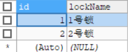

[TOC]


# 3.	SQL映射文件

在SQL映射文件中，可以使用标签：

```xml
<!--可以使用的标签：
<cache>：缓存
<cache-ref>：缓存引用
<insert>、<delete>、<update>、<select>：增删改查
<parameterMap>：复杂参数映射（已废弃）
<resultMap>：结果映射，自定义结果集的封装规则
<sql>：抽取可重用的SQL
-->
```


## 3.1	增删改查

### 3.1.1	增删改

在增删改标签中可以使用的属性：


#### 3.1.1.1	获取自增字段的值

应用场景：插入一个Employee对象，获取到对应的自增ID值

要获取对应的自增ID，需要使用<insert>标签下的userGeneratedKey和keyProperty属性：

```xml
<!--让MyBatis自动将自增ID赋值给传入的Employee对象的id属性
useGeneratedKeys="true" ：使用自增
keyProperty="id" ： 将自增的ID封装到id属性
-->
<insert id="insertEmp" useGeneratedKeys="true" keyProperty="id">
    insert into t_employee(empName, gender, email) VALUES(#{empName},#{gender},#{email})
</insert>
```

运行程序：

#### 3.1.1.2	原理

原理：实际上是使用了原始JDBC中PreparedStatement对象的getGeneratedKey()方法，获取到了执行该PreparedStatement对象而创建的所有自动生成的键

该应用场景**仅适用于支持自动生成主键**的字段的数据库（如MySQL和SQL Server）


#### 3.1.1.3	替代方法

部分数据库不支持主键自增，为了同样能够实现我们的需求，可以使用替代方法：

```xml
<insert id="insertEmp" useGeneratedKeys="true" keyProperty="id">
    <!--使用selectKey查询最大ID
        order="BEFORE" ：在核心SQL语句运行前运行
        keyProperty="id" ：将查询的值赋给JavaBean的id属性
    -->
    <selectKey order="BEFORE" keyProperty="id" resultType="Integer">
        select max(id)+1 from t_employee
    </selectKey>
    insert into t_employee(id,empName, gender, email)
     VALUES(#{id},#{empName},#{gender},#{email})
    <!--将查询到的ID，即数据库现有最大ID，+1后赋值给新插入的Employee对象，实现全字段赋值-->
</insert>
```


### 3.1.2	查询

在接口中添加方法，通过ID和员工名查询方法：

```java
public Employee getEmpByIdAndEmpName(Integer id,String empName);
```

在接口映射文件中实现方法：

```xml
<select id="getEmpByIdAndEmpName" resultType="com.example.bean.Employee">
    select * from t_employee where id = #{id} and empName=#{empName}
</select>
```

在测试类中添加测试方法：

```java
@Test
public void testQuery1() throws IOException {
    SqlSession sqlSession = sqlSessionFactory.openSession();
    EmployeeDao dao = sqlSession.getMapper(EmployeeDao.class);
    try{
        Employee employee = dao.getEmpByIdAndEmpName(1,"AAA");
        System.out.println(employee);
    }finally {
        sqlSession.close();
    }
}
```

运行程序：

```java
Cause: org.apache.ibatis.binding.BindingException: Parameter 'id' not found. Available parameters are [arg1, arg0, param1, param2]
//参数id没有找到，可用的参数为[arg1, arg0, param1, param2]
```

根据我们定义的SQL语句可知：

```sql
select * from t_employee where id = #{id} and empName=#{empName}
-- id,empName应分别为arg0,arg1或param1,param2
```

更改SQL语句格式：

```sql
select * from t_employee where id = #{arg0} and empName=#{arg1}
```

再次运行程序：


这样就可以查询到对应数据了


另外，当select语句中只有一个参数，如我们按ID查询员工时：

```xml
<select id="getEmpById" resultType="com.example.bean.Employee" databaseId="mysql">
    select * from t_employee where id = #{123}
</select>
```


可以看到，即使SpEL表达式没有正确对应实际属性名，仍然可以正常传入参数


#### 3.1.2.1	参数传递

向SQL语句传递参数时：

①单个参数：

​	1）基本类型：#{任意}，不需要经过任何处理

​	2）POJO：#{POJO属性名}

②多个参数：#{argN}(N=0,1,...,n)或#{paramM}(M=1,2,...,m)

原因：传入多个参数时，MyBatis自动将这些参数封装在一个Map中，相当于：

```java
Map<String,Object> map = new HashMap<>();
map.put("arg0",Object1);//map.put("param1",Object1);
map.put("arg1",Object2);//map.put("param2",Object2);
```

因此，要使用对应参数应使用#{key}获取对应值

③传入Map：#{key}


#### 3.1.2.2	@Param实现多参数传递

我们可以使用@Param注解为参数指定MyBatis封装入Map时对应的key，value为对应的key值

```java
public Employee getEmpByIdAndEmpName(@Param("id") Integer id, @Param("empName") String empName);
```

在接口实现方法中就可以使用指定的key获取参数的值了：

```sql
select * from t_employee where id = #{id} and empName=#{empName}
```


#### 3.1.2.3	Map实现多参数传递

既然MyBatis会为我们将多个参数封装入Map对象，因此我们也可以直接传递一个Map对象，避免MyBatis对参数的封装：

```java
public Employee getEmpByIdAndNameInMap(Map<String,Object> map);
```

在接口映射配置文件中实现方法：

```xml
<select id="getEmpByIdAndNameInMap" resultType="com.example.bean.Employee">
    select * from t_employee where id = #{id} and empName=#{empName}
</select>
```

在测试类中实现方法：

```java
@Test
public void testQuery2() throws IOException {
    SqlSession sqlSession = sqlSessionFactory.openSession();
    EmployeeDao dao = sqlSession.getMapper(EmployeeDao.class);
    try{
        Map<String,Object> map = new HashMap<>();//自行用Map封装参数
        map.put("id",1);
        map.put("empName","AAA");
        Employee employee = dao.getEmpByIdAndNameInMap(map);
        System.out.println(employee);
    }finally {
        sqlSession.close();
    }
}
```

运行程序：


#### 3.1.2.4	多参数传递时的取值

假定传递参数：

```java
method(Integer id, String str, Employee emp);
```

要正确取出对应参数，可以使用的方法：

```java
//1.@Param注解
method(@Param("id")Integer id, String str, Employee emp);
此时#{id} --> Integer id
    
//2.直接根据封装的key，按顺序取值
#{param2}或#{arg1} --> String str
    
//3.从POJO中取值
#{param3.email}或#{arg2.email} ---> Employee emp.email
```


#### 3.1.2.5	参数处理

在参数传递过程中，可以通过表达式中的属性设定规则，其中支持的属性有：

```java
javaType、jdbcType、mode、numericScale、
   resultMap、typeHandler、jdbcTypeName、expression
```

实际在使用时，我们一般只使用jdbcType设置JDBC数据类型：

```sql
select * from t_employee where id = #{id,jdbcType=INTEGER} and empName=#{empName}
```

MyBatis默认不指定jdbcType，在正常使用时，这对MySQL和Oracle数据库都没有影响

但当传入的数据为null时，MySQL数据库不受影响，但Oracle数据库不能识别NULL类型


#### 3.1.2.6	参数取值

在MyBatis中，有两种取值方式：

#{属性名}：是参数预编译的方式，参数位置用?替代，参数后来都是预编译设置进去的，安全性高，不存在SQL注入问题

${属性名}：直接与SQL语句进行拼串，安全性差，容易造成SQL注入


更改SQL语句进行测试：

```sql
select * from t_employee where id = ${id} and empName=#{empName}
```

在控制台查看log4j的日志信息：

```java
DEBUG 12-16 21:12:01,752 ==>  Preparing: select * from t_employee where id = 1 and empName=?   (BaseJdbcLogger.java:159) 
```

可以看到，在SQL语句预编译阶段，$表达式就已经完成了拼串，而$表达式则不进行拼串


##### 3.1.2.6.1	$表达式的应用

由于在预编译阶段，只有$表达式才能进行拼串而#表达式不能，我们可以通过使用$表达式进行不支持参数预编译的操作，如动态表名：

```sql
select * from ${tableName} where id = #{id} and empName=#{empName}
```

该SQL语句只有使用${}表达式才能动态传入表名，而#{}表达式则会因为在预编译阶段出现SQL语法错误而无法使用


#### 3.1.2.7	查询返回List

当我们需要查询返回多个对象时，可以将对象封装入List，返回List对象

要注意的是，虽然我们要返回的对象类型是List，但对应的实现方法的返回值类型resultType应为List中对象的类型


在接口中声明方法：

```java
public List<Employee> getAllEmps();
```

在接口映射配置文件中实现方法：

```xml
<!--当返回值类型为集合时，resultType对应的是集合中对象的类型-->
<select id="getAllEmps" resultType="com.example.bean.Employee">
    select * from t_employee
</select>
```

在测试类中调用方法：

```java
@Test
public void testQuery3() throws IOException {
    SqlSession sqlSession = sqlSessionFactory.openSession();
    EmployeeDao dao = sqlSession.getMapper(EmployeeDao.class);
    try{
        List<Employee> list = dao.getAllEmps();
        for (Employee e:list) {
            System.out.println(e);
        }
    }finally {
        sqlSession.close();
    }
}
```

运行程序：


#### 3.1.2.8	查询返回Map

我们可以将查询结果封装在Map中，这个过程由MyBatis来完成，key为列名，value为对应值

在接口中声明方法：

```java
public Map<String,Object> getEmpByIdReturnMap(Integer id);
```

在接口映射配置文件中实现方法：

```xml
<!--查询返回一个Map，returnType为Map-->
<select id="getEmpByIdReturnMap" resultType="map">
    select * from t_employee where id = #{id}
</select>
```

在测试类中调用方法：

```java
@Test
public void testQuery4() throws IOException {
    SqlSession sqlSession = sqlSessionFactory.openSession();
    EmployeeDao dao = sqlSession.getMapper(EmployeeDao.class);
    try{
        Map<String,Object> map = dao.getEmpByIdReturnMap(1);
        System.out.println(map);
    }finally {
        sqlSession.close();
    }
}
```

运行程序：


#### 3.1.2.9	查询返回多个Map

假定要查询全部Employee对象，返回Map

因为有多个对象，因此我们的key不能使用列名

我们可以使用ID这个主键作为key：

```java
@MapKey("id")//将查询到的记录的id作为key封装这个Map
public Map<Integer,Object> getAllEmpsReturnMap();
```

在接口映射配置文件中实现方法：

```xml
<!--查询返回多个对象，应当使用集合中的对象类型作为resultType的值-->
<select id="getAllEmpsReturnMap" resultType="com.example.bean.Employee">
    select * from t_employee
</select>
```

在测试类中调用方法：

```java
@Test
public void testQuery5() throws IOException {
    SqlSession sqlSession = sqlSessionFactory.openSession();
    EmployeeDao dao = sqlSession.getMapper(EmployeeDao.class);
    try{
        Map<Integer,Object> map = dao.getAllEmpsReturnMap();
        System.out.println(map);
    }finally {
        sqlSession.close();
    }
}
```

运行程序：


## 3.2	resultMap自定义封装规则

创建测试表t_cat：


添加测试数据：


创建对应实体类Cat，生成对应的get和set方法，以及toString方法：

```java
public class Cat {
    private Integer id;
    private String name;
    private Integer gender;
    private Integer age;
}
```

创建DAO层对应接口CatDao：

```java
public interface CatDao {
    public Cat getCatById(Integer id);
}
```

创建接口映射配置文件CatDao.xml：

```xml
<?xml version="1.0" encoding="UTF-8" ?>
<!DOCTYPE mapper
        PUBLIC "-//mybatis.org//DTD Mapper 3.0//EN"
        "http://mybatis.org/dtd/mybatis-3-mapper.dtd">

<mapper namespace="com.example.dao.CatDao">
    <select id="getCatById" resultType="com.example.bean.Cat">
        select * from  t_cat where id = #{id}
    </select>
</mapper>
```

在MyBatis配置文件中注册接口映射文件：

```xml
<mapper class="com.example.dao.CatDao"/>
```

在测试类中调用方法：

```java
@Test
public void testQuery0() throws IOException {
    SqlSession sqlSession = sqlSessionFactory.openSession();
    CatDao dao = sqlSession.getMapper(CatDao.class);
    try{
        Cat cat = dao.getCatById(1);
        System.out.println(cat);
    }finally {
        sqlSession.close();
    }
}
```

运行程序：


可以发现，只有POJO属性名与列名对应时，查询到的属性才能被封装上值，为了解决这个问题，我们需要自定义ResultSet封装规则


在MyBatis中，结果集默认封装规则：

（1）按列名和属性名一一对应（不区分大小写）

（2）若没有一一对应：

​		1）开启驼峰命名法（必须满足驼峰命名法规则 aaa_bbb -> aaaBbb）

​		2）起别名	typeAlias

我们可以通过起别名的方式使列名和属性名对应：

```sql
select id,cName name,cAge age,cGender gender from t_cat where id = #{id}
```

我们还可以自定义结果集的封装规则：

```xml
<resultMap id="mycat" type="com.example.bean.Cat">
    <!--<id>：指定主键列的对应规则
    column="id"：指定列名为id的列为主键列
    property="id"：指定为Cat的id属性封装该列数据
    -->
    <id column="id" property="id"/>
    <!--普通列-->
    <result property="name" column="cName"/>
    <result property="age" column="cAge"/>
    <result property="gender" column="cGender"/>
</resultMap>
```

在查询标签中通过resultMap属性指定自定义结果集的封装规则：

```xml
<select id="getCatById" resultType="com.example.bean.Cat" resultMap="mycat">
        select * from  t_cat where id = #{id}
</select>
```

运行程序：


## 3.3	联合查询

### 3.3.1	级联属性封装查询

创建表t_key：


将lockid设为t_lock(id)的外键：


添加测试数据：


创建表t_lock：


添加测试数据：



创建实体类Key：

```java
public class Key {
    private Integer id;
    private String keyName;
    private Lock lock;
}
```

创建实体类Lock：

```java
public class Lock {
    private Integer id;
    private String lockName;
}
```

创建DAO层接口KeyDao：

```java
public interface KeyDao {
    //将钥匙和对应的锁一起查询
    public Key getKeyById(Integer id);
}
```

创建接口映射配置文件KeyDao.xml：

```xml
<?xml version="1.0" encoding="UTF-8" ?>
<!DOCTYPE mapper
        PUBLIC "-//mybatis.org//DTD Mapper 3.0//EN"
        "http://mybatis.org/dtd/mybatis-3-mapper.dtd">

<mapper namespace="com.example.dao.KeyDao">
    <select id="getKeyById" resultMap="mykey">
        SELECT k.*,l.id lid,l.`lockName` FROM t_key k
        LEFT OUTER JOIN t_lock l ON k.`lockid`=l.`id`
        WHERE k.`id` = #{id}
    </select>

    <!--使用级联属性封装-->
    <resultMap id="mykey" type="com.example.bean.Key">
        <id column="id" property="id"/>
        <result property="keyName" column="keyName"/>
        <result property="lock.id" column="lid"/>
        <result property="lock.lockName" column="lockName"/>
    </resultMap>
</mapper>
```

在测试类中调用方法：

```java
@Test
public void testQuery11() throws IOException {
    SqlSession sqlSession = sqlSessionFactory.openSession();
    KeyDao dao = sqlSession.getMapper(KeyDao.class);
    try{
        Key key = dao.getKeyById(1);
        System.out.println(key);
    }finally {
        sqlSession.close();
    }
}
```

运行程序：


### 3.3.2	association定义联合查询

<association>标签适用于一个复杂的类型关联，如实体类中还有实体类，这是MyBatis推荐使用的方法

在接口映射配置文件中修改自定义的结果集封装方法：

```xml
<resultMap id="mykey" type="com.example.bean.Key">
    <id column="id" property="id"/>
    <result property="keyName" column="keyName"/>
    <!--使用association自定义对象的封装规则-->
    <!--javaType：指定属性对应的类型-->
    <association property="lock" javaType="com.example.bean.Lock">
        <id property="id" column="lid"/>
        <result property="lockName" column="lockName"/>
    </association>
</resultMap>
```

运行程序：


### 3.3.3	关联关系用集合Collection封装

假定一把锁可以对应多把钥匙，在锁Lock中添加属性keys：

```java
private List<Key> keys;
```

在表t_key中添加测试数据：


创建DAO层接口LockDao：

```java
public interface LockDao {
    public Lock getLockById(Integer id);
}
```

创建接口配置文件LockDao.xml

```xml
<?xml version="1.0" encoding="UTF-8" ?>
<!DOCTYPE mapper
        PUBLIC "-//mybatis.org//DTD Mapper 3.0//EN"
        "http://mybatis.org/dtd/mybatis-3-mapper.dtd">

<mapper namespace="com.example.dao.LockDao">
    <select id="getLockById" resultMap="myLock">
        SELECT l.*,k.id kid,k.keyName,k.lockid
        FROM t_lock l LEFT OUTER JOIN t_key k ON k.`lockid`=l.`id`
        WHERE l.`id` = #{id}
    </select>
    <resultMap id="myLock" type="com.example.bean.Lock">
        <id property="id" column="id"/>
        <result property="lockName" column="lockName"/>
        <!--collection：定义集合元素的封装
        property：指定哪个属性是集合属性
        ofType：指定集合中的元素类型
        -->
        <collection property="keys" ofType="com.example.bean.Key">
            <!--指定元素封装规则-->
            <id property="id" column="kid"/>
            <result property="keyName" column="keyName"/>
        </collection>
    </resultMap>
</mapper>
```

在测试类中调用方法：


### 3.3.4	分步查询

假定之前我们根据钥匙查询锁的方法拆为两步：查询钥匙和查询锁

在接口中定义方法：

```java
public Lock getLockByIdSimplely(Integer id);

public Key getKeyByIdSimplely(Integer id);
```

在接口映射配置文件中实现方法：

```xml
<select id="getLockByIdSimplely" resultType="com.example.bean.Lock">
    select * from t_lock where id = #{id}
</select>


<select id="getKeyByIdSimplely" resultMap="mykey02">
        select * from t_key where id = #{id}
</select>
<resultMap id="mykey02" type="com.example.bean.Key">
    <id property="id" column="id"/>
    <result property="keyName" column="keyName"/>
    <!--告诉MyBatis 要调用查询锁的方法-->
    <!--select：对应使用的方法的id，MyBatis自动调用方法并封装对象-->
    <!--为了防止方法id冲突，可以在方法id前加上名称空间namespace-->
    <!--column：指定将对应的属性传递给要调用的方法-->
    <association property="lock" select="com.example.dao.LockDao.getLockByIdSimplely"
                 column="lockid">
        <id property="id" column="id"/>
    </association>
</resultMap>
```

运行程序：

查看控制台日志信息：

```java
DEBUG 12-17 09:36:06,258 ==>  Preparing: select * from t_key where id = ?   (BaseJdbcLogger.java:159) 
DEBUG 12-17 09:36:06,292 ==> Parameters: 1(Integer)  (BaseJdbcLogger.java:159) 
DEBUG 12-17 09:36:06,310 ====>  Preparing: select * from t_lock where id = ? (BaseJdbcLogger.java:159) 
DEBUG 12-17 09:36:06,310 ====> Parameters: 1(Integer)  (BaseJdbcLogger.java:159) 
```

可以看到，我们在查询的过程中，实际调用了两条SQL查询语句


### 3.3.5	按需加载和延迟加载

在3.3.4分步查询中，我们先查询了钥匙，再根据钥匙信息查询了锁

但实际使用中，我们有时候只需要使用钥匙而不需要使用锁，或者需要使用但不会马上需要使用锁，这时我们可以暂时不查询锁，等到需要使用锁时再查询：

按需加载，即使数据库按需求加载对应的对象，不会查询其余对象

延迟加载，即当有查询执行时，不会立刻查询对象

要使用按需加载，需要在MyBatis配置文件中，开启全局按需加载策略：

```xml
<!--开启延迟加载-->
<setting name="lazyLoadingEnabled" value="true"/>
<!--开启属性按需加载-->
<setting name="aggressiveLazyLoading" value="false"/>
```

在测试方法中先查看钥匙，再查看锁：

```java
Key key = dao.getKeyByIdSimplely(1);
System.out.println(key.getKeyName());
Thread.sleep(1000);
System.out.println(key.getLock().getLockName());
```

查看控制台日志信息：

```java
DEBUG 12-17 09:49:25,958 ==>  Preparing: select * from t_key where id = ?   (BaseJdbcLogger.java:159) 
DEBUG 12-17 09:49:25,986 ==> Parameters: 1(Integer)  (BaseJdbcLogger.java:159) 
DEBUG 12-17 09:49:26,045 <==      Total: 1  (BaseJdbcLogger.java:159) 
1号钥匙
DEBUG 12-17 09:49:27,046 ==>  Preparing: select * from t_lock where id = ?   (BaseJdbcLogger.java:159) 
DEBUG 12-17 09:49:27,046 ==> Parameters: 1(Integer)  (BaseJdbcLogger.java:159) 
DEBUG 12-17 09:49:27,049 <==      Total: 1  (BaseJdbcLogger.java:159) 
1号锁
```

可以看到，当我们只查询钥匙信息时，MyBatis并没有去查询锁；而当我们查询锁信息时，MyBatis才会执行SQL查询，查询锁的信息


我们还可以对POJO参数独立指定是否延迟加载：

```xml
<association property="lock" select="com.example.dao.LockDao.getLockByIdSimplely"
column="lockid" fetchType="lazy">
    <id property="id" column="id"/>
</association>
```

通过<association>标签下的fetchType属性决定该级联属性是否延迟加载，当值为lazy时延迟加载，当值为eager时不延迟加载


### 3.3.6	Collection分步查询

在接口中定义方法：

```java
public List<Key> getKeysByLockId(Integer id);

public Lock getLockByIdByStep(Integer id);
```

在接口配置文件中实现方法：

```xml
<select id="getLockByIdByStep" resultType="com.example.bean.Key">
        select * from t_key where lockid = #{id}
</select>

<select id="getLockByIdByStep" resultMap="mylock02">
        select * from t_lock where id = #{id}
</select>
<resultMap id="mylock02" type="com.example.bean.Lock">
    <id property="id" column="id"/>
    <result property="lockName" column="lockName"/>
    <collection property="keys" ofType="com.example.bean.Key"
                select="com.example.dao.KeyDao.getKeysByLockId" column="id">
    </collection>
</resultMap>
```

在测试类中添加测试方法：

```java
@Test
public void testQuery14() throws IOException {
    SqlSession sqlSession = sqlSessionFactory.openSession();
    LockDao dao = sqlSession.getMapper(LockDao.class);
    try{
        Lock lock = dao.getLockByIdByStep(3);
        System.out.println(lock);
    }finally {
        sqlSession.close();
    }
}
```

运行程序：


要注意的是，在实际开发中，我们一般针对要查询的对象会单独编写SQL语句，而不是使用分步查询和延迟加载，因为这对数据库性能有一定影响