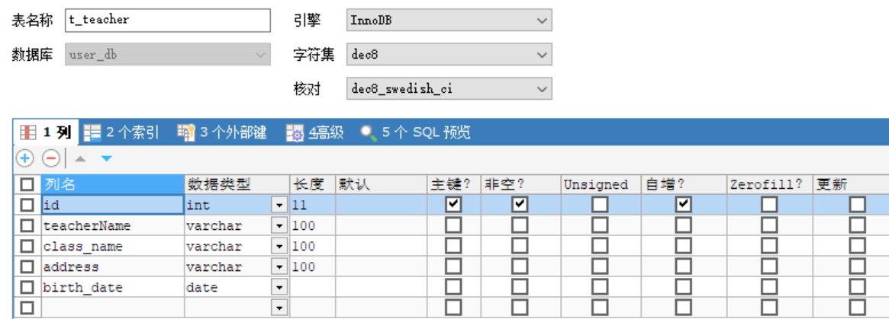
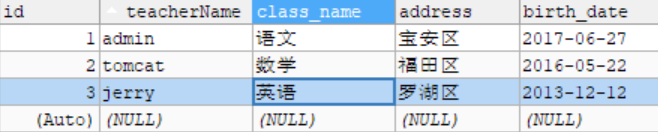

# 4.	动态SQL

动态SQL是MyBatis的提供的强大特性之一，极大地简化了拼装SQL的操作

## 4.0	环境搭建

在项目中创建新模块demo

在数据库中创建表t_teacher



加入测试数据：



创建实体类Teacher：

```java
public class Teacher {
    private Integer id;
    private String name;
    private String course;
    private String address;
    private Date Birth;
}
```

创建对应DAO层接口TeacherDao：

```java
public interface TeacherDao {
    public Teacher getTeacherById(Integer id);
}
```

创建接口映射配置文件TeacherDao.xml：

