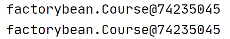

[TOC]


# 1.	IOC控制反转

## 1.1	底层原理

**控制反转**（Inversion of Control，缩写为**IoC**），是面向对象编程中的一种设计原则，可以用来减低代码间的耦合度。其中最常见的方式叫做**依赖注入**

### 1.1.1	什么是IOC

控制反转，就是把对象创建和对象之间的调用过程，交给Spring管理

#### 1.1.1.1	工厂模式

为了将代码的耦合度降低到最低限度，我们需要引入***工厂模式***

我们使用工厂类为Service类提供Dao类实例化对象，在一定程度上降低了代码的耦合性

#### 1.1.1.2	IOC

##### 1.1.1.2.1	IOC实现原理

IOC的实现原理：

1. 使用XML配置文件，配置要创建的对象
2. 创建工厂类：
   - XML解析
   - 通过反射创建对象

IOC将对象的创建和调用过程都交给了Spring统一管理

> 1、IOC思想基于IOC容器完成，IOC容器底层就是对象工厂


> 2、Spring中通过两个接口提供了两种IOC容器的实现方式：
>
> 1. BeanFactory：IOC容器的基本实现，是Spring的内部接口，开发时一般不使用
>
>    - ​	在加载配置文件时不创建对象，在获取和使用对象时才会创建对象
>
>      
>
> 2. ApplicationContext：相比BeanFactory功能更多更强大，由开发人员使用
>
>    - ​	在加载配置文件时就完成了对象的创建
>
> > Spring框架一般应用于服务器，因此使用ApplicationContext在服务器启动时提前加载好对象可以提高响应速度

> 3、ApplicationContext有实现类FileSystemXmlApplicationContext和ClassPathXmllApplicationContext
>
> 其中，FileSystemXmlApplicationContext允许通过绝对路径提供XML文件；
>
> ClassPathXmllApplicationContext允许通过相对路径提供XML文件；

# 2.	Bean管理

## 2.1	什么是Bean管理	

> 1. Spring创建对象
> 2. Spring注入属性

## 2.2	Bean管理操作的实现方式

> 1. 基于XML配置文件方式实现
> 2. 基于注解方式实现

## 2.3	基于XML方式的Bean管理

### 2.3.1	基于XML方式创建对象

```xml
<!-->配置User对象创建<-->
<bean id="user" class="com.example.User"></bean>
```

在Spring的XML配置文件中，使用<bean>标签，并添加相应属性，就能实现对象的创建。

> <bean>标签中的属性：
>
> >1. id属性：为要创建的对象建立唯一标识
> >2. class属性：要创建的对象对应类的***全路径***
> >3. *name属性*：功能等同与id属性，但其中可以加入'/'等特殊符号（了解）

要注意的是，Spring在创建对象时，默认使用无参构造方法


### 2.3.2	基于XML方式注入属性

1.DI：依赖注入，即注入属性，是IOC的一种具体实现

> 注入属性的两种实现方式：
>
> 1. set方法注入
>
>   ```java
>   class Book{
>       private String bookName;
>       public void setBookName(String bookName){
>           this.bookName=bookName;
>       }
>   }
>   //第一步：创建类，定义属性和对应的set方法
>   ```
>
>    ```xml
>   <!-->set方法注入属性<-->
>   <bean id="book" class="com.example.Book">
>   	<!--使用property标签完成属性注入-->
>       <property name="bookName" value="唐诗三百首"></property>
>       <!--name为属性名，value为属性值-->
>   </bean>
>    ```
>
> 2.有参构造注入（了解）
>
> ​	1）创建类，定义属性，创建类对应的有参构造方法
>
> ```java
> package com.example;
> public class Book {
>     public int pages;
>     public Book(int pages) {
>         this.pages = pages;
>     }
> }
> ```
>
> ​	2）在Spring配置文件中进行配置
>
> ```xml
> <bean id="book" class="com.example.Book">
>         <constructor-arg name="pages" value="50"/>
> </bean>
> ```
>
> 可以看到，有参构造注入方法是在有参构造方法中注入属性，而不是使用set方法注入。
>
> ```xml
> <bean id="book" class="com.example.Book">
>         <constructor-arg index="0" value="50"/>
> </bean>
> ```
>
> 同时，在有参构造注入方法中，还可以在<constructor-arg>标签中使用index属性指定对应的要注入属性，0表示有参构造方法中需要传入的第0个属性
>
> 3.p名称空间注入（了解）
>
> ​	1）使用p名称空间注入，可以简化基于XML注入方式
>
> ​		(1)在配置文件中添加p名称空间
>
> ```xml
> <beans xmlns="http://www.springframework.org/schema/beans"
>        xmlns:xsi="http://www.w3.org/2001/XMLSchema-instance"
>        xmlns:p="http://www.springframework.org/schema/p"
>        xsi:schemaLocation="http://www.springframework.org/schema/beans
>  http://www.springframework.org/schema/beans/spring-beans.xsd">
>  <!--在xml配置文件的<bean>标签中加入xmlns:p属性，末尾改为p-->
> ```
>
> ​		(2)在<bean>标签中进行属性注入
>
> ```xml
> <bean id="book" class="com.example.Book" p:pages="50"/>
> ```
>
> 要注意的是：p名称空间注入使用set方法注入，因此必须要有对应的set方法和无参构造方法

> 

#### 2.3.2.1	外部Bean注入属性

（1）创建两个类：service类和dao类

```java
//创建UserDao接口，再用UserDaoImpl类实现该接口
public interface UserDao {
    public void update();
}
public class UserDaoImpl implements UserDao{
    @Override
    public void update() {
        System.out.println("Dao update..");
    }
}
```

```java
//创建UserService接口，再用UserServiceImpl类实现该接口
public interface UserService {
    public void add();
}
public class UserServiceImpl implements UserService{
    private UserDao userDao;//先在Service类中创建Dao对象，再在Spring配置文件中注入属性

    public void setUserDao(UserDao userDao) {
        this.userDao = userDao;
    }

    @Override
    public void add() {
        System.out.println("Service add...");
        userDao.update();
    }
}
```

（2）在service类中调用dao类

（3）在Spring配置文件中进行配置

```xml
<!-- 注册bean -->
<bean id="userDaoImpl" class="com.example.dao.UserDaoImpl"></bean>
<bean id="userServiceImpl" class="com.example.service.UserServiceImpl">
        <property name="userDao" ref="userDaoImpl"/>
</bean><!--这里ref属性指的是userDao对象bean标签的id-->
```

#### 2.3.2.2	内部Bean注入属性

> （1）一对多的关系：部门和员工
>
> 一个部门有多个员工，但一个员工只属于一个部门：一个部门对应多个员工
>
> （2）在实体类之间表示一对多关系，员工表示所属部门，使用对象类型属性表示
>
> ```java
> public class Dept {//部门类
>  private String dname;
> 
>  public void setDname(String dname) {
>      this.dname = dname;
>  }
> }
> public class Emp {
>  private String ename;
>  private String gender;
>  //使用对象的形式表示某个员工属于一个部门
>  private Dept dept;
>  
>  public void setEname(String ename) {
>      this.ename = ename;
>  }
> 
>  public void setDept(Dept dept) {
>      this.dept = dept;
>  }
> 
>  public void setGender(String gender) {
>      this.gender = gender;
>  }
> }
> ```
>
> （3）在Spring配置文件中配置
>
> ```xml
> <bean id="emp" class="com.example.bean.Emp">
>      <!--设置普通属性-->
>      <property name="ename" value="Zhang"/>
>      <property name="gender" value="Male"/>
>      <!--设置对象类型属性-->
>      <property name="dept">
>          <bean id="dept" class="com.example.bean.Dept">
>              <property name="dname" value="安保部"/>
>          </bean>
>      </property>
> </bean>
> ```
>
> 通过在<bean>的<property>标签中再嵌套<bean>实现对象类型属性的赋值

#### 2.3.2.3	级联赋值注入属性

（1）外部Bean注入属性：

```xml
<bean id="emp" class="com.example.bean.Emp">
        <!--设置普通属性-->
        <property name="ename" value="Zhang"/>
        <property name="gender" value="Male"/>
        <!--设置对象类型属性-->
        <property name="dept" ref="dept"/>
    </bean>
<bean id="dept" class="com.example.bean.Dept">
        <property name="dname" value="安保部"/>
</bean>
```

在外部注册Bean，在内部引用注入属性

（2）

```xml
<bean id="emp" class="com.example.bean.Emp">
        <!--设置普通属性-->
        <property name="ename" value="Zhang"/>
        <property name="gender" value="Male"/>
        <!--设置对象类型属性-->
        <property name="dept" ref="dept"/>
        <property name="dept.dname" value="安保部"/>
</bean><!--直接对emp类内的dept对象的dname属性赋值，需要emp类内有dept的get方法-->
<bean id="dept" class="com.example.bean.Dept"/>
```

#### 2.3.2.4	XML方式注入其他类型属性

##### 2.3.2.4.1	注入字面量

​	1)空值(null)

```xml
<bean id="book" class="com.example.Book">
     <property name="bookName"><!--在Book类中添加String类型属性bookName以展示注入null值-->
         <null></null>
     </property>
     <property name="pages" value="50"/>
</bean>
```

如代码所示，我们在<property>标签中使用<null>标签表示向该属性注入null值

​	2)属性值包含特殊符号（假设不使用转义字符）

当属性值含有特殊符号时，如：

除了使用转义字符外，我们还可以使用XML的CDATA：

```xml
<property name="bookName">
         <value><![CDATA[<<新华字典>>]]></value>
</property>
```

要注意CDATA是XML的功能而不是Spring的功能

在IDEA中可以直接使用组合键Alt+Enter，选择"Convert text to CData"，自动生成一个CDATA


##### 2.3.2.4.2	注入集合属性

1.注入集合属性

​	1）注入数组类型属性

​	2）注入List集合类型属性

​	3）注入Map集合类型属性

​	4）注入Set集合类型属性

（1）创建类，定义数组、List、Map和Set类型属性，并生成对应的set方法

```java
public class Student {
    //1 数组类型属性
    private String[] courses;
    //2 List集合类型属性
    private List<String> list;
    //3 Map集合类型属性
    private Map<String,String> maps;
    //4 Set集合类型属性
    private Set<String> sets;

    public void setSets(Set<String> sets) {
        this.sets = sets;
    }

    public void setCourses(String[] courses) {
        this.courses = courses;
    }

    public void setList(List<String> list) {
        this.list = list;
    }

    public void setMaps(Map<String, String> maps) {
        this.maps = maps;
    }
}
```

（2）在Spring配置文件中进行配置

```xml
<bean id="stu" class="com.example.Student">
        <!--数组类型属性注入 -->
        <property name="courses">
            <array>
                <value>Java程序设计</value>
                <value>C++程序设计</value>
            </array>
        </property>
        <!--List类型属性注入 -->
        <property name="list">
            <list>
                <value>张三</value>
                <value>小明</value>
            </list>
        </property>
        <!--Map类型属性注入 -->
        <property name="maps"><!--与其他几种集合类型不同，Map类型保存键值对-->
            <map>
                <entry key="1" value="Java"/>
                <entry key="2" value="PHP"/>
            </map>
        </property>
        <!--Set类型属性注入 -->
        <property name="sets">
            <set>
                <value>MySQL</value>
                <value>Redis</value>
            </set>
        </property>
</bean>
```

2.在集合中注入对象类型属性

```java
public class Course {
    private String cname;

    public void setCname(String cname) {
        this.cname = cname;
    }
}
public class Student {
    private List<Course> courseList;

    public void setCourseList(List<Course> courseList) {
        this.courseList = courseList;
    }
}
```

```xml
<bean id="stu" class="com.example.Student">
        <property name="courseList">
            <list>
                <ref bean="course1"/>
                <ref bean="course2"/>
                <ref bean="course3"/>
            </list>
        </property>
</bean>
<!--创建多个Course类对象 用外部Bean注入-->
<bean id="course1" class="com.example.Course">
        <property name="cname" value="Math"/>
</bean>
<bean id="course2" class="com.example.Course">
        <property name="cname" value="English"/>
</bean>
<bean id="course3" class="com.example.Course">
        <property name="cname" value="Java"/>
</bean>
```

3.把集合注入部分提取出来

```java
public class Book {//创建类Book用作用例
    private List<String> list;

    public void setList(List<String> list) {
        this.list = list;
    }
}
```

（1）在Spring配置文件中引入名称空间util

（2）使用util标签完成集合的提取和注入

```xml
<?xml version="1.0" encoding="UTF-8"?>
<beans xmlns="http://www.springframework.org/schema/beans"
       xmlns:xsi="http://www.w3.org/2001/XMLSchema-instance"
       xmlns:util="http://www.springframework.org/schema/util"
       xsi:schemaLocation="http://www.springframework.org/schema/beans http://www.springframework.org/schema/beans/spring-beans.xsd
        http://www.springframework.org/schema/util http://www.springframework.org/schema/util/spring-beans.xsd">
    <!--1. 提取List集合类型属性注入-->
    <util:list id="bookList">
        <value>新华字典</value>
        <value>朗文英汉</value>
    </util:list>
    <!--2. 提取List集合类型属性注入使用-->
    <bean id="book" class="com.example.Book">
        <property name="list" ref="bookList"/>
    </bean>
</beans>
```

### 2.3.3	FactoryBean

在Spring中有两种Bean，一种是普通类型Bean，另一种是工厂Bean（FactoryBean）

普通Bean返回的对象类型与配置文件中定义的对象类型相同，而工厂Bean定义类型与返回类型不一定相同。

第一步，创建类，让这个类作为工厂Bean——实现接口FactoryBean

第二步，实现接口内方法，**在实现的方法中定义返回的bean类型**

```java
public class MyBean implements FactoryBean<Course> {
    @Override//定义返回bean
    public Course getObject() throws Exception {
        Course course = new Course();
        course.setCname("abc");
        return course;
    }//设置返回对象为Course对象

    @Override
    public Class<?> getObjectType() {
        return null;
    }

    @Override//是否为单例类
    public boolean isSingleton() {
        return false;
    }
}
```

在主方法中代码如下：

```java
ApplicationContext ac =
                new ClassPathXmlApplicationContext("test.xml");
Course course = ac.getBean("myBean",Course.class);//定义类型与返回类型不同
System.out.println(course);
```

```xml
<bean id="myBean" class="factorybean.MyBean"/>
```

### 2.3.4	Bean的作用域（重点）

1. 在Spring中，设置创建bean实例是单实例还是多实例
2. 在Spring中，默认情况下，bean是单实例对象

```xml
<bean id="Course" class="factorybean.Course">
        <property name="cname" value="abc"/>
</bean>
```

```java
ApplicationContext ac =
                new ClassPathXmlApplicationContext("test.xml");
        Course course1=ac.getBean("course",Course.class);
        Course course2=ac.getBean("course",Course.class);
        System.out.println(course1);
        System.out.println(course2);
```



由此可见，默认情况下，bean确实是单实例对象

3. 设置bean是单实例或多实例

   （1）在Spring配置文件的<bean>标签中有设置单（多）实例的属性scope

   （2）scope有多个值，其默认值为singleton（单实例），还可设置值为prototype（多实例）

   当对<bean>标签的scope属性设置为prototype后运行：

```xml
<bean id="course" class="factorybean.Course" scope="prototype">
        <property name="cname" value="abc"/>
</bean>
```


​		可见bean已经变为多实例对象了

​	（3）singleton和prototype的区别

①singleton表示单实例，prototype表示多实例

②在Spring配置文件中设置scope属性值为singleton或保持默认值，则加载Spring配置文件时就会生成单实例对象；而设置scope属性为prototype时，在加载Spring配置文件时不会创建对象，而是在调用getBean()方法获取对象时才会创建多实例对象，且每次获取到的对象不同。

### 2.3.5	Bean的生命周期（重点）

生命周期，就是从对象创建到对象销毁的过程

#### 2.3.5.1	Bean的生命周期

（1）通过构造器创建Bean实例（无参构造）

（2）为Bean的属性设置值和对其他Bean引用（调用set方法）

（3）调用Bean的初始化方法（需要进行配置）

（4）Bean可以使用（配置已经完成）

（5）当容器关闭时，调用Bean的销毁方法（需要配置销毁方法）

```java
public class Orders {
    private String oname;
    public Orders(){//设置无参构造方法
        System.out.println("第一步 执行无参构造创建Bean实例");
    }
    public void setOname(String oname) {
        this.oname = oname;
        System.out.println("第二步 调用set方法设置属性");
    }
    public void initMethod(){//创建执行的初始化方法
        System.out.println("第三步 执行初始化方法");
    }//需要在<bean>标签中设置init-method属性
    public void destroyMethod(){//创建执行的销毁方法
        System.out.println("第五步 执行销毁方法");
    }//需要在<bean>标签中设置destroy-method属性
}
```

```xml
<bean id="orders" class="bean.Orders" init-method="initMethod" destroy-method="destroyMethod">
        <property name="oname" value="手机"/>
</bean>
```

```java
ApplicationContext ac =
        new ClassPathXmlApplicationContext("test.xml");
Orders orders = ac.getBean("orders", Orders.class);
System.out.println("第四步 获取创建Bean实例对象");
//手动关闭容器，销毁Bean
((ClassPathXmlApplicationContext)ac).close();
//ac是ApplicationContext类型，没有close()方法，需要先强转为ClassPathXmlApplicationContext类型
```

运行结果：


#### 2.3.5.2	Bean后置处理器

Bean后置处理器作用在Bean的初始化前和初始化后，当使用Bean后置处理器时，Bean的生命周期为：

（1）通过构造器创建Bean实例（无参构造）

（2）为Bean的属性设置值和对其他Bean引用（调用set方法）

（3）把Bean实例传递给Bean后置处理器方法postProcessBeforeInitialization()

（4）调用Bean的初始化方法（需要进行配置）

（5）把Bean实例传递给Bean后置处理器方法postProcessAfterInitialization()

（6）Bean可以使用（配置已经完成）

（7）当容器关闭时，调用Bean的销毁方法（需要配置销毁方法）

演示：

1）创建类，实现接口BeanPostProcessor，创建后置处理器

```java
public class MyBeanPost implements BeanPostProcessor {
    @Override
    public Object postProcessBeforeInitialization(Object bean, String beanName) throws BeansException 	  {
        System.out.println("在初始化之前执行的方法");
        return bean;
	}

    @Override
    public Object postProcessAfterInitialization(Object bean, String beanName) throws BeansException 	{
        System.out.println("在初始化之后执行的方法");
        return bean;
    }
}
```

```xml
<!--配置后置处理器-->
<bean id="myBeanPost" class="bean.MyBeanPost"></bean>
<!--后置处理器会为当前配置文件中所有Bean实例都添加后置处理器-->
```

运行结果如图：

### 2.3.6	XML自动装配

> 什么是自动装配？
>
> ​	根据指定装配规则（属性名称或属性类型），Spring会自动将匹配的属性值进行注入

```java
public class Dept {
}
public class Emp {
    private Dept dept;

    public void setDept(Dept dept) {
        this.dept = dept;
    }

    @Override
    public String toString() {
        return "Emp{" +
                "dept=" + dept +
                '}';
    }

    public void test(){
        System.out.println(dept);
    }
}
```

（1）根据属性名称自动装配

```xml
<!--实现自动装配 在<bean>标签中配置autowire属性-->
    <!--autowire属性值：
        byName根据属性名称注入，要注入值bean的id和类属性相同
        byType根据属性类型注入
      -->
<bean id="emp" class="autowire.Emp" autowire="byName"/>
<bean id="dept" class="autowire.Dept"></bean>
```

（2）根据属性类型自动装配

```xml
<bean id="emp" class="autowire.Emp" autowire="byType"/>
<bean id="dept" class="autowire.Dept"></bean>
```

要注意的是，当可装配的bean有多个时，byType按类型装配会因不知道装配哪个而出错

### 2.3.7	引入外部属性文件

通过引入数据库，对<property>实现一次装配

1.直接配置数据库信息：

（1）配置德鲁伊连接池（druid.jar）

（2）引入德鲁伊连接池

```xml
<!--直接配置连接池-->
    <bean id="dataSource" class="com.alibaba.druid.pool.DruidDataSource">
        <property name="driverClassName" value="com.mysql.jdbc.Driver"/><!--数据库驱动类-->
        <property name="url" value="jdbc:mysql://localhost:3306/userDb"/>
        <property name="username" value="root"/><!--数据库用户名-->
        <property name="password" value="root"/><!--数据库用户密码-->
    </bean>
```

2.引入外部属性文件配置数据库连接池

（1）创建外部属性文件（.properties格式），写数据库信息

建立jdbc.properties

```properties
prop.driverClass=com.mysql.jdbc.Driver
prop.url=jdbc:mysql://localhost:3306/userDb
prop.userName=root
prop.password=root
#.properties配置文件使用键值对的形式
#prop是自定义的名称空间 用于区分 没有实际意义
```

(2)读取配置文件中的内容，即将外部properties属性文件引入到Spring配置文件中

（1）引入context名称空间

```xml
<beans xmlns="http://www.springframework.org/schema/beans"
       xmlns:xsi="http://www.w3.org/2001/XMLSchema-instance"
       xmlns:context="http://www.springframework.org/schema/context"
       xsi:schemaLocation="http://www.springframework.org/schema/beans http://www.springframework.org/schema/beans/spring-beans.xsd
        http://www.springframework.org/schema/context http://www.springframework.org/schema/context/spring-context.xsd">
</beans>
```

（2）在Spring配置文件中使用标签引入外部属性文件

```xml
<!--引入外部属性配置文件-->
    <context:property-placeholder location="classpath:jdbc.properties"/>
    <bean id="dataSource" class="com.alibaba.druid.pool.DruidDataSource">
        <property name="driverClassName" value="${prop.driverClass}"/><!--数据库驱动类-->
        <property name="url" value="${prop.url}"/>
        <property name="username" value="${prop.userName}"/><!--数据库用户名-->
        <property name="password" value="${prop.password}"/><!--数据库用户密码-->
    </bean>
<!--使用EL表达式，从jdbc.properties文件中获取数据-->
```


## 2.4	基于注解方式的Bean管理

### 2.4.1	什么是注解

> 1. 注解是代码中的一种特殊标记，格式为@注解名称(属性名称1=属性值1,属性名称2=属性值2)
> 2. 注解可以作用在类、方法、属性上面
> 3. 使用注解的目的：简化XML配置

### 2.4.2	Spring针对Bean管理中创建对象提供注解

```java
@Component//普通注解
@Service//一般用于注解业务逻辑层或Service层
@Controller//一般用于外部层
@Repository//一般用于DAO层
//以上四种注解功能相同，都可以创建Bean实例
```

### 2.4.3	基于注解方式实现对象创建

第一步 引入依赖：Spring-AOP

第二步 开启组件扫描：扫描指定包下的类内有无注解

> 在Spring配置文件中开启组件扫描
>
> ```xml
> <!--开启组件扫描
>      1.若要扫描多个包，各包全路径用逗号分隔
>      2.扫描包的上层目录
>  -->
> <context:component-scan base-package="com.example"></context:component-scan>
> ```

第三步 创建类，在类上添加对象注解

```java
//在注解中，value属性值可以省略不写
//若省略value属性值，则使用默认值
//默认值是类名称，首字母小写(UserService->userService)
@Component(value = "userService")//效果等同于<bean id="" class=""/>
public class UserServiceImpl{
    public void add() {
        System.out.println("Service add...");
    }
}
```

#### 2.4.3.1	开启组件扫描配置的细节说明

```xml
<!--示例1
        use-default-filters="false"表示不使用默认的filter，而是使用自定义的filter
        <context:include-filter>标签表示引入自定义filter，定义扫描哪些组件，
            type="annotation"表示扫描注解
            expression="org.springframework.stereotype.Controller"表示只扫描该类型注解
    -->
    <context:component-scan base-package="com.example" use-default-filters="false">
        <context:include-filter type="annotation"
                                expression="org.springframework.stereotype.Controller"/>
    </context:component-scan>

    <!--示例2
        <context:exclude-filter>标签设置对以下内容不进行扫描
        作用与include-filter正相反
    -->
    <context:component-scan base-package="com.example">
        <context:exclude-filter type="annotation"
                                expression="org.springframework.stereotype.Controller"/>
    </context:component-scan>
```

### 2.4.4	基于注解方式实现属性注入

```java
@Autowired//根据属性类型自动装配
@Qualifier//根据属性名称进行注入
@Resource//可以根据类型注入，也可以根据名称注入
//以上三种注解用于对象类型属性

@Value//用于注入普通类型属性
```

创建User Dao接口，用UserDaoImpl类实现

（1）@Autowired

第一步，创建service和dao对象，在两类上添加创建对象注解

第二步，在service注入dao对象，在service类添加dao类型属性，在属性上面使用注解

```java
public interface UserDao {
    public void add();
}
//DAO
@Repository
public class UserDaoImpl implements UserDao{
    @Override
    public void add() {
        System.out.println("dao add...");
    }
}
```

```java
//Service
@Service
public class UserServiceImpl{
    //定义dao类型的属性
    //添加注入属性注解
    @Autowired  //根据类型自动注入
    private UserDaoImpl userDao;
    //不需要添加set方法
    public void add() {
        System.out.println("Service add...");
        userDao.add();
    }
}
```

（2）@Qualifier：根据属性名称进行注入

@Qualifier注解与@Autowired注解一起使用

当一个接口有多个实现类时，@Autowired往往不能根据类型找到对应的实现类，这时候可以使用@Qualifier注解，根据名称找到对应实现类

接上例：

```java
@Autowired
@Qualifier(value = "userDaoImpl")//根据名称找到对应对象，再使用@Autowired自动装配
private UserDaoImpl userDao;
```

（3）@Resource：可以根据类型注入，也可以根据名称注入

```java
//@Resource//根据类型进行注入
@Resource(name = "userDaoImpl")//根据名称进行注入
private UserDaoImpl userDao;
```

要注意的是：


@Resource注解是Java标准提供的，而不是Spring框架提供的；

而Spring官方更推荐使用@Autowired注解和@Qualifier注解

（4）@Value：注入普通类型属性

```java
@Value(value = "abc")
private String name;
```

### 2.4.5	完全注解开发

（1）创建配置类，替代XML配置文件

1.创建config包，用于存放配置类。

2.创建SpringConfig类，作为配置类，在类上添加@Configuration注解，表示这是一个配置类

```java
@Configuration//作为配置类，替代XML配置文件
@ComponentScan(basePackages = {"com.example"})//扫描组件 替代<context:component-scan>标签
public class SpringConfig {
}
```

3.编写测试类，引入配置类

```java
public class TestAnnotation {
    @Test
    public void test(){
        ApplicationContext ac
                = new AnnotationConfigApplicationContext(SpringConfig.class);
        UserServiceImpl userService = ac.getBean("userServiceImpl",UserServiceImpl.class);
        userService.add();
    }
}
```
