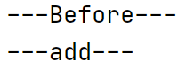
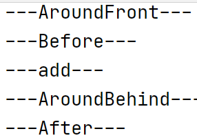
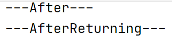
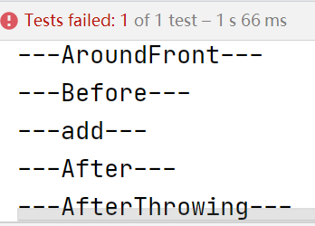
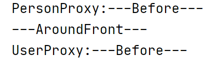
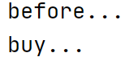

[TOC]


# 2.	AOP

## 2.0	AOP概念

### 2.0.1	什么是AOP？

AOP为Aspect Oriented Programming的缩写，意为：[面向切面编程](https://baike.baidu.com/item/面向切面编程/6016335)，通过[预编译](https://baike.baidu.com/item/预编译/3191547)方式和运行期间动态代理实现程序功能的统一维护的一种技术。

利用AOP可以对业务逻辑的各个部分进行隔离，从而使得业务逻辑各部分之间的[耦合度](https://baike.baidu.com/item/耦合度/2603938)降低，提高程序的可重用性，同时提高了开发的效率。

AOP可以以不通过修改源代码的方式，在主干功能里添加新功能。


### 2.0.2	AOP术语

1.连接点：在类中可以被增强的方法

2.切入点：实际真正被增强的方法

3.通知（增强）：实际增强的逻辑部分称为通知（增强），通知有多种类型：

​	（1）前置通知：在目标方法前执行

​	（2）后置通知：在目标方法后执行

​	（3）环绕通知：在目标方法执行前后都执行

​	（4）异常通知：目标方法出现异常时执行

​	（5）最终通知：无论是否发生异常，都会在最终执行

4.切面：将通知应用到切入点的过程


## 2.1	AOP底层原理

在AOP底层使用了动态代理，在动态代理中有两种情况：

（1）有接口情况，使用JDK动态代理

​		1）创建接口实现类的代理对象，通过代理对象增强方法（插入新功能的代码）

（2）无接口情况，使用CGLIB动态代理

​		1）创建当前类的子类的代理对象，通过代理对象增强方法


## 2.2	JDK动态代理

要使用JDK动态代理，就要使用Proxy类中的方法创建代理对象

```java
public static Object newProxyInstance(ClassLoader loader,Class<?>[] interfaces,InvocationHandler h)
//返回指定接口的代理类实例，该接口将方法调用分派给指定的调用处理程序
//方法中的三个参数：
//ClassLoader类加载器，用于加载实现类
//Class<?>[] interfaces 增强方法所在类所实现的接口，支持多接口
//InvocationHandler	实现这个接口，创建代理对象，写入增强方法
```


### 2.2.1	JDK动态代理实现

实现步骤：

（1）创建接口，定义方法

（2）创建接口实现类，实现方法

（3）使用Proxy类创建接口代理对象


（1）创建接口UserDao：

```java
public interface UserDao {
    public int add(int a,int b);
    public String update(String id);
}
```

（2）创建接口实现类UserDaoImpl，实现接口方法

```java
public class UserDaoImpl implements UserDao{
    @Override
    public int add(int a, int b) {
        return a+b;
    }

    @Override
    public String update(String id) {
        return id;
    }
}
```

（3）创建代理类UserDaoProxy：

```java
public class JDKProxy {
    public static void main(String[] args) {
        //创建接口实现类的代理对象
        Class[] ints={UserDao.class};
        UserDao userDao = (UserDao) Proxy.newProxyInstance(JDKProxy.class.getClassLoader(),ints,new UserDaoProxy(new UserDaoImpl()));
        int result = userDao.add(1,2);
        System.out.println("result:"+result);
    }
}

//这里也可以选择在第5行直接使用匿名类
class UserDaoProxy implements InvocationHandler,NullInterface{
//实现InvocationHandler接口
    //1.将要创建的代理对象对应的实现类传递过来
    //(1)有参构造传递
    private Object obj;
    public UserDaoProxy(Object obj){//参数传递的是代理对象对应的实现类
        this.obj=obj;
    }
    @Override
    //将增强逻辑写入invoke方法
    public Object invoke(Object proxy, Method method, Object[] args) throws Throwable {
        //参数分别为proxy代理对象，method当前要增强的方法,args参数
        //目标方法执行前
        System.out.println(method.getName()+"方法执行前执行，传递的参数："+ Arrays.toString(args));
        //目标方法执行
        Object result = method.invoke(obj,args);//result获取目标方法的返回值
        //目标方法执行后
        System.out.println("目标方法执行后"+obj);
        return result;//返回原目标方法的返回值
    }
}
```


## 2.3	AOP操作

1.Spring框架的AOP操作是基于[AspectJ]实现的

> AspectJ是一个独立的AOP框架，不是Spring框架的组成部分，一般把Spring和AspectJ一起使用，进行AOP操作

2.基于AspectJ实现AOP操作：

​	（1）基于XML配置文件实现

​	（2）基于注解方式实现（常用）

3.切入点表达式：知道对哪个类中的哪个方法进行增强

```java
//表达式形式：execution([权限修饰符][返回类型][类的全路径名][方法名称]([参数列表]))

//举例1：对com.example.dao.BookDao类中的add()方法增强：
execution(*com.example.dao.BookDao.add(..))
//*表示权限修饰符为任意，返回类型省略，圆括号中的..表示参数列表
    
//举例2：对com.example.dao.BookDao类中的全部方法增强：
execution(*com.example.dao.BookDao.*(..))
    
////举例2：对com.example.dao包下的全部类中的全部方法增强：
execution(*com.example.dao.*.*(..))
```


### 2.3.0	引入AOP依赖

```xml
<!-- https://mvnrepository.com/artifact/org.springframework/spring-aspects -->
<dependency>
    <groupId>org.springframework</groupId>
    <artifactId>spring-aspects</artifactId>
    <version>5.2.11.RELEASE</version>
</dependency>

<!-- https://mvnrepository.com/artifact/net.sourceforge.cglib/com.springsource.net.sf.cglib -->
<dependency>
    <groupId>net.sourceforge.cglib</groupId>
    <artifactId>com.springsource.net.sf.cglib</artifactId>
    <version>2.2.0</version>
</dependency>

<!-- https://mvnrepository.com/artifact/org.aopalliance/com.springsource.org.aopalliance -->
<dependency>
    <groupId>org.aopalliance</groupId>
    <artifactId>com.springsource.org.aopalliance</artifactId>
    <version>1.0.0</version>
</dependency>

<!-- https://mvnrepository.com/artifact/org.aspectj/com.springsource.org.aspectj.weaver -->
<dependency>
    <groupId>org.aspectj</groupId>
    <artifactId>com.springsource.org.aspectj.weaver</artifactId>
    <version>1.6.8.RELEASE</version>
</dependency>
```


### 2.3.1	AspectJ 注解方式实现

#### 2.3.1.1	@Before

（1）创建User类，在类中定义方法

```java
public class User {
    public void add(){
        System.out.println("---add---");
    }
}
```

（2）创建增强类UserProxy，编写增强逻辑，在增强类中创建多个方法，让不同方法代表不同通知类型

```java
//增强的类
public class UserProxy {
    //前置通知
    public void before(){
        System.out.println("---Before---");
    }
}
```

（3）在Spring配置文件中开启注解扫描

```xml
<?xml version="1.0" encoding="UTF-8"?>
<beans xmlns="http://www.springframework.org/schema/beans"
       xmlns:context="http://www.springframework.org/schema/context"
       xmlns:aop="http://www.springframework.org/schema/aop"
       xmlns:xsi="http://www.w3.org/2001/XMLSchema-instance"
       xsi:schemaLocation="http://www.springframework.org/schema/beans
       http://www.springframework.org/schema/beans/spring-beans.xsd
       http://www.springframework.org/schema/aop
       http://www.springframework.org/schema/aop/spring-aop.xsd
       http://www.springframework.org/schema/context
       http://www.springframework.org/schema/context/spring-context.xsd">
    <!--引入context和aop名称空间-->
    <!--开启组件扫描-->
    <context:component-scan base-package="com.example.aopanno"/>
</beans>
```

（4）使用注解创建目标类User和增强类UserProxy对象

```java
//被增强的类
@Component
public class User
```

（5）在增强类上增加注解@Aspect

```java
//增强类
@Component
@Aspect
public class UserProxy {
```

（6）在Spring配置文件中开启生成代理对象

```xml
<!--开启Aspect生成代理对象-->
<aop:aspectj-autoproxy/>
```

（7）配置不同类型的通知

在增强类UserProxy中，在作为通知（增强）方法上添加对应通知类型的注解，并使用切入点表达式配置

```java
//@Before注解表示这个方法用于前置通知
@Before("execution(* com.example.aopanno.User.add(..))")
```


运行程序：

注意，这里可能会提示junit版本过低而报错，若出现此问题请使用以下版本：

```xml
<!-- https://mvnrepository.com/artifact/junit/junit -->
<dependency>
  <groupId>junit</groupId>
  <artifactId>junit</artifactId>
  <version>4.12</version>
  <scope>test</scope>
</dependency>
```

正常情况下运行结果：


#### 2.3.1.2	其他通知

在增强类中实现其他通知：

```java
//@After表示最终通知
@After("execution(* com.example.aopanno.User.add(..))")
public void after(){
    System.out.println("---After---");
}

//@Around表示环绕通知
@Around("execution(* com.example.aopanno.User.add(..))")
public void around(ProceedingJoinPoint jp) throws Throwable {
    System.out.println("---AroundFront---");//目标方法执行前
    jp.proceed();//执行目标方法
    System.out.println("---AroundBehind---");//目标方法执行后
}

//@AfterReturning表示后置通知（返回通知）
@AfterReturning("execution(* com.example.aopanno.User.add(..))")
public void afterReturning(){
    System.out.println("---AfterReturning---");
}

//@AfterThrowing表示异常通知
@AfterThrowing("execution(* com.example.aopanno.User.add(..))")
public void afterThrowing(){
    System.out.println("---AfterThrowing---");
}
```

运行程序：




#### 2.3.1.3	@AfterThrowing

@AfterThrowing注解标注的方法只在目标方法抛出异常时执行，因此之前的测试不能判断@AfterThrowing注解标注的方法是否能够运行

在目标方法中引发异常：

```java
public void add(){        
    System.out.println("---add---");
    int i=10/0;
}
```

运行程序：



首先@Around环绕通知在目标方法执行前执行，输出AroundFront

其次，在目标方法被调用前，@Before前置通知输出Before

之后，在目标方法被调用，输出add

接着，目标方法中出现除零异常，目标方法异常终止，@After最终通知输出After

最后，目标方法抛出异常，@AfterThrowing异常通知输出AfterThrowing

由于程序异常终止，因此没有执行@Around的环绕后方法，且因为目标方法被终止而没有返回，因此没有执行@AfterReturning后置通知（返回通知）


#### 2.3.1.4	相同切入点抽取

```java
//相同切入点抽取
@Pointcut("execution(* com.example.aopanno.User.add(..))")//切入点表达式
public void pointDemo(){//切入点签名
}

@Before("pointDemo()")//直接使用切入点签名即可，不必再使用重复的切入点表达式
public void before(){
    System.out.println("---Before---");
}
```


#### 2.3.1.5	设置增强类的优先级

当有多个增强类为同一个方法进行增强时，可以设置增强类的优先级，保证方法执行顺序可控

新增增强类PersonProxy：

```java
@Component
@Aspect
@Order(1)//@Order注解用于为增强类设置优先级，数字越小优先级越高
public class PersonProxy {
    //@Before注解表示这个方法用于前置通知
    @Before("execution(* com.example.aopanno.User.add(..))")
    public void before(){
        System.out.println("PersonProxy:---Before---");
    }
}
```

将UserProxy优先级设为3：

```java
@Order(3)
public class UserProxy {
```

运行程序：



可以看到，通过指定增强类的优先级，实现了改变增强类的执行顺序


### 2.3.2	AspectJ XML配置文件方式实现（不常用）

实现步骤：

（1）创建增强类和被增强类，创建方法

（2）在Spring配置文件中创建两个类的对象

（3）在Spring配置文件中配置切入点


#### 2.3.2.1	XML配置文件方式实现

（1）创建被增强类Book：

```java
public class Book {
    public void buy(){
        System.out.println("buy...");
    }
}
```

创建增强类BookProx：

```java
public class BookProxy {
    public void before(){
        System.out.println("before...");
    }
}
```


（2）在Spring配置文件中创建两个类的对象：

```xml
<!--创建对象-->
<bean id="book" class="com.example.aopxml.Book"/>
<bean id="bookproxy" class="com.example.aopxml.BookProxy"/>
```


（3）在Spring配置文件中配置切入点：

```xml
<aop:config>
    <!--配置切入点-->
    <aop:pointcut id="p" expression="execution(* com.example.aopxml.Book.buy(..))"/>
    <!--配置切面 ref:增强类-->
    <aop:aspect ref="bookproxy">
        <!--增强作用在具体方法上-->
        <aop:before method="before" pointcut-ref="p"/>
        <!--aop:before表示使用Before通知，method表示通知对应的方法 pointcut-ref表示对应切入点-->
    </aop:aspect>
</aop:config>
```


（4）在测试类中添加测试方法：

```java
@Test
public void testAopXml(){
    ApplicationContext ac =
            new ClassPathXmlApplicationContext("beanxml.xml");
    Book book = ac.getBean("book", Book.class);
    book.buy();
}
```

运行程序：


## 2.4	SpringAOP完全使用注解开发

创建配置类，不需要XML配置文件：

```java
@Configuration//标记为配置类
@ComponentScan(basePackages = {"com.example"})//开启组件扫描
@EnableAspectJAutoProxy(proxyTargetClass = true)//开启Aspect生成代理对象
//相当于<aop:aspectj-autoproxy/>
public class ConfigAop {
}
```

