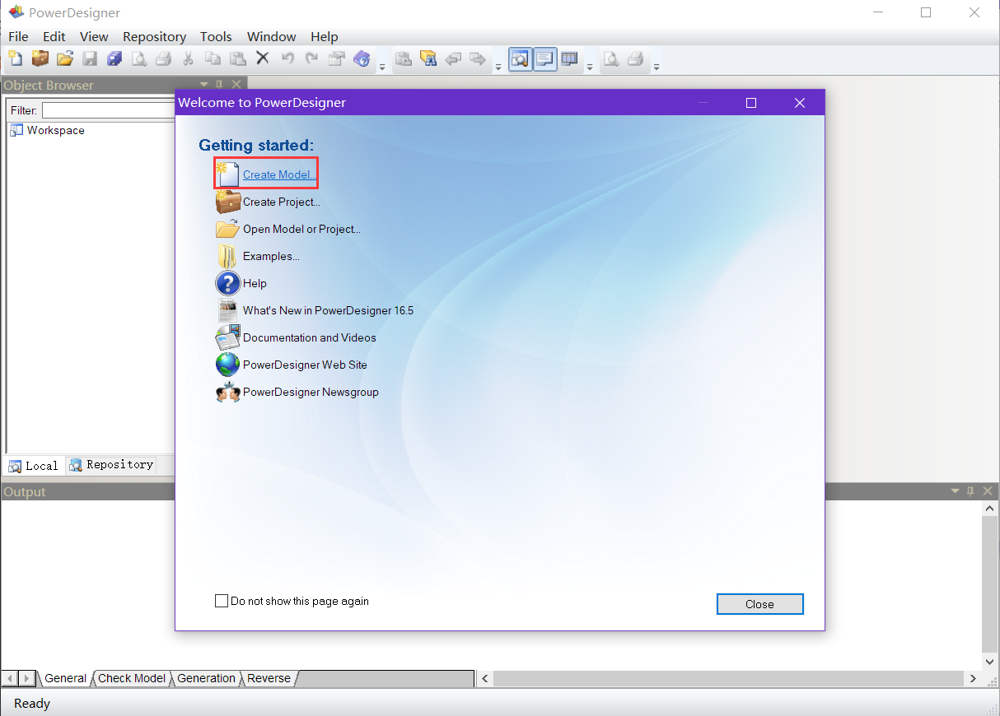
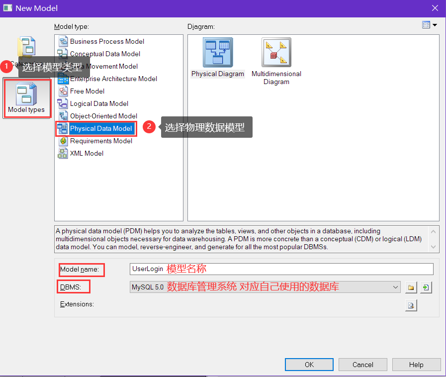
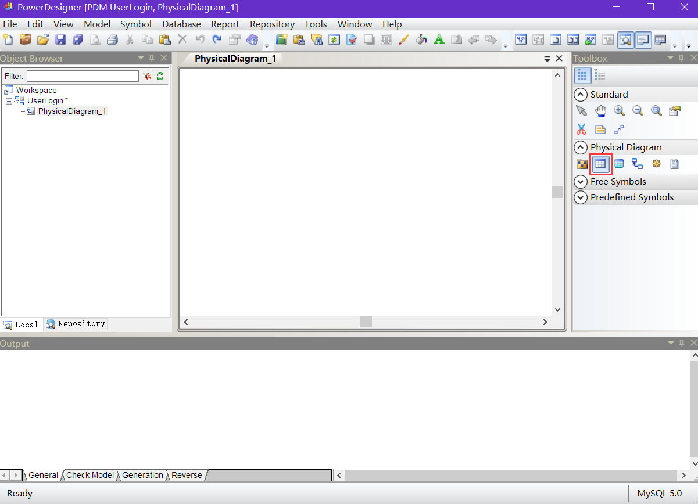
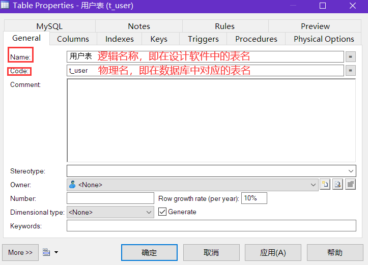
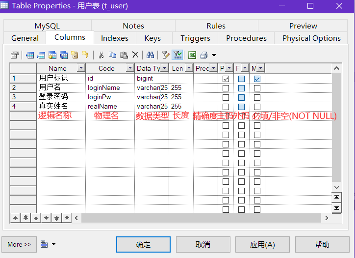
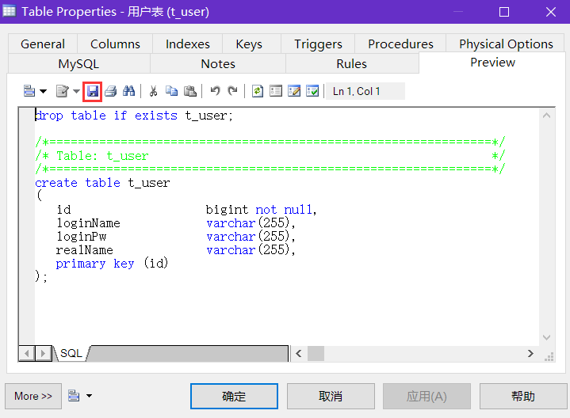
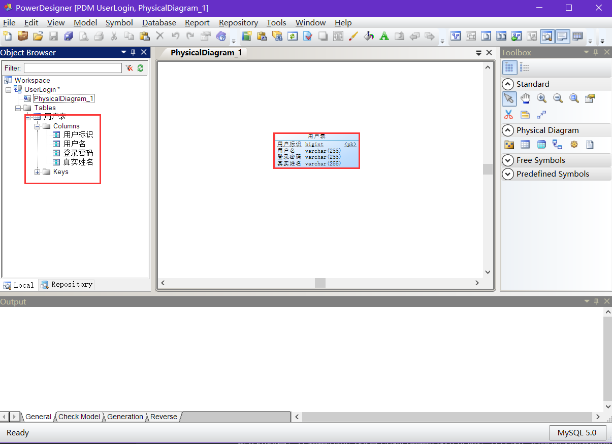

# 1.	PowerDesigner

该笔记中使用的版本为PowerDesigner 16.5

## 1.1	创建模型

1.打开PowerDesigner，在欢迎界面中选择创建模型Create Model：

2.选择模型种类Model Types，选择物理数据模型Physical Data Model，数据库管理系统按自己需要使用的对应数据库选择，如这里使用MySQL5.0

3.进入图表编辑页面，在右侧工具箱Toolbox中物理图表工具Physical Diagram中选择表Table：

4.点击图表编辑区域的空白部分，创建第一张表Table

5.在右侧工具盒切换回指针Pointer，双击刚刚创建的表，编辑表的信息：

6.在表属性窗口中切换到Columns栏，编辑列信息：

7.选择“应用”保存修改，在Preview窗口可以查看之前编辑的信息对应的SQL语句，点击上方工具栏的保存图标，可以将这些SQL语句保存为.sql文件：

8.关闭窗口，在编辑界面可以看到我们编辑的表的信息，在左侧栏对象浏览器Object Browser中展开表可以看到对应表项：

9.点击上方工具栏的保存按钮，可以将创建的物理数据模型保存为.pdm(Physical Data Model)文件