[TOC]


# 1.	JDBC

1.什么是JDBC？

Java DataBase Connectivity（JAVA语言连接数据库）

2.JDBC的本质？

JDBC是Sun公司制定的一套接口，位于java.sql包下

> 为什么要面向接口编程？
>
> 解耦合，降低代码耦合度，提高程序的扩展性。多态就是典型的面向抽象编程，而不是面向具体编程。
>
> ```java
> //我们建议面向抽象编程：
> Animal a = new Cat();
> public void feed(Animal animal){//面向父类型编程
> 
> }
> //而不是面向具体编程：
> Animal b = new Dog();
> public void feed(Dog dog){
> 
> }
> ```

> 为什么Sun公司要制定一套接口？
>
> 因为每个数据库的实现原理各不相同，各数据库开发者只需要根据接口开发对应的实现类（数据库驱动），而用户只需要调用接口就能实现功能

> 驱动：所有的数据库驱动都是以jar包形式存在的，jar包中有很多.class文件，它们用于实现JDBC接口。驱动不是Sun公司提供，而是由各数据库开发者提供。

3.JDBC编程步骤：

（1）注册驱动（告诉Java程序连接哪个数据库）

（2）获取连接（在JVM进程与数据库进程之间建立通道，属于进程间的通信，重量级，通信结束后需要关闭通道）

（3）获取数据库操作对象（执行SQL语句的对象）

（4）执行SQL语句（DQL,DML等）

（5）处理查询结果集（只有第四步执行SELECT语句时才需要处理查询结果集）

（6）释放资源（使用完资源后要关闭资源，Java和数据库间的通信是进程间的通信，开启后必须关闭）


## 1.1	JDBC编程

### 1.1.1	注册驱动

在Java中，需要使用java.sql包下的DriverManager类来注册驱动

DriverManager类下有方法registerDriver()：

```java
//我们要使用DriverManager类的registerDriver()方法注册驱动
public static synchronized void registerDriver(java.sql.Driver driver)
//java.sql.Driver对应的是JDBC定义的Driver接口，要正常使用数据库，必须传入我们要使用的数据库实现的Driver类
```

```java
//1.注册驱动,使Java程序连接到MySQL数据库
try {
    DriverManager.registerDriver(new Driver());
} catch (SQLException e) {
    //SQLException属于受检异常，必须捕获，否则无法通过编译
    e.printStackTrace();
}
```


### 1.1.2	获取连接

现在我们要获取连接，与数据库进程之间建立通道。我们通过DriverManager类的getConnection()方法实现：

```java
public static Connection getConnection(String url, String user, String password)throws SQLException
//该方法尝试建立与给定数据库URL的连接,DriverManager尝试从一组已注册的JDBC驱动程序中选择适当的驱动程序。
/*    参数
url - 形式为 jdbc:subprotocol:subname的数据库网址
user - 正在连接的数据库用户
password - 用户密码*/
```

> 1.URL：统一资源定位符，表示网络上某个资源的绝对路径，如www.baidu.com
>
> URL包括四部分：协议、IP、端口Port和资源名
>
> 如http://182.61.200.7:80/index.html：
>
> 其中http://为通信协议，182.61.200.7为服务器IP地址，80为端口号，index.html为服务器上的某资源名

> 2.什么是通信协议？
>
> 通信协议是通信前就提前约定好的数据传送格式，即约定好了数据包具体封装数据的格式。

```java
//1.注册驱动,使Java程序连接到MySQL数据库
try {
    DriverManager.registerDriver(new Driver());
    //2.获取连接
    String url="jdbc:mysql://localhost:3306/user_db";
    /*	jdbc:mysql://	 协议
    	localhost		IP地址(localhost为本机IP，相当于127.0.0.1)
    	3306		    MySQL数据库端口号
    	user_db			具体的数据库实例名	*/
    String user="root";
    String password="root";
    Connection con = (Connection) DriverManager.getConnection(url,user,password);
    System.out.println(con);
} catch (SQLException e) {
    //SQLException属于受检异常，必须捕获，否则无法通过编译
    e.printStackTrace();
}
```


### 1.1.3	获取数据库操作对象

我们需要使用Statement类对象操作数据库，因此使用Connection实例类的createStatement()方法：

```java
//3.获取数据库操作对象
Statement stmt = (Statement) con.createStatement();
```


### 1.1.4	执行SQL语句（添加操作）

建立测试表：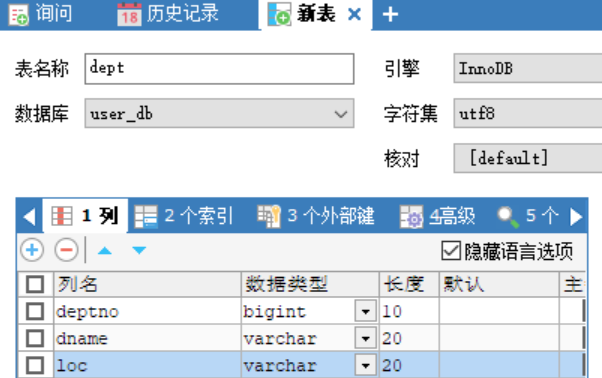

```java
//4.执行SQL语句
String sql = "insert into dept(deptno,dname,loc) values(50,'人事部','北京')";
//executeUpdate方法专门用于执行DML语句(Insert，Update，Delete)
int result = stmt.executeUpdate(sql);//返回值为影响数据库记录的条数
System.out.println(result==1?"保存成功":"保存失败");
```


### 1.1.5	释放资源

为了保证资源一定能得到释放，我们需要在try/catch语句块后使用finally语句块释放资源

但finally中不能访问到try中新建的对象，因此需要把对象声明放在try/catch外：

```java
//finally中不能访问到try中新建的对象，因此需要把对象声明放在try/catch外：
Connection con = null;
Statement stmt = null;
//1.注册驱动,使Java程序连接到MySQL数据库
try {
    DriverManager.registerDriver(new Driver());
    //2.获取连接
    String url="jdbc:mysql://localhost:3306/user_db";
    String user="root";
    String password="root";
    con = (Connection) DriverManager.getConnection(url,user,password);
    //3.获取数据库操作对象
    stmt = (Statement) con.createStatement();
    //4.执行SQL语句
    String sql = "insert into dept(deptno,dname,loc) values(50,'人事部','北京')";
    //executeUpdate方法专门用于执行DML语句(Insert，Update，Delete)
    int result = stmt.executeUpdate(sql);//返回值为影响数据库记录的条数
    System.out.println(result==1?"保存成功":"保存失败");

    //5.处理查询结果集

} catch (SQLException e) {
    //SQLException属于受检异常，必须捕获，否则无法通过编译
    e.printStackTrace();
}finally {
    //6.释放资源
    //为了保证资源一定能得到释放，在finally中关闭资源
    //遵循从小到大原则，从小到大依次关闭
    //对要关闭的资源可能抛出的异常分别进行try,catch
   
	if(stmt!=null){//从小到大原则，先关闭最后被实例化的Statement对象，再关闭Connection对象
     	try {
            stmt.close();
        } catch (SQLException throwables) {
            throwables.printStackTrace();
        }
    }
    if(con!=null){
        try {//分别进行try/catch，防止一个资源关闭异常跳转到catch导致其他资源没有关闭
            con.close();
        } catch (SQLException throwables) {
            throwables.printStackTrace();
        }
    }
}
```

运行程序：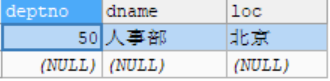


### 1.1.6	删除操作

代码与1.1.5中基本相同，但相对于1.1.4中SQL语句部分：

```java
String sql = "delete from dept where deptno = 50";
int result = stmt.executeUpdate(sql);
System.out.println(result==1?"删除成功":"删除失败");
```

运行程序：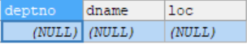


### 1.1.7	更新操作

代码与1.1.5中基本相同，但相对于1.1.4中SQL语句部分：

```java
String sql = "update dept set dname = '销售部',loc = '天津'where deptno= 50";
int result = stmt.executeUpdate(sql);
System.out.println(result==1?"更新成功":"更新失败");
```

运行程序：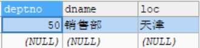


### 1.1.8	类加载的方式注册驱动

在Driver接口的MySQL实现类中代码：

```java
public class Driver extends NonRegisteringDriver implements java.sql.Driver {
    public Driver() throws SQLException {
    }

    static {
        try {
            DriverManager.registerDriver(new Driver());
        } catch (SQLException var1) {
            throw new RuntimeException("Can't register driver!");
        }
    }
}
```

由于Driver类中已经有了静态方法注册驱动，因此我们注册驱动时只需要加载类即可：

```java
//通过类加载的方式注册驱动更常用
//因为这种方法只需要一个字符串，而字符串可以写入.properties文件
Class.forName("com.mysql.jdbc.Driver");

//Class.forName()会抛出ClassNotFoundException异常，需要在下方与SQLException异常分别捕获：
	//JDBC编程流程
} catch (SQLException e) {
    e.printStackTrace();
}catch (ClassNotFoundException e){
    e.printStackTrace();
}finally {  
    //关闭资源
```


### 1.1.9	从属性资源文件中读取连接数据库信息

为了方便过渡到从属性资源文件中读取连接数据库所需信息，我们先建立字符串对象，将对象传入方法的参数，这样之后可以再从属性资源文件中读取信息为字符串赋值：

```java
String driver = "com.mysql.jdbc.Driver";
Class.forName(driver);
//2.获取连接
String url="jdbc:mysql://localhost:3306/user_db";
String user="root";
String password="root";
con = (Connection) DriverManager.getConnection(url,user,password);
```


建立属性资源文件jdbc.properties：

```properties
driver=com.mysql.jdbc.Driver
url=jdbc:mysql://localhost:3306/user_db
user=root
password=root
```


通过ResourceBundle对象获取properties配置文件信息：

```java
ResourceBundle bundle = ResourceBundle.getBundle("jdbc");
String driver = bundle.getString("driver");
String url=bundle.getString("url");
String user=bundle.getString("user");
String password=bundle.getString("password");
```


### 1.1.10	查询操作

要查询对象，就要把查询结果存入查询结果集中，它对应接口ResultSet

```java
ResultSet res = null;
```

查询结果集对象应获取SQL执行对象Statement执行查询操作的返回值，执行查询操作使用executeQuery()方法：

```java
//4.执行SQL语句
String sql = "select user_id,username,ustatus from t_user as userID,userName,uStatus";
set = stmt.executeQuery(sql);
```


#### 1.1.10.1	处理查询结果集

> ```java
> boolean next()throws SQLException
> ```
>
> 从当前位置移动光标向前一行。
>
> ResultSet光标最初定位在第一行的前面；该方法第一次调用到当前行的行首；第二次调用到第二行当前行，以此类推。
>
> 当光标位于最后一行时，调用next方法返回false。任何对ResultSet当前行调用将导致`SQLException`抛出。如果结果集的类型是`TYPE_FORWARD_ONLY`，它指定自己的JDBC驱动程序的实现将返回`false`或抛出一个SQLException异常。
>
> 如果一个输入流中打开当前行，调用的next方法将隐式地关闭它。
>
> - 结果 
>
>   `true`如果新的当前行是有效的； `false`如果没有更多的行 
>
> - 异常 
>
>   `SQLException`  -如果一个数据库访问错误发生或调用此方法在一个封闭的结果集 

```java
//5.处理查询结果集
while(res.next()){//光标指向的行有数据
    String user_id = res.getString(1);//取出光标对应行的数据
    String username=res.getString(2);//数字代表列号下标
    String ustatus = res.getString(3);//JDBC中所有下标从1开始
    System.out.println(user_id+","+username+","+ustatus);
}
```

这样的查询代码还不够健壮：当列的顺序发生变化时，我们取出的数据就不能一一对应了，因此我们应通过列名获取该列的数据：

```java
while(set.next()){
    String user_id = res.getString("userID");//根据列名获取信息，可靠性更高
    String username = res.getString("userName");//这里的列名对应4.中SQL语句的列名
    String ustatus = res.getString("uStatus" );//即这里的列名是查询结果集的列名
    System.out.println(user_id+","+username+","+ustatus);//不是表中的列的名称
}
```


最后从小到大释放资源：

```java
if(res!=null){//从小到大原则，先关闭最后被实例化的Statement对象，再关闭Connection对象
    try {
        res.close();
    } catch (SQLException throwables) {
        throwables.printStackTrace();
    }
}
if(stmt!=null){//分别进行try/catch，防止一个资源关闭异常跳转到catch导致其他资源没有关闭
    try {
        stmt.close();
    } catch (SQLException throwables) {
        throwables.printStackTrace();
    }
}
if(con!=null){
    try {
        con.close();
    } catch (SQLException throwables) {
        throwables.printStackTrace();
    }
}
```


## 1.2	用户登录业务

1.需求：模拟用户登录功能

2.业务描述：程序运行时，提供一个输入的入口，让用户输入用户名和密码，用户输入用户名和密码之后，提交信息，Java程序收集到用户信息，Java程序连接数据库验证用户名和密码是否合法，若合法则提示登录成功，不合法则提示登录失败

3.数据准备：在实际开发中，表的设计要使用专业的建模工具，我们这里使用PowerDesigner来进行数据库表的设计


### 1.2.1	使用PowerDesigner设计数据库表

详见JDBC笔记-1.1PowerDesigner.md


用IDEA打开使用PowerDesigner生成的.sql文件，将ID指定为自动增长，并插入几条信息：

```sql
drop table if exists t_user;

create table t_user
(
   id                   bigint not null auto_increment,#设为自动增长
   loginName            varchar(255),
   loginPw              varchar(255),
   realName             varchar(255),
   primary key (id)
);
insert into t_user(loginName, loginPw, realName) values ('ZhangThree','123','张三');
insert into t_user(loginName, loginPw, realName) values ('Jack','123','杰克');
insert into t_user(loginName, loginPw, realName) values ('LiFour','123','李四');
```


### 1.2.2	IDEA配置DataBase插件

在右侧栏选择Database，建立对应数据源，即你要使用的数据库，以MySQL为例：

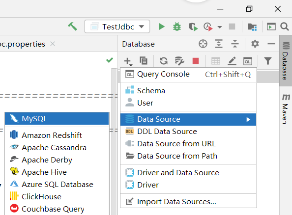

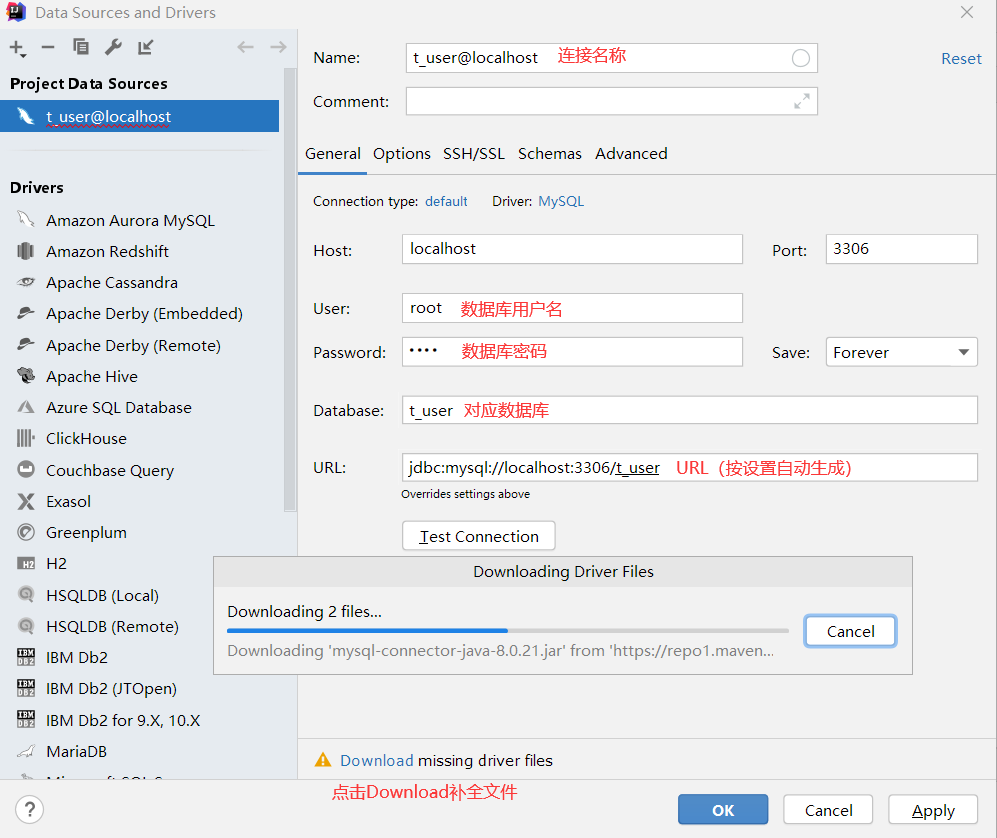


在数据库控制台中运行之前编写的SQL语句：

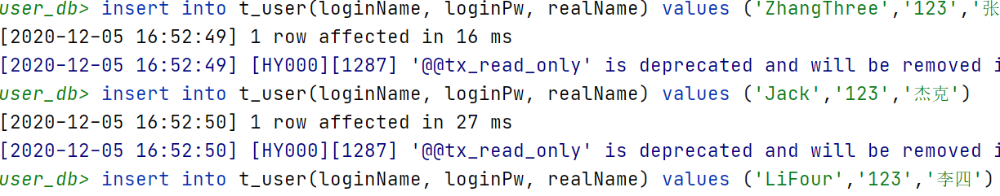

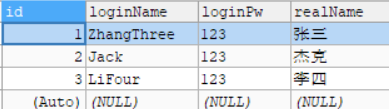


### 1.2.3	设计程序框架

在主方法中先设计程序主体的逻辑框架：

```java
public static void main(String[] args){
    //初始化登录界面,应返回用户输入的账号和密码
    Map<String,String> userLoginInfo = initUI();
    //传入用户输入的信息，验证登录是否成功
    boolean isLoginSuccess = login(userLoginInfo);
    //输出登录结果
    System.out.println(isLoginSuccess?"登录成功":"登录失败");
}
```


### 1.2.4	初始化登录界面

实现initUI()方法，在程序运行时提示用户输入账号密码，以键值对形式返回

```java
private static Map<String,String> initUI(){
    System.out.println("---用户登录---");
    Scanner s = new Scanner(System.in);
    System.out.print("   用户名：");
    String loginName = s.nextLine();
    System.out.print("   密码：");
    String loginPw = s.nextLine();
    Map<String,String> userLoginInfo = new HashMap<>();
    userLoginInfo.put("loginName",loginName);
    userLoginInfo.put("loginPw",loginPw);
    return userLoginInfo;
}
```


### 1.2.5	验证用户信息

实现login()方法，根据用户输入的信息，通过JDBC操作查询数据库并进行比对，返回逻辑值，表示用户登录是否成功：

```java
private static boolean login(Map<String, String> userLoginInfo) {
    //初始化判断登录成功为false，若不修改该值即视为登录失败
    boolean isLoginSuccess = false;
    //JDBC操作
    Connection con = null;
    Statement stmt = null;
    ResultSet res = null;
    //获取数据库配置资源文件
    ResourceBundle bundle = ResourceBundle.getBundle("jdbc");
    String driver = bundle.getString("driver");
    String url = bundle.getString("url");
    String user = bundle.getString("user");
    String pw = bundle.getString("password");
    //获取userLoginInfo信息，即用户输入的信息
    String loginName = userLoginInfo.get("loginName");
    String loginPw = userLoginInfo.get("loginPw");
    try {
        //1.注册驱动
        Class.forName(driver);
        //2.获取连接
        con = (Connection) DriverManager.getConnection(url,user,pw);
        //3.获取数据库操作对象
        stmt = (Statement) con.createStatement();
        //4.执行SQL语句
        String sql = "select * from t_user where loginName='"+loginName+"'and loginPw='"+loginPw+"'";
        res = stmt.executeQuery(sql);
        //5.处理查询结果集
        if(res.next()){//若为真证明数据库查询到了信息，即用户登录信息与数据库信息一致
            isLoginSuccess = true;//登录成功
        }

    } catch (ClassNotFoundException e) {
        e.printStackTrace();
    }catch (SQLException throwables) {
        throwables.printStackTrace();
    }finally {
        //6.释放资源 遵循从小到大原则
        if(res!=null){
            try {
                res.close();
            } catch (SQLException throwables) {
                throwables.printStackTrace();
            }
        }
        if(stmt!=null){
            try {
                stmt.close();
            } catch (SQLException throwables) {
                throwables.printStackTrace();
            }
        }
        if(con!=null){
            try {
                con.close();
            } catch (SQLException throwables) {
                throwables.printStackTrace();
            }
        }
    }
    return isLoginSuccess;//返回登录判断
}
```

运行程序：

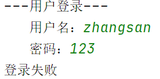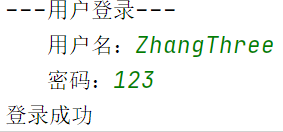


### 1.2.6	SQL注入

再次运行程序：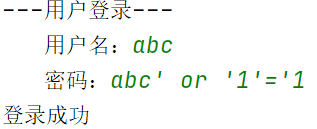

可以看到，我们输入了错误的用户名和密码却实现了登录，这种现象被称为SQL注入

```
---用户登录---
   用户名：abc
   密码：abc' or '1'='1
登录成功
```


#### 1.2.6.1	为什么会出现SQL注入

在SQL语句执行位置标记断点，用Debug模式查看执行前的SQL语句：


由于‘1’=‘1’必定成立，因此必定能查询到数据库信息

而我们判断用户能否登录的依据是if(res.next())，即判断数据库有无查询结果

因此必定能够登录成功


#### 1.2.6.1	SQL注入的根本原因

```java
String sql = "select * from t_user where loginName='"+loginName+"'and loginPw='"+loginPw+"'";
//以上代码完成了SQL语句的拼接，而以下代码发送SQL语句给DBMS，DBMS再进行对SQL语句的编译
//由于用户的非法输入，使用户输入的非法信息被作为SQL语句的一部分编译进去，导致原SQL语句的含义被扭曲
```

因此，SQL注入的根本原因是用户输入的信息中含有SQL语句的关键字，并且这些关键字参与了关键字的编译过程，导致原SQL语句的含义被扭曲，进而达到了SQL注入


#### 1.2.6.2	解决SQL注入问题

如何解决SQL注入问题？

只要用户提供的信息不参与SQL语句的编译过程，问题就解决了。即使用户提供的信息中含有SQL关键字，只要不参与编译就不起作用，从而解决SQL注入问题。

要想用户提供的信息不参与SQL语句的编译过程，需要使用PreparedStatement预编译执行对象来替代Statement执行对象

PreparedStatement接口继承了Statement接口

PreparedStatement属于预编译的数据库操作对象

PreparedStatement的原理是：预先对SQL语句的框架进行编译，然后再给SQL语句传"值"。


为了解决SQL注入问题，我们需要对之前的代码做一些修改：

1.将Statement执行对象替换为PreparedStatement预编译执行对象

```java
PreparedStatement ps = null;//使用PreparedStatement预编译的数据库操作对象替换Statement
```

2.在第三步获取对象时，我们现在需要获取一个PreparedStatement预编译执行对象，需要使用Connection类下的prepareStatement()方法，传入一个SQL语句，用占位符"?"替代传入的值，这个方法会返回我们需要的PreparedStatement对象：

```java
//3.获取数据库操作对象
String sql = "select * from t_user where loginName = ? and loginPw = ?";//SQL语句框架
//程序执行到这里，会发送SQL语句给DBMS进行处理，DBMS会对SQL语句进行预编译
ps = (PreparedStatement) con.prepareStatement(sql);//一个"?"对应一个值
//给占位符"?"传值，JDBC中所有下标从1开始
ps.setString(1,loginName);//第一个参数表示占位符下标
ps.setString(2,loginPw);//第二个参数表示要给占位符所在位置传入的值

//4.执行SQL语句
res = ps.executeQuery();//注意这里不需要传入SQL语句
```

此时sql中的占位符"?"之后需要传入值，不论传入什么都只作为一个字符串处理，不会注入到SQL语句中。


第六步释放PreparedStatement资源：

```java
if(ps!=null){
    try {
        ps.close();
    } catch (SQLException throwables) {
        throwables.printStackTrace();
    }
}
```

运行程序：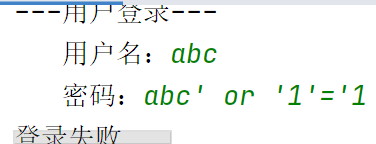

```sql
#此时传入的字符串为
select * from t_user where loginName = 'abc' and loginPw = 'abc\' or \'1\' = \'1'
#对比SQL注入时传入的字符串：
select * from t_user where loginName = 'abc' and loginPw = 'abc' or '1' = '1'
```

这样，我们就解决了SQL注入问题


#### 1.2.6.3	Statement与PreparedStatement

1.Statement与PreparedStatement区别：

（1）Statement存在SQL注入问题，PreparedStatement解决了SQL注入问题

（2）Statement编译一次执行一次，PreparedStatement编译一次可执行多次，因此效率相比Statement更高

（3）PreparedStatement会在编译阶段做类型安全检查

综上所述，绝大部分情况下我们都选择使用安全性更好、效率更高的PreparedStatement


2.什么情况下需要Statement？

​	业务方面要求必须支持SQL注入时需要使用Statement，因为Statement支持SQL注入

​		如我们需要手动指定查询对象的排序类型时，升序为ASC,降序为DESC

​		我们只能使用SQL注入来改变SQL查询语句的排序方式，若使用PreparedStatement，则会出现order by id 'desc'的情况，无法通过编译，方法会抛出Mysql语法错误异常MySQLSyntaxErrorException


## 1.3	PreparedStatement实现增删改

### 1.3.1	添加操作

```java
//3.获取数据库操作对象
String sql = "insert into dept(deptno, dname, loc) values (?,?,?)";
ps = (PreparedStatement) con.prepareStatement(sql);
ps.setInt(1,10);
ps.setString(2,"销售部");
ps.setString(3,"南京");
//4.执行SQL语句
int count = 0;
count = ps.executeUpdate();
System.out.println(count==0?"插入失败":"插入成功");
```

运行程序：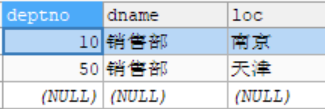


### 1.3.2	修改操作

```java
//3.获取数据库操作对象
String sql = "update dept set dname = ?, loc = ? where deptno = ?";
ps = (PreparedStatement) con.prepareStatement(sql);
ps.setString(1,"研发部");
ps.setString(2,"广州");
ps.setInt(3,10);
//4.执行SQL语句
int count = 0;
count = ps.executeUpdate();
System.out.println(count==0?"更新失败":"更新成功");
```

运行程序：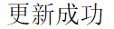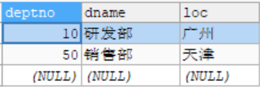


### 1.3.3	删除操作

```java
//3.获取数据库操作对象
String sql = "delete from dept where deptno = ?";
ps = (PreparedStatement) con.prepareStatement(sql);
ps.setInt(1,10);
//4.执行SQL语句
int count = 0;
count = ps.executeUpdate();
System.out.println(count==0?"删除失败":"删除成功");
```

运行程序：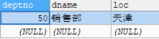


## 1.4	JDBC事务机制

在JDBC中，事务是自动提交的，即每次执行任意DML语句都会自动提交。

这是JDBC的默认行为，但在实际业务中，通常使用多条DML语句联合完成，必须保证这些DML语句在同一个事务中同时执行成功或同时执行失败。


### 1.4.1	验证JDBC事务自动提交机制

接1.3中代码，修改第三步和第四步内容：

```java
//3.获取数据库操作对象
String sql = "update dept set dname = ? where deptno = ?";
ps = (PreparedStatement) con.prepareStatement(sql);
ps.setString(1,"X部门");
ps.setInt(2,50);
//4.执行SQL语句
count = ps.executeUpdate();//执行第一条Update语句
System.out.println(count==0?"更新失败":"更新成功");

//重新给占位符传值
ps.setString(1,"Y部门");
ps.setInt(2,40);
count = ps.executeUpdate();//执行第二条Update语句
System.out.println(count==0?"更新失败":"更新成功");
```


在上述代码第8行插入断点，运行程序，当程序执行到断点时刷新数据库：

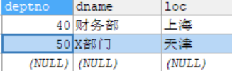

可以看到数据库数据已经发生了变化，再次运行程序直到结束：

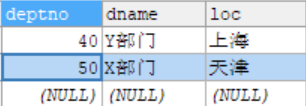

可以看到JDBC的事务自动提交机制确实存在，这对我们实际业务的开发有很大的负面影响，为了不影响我们正常的事物操作，必须解决这一问题。


### 1.4.2	银行转账系统

1.编写SQL脚本，创建银行账户表t_act：

```SQL
drop table if exists t_act;

create table t_act(#银行账户表
    actno bigint not null,#账号
    balance double(7,2)#余额 七位有效数字，两位小数
);
insert into t_act(actno, balance) VALUES(111,20000);#插入测试数据
insert into t_act(actno, balance) VALUES(222,0);
commit;#提交事务
select * from t_act;
```

运行脚本：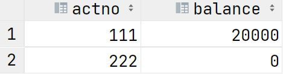


2.假定情景用户111向用户222转账10000元，在111扣款后，222收款前引发异常：

```java
//假定情景：用户111向用户222转账10000元
ps.setDouble(1,10000);
ps.setInt(2,111);
//4.执行SQL语句
count = ps.executeUpdate();
System.out.println(count==0?"更新失败":"更新成功");

String s = null;//引发异常
s.toString();

ps.setDouble(1,10000);
ps.setInt(2,222);
count = ps.executeUpdate();
System.out.println(count==0?"更新失败":"更新成功");
```

运行程序：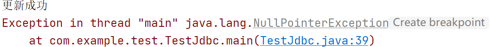

此时用户111扣款完成，而222没有收到，此时数据库为：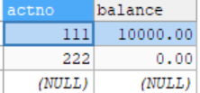

可以看到111扣款而222没有收到这笔钱，可见事务自动提交机制对我们实际业务影响非常大


#### 1.4.2.1	禁用事务自动提交

为了不影响实际业务开展，我们需要将事务自动提交改为手动提交，在Connection接口下有方法setAutoCommit，传入false则表示禁用事务自动提交：

```java
//2.获取连接
con = (Connection) DriverManager.getConnection(url,user,password);
con.setAutoCommit(false);//禁用事务自动提交
//3.获取预编译对象
```


#### 1.4.2.2	事务回滚

接以上测试代码，我们已经禁用了事务自动提交，为了能完成业务，我们需要在所有DML语句后一次性提交所有事务，同时处于安全性考虑，一旦发生异常我们需要执行事务回滚操作，恢复操作前的数据：

```java
//程序执行到这里，说明之前没有发生异常，事物结束，手动提交数据
    con.commit();//提交事务
} catch (Exception e) {
    if(con!=null){
        try {
            con.rollback();//回滚事务
        } catch (SQLException throwables) {
            throwables.printStackTrace();
        }
    }
}finally {
    //6.释放资源
```


## 1.5	JDBC工具类

为了简化JDBC编程，我们可以自己封装一个JDBC工具类：

```java
//JDBC工具类
public class DBUtil {
    //在工具类中，构造方法一般是私有的
    //因为工具类中的方法都是静态方法，不需要构造对象，直接使用类名调用即可
    private DBUtil(){}
    private static ResourceBundle bundle;
    private static String driver = null;
    private static String url = null;
    private static String user = null;
    private static String password = null;
    //静态代码块在类加载时执行，并且只执行一次
    static {
        bundle = ResourceBundle.getBundle("jdbc");
        driver = bundle.getString("driver");
        url = bundle.getString("url");
        user = bundle.getString("user");
        password = bundle.getString("password");
        try {
            Class.forName(driver);
        } catch (ClassNotFoundException e) {
            e.printStackTrace();
        }
    }

    /**
     * 获取数据库连接对象
     * @return 连接对象
     * @throws SQLException
     */
    public static Connection getConnection() throws SQLException {
        return DriverManager.getConnection(url,user,password);
    }//这里只抛出异常，在实际操作中再捕获异常

    /**
     *
     * @param con 连接对象
     * @param ps  数据库操作对象
     * @param rs  查询结果集
     */
    public static void close(Connection con, PreparedStatement ps, ResultSet rs){
        if(rs!=null){
            try {
                rs.close();
            } catch (SQLException throwables) {
                throwables.printStackTrace();
            }
        }
        if(ps!=null){
            try {
                ps.close();
            } catch (SQLException throwables) {
                throwables.printStackTrace();
            }
        }
        if(con!=null){
            try {
                con.close();
            } catch (SQLException throwables) {
                throwables.printStackTrace();
            }
        }
    }
}
```


## 1.6	模糊查询

使用之前编写的JDBC工具类，进行模糊查询：

```java
public static void main(String[] args) {
    Connection con = null;
    PreparedStatement ps = null;
    ResultSet rs = null;
    try {
        //1.注册驱动(在DBUtil中进行)
        //2.获取连接
        con =  DBUtil.getConnection();
        //3.获取预编译的数据库操作对象
        String sql = "select realName from t_user where loginName like ?";
        ps = (PreparedStatement) con.prepareStatement(sql);
        ps.setString(1,"_a%");
        //4.执行SQL语句
        rs = ps.executeQuery();
        //5.处理查询结果集
        while(rs.next()){
            System.out.println(rs.getString("realName"));
        }
    } catch (Exception throwables) {
        throwables.printStackTrace();
    }finally {
        //6.释放资源
        DBUtil.close(con,ps,rs);
    }
}
```

运行程序：


## 1.7	悲观锁和乐观锁

### 1.7.1	简单解释

1.悲观锁：事务必须排队进行，数据被锁定，不允许并发（行级锁：SELECT语句后加上 for update）

2.乐观锁：支持并发，事务不需要排队，但需要一个版本号，各事务通过版本号判断查询和提交时事务数据是否一致


### 1.7.2	概念解释

数据库管理系统（DBMS）中的并发控制的任务是确保在多个事务同时存取数据库中同一数据时不破坏事务的隔离性和统一性以及数据库的统一性。

乐观并发控制(乐观锁)和悲观并发控制（悲观锁）是并发控制主要采用的技术手段。

针对于不同的业务场景，应该选用不同的并发控制方式。所以，不要把乐观并发控制和悲观并发控制狭义的理解为DBMS中的概念，更不要把他们和数据中提供的锁机制（行锁、表锁、排他锁、共享锁）混为一谈。其实，在DBMS中，悲观锁正是利用数据库本身提供的锁机制来实现的。

#### 

#### 1.7.2.1	悲观锁

##### 1.7.2.1.1	悲观锁概念

当我们要对一个数据库中的一条数据进行修改的时候，为了避免同时被其他人修改，最好的办法就是直接对该数据进行加锁以防止并发。

这种借助数据库锁机制在修改数据之前先锁定，再修改的方式被称之为悲观并发控制（又名“悲观锁”，Pessimistic Concurrency Control，缩写“PCC”）。

> 在关系数据库管理系统里，悲观并发控制（又名“悲观锁”，Pessimistic Concurrency Control，缩写“PCC”）是一种并发控制的方法。它可以阻止一个事务以影响其他用户的方式来修改数据。如果一个事务执行的操作都某行数据应用了锁，那只有当这个事务把锁释放，其他事务才能够执行与该锁冲突的操作。
> 悲观并发控制主要用于数据争用激烈的环境，以及发生并发冲突时使用锁保护数据的成本要低于回滚事务的成本的环境中。

##### 

##### 1.7.2.1.2	悲观锁机制

悲观锁，正如其名，它指的是对数据被外界（包括本系统当前的其他事务，以及来自外部系统的事务处理）修改持保守态度(悲观)，因此，在整个数据处理过程中，将数据处于锁定状态。 悲观锁的实现，往往依靠数据库提供的锁机制 （也只有数据库层提供的锁机制才能真正保证数据访问的排他性，否则，即使在本系统中实现了加锁机制，也无法保证外部系统不会修改数据）


##### 1.7.2.1.3	悲观锁在数据库的流程

在数据库中，悲观锁的流程如下：

> 在对任意记录进行修改前，先尝试为该记录加上[排他锁](http://www.hollischuang.com/archives/923)（exclusive locking）。
>
> 如果加锁失败，说明该记录正在被修改，那么当前查询可能要等待或者抛出异常。 具体响应方式由开发者根据实际需要决定。
>
> 如果成功加锁，那么就可以对记录做修改，事务完成后就会解锁了。
>
> 其间如果有其他对该记录做修改或加排他锁的操作，都会等待我们解锁或直接抛出异常。

##### 

##### 1.7.2.1.4	悲观锁在MySQL应用

> MySQL默认使用业务自动提交autocommit模式，也就是说，当你执行一个更新操作后，MySQL会立刻将结果进行提交。
>
> 因此要使用悲观锁，首先要关闭业务自动提交：
>
> ```java
> con = (Connection) DriverManager.getConnection(url,user,password);
> con.setAutoCommit(false);//禁用事务自动提交
> ```

```sql
//0.开始事务
begin;/begin work;/start transaction; (三者选一就可以)
//1.查询出商品信息
select status from t_goods where id=1 for update;
//2.根据商品信息生成订单
insert into t_orders (id,goods_id) values (null,1);
//3.修改商品status为2
update t_goods set status=2;
//4.提交事务
commit;/commit work;
```

以上，在对id = 1的记录修改前，先通过for update的方式进行加锁，然后再进行修改。这是比较典型的悲观锁策略。

如果以上修改库存的代码发生并发，同一时间只有一个线程可以开启事务并获得id=1的锁，其它的事务必须等本次事务提交之后才能执行。这样我们可以保证当前的数据不会被其它事务修改。

上面的查询语句中，我们使用了`select…for update`的方式，这样就通过开启[排他锁](http://www.hollischuang.com/archives/923)的方式实现了悲观锁。此时在t_goods表中，id为1的 那条数据就被我们锁定了，其它的事务必须等本次事务提交之后才能执行。这样我们可以保证当前的数据不会被其它事务修改。

> 上面我们提到，使用`select…for update`会把数据给锁住，不过我们需要注意一些锁的级别，MySQL InnoDB默认[行级锁](http://www.hollischuang.com/archives/914)。行级锁都是基于索引的，如果一条SQL语句用不到索引是不会使用行级锁的，会使用表级锁把整张表锁住，这点需要注意。


##### 1.7.2.1.5	悲观锁的优点

悲观并发控制实际上是“先取锁再访问”的保守策略，为数据处理的安全提供了保证。

##### 

##### 1.7.2.1.6	悲观锁的缺点

1.在效率方面，处理加锁的机制会让数据库产生额外的开销，还有增加产生死锁的机会

2.在只读型事务处理中，由于不会产生冲突，也没必要使用锁，这样做只能增加系统负载

3.降低了并行性，一个事务如果锁定了某行数据，其他事务就必须等待该事务处理完才可以处理那行数


#### 1.7.2.2	乐观锁

##### 1.7.2.2.1	乐观锁概念

在关系数据库管理系统里，乐观并发控制（又名“乐观锁”，Optimistic Concurrency Control，缩写“OCC”）是一种并发控制的方法。它假设多用户并发的事务在处理时不会彼此互相影响，各事务能够在不产生锁的情况下处理各自影响的那部分数据。在提交数据更新之前，每个事务会先检查在该事务读取数据后，有没有其他事务又修改了该数据。如果其他事务有更新的话，正在提交的事务会进行回滚。


##### 1.7.2.2.2	乐观锁与悲观锁的区别

乐观锁（ Optimistic Locking ） 相对悲观锁而言，乐观锁假设认为数据一般情况下不会造成冲突，所以在数据进行提交更新的时候，才会正式对数据的冲突与否进行检测，如果发现冲突了，则让返回用户错误的信息，让用户决定如何去做。

相对于悲观锁，在对数据库进行处理的时候，乐观锁并不会使用数据库提供的锁机制。一般的实现乐观锁的方式就是记录数据版本（ Version ）。

> 数据版本,为数据增加的一个版本标识。当读取数据时，将版本标识的值一同读出，数据每更新一次，同时对版本标识进行更新。当我们提交更新的时候，判断数据库表对应记录的当前版本信息与第一次取出来的版本标识进行比对，如果数据库表当前版本号与第一次取出来的版本标识值相等，则予以更新，否则认为是过期数据。


##### 1.7.2.2.3	乐观锁的实现

实现数据版本有两种方式，第一种是使用版本号，第二种是使用时间戳。

**使用版本号实现乐观锁**：

使用版本号时，可以在数据初始化时指定一个版本号，每次对数据的更新操作都对版本号执行+1操作。并判断当前版本号是不是该数据的最新的版本号。

```sql
1.查询出商品信息
select (status,status,version) from t_goods where id=#{id}
2.根据商品信息生成订单
3.修改商品status为2
update t_goods 
set status=2,version=version+1
where id=#{id} and version=#{version};
```

以上SQL语句其实还是有一定的问题的，即出现高并发场景时，只有一个线程可以修改成功，那么就会存在大量的失败。

对于像淘宝这样的电商网站，高并发是常有的事，总让用户感知到失败显然是不合理的。所以，还是要想办法减少乐观锁的粒度的。

有一条比较好的建议，可以减小乐观锁力度，最大程度的提升吞吐率，提高并发能力，如下：

```sql
//修改商品库存 
update item set quantity=quantity - 1 where id = 1 and quantity - 1 > 0 
```

以上SQL语句中，如果用户下单数为1，则通过quantity – 1 > 0的方式进行乐观锁控制。

以上update语句，在执行过程中，会在一次原子操作中自己查询一遍quantity的值，并将其扣减掉1。

高并发环境下锁粒度把控是一门重要的学问，选择一个好的锁，在保证数据安全的情况下，可以大大提升吞吐率，进而提升性能。


##### 1.7.2.2.4	乐观锁的优点

乐观并发控制相信事务之间的数据竞争(data race)的概率是比较小的，因此尽可能直接做下去，直到提交的时候才去锁定，所以不会产生任何锁和死锁，即没有真正加锁，效率更高。


##### 1.7.2.2.5	乐观锁的缺点

一旦锁的粒度掌握不好，更新失败的概率就会比较高，容易发生业务失败。


#### 1.7.2.3	悲观锁与乐观锁的选择

在乐观锁与悲观锁的选择上面，主要看下两者的区别以及适用场景就可以了。

1、乐观锁并未真正加锁，效率高。一旦锁的粒度掌握不好，更新失败的概率就会比较高，容易发生业务失败。

2、悲观锁依赖数据库锁，效率低。更新失败的概率比较低。

随着互联网三高架构（高并发、高性能、高可用）的提出，悲观锁已经越来越少的被使用到生产环境中了，尤其是并发量比较大的业务场景。


### 1.7.3	演示行级锁机制

#### 1.7.3.1	创建测试表

在数据库user_db中创建测试表emp：

```sql
CREATE TABLE `user_db`.`emp`(
    `ename` VARCHAR(20),
    `job` VARCHAR(20),
    `sal` DOUBLE
) ENGINE=INNODB CHARSET=utf8;
```

为测试表emp添加测试数据：

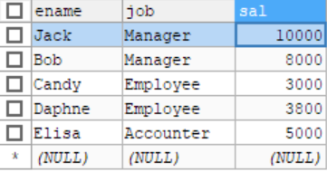


#### 1.7.3.2	开启行级锁

```java
//程序1
//这个程序开启一个事务，专门进行查询，并使用行级锁/悲观锁，锁定相关记录
//这个程序负责修改被锁定的记录
public class TestJdbc {
    public static void main(String[] args) {
        Connection con = null;
        PreparedStatement ps = null;
        ResultSet rs = null;
        try {
            //1.注册驱动(在DBUtil中进行)
            //2.获取连接
            con =  DBUtil.getConnection();
            con.setAutoCommit(false);//关闭事务自动提交
            //3.获取预编译的数据库操作对象
            String sql = "select ename,job,sal from emp where job = ? for update";
            //查询对象，使用行级锁(悲观锁)
            ps = (PreparedStatement) con.prepareStatement(sql);
            ps.setString(1,"Manager");
            //4.执行SQL语句
            rs = ps.executeQuery();
            //5.处理查询结果集
            while(rs.next()){
                System.out.println("ename:"+rs.getString("ename")
                        +",job:"+rs.getString("job")+",sal:"+rs.getString("sal"));
            }
            //提交事务，事务结束，释放悲观锁
            con.commit();
        } catch (Exception throwables) {
            throwables.printStackTrace();
        }finally {
            //6.释放资源
            DBUtil.close(con,ps,rs);
        }
    }
}
```

运行程序：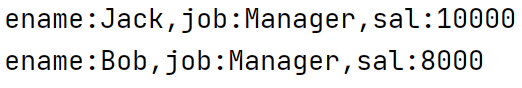


#### 1.7.3.3	修改被锁定的记录

```java
//程序2
//这个程序负责修改被锁定的记录
public class TestLock {
    public static void main(String[] args) {
        Connection con = null;
        PreparedStatement ps = null;
        try {
            con = DBUtil.getConnection();
            con.setAutoCommit(false);
            String sql = "update emp set sal = sal * 1.1 where job = ?";
            ps = con.prepareStatement(sql);
            ps.setString(1,"Manager");
            int count = ps.executeUpdate();
            System.out.println(count==0?"更新失败":"更新成功");
            con.commit();
        } catch (Exception throwables) {
            if(con!=null){
                try {
                    con.rollback();
                } catch (SQLException e) {
                    e.printStackTrace();
                }
            }
        }finally {
            DBUtil.close(con,ps,null);
        }//修改记录不需要ResultSet对象，因此直接传入null
    }
}
```

在程序1代码第27行commit()执行处设置断点，Debug模式运行程序1：

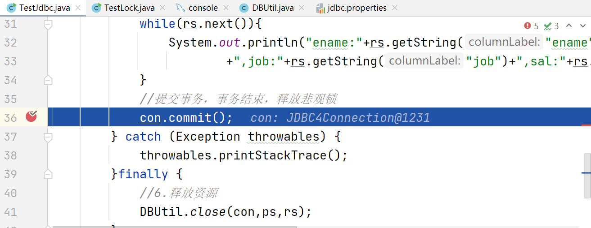当到达断点位置时运行程序2：

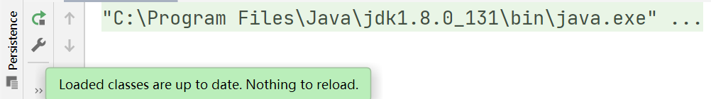

刷新数据库：

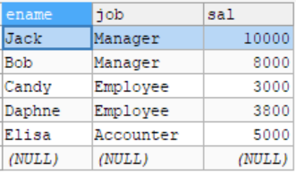

可以看到数据库的数据没有任何变化，这表明行级锁确实可以阻止其他进程对锁定数据的访问。