[TOC]


# 2.	JDBCTemplate

> 什么是JDBC？
>
> Java数据库连接，（Java Database Connectivity，简称JDBC）是[Java语言](https://baike.baidu.com/item/Java语言)中用来规范客户端程序如何来访问数据库的[应用程序接口](https://baike.baidu.com/item/应用程序接口/10418844)，提供了诸如查询和更新数据库中数据的方法。我们通常说的JDBC是面向关系型数据库的。

1.什么是JDBCTemplate？

JDBCTemplate是Spring框架对JDBC的封装，使用JDBCTemplate可以方便地实现对数据库的操作

## 2.0	环境配置

### 2.0.1	引入JDBC依赖

```xml
<!-- https://mvnrepository.com/artifact/mysql/mysql-connector-java -->
<dependency>
    <groupId>mysql</groupId>
    <artifactId>mysql-connector-java</artifactId>
    <version>8.0.22</version>
</dependency>

<!-- https://mvnrepository.com/artifact/org.springframework/spring-jdbc -->
<dependency>
    <groupId>org.springframework</groupId>
    <artifactId>spring-jdbc</artifactId>
    <version>5.2.11.RELEASE</version>
</dependency>

<!-- https://mvnrepository.com/artifact/org.springframework/spring-tx -->
<dependency>
    <groupId>org.springframework</groupId>
    <artifactId>spring-tx</artifactId>
    <version>5.2.11.RELEASE</version>
</dependency>

<!-- https://mvnrepository.com/artifact/org.springframework/spring-orm -->
<dependency>
    <groupId>org.springframework</groupId>
    <artifactId>spring-orm</artifactId>
    <version>5.2.11.RELEASE</version>
</dependency>
```


### 2.0.2	建立测试数据库

在数据库管理软件中建立测试数据库user_db，字符集选择utf8：

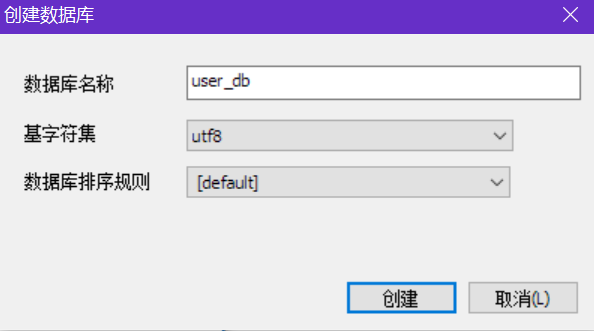

建立测试表test，引擎选择InnoDB，字符集选择utf8：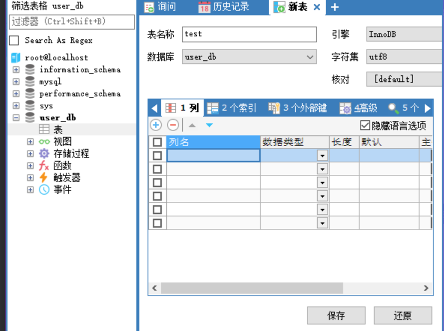

### 2.0.3	配置数据库连接池

在Spring配置文件中配置数据库连接池：

```xml
<!--配置数据库连接池-->
<bean id="dataSource" class="com.alibaba.druid.pool.DruidDataSource" destroy-method="close">
    <property name="url" value="jdbc:mysql://localhost:3306/user_db?serverTimezone=UTC"/>
    <!--serverTimezone设置时区为UTC-->
    <!--也可以写作：jdbc:mysql:///user_db?serverTimezone=UTC-->
    <property name="username" value="root"/>
    <property name="password" value="root"/>
    <property name="driverClassName" value="com.mysql.jdbc.Driver"/>
</bean>
```


### 2.0.4	配置JDBCTemplate对象

在Spring配置文件中配置JDBCTemplate对象，注入DataSource

```xml
<!--配置JDBCTemplate对象-->
    <bean id="jdbcTemplate" class="org.springframework.jdbc.core.JdbcTemplate">
        <!--注入DataSource-->
        <property name="dataSource" ref="dataSource"/>
</bean>
```


### 2.0.5	创建测试环境

（1）在Spring配置文件中开启组件扫描：

```xml
<!--开启组件扫描-->
<context:component-scan base-package="com.example"/>
```


（2）创建Dao类接口UserDao，并创建接口实现类UserDaoImpl，在Dao中注入JDBCTemplate对象：

```java
public interface UserDao {
}

@Repository
public class UserDaoImpl {
    //注入JDBCTemplate
    @Autowired
    private JdbcTemplate jdbcTemplate;
}
```

创建Service类UserService，注入UserDao对象：

```java
@Service
public class UserService {
    //注入DAO
    @Autowired
    private UserDao UserDao;
}
```


## 2.1	JDBCTemplate操作数据库

### 2.1.1	添加操作

（1）创建测试表t_user，配置如下：

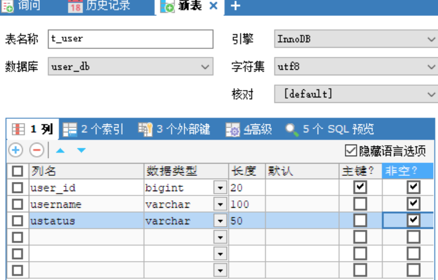

（2）对应数据库创建实体类User，并生成对应的get和set方法：

```java
public class User {
    private String userId;
    private String userName;
    private String ustatus;
}
```

（3）在Service层调用DAO层的数据库添加操作：

```java
//添加用户
public void addUser(User user){
    userDao.add(user);
}
```

（4）在Dao层中添加数据库操作：

```java
public interface UserDao {
    void add(User user);
}
```

```java
@Override
public void add(User user){
    //1.创建SQL语句
    String sql="insert into t_user values(?,?,?)";
    //SQL语句中的?表示表中的列名
    //2.调用方法实现数据库操作
    Object[] args={user.getUserId(),user.getUserName(),user.getUstatus()}
    int update = jdbcTemplate.update(sql,args);
    System.out.println("成功影响了"+update+"行");
    //返回值表示成功影响的行数
    //使用jdbcTemplate对象的update()方法实现数据库操作
    //一共传递两个参数：SQL语句和用于设置SQL语句值的可变参数
}
```


（5）创建测试类TestJdbc

```java
public class TestJdbc {
    @Test
    public void testJdbcTemplate(){
        ApplicationContext ac=
                new ClassPathXmlApplicationContext("bean.xml");
        UserService userService = ac.getBean("userService",UserService.class);
        userService.addUser(new User("1","Admin","OK"));
    }
}
```

运行程序：

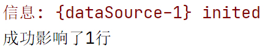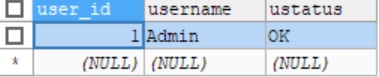


### 2.1.2	修改和删除操作

在Service层添加删除和修改用户的操作：

```java
//修改用户
public void updateUser(User user){
    userDao.update(user);
}

//删除用户
public void deleteUser(String id){
    userDao.delete(id);
}
```

在UserDao中添加对应操作的声明：

```java
void update(User user);

void delete(String id);
```

在UserDaoImpl中实现对应操作：

```java
@Override
public void update(User user) {
    String sql = "update t_user set username=?,ustatus=?where user_id=?";
    Object[] args={user.getUserName(),user.getUstatus(),user.getUserId()};
    int result = jdbcTemplate.update(sql,args);
}

@Override
public void delete(String id) {
    String sql = "delete from t_user where user_id=?";
    int result = jdbcTemplate.update(sql,id);
}
```

创建测试方法，测试修改操作：

```java
@Test
public void testJdbcTemplate(){
    ApplicationContext ac=
            new ClassPathXmlApplicationContext("bean.xml");
    UserService userService = ac.getBean("userService",UserService.class);
    userService.updateUser(new User("1","NewAdmin","NowOK"));
}
```

运行程序：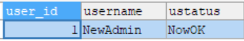


测试删除操作：

```java
@Test
public void testJdbcTemplate(){
    ApplicationContext ac=
            new ClassPathXmlApplicationContext("bean.xml");
    UserService userService = ac.getBean("userService",UserService.class);
    userService.deleteUser("1");
}
```

运行程序：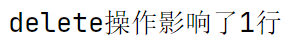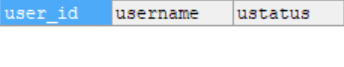


### 2.1.3	查询操作

#### 2.1.3.1	查询返回某个值

例：查询表中有多少条记录，结果应返回一个数值：

在Service层中添加查询记录条数的操作：

```java
//查询表中记录条数
public int findCount(){
    return userDao.selectCount();
}
```

在UserDao中声明操作：

```java
public int selectCount();
```

在UserDaoImpl中实现操作：

```java
@Override
public int selectCount() {
    String sql ="select count(*) from t_user";
    Integer count =jdbcTemplate.queryForObject(sql,Integer.class);
    //使用queryForObject()方法进行聚集操作，第二个参数表示返回值对应类
    return count;
}
```

在测试类中添加测试方法：

```java
int result = userService.findCount();
System.out.println("表中共有"+result+"条记录");
```

由于表中没有数据，先临时添加几条数据：

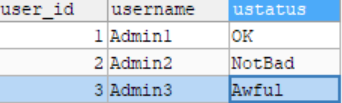

运行程序：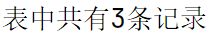


#### 2.1.3.2	查询返回对象

假设要查询表中某个对象，结果应返回这个对象：

在Service层中添加查询对象操作：

```java
//查询表中对象
public User findUser(String id){
    return userDao.selectUser(id);
}
```

在UserDao中声明操作：

```java
public User selectUser(String id);
```

在UserDaoImpl中实现操作：

> 要实现返回对象，需要使用JDBCTemplate中的queryForObject方法，该方法需要三个参数：
>
> SQL语句，RowMapper，SQL语句值
>
> 
>
> 其中RowMapper是一个接口，用来返回不同类型的数据，使用该接口对应的实现类可以实现对数据的封装

```java
@Override
public User selectUser(String id) {
    String sql="select * from t_user where user_id=?";
    User user = jdbcTemplate.queryForObject(sql,new BeanPropertyRowMapper<User>(User.class),id);
    return user;
}
```

在测试类中添加测试方法：

```java
User user = userService.findUser("1");
System.out.println(user);
```

运行程序：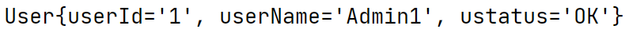


#### 2.1.3.3	查询返回集合

假设要查询表中全部对象：

在Service层添加操作：

```java
//查询表中全部对象
public List<User> findAll(){
    return userDao.selectAllUsers();
}
```

在UserDao中声明操作：

```java
public List<User> selectAllUsers();
```

在UserDaoImpl中实现操作：

```java
@Override
public List<User> selectAllUsers() {
    String sql = "select * from t_user";
    List<User> users = jdbcTemplate.query(sql,new BeanPropertyRowMapper<User>(User.class));
    //由于没有SQL语句值，因此省略第三条参数
    return users;
}
```

在测试类中添加测试方法：

```java
List<User> users = userService.findAll();
for (User user:users) {
    System.out.println(user);
}
```

运行程序：

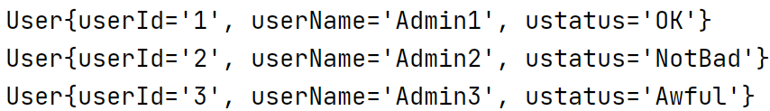


## 2.2	批量操作数据库

### 2.2.1	批量添加操作

要通过JDBCTemplate对象批量添加操作数据库，需要使用batchUpdate()方法：

第一条参数为SQL语句，第二条参数为添加多条参数对应的数据所在List集合

在Service层中添加批量添加操作方法：

```java
//批量添加
public int batchAdd(List<Object[]> batchArgs){
    userDao.batchAdd(batchArgs);
}
```

在UserDao中声明方法：

```java
public int batchAdd(List<Object[]> batchArgs);
```

在UserDaoImpl中实现方法：

```java
@Override
public void batchAdd(List<Object[]> batchArgs) {
    String sql="insert into t_user values(?,?,?)";
    int[] ints= jdbcTemplate.batchUpdate(sql,batchArgs);
    System.out.println(Arrays.toString(ints));
}
```

在测试类中添加测试方法：

```java
List<Object[]> batchArgs=new ArrayList<>();
Object[] o1={"4","User1","VeryGood"};
Object[] o2={"5","User2","Nice"};
Object[] o3={"6","User3","Perfect"};
batchArgs.add(o1);
batchArgs.add(o2);
batchArgs.add(o3);
userService.batchAdd(batchArgs);
```

运行程序：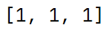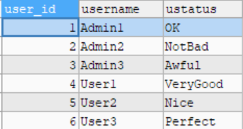

### 2.2.2	批量修改和删除操作

在Service层中添加批量修改和删除操作方法：

```java
//批量修改
public void batchUpdate(List<Object[]> batchArgs){
    userDao.batchUpdate(batchArgs);
}

//批量删除
public void batchDelete(List<Object[]> batchArgs){
    userDao.batchDelete(batchArgs);
}
```

在UserDao中声明方法：

```java
public void batchUpdate(List<Object[]> batchArgs);

public void batchDelete(List<Object[]> batchArgs);
```

在UserDaoImpl中实现方法：

```java
@Override
public void batchUpdate(List<Object[]> batchArgs) {
    String sql = "update t_user set username=?,ustatus=?where user_id=?";
    int[] ints = jdbcTemplate.batchUpdate(sql, batchArgs);
    System.out.println(Arrays.toString(ints));
}
@Override
public void batchDelete(List<Object[]> batchArgs) {
    String sql = "delete from t_user where user_id=?";
    int[] ints = jdbcTemplate.batchUpdate(sql, batchArgs);
    System.out.println(Arrays.toString(ints));
}
```


在测试类中添加批量修改的测试方法：

```java
List<Object[]> batchArgs=new ArrayList<>();
Object[] o1={"User1","VeryGood","1"};
Object[] o2={"User2","Nice","2"};
Object[] o3={"User3","Perfect","3"};
batchArgs.add(o1);
batchArgs.add(o2);
batchArgs.add(o3);
userService.batchUpdate(batchArgs);
```

运行程序：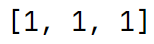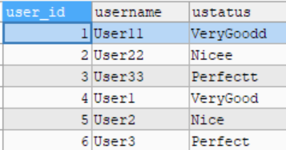


在测试类中添加批量删除的测试方法：

```java
List<Object[]> batchArgs=new ArrayList<>();
Object[] o1={"1"};
Object[] o2={"2"};
Object[] o3={"3"};
batchArgs.add(o1);
batchArgs.add(o2);
batchArgs.add(o3);
userService.batchDelete(batchArgs);
```

运行结果：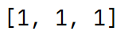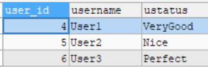