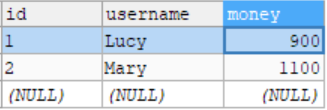

[TOC]


# 4.	事务

1.什么是事务？

事务是数据库操作的最基本单元，在逻辑上是一组操作，这一组操作要么都成功，如果有一个失败则所有操作都失败。

2.事务典型场景：银行转账

A向B转账100元，则A账户减少100元，B账户增加100元

3.事务特性（ACID）：

（1）原子性(Atomicity)：一个事务中的操作不可分割，要么都成功要么都失败

（2）一致性(Consistency)：针对一个事务操作前与操作后的状态一致，操作前后数据总量不变

（3）隔离性(Isolation)：针对多个用户同时操作，主要是排除其他事务对本次事务的影响

（4）持久性(Durability)：当事务提交时，数据库表中数据会发生变化，事务结束后的数据不随着外界原因导致数据丢失


## 4.1	银行转账操作

### 4.1.0	搭建事物操作环境

搭建银行转账操作环境：

在JavaEE中，程序分为三层结构：视图层Web层、业务逻辑层（服务层）Service层、数据层Dao层

由于我们这里主要学习事务相关知识，因此主要关注Service层和Dao层的搭建

对于DAO层：

Dao层主要负责数据库中的操作，在银行转账时，一方账户余额减少，另一方账户余额增加，因此我们需要两个方法，即增加钱与减少钱

对于Service层：

Service层主要负责业务逻辑操作，在银行转账时，我们需要调用转账方的减少钱的方法，再调用收款方增加钱的方法，这两个操作合在一起构成了转账的过程


### 4.1.1	创建测试用数据库表

创建测试用数据库表t_act：

设置id为主键，保存表并添加测试数据：


### 4.1.2	创建Service层和Dao层

要搭建Service层和Dao层，我们需要在Service层中注入Dao层对象，在Dao层中注入JDBCTemplate对象，在JDBCTemplate中注入DataSource对象：

（1）在Spring配置文件中开启组件扫描，配置数据库连接池DataSource，再将DataSource对象注入JDBCTemplate：

```xml
<?xml version="1.0" encoding="UTF-8"?>
<beans xmlns="http://www.springframework.org/schema/beans"
       xmlns:context="http://www.springframework.org/schema/context"
       xmlns:xsi="http://www.w3.org/2001/XMLSchema-instance"
       xsi:schemaLocation="http://www.springframework.org/schema/beans
       http://www.springframework.org/schema/beans/spring-beans.xsd
       http://www.springframework.org/schema/context
       http://www.springframework.org/schema/context/spring-context.xsd">

    <!--开启组件扫描-->
    <context:component-scan base-package="com.example"/>
    <!--配置数据库连接池-->
    <bean id="dataSource" class="com.alibaba.druid.pool.DruidDataSource" destroy-method="close">
        <property name="url" value="jdbc:mysql://localhost:3306/user_db?serverTimezone=UTC"/>
        <!--serverTimezone设置时区为UTC-->
        <!--也可以写作：jdbc:mysql:///user_db?serverTimezone=UTC-->
        <property name="username" value="root"/>
        <property name="password" value="root"/>
        <property name="driverClassName" value="com.mysql.jdbc.Driver"/>
    </bean>

    <!--配置JDBCTemplate对象-->
    <bean id="jdbcTemplate" class="org.springframework.jdbc.core.JdbcTemplate">
        <!--注入DataSource-->
        <property name="dataSource" ref="dataSource"/>
    </bean>
</beans>
```

（2）创建Dao层接口UserDao，并创建UserDao的实现类UserDaoImpl，注入JDBCTemplate对象：

```java
public interface UserDao {
}

@Repository
public class UserDaoImpl implements UserDao{
    //注入JDBCTemplate对象
    @Autowired
    private JdbcTemplate jdbcTemplate;
}
```

（3）创建Service层类UserService，注入UserDao对象：

```java
@Service
public class UserService {
    //注入Dao对象
    @Autowired
    private UserDao userDao;
}
```


### 4.1.3	实现转账操作

（1）在UserDao分别声明增加钱的方法addMoney()和减少钱的方法reduceMoney()

```
public void addMoney(double money,String username);
public void reduceMoney(double money,String username);
```

在UserDaoImpl中实现方法：

```java
@Override
public void addMoney(double money,String username) {
    String sql = "update t_act set money = money+? where username = ?";
    jdbcTemplate.update(sql,money,username);
}

@Override
public void reduceMoney(double money,String username) {
    String sql = "update t_act set money = money-? where username = ?";
    jdbcTemplate.update(sql,money,username);
}
```


（2）在Service层实现业务逻辑操作，调用Dao层中的方法，完成转账操作：

```java
public void transfer(double Money,String sender,String receiver){//转账方法
    userDao.reduceMoney(100,sender);
    userDao.addMoney(100,receiver);
}
```


（3）添加测试类actTest：

```java
public class actTest {
    @Test
    public void actTest(){
        ApplicationContext ac = 
                new ClassPathXmlApplicationContext("bean.xml");
        UserService userService = ac.getBean("userService",UserService.class);
        userService.transfer(100,"Lucy","Mary");
        //Lucy向Mary转账100元
    }
}
```

运行程序，刷新数据库：



可以看到，我们已经实现了转账操作


### 4.1.4	转账操作存在的问题

上述代码，若都能正常执行，则不存在问题。

但若有代码出现异常，则可能会出现逻辑问题：

​	若在转账过程中，付款方完成付款后，收款方收到款项前出现错误，程序异常结束，此时付款方钱减少而收款方钱没有增加，这不符合事务操作的一致性原则


## 4.2	事务操作

### 4.2.1	事务操作过程

在事务操作中有以下步骤：

（1）开启事务

（2）进行业务操作，若出现异常，需要捕获异常

（3）若没有发生异常，提交事务，完成操作

（4）若出现异常并捕获，需要进行事务回滚


### 4.2.2	Spring事务管理

通常情况下，事务位于JavaEE三层结构中的Service层

在Spring中，事务管理操作有两种实现方式：

（1）编程式事务管理

（2）声明式事务管理（常用）


### 4.2.3	声明式事务管理

声明式事务管理也有两种实现方式：

（1）基于注解方式实现

（2）基于XML配置文件方式实现

**在Spring中，声明式事务管理底层使用AOP原理**


#### 4.2.3.1	Spring事务管理API

（1）Spring提供了事务管理器接口PlatformTransactionManager，并针对不同框架提供了不同的实现类


目前我们操作数据库使用JDBCTemplate，因此我们使用的是DataSourceTransactionManager


#### 4.3.2.2	基于注解方式实现声明式事务管理

##### 4.3.2.2.1	在Spring配置文件中配置事务管理器

因为我们使用的是JDBCTemplate操作数据库，因此我们需要使用的事务管理器类为DataSourceTransactionManager

在DataSourceTransactionManager类中对应的构造方法：	

```java
public DataSourceTransactionManager(DataSource dataSource) {
    this();
    this.setDataSource(dataSource);
    this.afterPropertiesSet();
}
```

可以看到，构造事务管理器类DataSourceTransactionManager需要传入数据源DataSource，因此在配置事务管理器时需要注入DataSource。

在Spring配置文件中：

```xml
<!--配置事务管理器-->
<bean id="transactionManager" class="org.springframework.jdbc.datasource.DataSourceTransactionManager">
    <!--注入数据源-->
    <property name="dataSource" ref="dataSource"/>
</bean>
```


##### 4.3.2.2.2	在Spring配置文件中开启事务注解

（1）要开启事务注解，需要引入名称空间tx

（2）在Spring配置文件中：

```xml
<!--开启事务注解-->
<tx:annotation-driven transaction-manager="transactionManager"></tx:annotation-driven>
<!--要开启事务注解需要用transaction-manager属性指定我们配置好的事务管理器-->
```

（3）在Service类（获取Service类中的方法）上添加事务注解

```java
@Transactional
public class UserService {
```

> @Transactional注解可以添加到类上，也可以添加到方法上
>
> 若在类上添加@Transactional注解则表示类中所有方法都添加了事务
>
> 若在方法上添加@Transactional注解则表示为这个方法添加事务

（4）测试效果

在Service层中转账操作，扣款与收款间引发异常：

```java
public void transfer(double Money,String sender,String receiver){//转账方法
    userDao.reduceMoney(100,sender);
    //引发异常
    String s = null;
    s.toString();
    userDao.addMoney(100,receiver);
}
```

运行程序：

可以看到，程序运行并触发了异常，刷新数据库查看数据：


可以看到数据库中的数据没有发生变化，即因异常触发了事务回滚机制，恢复了数据库中的数据


##### 4.3.2.2.3	@Transactional

在Service类上添加注解@Transactional，可以在注解中配置事务相关参数：


```java
propagation	//事务传播行为

isolation	//事务隔离级别
    
timeout	//超时时间
    
readOnly	//是否只读
    
rollbackFor	//事务回滚
    
noRollbackFor	//事务不回滚
```


###### 4.3.2.2.3.1	事务传播行为propagation

> 什么叫事务传播行为？
> 即然是传播，那么至少有两个东西，才可以发生传播。单体不存在传播这个行为。
>
> 事务传播行为（propagation behavior）指的就是当一个事务方法被另一个事务方法调用时，这个事务方法应该如何进行。 
>
> 例如：methodA事务方法调用methodB事务方法时，methodB是继续在调用者methodA的事务中运行呢，还是为自己开启一个新事务运行，这就是由methodB的事务传播行为决定的。


在Spring中有7种事务传播行为：

|                           事务行为                           |                             说明                             |
| :----------------------------------------------------------: | :----------------------------------------------------------: |
|     [PROPAGATION_REQUIRED](#1.	PROPAGATION_REQUIRED)      |         支持当前事务，若当前没有事务，就新建一个事务         |
|     [PROPAGATION_SUPPORTS](#2.	PROPAGATION_SUPPORTS)      |      支持当前事务，假设当前没有事务，就以非事务方式运行      |
|    [PROPAGATION_MANDATORY](#3.	PROPAGATION_MANDATORY)     |          支持当前事务，假设当前没有事务，就抛出异常          |
| [PROPAGATION_REQUIRES_NEW](#4.	PROPAGATION_REQUIRES_NEW)  | 无论当前是否存在事务都新建事务（若当前存在事务。把当前事务挂起） |
| [PROPAGATION_NOT_SUPPORTED](#5.	PROPAGATION_NOT_SUPPORTED) |   以非事务方式运行操作。假设当前存在事务，就把当前事务挂起   |
|        [PROPAGATION_NEVER](#6.	PROPAGATION_NEVER)         |        以非事务方式运行，假设当前存在事务，则抛出异常        |
|       [PROPAGATION_NESTED](#7.	PROPAGATION_NESTED)        | 如果当前存在事务，则在嵌套事务内执行。如果当前没有事务，则执行与PROPAGATION_REQUIRED类似的操作。 |

在Spring中，事务传播行为默认为PROPAGATION_REQUIRED，其中PROPAGATION_REQUIRED和PROPAGATION_REQUIRES_NEW较为常用

> ### ##1.	PROPAGATION_REQUIRED
>
> 假如当前正要运行的事务不在另外一个事务里，那么就建立一个新的事务 
>
> 假设ServiceB.methodB的事务级别定义PROPAGATION_REQUIRED, 那么因为执行ServiceA.methodA的时候，ServiceA.methodA已经起了事务。
>
> 这时调用ServiceB.methodB，ServiceB.methodB看到自己已经执行在ServiceA.methodA的事务内部。就不再建立新的事务。
>
> 而假如ServiceA.methodA执行的时候发现自己没有在事务中，他就会为自己分配一个事务。
>
> 这样，在ServiceA.methodA或者在ServiceB.methodB内的不论什么地方出现异常。事务都会被回滚。即使ServiceB.methodB的事务已经被提交，可是ServiceA.methodA在接下来fail要回滚，ServiceB.methodB也要回滚
>
> 
>
> 
>
> ### ##2.	PROPAGATION_SUPPORTS
>
> 假设当前在事务中。即以事务的形式执行。假设当前不在一个事务中，那么就以非事务的形式执行
>
> 
>
> ### ##3.	PROPAGATION_MANDATORY
>
> 必须在一个事务中执行。也就是说，他仅仅能被一个父事务调用。否则抛出异常
>
> 
>
> ### ##4.	PROPAGATION_REQUIRES_NEW
>
> 假设设计ServiceA.methodA的事务级别为PROPAGATION_REQUIRED，ServiceB.methodB的事务级别为PROPAGATION_REQUIRES_NEW。
>
> 那么当运行到ServiceB.methodB的时候，ServiceA.methodA所在的事务就会挂起。ServiceB.methodB会建立一个新的事务。等待ServiceB.methodB的事务完毕以后，他才继续运行。
>
> 这与PROPAGATION_REQUIRED 的事务差别在于事务的回滚程度。由于ServiceB.methodB是新建立的事务，那么就存在两个不同的事务。假设ServiceB.methodB已经提交，那么ServiceA.methodA失败回滚。ServiceB.methodB是不会回滚的。假设ServiceB.methodB失败回滚，假设他抛出的异常被ServiceA.methodA捕获，ServiceA.methodA事务仍然可能提交。
>
> 
>
> 
>
> ### ##5.	PROPAGATION_NOT_SUPPORTED
>
> 当前不支持事务。
>
> 假设ServiceA.methodA的事务级别是PROPAGATION_REQUIRED ，而ServiceB.methodB的事务级别是PROPAGATION_NOT_SUPPORTED ，那么当执行到ServiceB.methodB时。ServiceA.methodA的事务挂起。而他以非事务的状态执行完，再继续ServiceA.methodA的事务。
>
> 
>
> ### ##6.	PROPAGATION_NEVER
>
> 不能在事务中执行。
> 如果ServiceA.methodA的事务级别是PROPAGATION_REQUIRED。 而ServiceB.methodB的事务级别是PROPAGATION_NEVER ，那么ServiceB.methodB会抛出异常。
>
> 
>
> ### ##7.	PROPAGATION_NESTED
>
> 如果当前存在事务，则在嵌套事务内执行。如果当前没有事务，则执行与PROPAGATION_REQUIRED类似的操作。


###### 4.3.2.2.3.2	事务隔离级别isolation

事务操作中的隔离性特性，指的是多事务操作间互不影响。

若不考虑隔离性，多事务操作时就会出现并发访问导致的数据读取问题：

（1）[脏读](#3.	脏读)

（2）[不可重复读](#2.	不可重复读)

（3）[虚读（幻读）](#3.	虚读（幻读）)

> ### ##1.	脏读
>
> 脏读指的是一个未提交事务读取到了另一个未提交事务的数据，即读取了未提交的数据
>
> A事务读取B事务尚未提交的数据，此时如果B事务发生错误并执行回滚操作，那么A事务读取到的数据就是脏数据。
>
> 这种情况常发生于转账与取款操作中
>
> | 时间顺序 |                     转账事务                      |                     取款事务                     |
> | :------: | :-----------------------------------------------: | :----------------------------------------------: |
> |    1     |                                                   |                     开始事务                     |
> |    2     |                     开始事务                      |                                                  |
> |    3     |                                                   |               查询账户余额为2000元               |
> |    4     |                                                   |          取款1000元，余额被更改为1000元          |
> |    5     |         查询账户余额为1000元（产生脏读）          |                                                  |
> |    6     |                                                   | 取款操作发生未知错误，事务回滚，余额变更为2000元 |
> |    7     | 转入2000元，余额被更改为3000元（脏读的1000+2000） |                                                  |
> |    8     |                     提交事务                      |                                                  |
> | **备注** |      按照正确逻辑，此时账户余额应该为4000元       |                                                  |
>
> 
>
> ### ##2.	不可重复读
>
> 不可重复读，指的是一个未提交的事务读取到了某提交事务修改的数据，即前后多次读取，数据内容不一致
>
> 事务A在执行读取操作，由于整个事务A比较大，前后读取同一条数据需要经历很长的时间 。而在事务A第一次读取数据，比如此时读取了小明的年龄为20岁，事务B执行更改操作，将小明的年龄更改为30岁，此时事务A第二次读取到小明的年龄时，发现其年龄是30岁，和之前的数据不一样了，也就是数据不重复了，系统不可以读取到重复的数据，称为**不可重复读**。但按正常逻辑，事务A前后读取的数据应当相同。
>
> | 时间顺序 |                      事务A                      |        事务B         |
> | :------: | :---------------------------------------------: | :------------------: |
> |    1     |                    开始事务                     |                      |
> |    2     |          第一次查询，小明的年龄为20岁           |                      |
> |    3     |                                                 |       开始事务       |
> |    4     |                    其他操作                     |                      |
> |    5     |                                                 | 更改小明的年龄为30岁 |
> |    6     |                                                 |       提交事务       |
> |    7     |          第二次查询，小明的年龄为30岁           |                      |
> | **备注** | 按照正确逻辑，事务A前后两次读取到的数据应该一致 |                      |
>
> 
>
> ### ##3.	虚读（幻读）
>
> 虚读（幻读），指的是一个未提交的事务读取到了某提交事务添加的数据，即前后多次读取，数据总量不一致
>
> 事务A在执行读取操作，需要两次统计数据的总量，前一次查询数据总量后，此时事务B执行了新增数据的操作并提交后，这个时候事务A读取的数据总量和之前统计的不一样，就像产生了幻觉一样，平白无故的多了几条数据，称为幻读。
>
> | 时间顺序 |                        事务A                        |     事务B     |
> | :------: | :-------------------------------------------------: | :-----------: |
> |    1     |                      开始事务                       |               |
> |    2     |             第一次查询，数据总量为100条             |               |
> |    3     |                                                     |   开始事务    |
> |    4     |                      其他操作                       |               |
> |    5     |                                                     | 新增100条数据 |
> |    6     |                                                     |   提交事务    |
> |    7     |             第二次查询，数据总量为200条             |               |
> | **备注** | 按照正确逻辑，事务A前后两次读取到的数据总量应该一致 |               |
>
> 
>
> **小结：不可重复读的和幻读很容易混淆，不可重复读侧重于修改，幻读侧重于新增或删除。解决不可重复读的问题只需锁住满足条件的行，解决幻读需要锁表**
>
> **要注意的是，在以上三种问题中，脏读必须避免，而其他两种问题是可以出现的**


要避免多事务操作时出现问题，就要设置事务隔离级别：

在MySQL中有四种事务隔离级别：

|         事务隔离级别         | 脏读 | 不可重复读 | 幻读 |
| :--------------------------: | :--: | :--------: | :--: |
| 读未提交（READ_UNCOMMITTED） |  是  |     是     |  是  |
| 不可重复读（READ_COMMITTED） |  否  |     是     |  是  |
| 可重复读（REPEATABLE_READ）  |  否  |     否     |  是  |
|    串行化（SERIALIZABLE）    |  否  |     否     |  否  |

在MySQL中，默认的事务隔离级别为**可重复读REPEATABLE_READ**


###### 4.3.2.2.3.3	超时时间timeout

设定一个超时时间，事务必须在规定的时间内完成提交，若超出规定时间则事务回滚

超时时间timeout默认值为-1，即事务操作不会超时。设置的时间以秒为单位计算。


###### 4.3.2.2.3.4	是否只读readOnly

在数据库中，将查询操作称为读操作，将增删改操作称为写操作

通过设置是否只读readOnly属性，可以指定对象能否进行修改数据操作

是否只读readOnly属性默认值为false，表示可以进行读写操作


###### 4.3.2.2.3.5	事务回滚rollbackFor

可以通过事务回滚rollbackFor属性，设置对哪些异常进行事务回滚操作


###### 4.3.2.2.3.6	事务不回滚noRollbackFor

可以通过事务不回滚noRollbackFor属性，设置对哪些异常不进行事务回滚操作


#### 4.3.2.3	基于XML配置文件方式实现声明式事务管理

##### 4.3.2.3.1	在Spring配置文件中配置事务管理器

```xml
<!--1.配置事务管理器-->
<bean id="transactionManager" class="org.springframework.jdbc.datasource.DataSourceTransactionManager">
    <!--注入数据源-->
    <property name="dataSource" ref="dataSource"/>
</bean>
```


##### 4.3.2.3.2	在Spring配置文件中配置通知

```xml
<!--2.配置通知-->
<tx:advice id="txadvice">
    <!--配置事务参数-->
    <tx:attributes>
        <!--指定在哪种规则的方法上添加事务，可以使用通配符-->
        <!--相当于@Transactional注解-->
        <tx:method name="transfer*" propagation="REQUIRED"/>
    </tx:attributes>
</tx:advice>
```


##### 4.3.2.3.3	在Spring配置文件中配置切入点和切面

```xml
<!--3.配置切入点和切面-->
<aop:config>
    <!--配置切入点-->
    <aop:pointcut id="p" expression="execution(* com.example.service.UserService.*(..))"/>
    <!--配置切面 advice-ref对应通知 pointcut-ref对应切入点-->
    <aop:advisor advice-ref="txadvice" pointcut-ref="p"/>
</aop:config>
```


其他代码接4.3.2.2.2中代码，运行程序：


可以看到数据库中的数据没有发生改变，即事务回滚启动，实现了声明式事务管理


#### 4.3.2.4	完全注解方式实现声明式事务管理

（1）创建配置类UserConfig：

```java
@Configuration//标识配置类
@ComponentScan(basePackages = "com.example")//开启组件扫描
@EnableTransactionManagement//开启事务
public class UserConfig {
    //创建数据库连接池
    @Bean
    public DruidDataSource getDruidDataSource(){
        DruidDataSource dataSource = new DruidDataSource();
        ResourceBundle bundle = ResourceBundle.getBundle("jdbc");
        String driver = bundle.getString("driver");
        String url = bundle.getString("url");
        String user = bundle.getString("user");
        String password = bundle.getString("password");
        dataSource.setDriverClassName(driver);
        dataSource.setUrl(url);
        dataSource.setUsername(user);
        dataSource.setPassword(password);
        return  dataSource;
    }

    //创建JDBCTemplate对象
    @Bean
    public JdbcTemplate getJdbcTemplate(DataSource dataSource){
        //从IOC容器中根据类型找到DataSource对象
        JdbcTemplate jdbcTemplate = new JdbcTemplate();
        jdbcTemplate.setDataSource(dataSource);//注入DataSource对象
        return jdbcTemplate;
    }

    //创建事务管理器对象
    @Bean
    public DataSourceTransactionManager getDataSourceTransactionManager(DataSource dataSource){
        //从IOC容器中根据类型找到DataSource对象
        DataSourceTransactionManager dstm = new DataSourceTransactionManager();
        dstm.setDataSource(dataSource);//注入DataSource对象
        return dstm;
    }
}
```

（2）创建测试类方法：

```java
@Test
public void actTestAnno(){
    ApplicationContext ac =
            new AnnotationConfigApplicationContext(UserConfig.class);
    UserService userService = ac.getBean("userService",UserService.class);
    userService.transfer(100,"Lucy","Mary");
}
```

运行程序：

数据库数据依然没有发生变化，即我们实现了用完全注解方式实现声明式事务管理