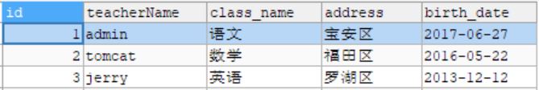
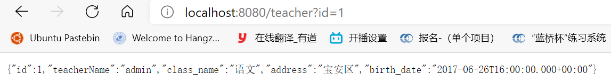
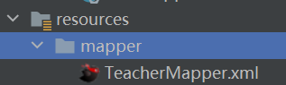
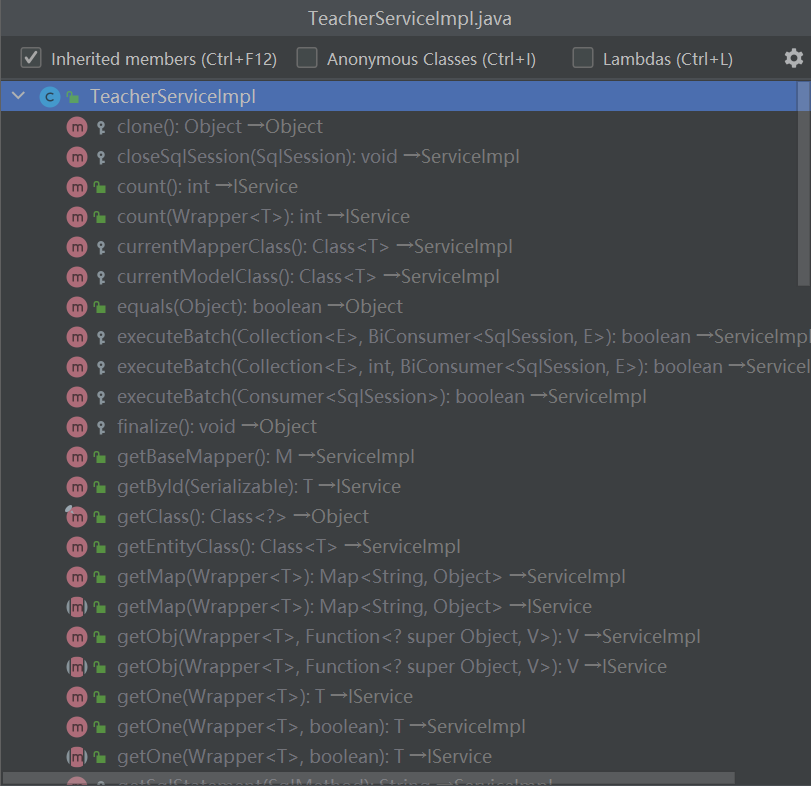
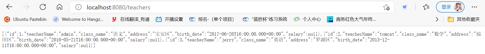
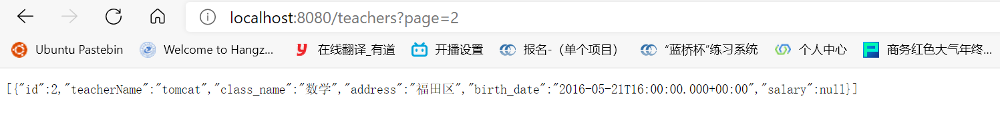

# 12.	SpringBoot数据访问

## 12.1	SQL

### 12.1.1	数据源的自动配置**HikariDataSource**

导入JDBC场景：

```xml
<dependency>
	<groupId>org.springframework.boot</groupId>
	<artifactId>spring-boot-starter-data-jdbc</artifactId>
</dependency>      
```


引入数据库驱动：

```xml
<dependency>
            <groupId>mysql</groupId>
            <artifactId>mysql-connector-java</artifactId>
<!--            <version>5.1.49</version>-->
        </dependency>

默认版本：<mysql.version>8.0.22</mysql.version>
数据库版本应当和驱动版本对应
想要修改版本
1、直接依赖引入具体版本（maven的就近依赖原则）
2、重新声明版本（maven的属性的就近优先原则）
    <properties>
        <java.version>1.8</java.version>
        <mysql.version>5.1.49</mysql.version>
    </properties>
```


### 12.1.2	自动配置分析

自动配置的类：

```
DataSourceAutoConfiguration 数据源自动配置
DataSourceTransactionManagerAutoConfiguration 事务管理器自动配置
JdbcTemplateAutoConfiguration JdbcTemplate自动配置 对应配置项为spring.jdbc
JndiDataSourceAutoConfiguration Jndi自动配置
XADataSourceAutoConfiguration 分布式事务相关自动配置
```

其中DataSourceAutoConfiguration中：

1、配置项对应spring.datasource

2、当容器中没有DataSource的配置时，才会自动配置连接池，SpringBoot默认为我们配置的数据源为HikariDataSource，当同时有多个数据源依赖存在时，可以通过配置项指定数据源，SpringBoot将为我们动态创建数据源连接池

在配置文件中进行数据源连接池的配置：

```yaml
spring:
  datasource:
    url: jdbc:mysql://localhost:3306/user_db
    username: root
    password: root
    driver-class-name: com.mysql.jdbc.Driver
    #type: com.zaxxer.hikari.HikariDataSource
    # 通过type动态指定数据源类型
```


在JdbcTemplateAutoConfiguration中有@Bean和@Primary注解，将JdbcTemplate组件注入到IOC容器中，因此我们可以直接使用JdbcTemplate


### 12.1.3	使用Druid数据源

Druid官方GitHub文档：

https://github.com/alibaba/druid

整合第三方技术的两种方式

- 自定义
- 找starter


#### 12.1.3.1	自定义整合Druid

引入依赖：

```xml
<dependency>
    <groupId>com.alibaba</groupId>
    <artifactId>druid</artifactId>
    <version>1.1.17</version>
</dependency>
```

创建配置类：

```java
@Configuration
public class MyDataSourceConfig {
//    SpringBoot默认在没有配置数据源时自动配置数据源，因此当我们手动配置好数据源后SpringBoot就不会再创建数据源
    @ConfigurationProperties("spring.datasource")
    @Bean
    public DataSource getDataSource() throws SQLException {
        DruidDataSource dataSource = new DruidDataSource();
//        绑定配置文件，SpringBoot就会为我们完成配置而无需手动配置
//        dataSource.setUrl("jdbc:mysql://localhost:3306/user_db");
//        dataSource.setUsername("root");
//        dataSource.setPassword("root");
        //加入监控功能和防火墙功能
        dataSource.setFilters("stat,wall");
        return dataSource;
    }

    //配置Druid的监控页
    @Bean
    public ServletRegistrationBean statViewServlet(){
        StatViewServlet statViewServlet = new StatViewServlet();
        ServletRegistrationBean<StatViewServlet> servletRegistrationBean = new ServletRegistrationBean<>(statViewServlet, "/druid/*");
        //添加登录功能
        servletRegistrationBean.addInitParameter("loginUsername", "admin");
        servletRegistrationBean.addInitParameter("loginPassword", "admin");
        return servletRegistrationBean;
    }

    //配置WebStatFilter，用于采集web-jdbc关联监控的数据。
    @Bean
    public FilterRegistrationBean webStatFilter(){
        WebStatFilter webStatFilter = new WebStatFilter();
        FilterRegistrationBean<WebStatFilter> registrationBean = new FilterRegistrationBean(webStatFilter);
        registrationBean.setUrlPatterns(Arrays.asList("/*"));
        registrationBean.addInitParameter("exclusions", "*.js,*.gif,*.jpg,*.png,*.css,*.ico,/druid/*");
        return registrationBean;
    }
}
```


#### 12.1.3.2	starter整合Druid

引入依赖：

```xml
<dependency>
    <groupId>com.alibaba</groupId>
    <artifactId>druid-spring-boot-starter</artifactId>
    <version>1.1.17</version>
</dependency>
```


扩展配置项：**spring.datasource.druid**

DruidSpringAopConfiguration.**class**,  监控SpringBean的；配置项：**spring.datasource.druid.aop-patterns**

DruidStatViewServletConfiguration.**class**, 监控页的配置：**spring.datasource.druid.stat-view-servlet；默认开启**

 DruidWebStatFilterConfiguration.**class**, web监控配置；**spring.datasource.druid.web-stat-filter；默认开启**

DruidFilterConfiguration.**class** 所有Druid使用的Filter的配置

```java
private static final String FILTER_STAT_PREFIX = "spring.datasource.druid.filter.stat";
private static final String FILTER_CONFIG_PREFIX = "spring.datasource.druid.filter.config";
private static final String FILTER_ENCODING_PREFIX = "spring.datasource.druid.filter.encoding";
private static final String FILTER_SLF4J_PREFIX = "spring.datasource.druid.filter.slf4j";
private static final String FILTER_LOG4J_PREFIX = "spring.datasource.druid.filter.log4j";
private static final String FILTER_LOG4J2_PREFIX = "spring.datasource.druid.filter.log4j2";
private static final String FILTER_COMMONS_LOG_PREFIX = "spring.datasource.druid.filter.commons-log";
private static final String FILTER_WALL_PREFIX = "spring.datasource.druid.filter.wall";
```


### 12.1.4	整合MyBatis

MyBatis官方GitHub：https://github.com/mybatis

#### 12.1.4.1	配置MyBatis

引入starter：

```xml
<dependency>
    <groupId>org.mybatis.spring.boot</groupId>
    <artifactId>mybatis-spring-boot-starter</artifactId>
    <version>2.1.4</version>
</dependency>
```

MyBatis自动配置了SqlSessionFactory，并自动配置了SqlSessionTemplate，组合了SqlSession

只要我们写的操作MyBatis的接口标注了 **@Mapper 就会被自动扫描进来**

添加MyBatis配置文件mybatis-config.xml：

```xml
<?xml version="1.0" encoding="UTF-8" ?>
<!DOCTYPE configuration
        PUBLIC "-//mybatis.org//DTD Config 3.0//EN"
        "http://mybatis.org/dtd/mybatis-3-config.dtd">

<configuration>
    <settings>
<!--       开启延迟加载功能-->
        <setting name="lazyLoadingEnabled" value="true"/>
<!--        开启属性按需加载-->
        <setting name="aggressiveLazyLoading" value="false"/>
        <!--开启二级缓存，并告诉MyBatis哪个Dao查询的时候需要用到二级缓存-->
        <setting name="cacheEnabled" value="true"/>
    </settings>
</configuration>
```

在配置文件中添加MyBatis配置文件和MyBatis映射文件：

```yaml
# 配置mybatis规则
mybatis:
  config-location: classpath:mybatis/mybatis-config.xml  #全局配置文件位置
  mapper-locations: classpath:mybatis/mapper/*.xml  #sql映射文件位置
```

实际上MyBatis配置文件中的配置在全局配置文件中也可以进行配置，对应配置项为mybatis.configuration

#### 12.1.4.2	MyBatis测试

针对数据库中的表t_teacher进行MyBatis测试：



创建实体类Teacher：

```java
@Data
public class Teacher {
    private Integer id;
    private String teacherName;
    private String class_name;
    private String address;
    private Date birth_date;
}
```

创建MyBatis映射接口TeacherMapper：

```java
@Mapper
public interface TeacherMapper {
    public Teacher getTeacher(Integer id);
}
```

创建接口映射文件TeacherMapper.xml：

```xml
<?xml version="1.0" encoding="UTF-8" ?>
<!DOCTYPE mapper
        PUBLIC "-//mybatis.org//DTD Mapper 3.0//EN"
        "http://mybatis.org/dtd/mybatis-3-mapper.dtd">
<mapper namespace="com.example.boot.mapper.TeacherMapper">
    <select id="getTeacher" resultType="com.example.boot.bean.Teacher">
        select * from t_teacher where id = #{id}
    </select>
</mapper>
```

创建控制器响应方法：

```java
@Autowired
private TeacherMapper teacherMapper;
@ResponseBody
@GetMapping("/teacher")
public Teacher getTeacher(@RequestParam("id") Integer id){
    return teacherMapper.getTeacher(id);
}
```

运行项目：




另外，对于刚才的接口映射方法，还可以基于注解配置映射：

```java
@Mapper
public interface TeacherMapper {
    @Select("select * from t_teacher where id = #{id}")
    public Teacher getTeacher(Integer id);
}
```

注解开发和XML开发可以在同一接口中混合使用


为了避免在每个MyBatis接口都标注@Mapper的麻烦，还可以在配置类上使用注解@MapperScan，它能将对应包路径下所有接口作为MyBatis接口：

```java
@MapperScan("com.example.boot.mapper")
```


#### 12.1.4.3	整合MyBatis-Plus

官方文档：https://mp.baomidou.com/

> Mybatis-Plus（简称MP）是一个 Mybatis 的增强工具，在 Mybatis 的基础上只做增强不做改变，为简化开发、提高效率而生。

引入依赖：

```xml
<dependency>
    <groupId>com.baomidou</groupId>
    <artifactId>mybatis-plus-boot-starter</artifactId>
    <version>3.4.1</version>
</dependency>
```

由于已经包含，因此引入MyBatisPlus就不必再引入MyBatis和Jdbc了


##### 12.1.4.3.1	MyBatis-Plus自动配置

MyBatis-Plus使用配置类MybatisPlusAutoConfiguration 进行自动配置， 配置项绑定了配置文件MybatisPlusProperties。在全局配置文件中使用配置项**mybatis-plus**进行配置

在MyBatis-Plus中，映射文件位置**mapperLocations 是自动配置好的**，其默认值为：classpath\*:/mapper/\**/\*.xml；即任意包的类路径下的所有mapper文件夹下任意路径下的所有xml都是sql映射文件。  建议以后sql映射文件放在 mapper下**



在MyBatis-Plus中有接口BaseMapper，其中封装了许多常用的CRUD方法，因此在通常情况下我们创建的MyBatis接口可以直接继承BaseMapper而不必创建SQL映射文件

MyBatis-Plus在全局配置文件中对应的配置项为**mybatis-plus**，需要注意的是MyBatis-Plus自动开启了驼峰命名法转下划线名称，如果不需要可以选择关闭：

```yaml
mybatis-plus:
  configuration:
    map-underscore-to-camel-case: false
```


##### 12.1.4.3.2	MyBatis-Plus测试

在MyBatis-Plus中还有许多增强功能，如实体类增强：

```java
@Data
@TableName("t_teacher")
//注明该实体类对应数据库中的表t_teacher
public class Teacher {
    private Integer id;
    private String teacherName;
    private String class_name;
    private String address;
    private Date birth_date;
    //表示该属性在数据库中不存在，MyBatis-Plus会直接忽略该属性
    @TableField(exist = false)
    private Double salary;
}
```

创建服务层Service接口TeacherService，继承MyBatis-Plus提供的服务层接口IService：

```java
public interface TeacherService extends IService<Teacher> {
}
```

再创建服务层实现类TeacherServiceImpl，实现TeacherService并继承MyBatis-Plus提供的服务层实现类ServiceImpl类：

```java
@Service
public class TeacherServiceImpl extends ServiceImpl<TeacherMapper, Teacher> implements TeacherService{
}
```

这样，ServiceImpl就替我们实现了IService接口中定义的许多方法，而我们就可以直接使用这些方法了：

	

创建控制器响应方法：

```java
@Autowired
private TeacherService teacherService;
@ResponseBody
@GetMapping("/teachers")
public List<Teacher> getAllTeacher(){
    return teacherService.list();
}

@ResponseBody
@GetMapping("/teacher")
public Teacher getTeacher(@RequestParam(value = "id", required = false) Integer id) {
    return teacherService.getById(id);
}
```

运行程序：




##### 12.1.4.3.3	MyBatis-Plus分页查询

要使用MyBatis-Plus的分页查询功能，首先要添加分页拦截器：

```java
@Configuration
public class MyBatisConfig {
    @Bean
    public MybatisPlusInterceptor paginationInterceptor() {
        MybatisPlusInterceptor paginationInterceptor = new MybatisPlusInterceptor();
        //将分页拦截器加入到MyBatisPlus的拦截器中
        PaginationInnerInterceptor innerInterceptor = new PaginationInnerInterceptor();
        paginationInterceptor.addInnerInterceptor(innerInterceptor);
        return paginationInterceptor;
    }
}
```

在分页拦截器中也可以进行一些配置：

|  属性名  |   类型   | 默认值 |                             描述                             |
| :------: | :------: | :----: | :----------------------------------------------------------: |
| overflow | boolean  | false  | 溢出总页数后是否进行处理(默认不处理,参见 `插件#continuePage` 方法) |
| maxLimit |   Long   |        |  单页分页条数限制(默认无限制,参见 `插件#handlerLimit` 方法)  |
|  dbType  |  DbType  |        | 数据库类型(根据类型获取应使用的分页方言,参见 `插件#findIDialect` 方法) |
| dialect  | IDialect |        |          方言实现类(参见 `插件#findIDialect` 方法)           |

在使用时调用ServiceImpl的page方法，传入一个Page对象进行分页查询。

Page类中有许多属性可供使用：

```java
protected List<T> records;
protected long total;
protected long size;
protected long current;
protected List<OrderItem> orders;
protected boolean optimizeCountSql;
protected boolean isSearchCount;
protected boolean hitCount;
protected String countId;
protected Long maxLimit;
```

添加测试方法：

```java
@Autowired
private TeacherService teacherService;
@ResponseBody
@GetMapping("/teachers")
public List<Teacher> getTeachers(@RequestParam(value = "page", defaultValue = "1")Integer pageNum){
    Integer pageSize = 1;
    //构建分页参数
    Page<Teacher> page = new Page<>(pageNum, pageSize);//目标页号，页面大小
    //调用page方法进行分页
    Page<Teacher> teacherPage = teacherService.page(page, null);
    List<Teacher> teachers = page.getRecords();
    return teachers;
}
```

运行项目：




## 12.2	NoSQL

> NoSQL，即Not Only SQL，泛指非关系型的数据库。随着互联网[web2.0](https://baike.baidu.com/item/web2.0/97695)网站的兴起，传统的关系数据库在处理web2.0网站，特别是超大规模和高并发的[SNS](https://baike.baidu.com/item/SNS/10242)类型的web2.0纯[动态网站](https://baike.baidu.com/item/动态网)已经显得力不从心，出现了很多难以克服的问题，而非关系型的数据库则由于其本身的特点得到了非常迅速的发展。NoSQL数据库的产生就是为了解决大规模数据集合多重数据种类带来的挑战，特别是大数据应用难题。

### 12.2.1	Redis

> Redis（Remote Dictionary Server )，即远程字典服务，是一个开源的使用ANSI [C语言](https://baike.baidu.com/item/C语言)编写、支持网络、可基于内存亦可持久化的日志型、Key-Value[数据库](https://baike.baidu.com/item/数据库/103728)，并提供多种语言的API。从2010年3月15日起，Redis的开发工作由VMware主持。从2013年5月开始，Redis的开发由[Pivotal](https://baike.baidu.com/item/Pivotal)赞助。

引入starter：

```xml
<dependency>
	<groupId>org.springframework.boot</groupId>
	<artifactId>spring-boot-starter-data-redis</artifactId>
</dependency>
```


#### 12.2.1.1	Redis自动配置

Redis使用配置类RedisAutoConfiguration进行自动配置，属性类为RedisProperties，对应配置项**spring.redis**

SpringBoot会根据我们使用的客户端配置对应的连接工厂：**Lettuce**ConnectionConfiguration、**Jedis**ConnectionConfiguration

同时还自动注入了RedisTemplate<**Object**, **Object**>和**StringRedisTemplate<String, String>**，我们在操作Redis时主要使用这两种Template


#### 12.2.1.2	使用阿里云Redis

购买阿里云Redis产品：

按量付费-经典网络-社区版-Redis5.0-读写分离版-1个只读节点

购买后申请公网连接，将白名单设置为0.0.0.0/0，允许所有地址访问


#### 12.2.1.3	Redis配置

```yaml
spring:
  redis:
    host: r-bp1nc7reqesxisgxpipd.redis.rds.aliyuncs.com #服务器公网地址
    port: 6379
    password: Admin:Admin123456 # 密码为账号:密码
    client-type: lettuce # 指定客户端类型
```


#### 12.2.1.4	Redis测试

```java
@Autowired
StringRedisTemplate stringRedisTemplate;

@Test
void testRedis(){
    ValueOperations<String, String> operations = stringRedisTemplate.opsForValue();
    operations.set("hello", "world");
    String hello = operations.get("hello");
    System.out.println(hello);
}
```


#### 12.2.1.5	切换为Jedis客户端

引入Jedis依赖：

```xml
<dependency>
    <groupId>redis.clients</groupId>
    <artifactId>jedis</artifactId>
</dependency>
```

在配置文件中指定客户端类型为Jedis：

```yaml
spring:
  redis:
      client-type: jedis
```


#### 12.2.1.6	RedisURI计数器实现

添加拦截器RedisURICountInterceptor

```java
@Component
public class RedisUriCountInterceptor implements HandlerInterceptor {
    @Autowired
    StringRedisTemplate redisTemplate;

    @Override
    public boolean preHandle(HttpServletRequest request, HttpServletResponse response, Object handler) throws Exception {
        String uri = request.getRequestURI();
        //每访问一次当前URI则计数器+1
        redisTemplate.opsForValue().increment(uri);
        return true;
    }
}
```

注册拦截器：

```java
@Configuration
public class WebConfig implements WebMvcConfigurer {
    @Autowired
    private RedisUriCountInterceptor uriCountInterceptor;

    @Override
    public void addInterceptors(InterceptorRegistry registry) {
        //拦截器将拦截除登录页以外的所有页面
        registry.addInterceptor(new LoginInterceptor()).addPathPatterns("/**").excludePathPatterns("/","/login");
        registry.addInterceptor(uriCountInterceptor).addPathPatterns("/**");
    }
}
```