# 14.	SpringBoot性能监控

## 14.1	SpringBoot Actuator

> Spring Boot Actuator可以帮助你监控和管理Spring Boot应用，比如健康检查、审计、统计和HTTP追踪等。所有的这些特性可以通过JMX或者HTTP endpoints来获得。
>
> Actuator同时还可以与外部应用监控系统整合，比如 [Prometheus](https://prometheus.io/), [Graphite](https://graphiteapp.org/), [DataDog](https://www.datadoghq.com/), [Influx](https://www.influxdata.com/), [Wavefront](https://www.wavefront.com/), [New Relic](https://newrelic.com/)等。这些系统提供了非常好的仪表盘、图标、分析和告警等功能，使得你可以通过统一的接口轻松的监控和管理你的应用。
>
> Actuator使用[Micrometer](http://micrometer.io/)来整合上面提到的外部应用监控系统。这使得只要通过非常小的配置就可以集成任何应用监控系统。
>
> 未来每一个微服务在云上部署以后，我们都需要对其进行监控、追踪、审计、控制等。SpringBoot就抽取了Actuator场景，使得我们每个微服务快速引用即可获得生产级别的应用监控、审计等功能。


### 14.1.1	SpringBoot Actuator版本差异

需要注意的是，SpringBoot1.x版本使用的Actuator为1.x版本，而SpringBoot2.x使用Actuator2.x版本，其区别在于：


### 

### 14.1.2	使用SpringBoot Actuator

引入SpringBoot Actuator依赖：

```xml
<dependency>
	<groupId>org.springframework.boot</groupId>
	<artifactId>spring-boot-starter-actuator</artifactId>
</dependency>
```

访问 http://localhost:8080/actuator/

在配置文件中暴露所有监控信息为HTTP：

```yaml
management:
  endpoints:
    enabled-by-default: true #暴露所有端点信息
    web:
      exposure:
        include: '*'  #以web方式暴露
```

这里显示了我们当前能够访问的所有监控信息：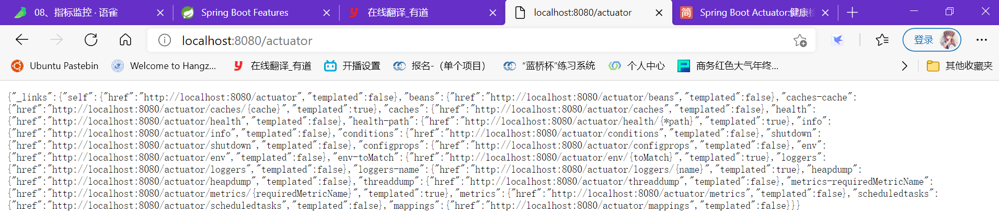

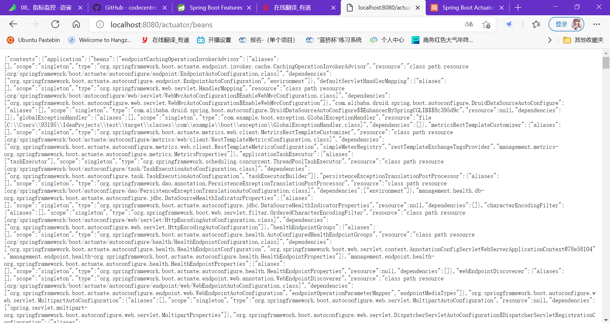

监控器传回的监控信息为JSON格式，我们可以结合JSON插件和前端面板使用


### 14.1.3	JMX方式监控

除了HTTP查看监控信息外，Actuator默认使用JMX方式查看监控信息：

在CMD控制台输入jconsole打开Java控制台：

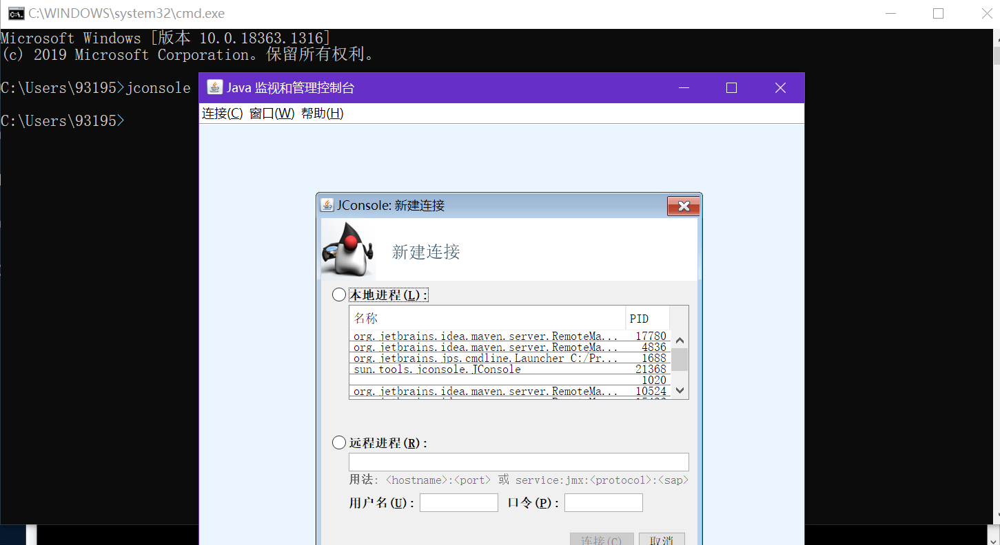

选中我们的SpringBoot项目进程后连接，在MBean栏中可以以JMX方式查看监控信息：

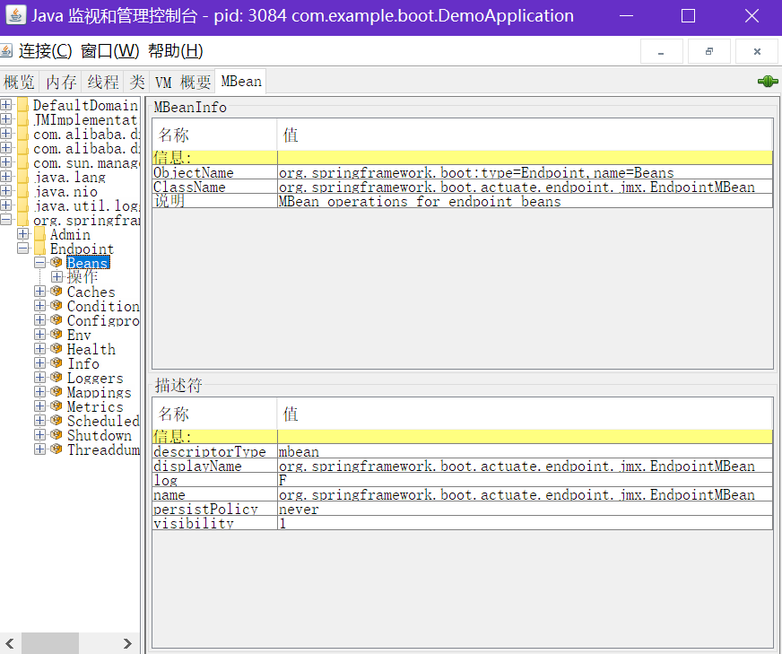


## 14.2	Actuator Endpoint

Endpoint，即Actuator监视器的监控端点，每个监控端点表示一个监控类型

### 14.2.1	常见Endpoint

常见的监控端点有：

| ID                 | 描述                                                         |
| ------------------ | ------------------------------------------------------------ |
| `auditevents`      | 暴露当前应用程序的审核事件信息。需要一个`AuditEventRepository组件`。 |
| `beans`            | 显示应用程序中所有Spring Bean的完整列表。                    |
| `caches`           | 暴露可用的缓存。                                             |
| `conditions`       | 显示自动配置的所有条件信息，包括匹配或不匹配的原因。         |
| `configprops`      | 显示所有`@ConfigurationProperties`。                         |
| `env`              | 暴露Spring的属性`ConfigurableEnvironment`                    |
| `flyway`           | 显示已应用的所有Flyway数据库迁移。 需要一个或多个`Flyway`组件。 |
| `health`           | 显示应用程序运行状况信息。                                   |
| `httptrace`        | 显示HTTP跟踪信息（默认情况下，最近100个HTTP请求-响应）。需要一个`HttpTraceRepository`组件。 |
| `info`             | 显示应用程序信息。                                           |
| `integrationgraph` | 显示Spring `integrationgraph` 。需要依赖`spring-integration-core`。 |
| `loggers`          | 显示和修改应用程序中日志的配置。                             |
| `liquibase`        | 显示已应用的所有Liquibase数据库迁移。需要一个或多个`Liquibase`组件。 |
| `metrics`          | 显示当前应用程序的“指标”信息。                               |
| `mappings`         | 显示所有`@RequestMapping`路径列表。                          |
| `scheduledtasks`   | 显示应用程序中的计划任务。                                   |
| `sessions`         | 允许从Spring Session支持的会话存储中检索和删除用户会话。需要使用Spring Session的基于Servlet的Web应用程序。 |
| `shutdown`         | 使应用程序正常关闭。默认禁用。                               |
| `startup`          | 显示由`ApplicationStartup`收集的启动步骤数据。需要使用`SpringApplication`进行配置`BufferingApplicationStartup`。 |
| `threaddump`       | 执行线程转储。                                               |


如果您的应用程序是Web应用程序（Spring MVC，Spring WebFlux或Jersey），则可以使用以下附加端点：

| ID           | 描述                                                         |
| ------------ | ------------------------------------------------------------ |
| `heapdump`   | 返回`hprof`堆转储文件。                                      |
| `jolokia`    | 通过HTTP暴露JMX bean（需要引入Jolokia，不适用于WebFlux）。需要引入依赖`jolokia-core`。 |
| `logfile`    | 返回日志文件的内容（如果已设置`logging.file.name`或`logging.file.path`属性）。支持使用HTTP`Range`标头来检索部分日志文件的内容。 |
| `prometheus` | 以Prometheus服务器可以抓取的格式公开指标。需要依赖`micrometer-registry-prometheus`。 |


最常用的Endpoint监控端点：

- **Health：监控状况**
- **Metrics：运行时指标**
- **Loggers：日志记录**


### 14.2.2	Health Endpoint

健康检查端点，我们一般用于在云平台，平台会定时的检查应用的健康状况，我们就需要Health Endpoint可以为平台返回当前应用的一系列组件健康状况的集合。

重要的几点：

- health endpoint返回的结果，应该是一系列健康检查后的一个汇总报告
- 很多的健康检查默认已经自动配置好了，比如：数据库、redis等
- 可以很容易的添加自定义的健康检查机制


### 14.2.3	Metrics Endpoint

提供详细的、层级的、空间指标信息，这些信息可以被pull（主动推送）或者push（被动获取）方式得到；

- 通过Metrics对接多种监控系统
- 简化核心Metrics开发
- 添加自定义Metrics或者扩展已有Metrics


### 14.2.4	管理Endpoints

#### 14.2.4.1	开启与禁用Endpoints

默认所有的Endpoint除过shutdown都是开启的。

需要开启或者禁用某个Endpoint。配置模式为  **management.endpoint.<endpointName>.enabled = true**

```yaml
management:
  endpoint:
    beans:
      enabled: true
```

或者禁用所有的Endpoint然后手动开启指定的Endpoint：

```yaml
management:
  endpoints:
    enabled-by-default: false
  endpoint:
    beans:
      enabled: true
    health:
      enabled: true
```


#### 14.2.4.2	暴露Endpoints

支持的暴露方式

- HTTP：默认只暴露**health**和**info** Endpoint
- **JMX**：默认暴露所有Endpoint
- 除过health和info，剩下的Endpoint都应该进行保护访问。如果引入SpringSecurity，则会默认配置安全访问规则

| ID                 | JMX  | Web  |
| ------------------ | ---- | ---- |
| `auditevents`      | Yes  | No   |
| `beans`            | Yes  | No   |
| `caches`           | Yes  | No   |
| `conditions`       | Yes  | No   |
| `configprops`      | Yes  | No   |
| `env`              | Yes  | No   |
| `flyway`           | Yes  | No   |
| `health`           | Yes  | Yes  |
| `heapdump`         | N/A  | No   |
| `httptrace`        | Yes  | No   |
| `info`             | Yes  | Yes  |
| `integrationgraph` | Yes  | No   |
| `jolokia`          | N/A  | No   |
| `logfile`          | N/A  | No   |
| `loggers`          | Yes  | No   |
| `liquibase`        | Yes  | No   |
| `metrics`          | Yes  | No   |
| `mappings`         | Yes  | No   |
| `prometheus`       | N/A  | No   |
| `scheduledtasks`   | Yes  | No   |
| `sessions`         | Yes  | No   |
| `shutdown`         | Yes  | No   |
| `startup`          | Yes  | No   |
| `threaddump`       | Yes  | No   |


## 14.3	定制Endpoint

### 14.3.1	定制 Health  Endpoint信息

在SpringBoot Actuator中，Health Endpoint默认只以Up和Down表示当前项目是否健康，而不会显示导致Down的原因：

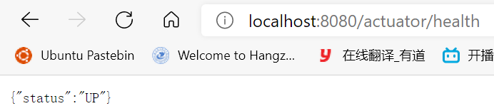


为了方便项目问题排查，我们可以通过配置项要求Health Endpoint提供详细信息：

```yaml
management:
  endpoint:
    health:
      enabled: true
      show-details: always #总是显示详细信息。可显示每个模块的状态信息
```

此时，Health Endpoint就能提供各模块的详细信息：

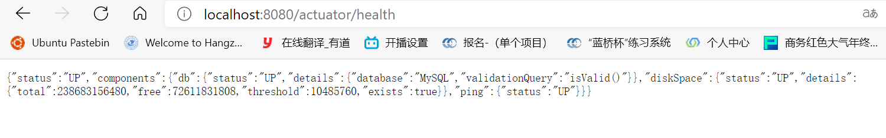


另外，如果我们还要定制更多信息，可以自己继承并实现AbstractHealthIndicator抽象类：

```java
@Component
public class MyHealthIndicator extends AbstractHealthIndicator {

    /**
     * 真实的检查方法
     * @param builder
     * @throws Exception
     */
    @Override
    protected void doHealthCheck(Health.Builder builder) throws Exception {
        //mongodb。  获取连接进行测试
        Map<String,Object> map = new HashMap<>();
        // 检查完成
        if(1 == 2){
//            builder.up(); //健康
            builder.status(Status.UP);
            map.put("count",1);
            map.put("ms",100);
        }else {
//            builder.down();
            builder.status(Status.OUT_OF_SERVICE);
            map.put("err","连接超时");
            map.put("ms",3000);
        }
        builder.withDetail("code",100)
                .withDetails(map);
    }
}
```

运行项目，此时我们自定义的健康检查已经出现在了监控页面上：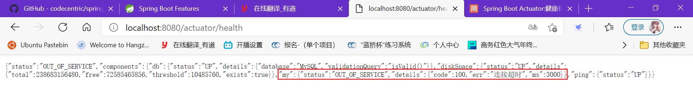


### 14.3.2	定制Info Endpoint信息

在Info页面，默认没有任何信息展示

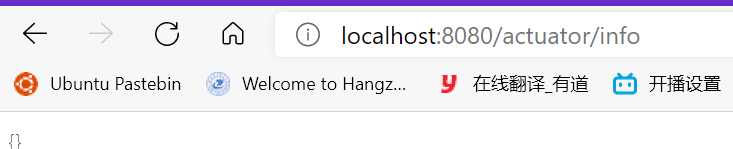

但我们可以自定义要展示的页面信息


#### 14.3.2.1	编写配置文件

我们可以直接在全局配置文件中编写需要在Info Endpoint监控页面展示的信息：

```yaml
info:
  appName: boot-admin
  version: 2.0.1
  mavenProjectName: @project.artifactId@  #使用@@可以获取maven的pom文件值
  mavenProjectVersion: @project.version@
```


#### 14.3.2.2	编写InfoContributor

类似的，我们也可以自己编写InfoContributor来定制信息：

```java
@Component
public class MyInfoContributor implements InfoContributor {
    @Override
    public void contribute(Info.Builder builder) {
        builder.withDetail("example",
                Collections.singletonMap("key", "value"))
                .withDetail("Hello", "SpringBoot Actuator");
    }
}
```

此时Info页面显示的信息包括配置文件中编写的信息，也包括自定义的InfoContributor中的信息：

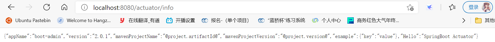


### 14.3.3	定制Metrics信息

#### 14.3.3.1	SpringBoot支持自动适配的Metrics

- JVM metrics, report utilization of:

- - Various memory and buffer pools
  - Statistics related to garbage collection
  - Threads utilization
  - Number of classes loaded/unloaded

- CPU metrics
- File descriptor metrics
- Kafka consumer and producer metrics
- Log4j2 metrics: record the number of events logged to Log4j2 at each level
- Logback metrics: record the number of events logged to Logback at each level
- Uptime metrics: report a gauge for uptime and a fixed gauge representing the application’s absolute start time
- Tomcat metrics (`server.tomcat.mbeanregistry.enabled` must be set to `true` for all Tomcat metrics to be registered)
- [Spring Integration](https://docs.spring.io/spring-integration/docs/5.4.1/reference/html/system-management.html#micrometer-integration) metrics


#### 14.3.3.2	定制Metrics

要定制指标信息，可以在Service层的构造方法中注册指标

```java
@Service
public class TeacherServiceImpl extends ServiceImpl<TeacherMapper, Teacher> implements TeacherService{
    private Counter counter;
    public TeacherServiceImpl(MeterRegistry meterRegistry){
        //在构造方法中注册指标，并指定指标名
        counter = meterRegistry.counter("teacherServiceImpl.method.running.counter");
    }
    public void hello() {
        counter.increment();
    }
    ...
}
```

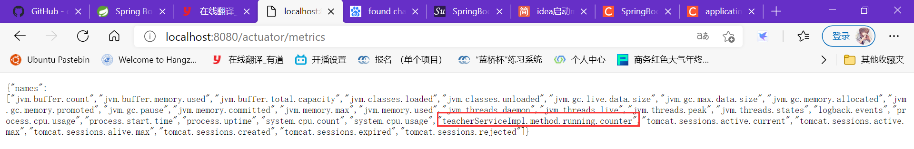


也可以使用以下方法：

```java
//也可以使用下面的方式
@Bean
MeterBinder queueSize(Queue queue) {
    return (registry) -> Gauge.builder("queueSize", queue::size).register(registry);
}
```


### 14.3.4	自定义Endpoint

要自定义Endpoint，只需要用@Endpoint标记该类为一个Endpoint，并用@Component将该类加入容器即可

在Endpoint类中，需要使用@ReadOperation和@WriteOperation注解标记方法为读操作和写操作：

```java
@Component
@Endpoint(id = "myService")//标记该类为一个Endpoint且指定id
public class MyServiceEndpoint {
    @ReadOperation
    public Map getDockerInfo(){
        return Collections.singletonMap("dockerInfo", "Docker started");
    }

    @WriteOperation
    public void stopDocker(){
        System.out.println("Docker stopped");
    }
}
```

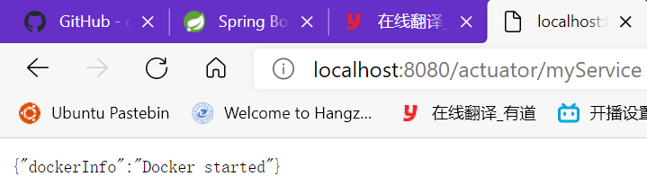

场景：开发**ReadinessEndpoint**来管理程序是否就绪，或者**LivenessEndpoint**来管理程序是否存活；

当然，这个也可以直接使用 https://docs.spring.io/spring-boot/docs/current/reference/html/production-ready-features.html#production-ready-kubernetes-probes


## 14.4	SpringBoot Admin Server

官方GitHub文档：https://github.com/codecentric/spring-boot-admin

SpringBoot Admin Server是一种可视化工具


### 14.4.1	使用SpringBoot AdminServer

引入服务器依赖：

```xml
<dependency>
    <groupId>de.codecentric</groupId>
    <artifactId>spring-boot-admin-starter-server</artifactId>
    <version>2.3.1</version>
</dependency>
```

在主应用类上使用注解@EnableAdminServer，启用SpringBoot AdminServer：

```java
@EnableAdminServer //开启SpringBoot AdminServer功能
```

引入客户端依赖：

```xml
<dependency>
    <groupId>de.codecentric</groupId>
    <artifactId>spring-boot-admin-starter-client</artifactId>
    <version>2.3.1</version>
</dependency>
```

配置客户端地址，使服务器能收集到客户端地址信息：

```yaml
server:
  port: 8888 # 为了区分客户端与服务器，我们使用8888端口作为客户端的端口
  
spring:
  boot:
    admin:
      client:
        url: http://localhost:8888
        instance:
          prefer-ip: true # 使用IP注册实例
  application:
    name: Demo-Client # 指定应用名称

management:
  endpoints:
    web:
      exposure:
        include: '*'  #以web方式暴露
    enabled-by-default: true #暴露所有端点信息
```

此时，我们访问localhost:8888/applications就可以登录SpringBoot AdminServer服务器了：

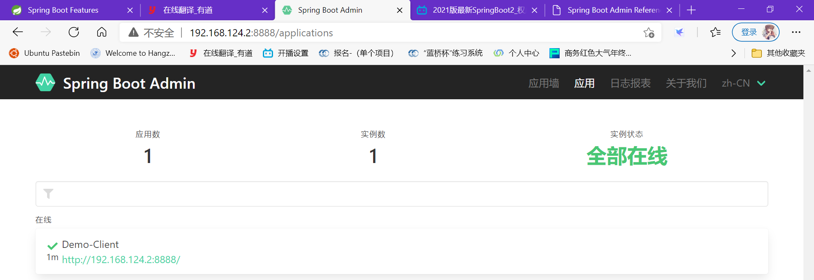

在应用墙可以查看所有应用，找到目标应用，点击可以查看应用详细信息：

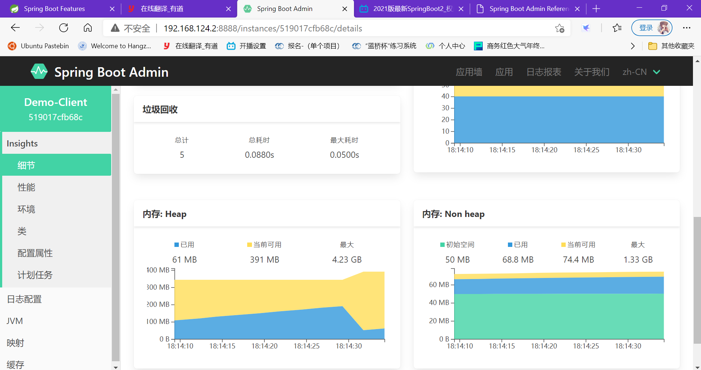