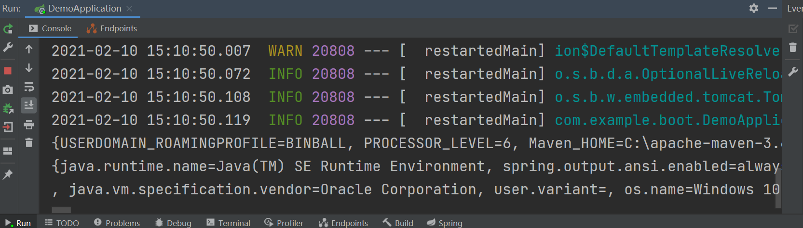

# 15.	SpringBoot高级特性

## 15.1	profile功能

为了简化多环境适配流程，SpringBoot提供了profile功能，能让我们在多应用场景间快速切换


### 15.1.1	测试profile功能

在配置文件中添加测试数据：

```properties
person.name=Mary
```

分别建立两个yml配置文件，对应两个使用场景：

创建生产环境配置文件application-prod.yml：

```yaml
person:
  name: Product
```

创建测试环境配置文件application-test.yml：

```yaml
person:
  name: Test
```

创建测试控制器类HelloController：

```java
@RestController
public class HelloController {
    //用@Value注解从配置文件中按Key取值
    // 若未取到则以冒号后作为默认值
    @Value("${person.name:Jack}")
    private String name;

    @GetMapping("/")
    public String hello(){
        return "Hello,"+name;
    }
}
```

运行项目：


此时@Value取到的是配置文件中的值，这是因为我们还没有使用profile功能，并且默认配置文件优于yaml配置文件

在默认配置文件中删除测试数据，并指定使用环境：

```properties
spring.profiles.active=prod
# 指定要激活的环境，默认配置文件和指定环境配置文件都生效
```

运行项目：


当找不到目标环境时：

```properties
spring.profiles.active=test123
```


### 15.1.2	@Profile条件装配

创建实体类Person：

```java
@Data
public class Person {
    private String name;
    private Integer age;
}
```

创建两个继承类Boss和Worker：

```java
@Data
@Component
@ConfigurationProperties("person")
public class Boss extends Person{
}

@Data
@Component
@ConfigurationProperties("person")
public class Worker extends Person{
}
```

这两个类都从配置文件中取值构建对象，但我们希望运行生产环境时构建Boss对象；而运行测试环境时构建Worker对象

这时我们可以使用@Profile注解，指定该类只在指定环境下构建对象：

```java
@Profile("prod")
@Data
@Component
@ConfigurationProperties("person")
public class Boss extends Person{
}

@Profile("test")
@Data
@Component
@ConfigurationProperties("person")
public class Worker extends Person{
}
```


类似的，在配置类中也可以使用这种方法获取我们需要的Bean：

创建实体类Color：

```java
@Data
@AllArgsConstructor
public class Color {
    private String color;
}
```

在配置类中使用@Profile注解指定环境：

```java
@Configuration
public class MyConfig {
    @Bean
    @Profile("prod")
    public Color getRed(){
        return new Color("Red");
    }

    @Bean
    @Profile("test")
    public Color getGreen(){
        return new Color("Green");
    }
}
```


### 15.1.3	profile分组

当一个环境只对应一个配置文件似乎不能完全满足我们的需求时，我们可以使用profile分组：

创建配置文件application-dev.yml，在默认配置文件application.properties/yml/yaml中：

```properties
spring.profiles.active=myprod
#自定义分组组名，将需要的配置文件都添加到分组中，一次激活一个分组
spring.profiles.group.myprod[0]=prod
spring.profiles.group.myprod[1]=dev

spring.profiles.group.mytest[0]=test
spring.profiles.group.mytest[1]=dev
```


## 15.2	外部化配置

SpringBoot官方文档：https://docs.spring.io/spring-boot/docs/current/reference/html/spring-boot-features.html#boot-features-external-config

外部化配置，即将所有配置信息抽取为配置文件，集中化管理

> Spring Boot lets you externalize your configuration so that you can work with the same application code in different environments. You can use a variety of external configuration sources, include Java properties files, YAML files, environment variables, and command-line arguments.
>
> Spring Boot允许您外部化配置，这样您就可以在不同的环境中使用相同的应用程序代码。您可以使用各种外部配置源，包括Java属性文件、YAML文件、环境变量和命令行参数。
>
> Property values can be injected directly into your beans by using the @Value annotation, accessed through Spring’s Environment abstraction, or be bound to structured objects through @ConfigurationProperties.
>
> 属性值可以通过使用@Value注解直接注入到bean中，可以通过Spring的环境抽象访问，也可以通过@ConfigurationProperties绑定到结构化对象。
>
> Spring Boot uses a very particular PropertySource order that is designed to allow sensible overriding of values. Properties are considered in the following order (with values from lower items overriding earlier ones):
>
> Spring Boot使用一种非常特殊的PropertySource顺序，这种顺序被设计为允许合理地覆盖值。属性按以下顺序被考虑(较低项的值覆盖较早项的值):
>
> 1. Default properties (specified by setting `SpringApplication.setDefaultProperties`).
>
>    默认属性(通过设置' SpringApplication.setDefaultProperties '指定)。
>
> 2. [`@PropertySource`](https://docs.spring.io/spring/docs/5.3.1/javadoc-api/org/springframework/context/annotation/PropertySource.html) annotations on your `@Configuration` classes. Please note that such property sources are not added to the `Environment` until the application context is being refreshed. This is too late to configure certain properties such as `logging.*` and `spring.main.*` which are read before refresh begins.
>
>    在配置类上标注的@PropertySource注解，注意在刷新应用程序上下文之前，这些属性源不会添加到“环境”中。在刷新开始之前读取诸如logging.*和spring.main.\*等的配置已经太晚了
>
> 3. **Config data (such as** **`application.properties`** **files)**
>
>    配置数据，如application.properties文件
>
> 4. A `RandomValuePropertySource` that has properties only in `random.*`.
>
>    只在random.*中有属性的RandomValuePropertySource
>
> 5. OS environment variables.
>
>    系统环境变量
>
> 6. Java System properties (`System.getProperties()`).
>
>    Java系统配置
>
> 7. JNDI attributes from `java:comp/env`.
>
>    来自java:comp/env的JNDI属性
>
> 8. `ServletContext` init parameters.
>
>    ServletContext初始化变量
>
> 9. `ServletConfig` init parameters.
>
>    ServletConfig初始化变量
>
> 10. Properties from `SPRING_APPLICATION_JSON` (inline JSON embedded in an environment variable or system property).
>
>     来自`SPRING_APPLICATION_JSON`(内嵌JSON嵌入到环境变量或系统属性中)的配置
>
> 11. Command line arguments.
>
>     命令行语句
>
> 12. `properties` attribute on your tests. Available on [`@SpringBootTest`](https://docs.spring.io/spring-boot/docs/2.4.0/api/org/springframework/boot/test/context/SpringBootTest.html) and the [test annotations for testing a particular slice of your application](https://docs.spring.io/spring-boot/docs/current/reference/html/spring-boot-features.html#boot-features-testing-spring-boot-applications-testing-autoconfigured-tests).
>
>     在测试中的配置属性
>
> 13. [`@TestPropertySource`](https://docs.spring.io/spring/docs/5.3.1/javadoc-api/org/springframework/test/context/TestPropertySource.html) annotations on your tests.
>
>     在测试中的注解属性
>
> 14. [Devtools global settings properties](https://docs.spring.io/spring-boot/docs/current/reference/html/using-spring-boot.html#using-boot-devtools-globalsettings) in the `$HOME/.config/spring-boot` directory when devtools is active.
>
>     开发工具的全局设置配置


### 15.2.1	外部配置源

常用：**Java属性文件**、**YAML文件**、**环境变量**、**命令行参数**；


### 15.2.2	获取外部配置

根据官方文档可知，我们可以获取到环境变量信息：

```java
@Value("${Maven_HOME}")
private String msg;

@GetMapping("/")
public String hello(){
    return msg;
}
```


或者在主应用类中获取：

```java
ConfigurableApplicationContext run = SpringApplication.run(DemoApplication.class, args);
ConfigurableEnvironment environment = run.getEnvironment();

Map<String, Object> systemEnvironment = environment.getSystemEnvironment();
Map<String, Object> systemProperties = environment.getSystemProperties();

System.out.println(systemEnvironment);
System.out.println(systemProperties);
```




### 15.2.3	配置文件查找位置

(1) classpath 根路径

(2) classpath 根路径下config目录

(3) jar包当前目录

(4) jar包当前目录的config目录

(5) /config子目录的直接子目录


### 15.2.4	配置文件加载顺序

（1）当前jar包内部的application.properties和application.yml

（2）当前jar包内部的application-{profile}.properties 和 application-{profile}.yml

（3） 引用的外部jar包的application.properties和application.yml

（4） 引用的外部jar包的application-{profile}.properties 和 application-{profile}.yml


注意：**指定环境优先，外部优先，后面的可以覆盖前面的同名配置项**


## 15.3	自定义Starter

待更新