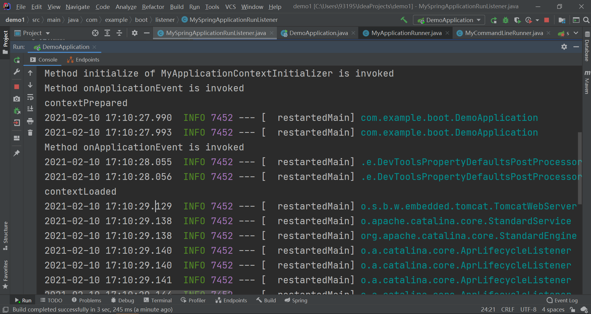
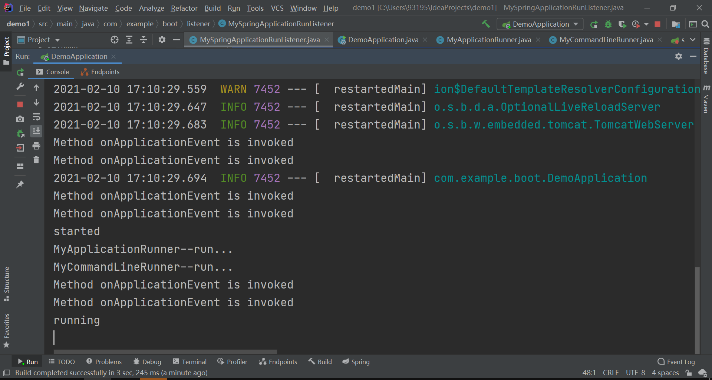

# 16.	SpringBoot原理解析

## 16.1	SpringBoot启动过程

在SpringBoot启动过程中，主要有两部分：

1.创建SpringBoot应用SpringApplication

2.启动SpringBoot应用SpringApplication


### 16.1.1	创建SpringBoot应用

```java
public SpringApplication(ResourceLoader resourceLoader, Class<?>... primarySources) {
    this.sources = new LinkedHashSet();
    this.bannerMode = Mode.CONSOLE;
    //一些配置项
    this.logStartupInfo = true;
    this.addCommandLineProperties = true;
    this.addConversionService = true;
    this.headless = true;
    this.registerShutdownHook = true;
    this.additionalProfiles = Collections.emptySet();
    this.isCustomEnvironment = false;
    this.lazyInitialization = false;
    this.applicationContextFactory = ApplicationContextFactory.DEFAULT;
    this.applicationStartup = ApplicationStartup.DEFAULT;
    //装载资源加载器
    this.resourceLoader = resourceLoader;
    //确认主配置文件不为空
    Assert.notNull(primarySources, "PrimarySources must not be null");
    this.primarySources = new LinkedHashSet(Arrays.asList(primarySources));
    //获取当前web应用类型(响应式编程/Servlet编程)
    this.webApplicationType = WebApplicationType.deduceFromClasspath();
    //初始启动引导器 在spring.factories文件中找org.springframework.boot.Bootstrapper
    this.bootstrappers = new ArrayList(this.getSpringFactoriesInstances(Bootstrapper.class));
    //在spring.factories文件中找ApplicationContextInitializer，并作为初始化器
    this.setInitializers(this.getSpringFactoriesInstances(ApplicationContextInitializer.class));
    //在spring.factories文件中找ApplicationListener作为监听器
    this.setListeners(this.getSpringFactoriesInstances(ApplicationListener.class));
    //在堆栈中将有main方法的类作为主应用类
    this.mainApplicationClass = this.deduceMainApplicationClass();
}
```


### 16.1.2	启动SpringBoot应用

```java
public ConfigurableApplicationContext run(String... args) {
    //StopWatch用于记录应用启停
    StopWatch stopWatch = new StopWatch();
    //记录应用启动时间
    stopWatch.start();
    //创建引导上下文
    //获取所有在SpringApplication构造方法中保存的bootstrapper，逐个执行initialize方法，完成对引导启动器上下文环境设置
    DefaultBootstrapContext bootstrapContext = this.createBootstrapContext();
    ConfigurableApplicationContext context = null;
    //使当前应用进入headless模式
    this.configureHeadlessProperty();
    //获取所有运行监听器RunListener(去spring.factories找 SpringApplicationRunListener.)
    SpringApplicationRunListeners listeners = this.getRunListeners(args);
    //遍历RunListener，逐个调用starting方法
  	//相当于通知所有感兴趣系统正在启动过程的人，项目正在 starting。
   	//即这里运行监听器是为了方便所有Listener进行事件感知
    listeners.starting(bootstrapContext, this.mainApplicationClass);

    try {
        //保存命令行参数
        ApplicationArguments applicationArguments = new DefaultApplicationArguments(args);
        //调用prepareEnvironment()方法准备环境：
        	//根据web应用类型返回或创建一个基础环境信息对象
        	//配置环境信息对象
        		//读取所有配置源的配置属性值
        	//绑定环境信息
        	//监听器调用environmentPrepared()方法，通知所有监听器：当前环境准备完成
        ConfigurableEnvironment environment = this.prepareEnvironment(listeners, bootstrapContext, applicationArguments);
        this.configureIgnoreBeanInfo(environment);
        Banner printedBanner = this.printBanner(environment);
        //调用createApplicationContext()方法，根据web应用类型，创建IOC容器
        context = this.createApplicationContext();
        context.setApplicationStartup(this.applicationStartup);
        //调用prepareContext()方法，准备IOC容器ApplicationContext的基本信息：
        	//保存环境信息
        	//IOC容器后置处理流程
        	//应用初始化器applyInitializer：
        		//调用所有ApplicationContextInitializer的initialize()方法，对IOC容器进行初始化扩展功能
        	//遍历所有Listener，调用contextPrepared()方法(实际使用了EventPublishRunListenr)，通知所有的监听器contextPrepared
        	//所有的监听器调用contextLoaded()方法，通知所有的监听器IOC容器已经加载完成contextLoaded
        this.prepareContext(bootstrapContext, context, environment, listeners, applicationArguments, printedBanner);
        //调用refreshContext方法，刷新IOC容器，创建容器中的所有组件
        this.refreshContext(context);
        //调用afterRefresh方法，进行IOC刷新后的工作：

        this.afterRefresh(context, applicationArguments);
        stopWatch.stop();
        if (this.logStartupInfo) {
            (new StartupInfoLogger(this.mainApplicationClass)).logStarted(this.getApplicationLog(), stopWatch);
        }
	//所有Listener调用started()方法，通知监听器当前项目启动
        listeners.started(context);
        //获取Runner对象，包括ApplicationRunner和CommandLineRunner，合并所有Runner并进行排序
        //遍历Runner，逐个调用run方法
        this.callRunners(context, applicationArguments);
    } catch (Throwable var10) {
        //如果出现异常，Listener调用failed方法，通知监听器项目启动失败
        this.handleRunFailure(context, var10, listeners);
        throw new IllegalStateException(var10);
    }

    try {
        //如果一切正常，监听器Listener调用running()方法，通知监听器项目正在运行
        listeners.running(context);
        return context;
    } catch (Throwable var9) {
        //如果出现异常，Listener继续调用failed方法，通知监听器项目启动失败
        this.handleRunFailure(context, var9, (SpringApplicationRunListeners)null);
        throw new IllegalStateException(var9);
    }
}
```


```java
public interface Bootstrapper {

	/**
	 * Initialize the given {@link BootstrapRegistry} with any required registrations.
	 * @param registry the registry to initialize
	 */
	void intitialize(BootstrapRegistry registry);

}
```


```java
@FunctionalInterface
public interface ApplicationRunner {

	/**
	 * Callback used to run the bean.
	 * @param args incoming application arguments
	 * @throws Exception on error
	 */
	void run(ApplicationArguments args) throws Exception;

}
```


```java
@FunctionalInterface
public interface CommandLineRunner {

	/**
	 * Callback used to run the bean.
	 * @param args incoming main method arguments
	 * @throws Exception on error
	 */
	void run(String... args) throws Exception;

}
```


## 16.2	自定义事件监听组件

创建MyApplicationContextInitializer，实现ApplicationContextInitializer接口：

```java
public class MyApplicationContextInitializer implements ApplicationContextInitializer {
    @Override
    public void initialize(ConfigurableApplicationContext configurableApplicationContext) {
        System.out.println("Method initialize of MyApplicationContextInitializer is invoked");
    }
}
```

创建MyApplicationListener，实现ApplicationListener接口：

```java
public class MyApplicationListener implements ApplicationListener {
    @Override
    public void onApplicationEvent(ApplicationEvent applicationEvent) {
        System.out.println("Method onApplicationEvent is invoked");
    }
}
```

创建MySpringApplicationRunListener，实现SpringApplicationRunListener接口：

```java
public class MySpringApplicationRunListener implements SpringApplicationRunListener {
    
    private SpringApplication springApplication;
    public MySpringApplicationRunListener(SpringApplication springApplication, String[] args) {
        this.springApplication = springApplication;
    }
    
    @Override
    public void starting(ConfigurableBootstrapContext bootstrapContext) {
        System.out.println("starting...");
    }

    @Override
    public void environmentPrepared(ConfigurableBootstrapContext bootstrapContext, ConfigurableEnvironment environment) {
        System.out.println("environmentPrepared...");
    }

    @Override
    public void contextPrepared(ConfigurableApplicationContext context) {
        System.out.println("contextPrepared");
    }

    @Override
    public void contextLoaded(ConfigurableApplicationContext context) {
        System.out.println("contextLoaded");
    }

    @Override
    public void started(ConfigurableApplicationContext context) {
        System.out.println("started");
    }

    @Override
    public void running(ConfigurableApplicationContext context) {
        System.out.println("running");
    }

    @Override
    public void failed(ConfigurableApplicationContext context, Throwable exception) {
        System.out.println("failed");
    }
}
```

创建MyApplicationRunner，实现ApplicationRunner接口：

```java
@Component
public class MyApplicationRunner implements ApplicationRunner {
    @Override
    public void run(ApplicationArguments args) throws Exception {
        System.out.println("MyApplicationRunner--run...");
    }
}
```

创建MyCommandLineRunner，实现CommandLineRunner接口：

```java
@Component
public class MyCommandLineRunner implements CommandLineRunner {
    @Override
    public void run(String... args) throws Exception {
        System.out.println("MyCommandLineRunner--run...");
    }
}
```

在resources目录下创建目录META-INF，创建配置文件spring.factories，将创建的组件注册：

```properties
org.springframework.context.ApplicationListener=\
  com.example.boot.listener.MyApplicationListener

org.springframework.context.ApplicationContextInitializer=\
  com.example.boot.listener.MyApplicationContextInitializer

org.springframework.boot.SpringApplicationRunListener=\
  com.example.boot.listener.MySpringApplicationRunListener

org.springframework.boot.ApplicationRunner=\
  com.example.boot.listener.MyApplicationRunner

org.springframework.boot.CommandLineRunner=\
  com.example.boot.listener.MyCommandLineRunner
```

运行结果如图：






## 16.3	Application Events and Listeners

https://docs.spring.io/spring-boot/docs/current/reference/html/spring-boot-features.html#boot-features-application-events-and-listeners

**ApplicationContextInitializer**

**ApplicationListener**

**SpringApplicationRunListener**