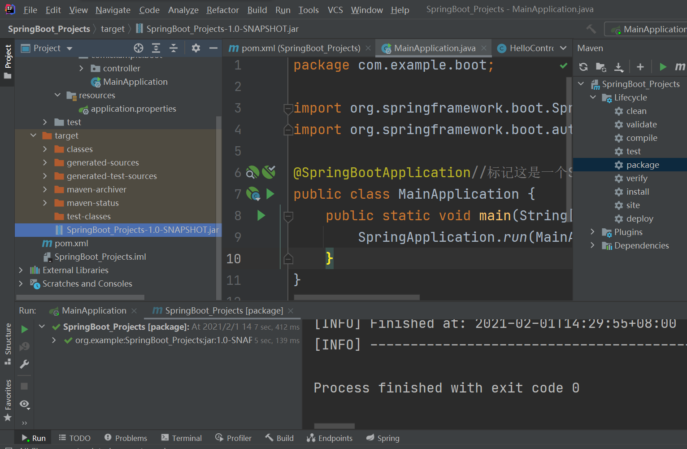

# 2.	SpringBoot特点

## 2.1	HelloWorld

创建Maven项目，导入依赖：

```xml
<parent>
    <groupId>org.springframework.boot</groupId>
    <artifactId>spring-boot-starter-parent</artifactId>
    <version>2.3.4.RELEASE</version>
</parent>

<dependencies>
    <dependency>
    <groupId>org.springframework.boot</groupId>
    <artifactId>spring-boot-starter-web</artifactId>
    </dependency>
</dependencies>
```

创建主程序类MainApplication：

```java
@SpringBootApplication//标记这是一个SpringBoot应用类
public class MainApplication {
    public static void main(String[] args) {
        SpringApplication.run(MainApplication.class, args);
    }
}
```

创建控制器类HelloController：

```java
/*
* 相当于@ResponseBody和@Controller
* */
@RestController
public class HelloController {

    @RequestMapping("/hello")
    public String handle(){
        return "Hello,SpringBoot!";
    }//将字符串直接传递给浏览器
}
```

运行程序，访问localhost:8080/hello：


## 2.2	SpringBoot的配置简化

在SpringBoot中，只需要通过一个配置文件就能完成整个项目的配置，通常我们在resources文件夹下创建application.properties文件作为配置文件，如：

```properties
server.port=8888
# 修改服务器端口号为8888
```


## 2.3	SpringBoot的部署简化

在SpringBoot中，整个项目，包括Tomcat服务器，都可以被完整地打包成一个可执行的jar包，可以拷贝到其他设备上，在需要的时候执行：

在Maven的LifeCycle中选中项目，选择package：


打包得到的jar包会出现在项目的target文件夹下：



在控制台中使用指令：java -jar jar文件名 来部署项目：


### 2.3.1	部署项目出现问题：jar文件中没有主清单属性

在运行时若出现问题：


jar文件中没有主清单属性

应在POM文件中添加：

```xml
<build>
    <plugins>
        <plugin>
            <groupId>org.springframework.boot</groupId>
            <artifactId>spring-boot-maven-plugin</artifactId>
        </plugin>
    </plugins>
</build>
```


## 2.4	SpringBoot的自动配置

### 2.4.1	依赖管理

SpringBoot项目在pom文件中声明了父项目的版本号：

```xml
<parent>
    <groupId>org.springframework.boot</groupId>
    <artifactId>spring-boot-starter-parent</artifactId>
    <version>2.3.5.RELEASE</version>
</parent>
```

而在父项目spring-boot-starter-parent中也声明了其父项目的版本号：

```xml
<parent>
  <groupId>org.springframework.boot</groupId>
  <artifactId>spring-boot-dependencies</artifactId>
  <version>2.3.5.RELEASE</version>
</parent>
```

在spring-boot-dependencies中，则声明了SpringBoot项目依赖的各jar包版本号：


其中几乎声明了所有开发中常用的依赖的版本号，采用自动版本仲裁机制

因此，我们在SpringBoot项目中引入依赖无需关注依赖的版本号，如：

```xml
<dependency>
    <groupId>org.springframework.boot</groupId>
    <artifactId>spring-boot-starter-web</artifactId>
</dependency>
```

**对于非版本仲裁jar的引入，仍然需要写版本号**


#### 2.4.1.1	starter场景启动器

在SpringBoot中，通常将某个场景对应所需的一组依赖打包为一个场景启动器，称为starter，即spring-boot-starter-*，其中星号表示对应的场景。

只要引入starter，这个场景的所有常规需要的依赖我们都自动引入

SpringBoot所有支持的场景
https://docs.spring.io/spring-boot/docs/current/reference/html/using-spring-boot.html#using-boot-starter

另外还有*-spring-boot-starter： 这是第三方为我们提供的简化开发的场景启动器。

```xml
<!--所有场景启动器最底层的依赖-->
<dependency>
  <groupId>org.springframework.boot</groupId>
  <artifactId>spring-boot-starter</artifactId>
  <version>2.3.4.RELEASE</version>
  <scope>compile</scope>
</dependency>
```


#### 2.4.1.2	手动修改依赖版本

当我们需要自行选择依赖的版本号时，需要在pom文件中使用properties标签进行配置，如我们想使用MySQL驱动的版本为5.1.43：

在spring-boot-dependencies中，对MySQL依赖声明如下：


因此，在项目的pom文件中添加配置：

```xml
<properties>
    <mysql.version>5.1.43</mysql.version>
</properties>
```


### 2.4.2	自动配置

1、自动配置Tomcat

SpringBoot为我们自动引入了Tomcat依赖并进行了自动配置：

```xml
<dependency>
  <groupId>org.springframework.boot</groupId>
  <artifactId>spring-boot-starter-tomcat</artifactId>
  <version>2.3.5.RELEASE</version>
</dependency>
```

2、自动配置SpringMVC：

SpringBoot同样自动引入了SpringMVC并进行了配置，包括前端控制器DispatcherServlet、字符编码过滤器characterEncodingFilter、视图解析器ViewResolver和文件上传解析器MultipartResolver等，即SpringBoot已经自动完成了常见场景的配置：

```xml
<dependency>
  <groupId>org.springframework</groupId>
  <artifactId>spring-web</artifactId>
  <version>5.2.10.RELEASE</version>
  <scope>compile</scope>
</dependency>
<dependency>
  <groupId>org.springframework</groupId>
  <artifactId>spring-webmvc</artifactId>
  <version>5.2.10.RELEASE</version>
  <scope>compile</scope>
</dependency>
```

3、默认的包结构：

SpringBoot会扫描其主程序同路径及子路径下的所有组件

也可以通过SpringBoot主应用类的@SpringBootApplication注解的scanBasePackages属性指定扫描路径：

```java
@SpringBootApplication(scanBasePackages = "com.example")
public class MainApplication {
    public static void main(String[] args) {
        SpringApplication.run(MainApplication.class, args);
    }
}
```

还可以通过@ComponentScan注解指定扫描路径，但@SpringBootApplication注解包括以下三个注解：

```
@SpringBootConfiguration
@EnableAutoConfiguration
@ComponentScan
```

因此@ComponentScan和@SpringBootApplication注解不能同时存在，要在主应用类下使用@ComponentScan注解就要将@SpringBootApplication替换为对应的三个子注解：

```java
@SpringBootConfiguration
@EnableAutoConfiguration
@ComponentScan("com.example")
public class MainApplication {
    public static void main(String[] args) {
        SpringApplication.run(MainApplication.class, args);
    }
}
```


4、SpringBoot的各种配置都有默认值，且这些默认配置最终会映射到MultipartProperties；配置文件的值最终会绑定到对应的类上，这个类会在容器中创建对象

5、SpringBoot按需加载配置项，应用只会加载当前场景需要的starter。在SpringBoot中，所有自动配置都在spring-boot-autoconfigure包中进行：


## 2.5	SpringBoot容器

### 2.5.1	注解配置

创建实体类User：

```java
public class User {
    private String name;
    private Integer age;
}
```

#### 2.5.1.1	@Configuration

在Spring中，我们常使用XML配置bean：

```xml
<?xml version="1.0" encoding="UTF-8"?>
<beans xmlns="http://www.springframework.org/schema/beans"
       xmlns:xsi="http://www.w3.org/2001/XMLSchema-instance"
       xsi:schemaLocation="http://www.springframework.org/schema/beans http://www.springframework.org/schema/beans/spring-beans.xsd">
    <bean id="user" class="com.example.boot.bean.User">
        <property name="name" value="Admin"/>
        <property name="age" value="18"/>
    </bean>
</beans>
```

而在SpringBoot中，我们一般使用注解配置：

创建配置类MyConfig，使用注解@Configuration表示这是一个配置类：

```java
//表示这是一个配置类
@Configuration
public class MyConfig {
}
```

相对于XML配置使用<bean>标签配置，在配置类中常使用方法返回bean：

```java
@Bean//使用@Bean注解为容器中添加组件，组件id默认为方法名
//返回类型就是组件类型，返回值就是组件在容器中的实例
public User user(){
    return new User("Admin", 18);
}
```

也可以为@Bean注解赋值来指定组件id：

```java
@Bean("user01")
```

在主应用类中可以获取IOC容器，查看我们配置的Bean是否正确：

```java
//1.返回IOC容器
ConfigurableApplicationContext run = SpringApplication.run(MainApplication.class, args);
//2.获取Bean实例
User user = run.getBean("user", User.class);
System.out.println(user);
```


> 1、配置类上使用@Configuration注解标识配置类，在类中使用@Bean注解标注在方法上为容器注册组件，组件默认为单实例
>
> 2、配置类本身也是一个组件
>
> 3、在SpringBoot2或Spring5.2之后，配置类中属性proxyBeanMethods代理bean方法默认为true(Full模式)，此时该配置类会被代理，在同一个配置文件中调用其它被@Bean注解标注的方法获取对象时会直接从IOC容器之中获取，即外部无论调用多少次配置类中某组件的注册方法，获取到的组件都是同一个对象，SpringBoot保证容器中该组件只有一个实例。
>
> ​	当proxyBeanMethods=false时(Lite模式)，配置类不会被代理，每次获取bean都会创建一个新的对象，而不是从IOC容器中获取。
>
> ​	Full模式能够保证组件单实例，但速度较慢；Lite模式使得组件有多个实例，速度较快。使用Full或Lite模式取决于我们是否要保证组件对象前后一致。

#### 2.5.1.2	@Import、@Conditional和@ImportResource

```java
@Import({User.class})
//导入注解
//在容器中自动创建出对应类型的组件，组件名默认为全类名
```

```java
@Conditional
//条件注入注解
//当满足注解指定条件时，进行组件注入
```


```java
@ImportResource("classpath:beans.xml")
//可以通过@ImportResource注解，将XML配置文件引入，使得XML文件中的配置也能正常使用
```


## 2.5.2	配置绑定

假定要有配置文件如下：

```properties
myuser.name=User01
myuser.age=20
```

要将配置文件中的数据一一对应创建Bean，在SpringBoot中可以通过@ConfigurationProperties实现：

#### 

#### 2.5.2.1	实体类

在实体类中：

```java
//只有在容器中的组件，才能使用SpringBoot的功能
@Component
@ConfigurationProperties(prefix = "myuser")
public class User {
    private String name;
    private Integer age;
}
```

在控制器中：

```java
@RestController
public class HelloController {
    @Autowired
    private User user;
    //利用@Autowired注解自动获取对象，再用@RequestMapping响应请求返回对象
    @RequestMapping("/user")
    public User user(){
        return user;
    }
}
```

运行结果如图：


#### 2.5.2.2	配置类

同样的，在实体类上加上@ConfigurationProperties注解：

```java
@ConfigurationProperties(prefix = "myuser")
public class User {
    private String name;
    private Integer age;
}
```

在配置类上加上@EnableConfigurationProperties注解：

```java
@Configuration
@EnableConfigurationProperties(User.class)
//1.开启User类的配置绑定功能
//2.将User自动注册到容器中
public class MyConfig {
}
```

这样，配置类就会自动为我们将对应的组件注册到容器中


**要注意的是，配置信息必须写在配置文件application.properties中**

