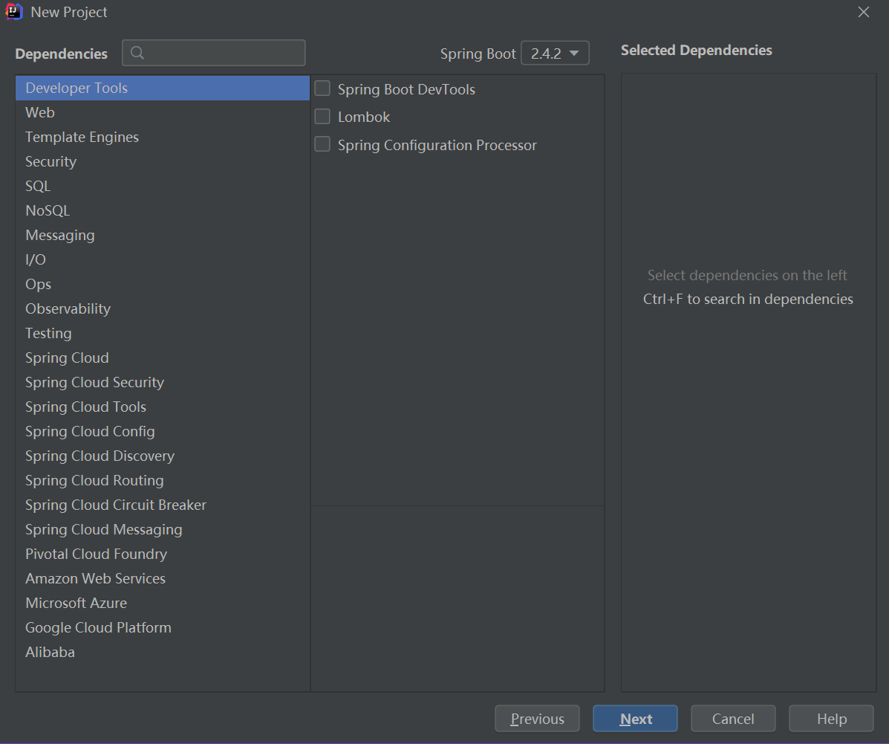

# 4.	SpringBoot开发技巧

## 4.1	debug

在开发中，有时我们需要知道导入的依赖是否由SpringBoot自动配置了。

通常，引入场景对应的自动配置一般都会生效。

为了验证，我们可以在application.properties配置文件中添加配置：

```properties
debug=true
```

此时我们可以在控制台中查看哪些配置生效了，哪些配置没有生效以及没有生效的原因：


## 4.2	修改组件

1.参照官方文档修改配置文件对应的配置项的值：https://docs.spring.io/spring-boot/docs/current/reference/html/appendix-application-properties.html#common-application-properties

2.使用@Bean和@Component注解自定义组件

3.使用自定义器Customizer


## 4.3	Lombok

Lombok能通过注解的方式，在编译时自动为属性生成构造器、getter/setter、equals、hashcode、toString方法，简化了JavaBean的开发

### 4.3.1	配置Lombok

1.引入依赖：

```xml
<dependency>
	<groupId>org.projectlombok</groupId>
	<artifactId>lombok</artifactId>
</dependency>
```

2.安装IDEA插件Lombok：

在IDEA工具栏选择File-Settings打开设置，选择Plugins，搜索Lombok并安装：


这样，JavaBean就可以使用注解来替代原来的Getter/Setter方法、ToString方法等：

```java
@ToString//自动生成ToString方法
@Data//自动生成setter/getter、equals、canEqual、hashCode、toString方法，如为final属性，则不会为该属性生成setter方法。
@AllArgsConstructor//全参构造器
@NoArgsConstructor//无参构造器
@EqualsAndHashCode//重写equals和hashCode方法
@ConfigurationProperties(prefix = "myuser")
public class User {
    private String name;
    private Integer age;
}
```

另外，在控制器类上，还可以添加@Slf4j注解，自动注入日志类，可以随时将日志输出到控制台中，方便调试：

```java
@Slf4j
@RestController
public class HelloController {
    @Autowired
    private User user;
    
    @RequestMapping("/user")
    public User user(){
        log.warn("正在处理user请求");
        return user;
    }
}
```

```properties
2021-02-02 16:36:08.290  WARN 13148 --- [nio-8080-exec-1] c.e.boot.controller.HelloController      : 正在处理user请求
```

其他Lombok的使用及优缺点可见其他人的文章：https://www.cnblogs.com/heyonggang/p/8638374.html


## 4.4	dev-tools

dev-tools是SpringBoot提供的热更新工具，使用Ctrl+F9进行热更新

### 4.4.1	引入依赖

```xml
<dependency>
    <groupId>org.springframework.boot</groupId>
    <artifactId>spring-boot-devtools</artifactId>
    <optional>true</optional>
</dependency>
```


## 4.5	Spring Initailizr

**Spring Initailizr**是SpringBoot项目的初始化向导，要使用它只需要在创建新项目时选择Spring Initailizr：

根据需要选择设置：


根据需求选择开发场景：



选择完成后，就可以得到一份能直接运行的项目：

