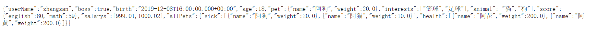

# 5.	SpringBoot配置文件

## 5.1	YAML

> *YAML*是"YAML Ain't a Markup Language"（YAML不是一种[标记语言](https://baike.baidu.com/item/标记语言)）的[递归缩写](https://baike.baidu.com/item/递归缩写)。在开发的这种语言时，*YAML* 的意思其实是："Yet Another Markup Language"（仍是一种[标记语言](https://baike.baidu.com/item/标记语言)），但为了强调这种语言**以数据为中心**，而不是以标记语言为重点，而用反向缩略语重命名。


### 5.1.1	YAML基本语法

1.YAML使用键值对形式表示数据，格式为Key: Value，**注意冒号后有一个空格**

2.大小写敏感，即区分大小写

3.使用缩进表示层级关系

4.缩进不允许使用Tab，只能使用空格

5.缩进空格数不重要，但要保证同层级左对齐

6.用#表示注释

7.单引号''和双引号""分别表示字符串中内容会被转义/不转义


### 5.1.2	YAML数据类型

- 字面量：单个的、不可再分的值。date、boolean、string、number、null

```yaml
k: v
```

- 对象：键值对的集合。map、hash、set、object 

```yaml
行内写法：  k: {k1:v1,k2:v2,k3:v3}
#或
k: 
  k1: v1
  k2: v2
  k3: v3
```

- 数组：一组按次序排列的值。array、list、queue

```yaml
行内写法：  k: [v1,v2,v3]
#或者
k:
 - v1
 - v2
 - v3
#-和value之间也有空格
```


### 5.1.3	使用YAML为组件赋值

创建两个测试类Person和Pet：

```java
@ConfigurationProperties(prefix = "person")
@Component
@Data
public class Person {
    private String userName;
    private Boolean boss;
    private Date birth;
    private Integer age;
    private Pet pet;
    private String[] interests;
    private List<String> animal;
    private Map<String, Object> score;
    private Set<Double> salarys;
    private Map<String, List<Pet>> allPets;
}

@Data
public class Pet {
    private String name;
    private Double weight;
}
```

创建配置文件application.yaml或application.yml，添加测试数据：

```yaml
person:
  userName: zhangsan
  boss: true
  birth: 2019/12/09
  age: 18
  interests: [篮球,足球]
  animal:
    - 猫
    - 狗
  score: {english: 80,math: 59}
  salarys:
    - 999.01
    - 1000.02
  pet:
    name: 阿狗
    weight: 20.00
  allPets:
    sick:
      - {name: 阿狗,weight: 20.00}
      - name: 阿猫
        weight: 10.00
    health:
      - {name: 阿花,weight: 200.00}
      - {name: 阿黄,weight: 200.00}
```

创建控制器类HelloController，测试组件是否在容器中：

```java
@RestController
public class HelloController {
    @Autowired
    private Person person;

    @RequestMapping("/person")
    public Person person(){
        return person;
    }
}
```

运行程序：




**要注意的是，如果application.properties和application.yml中同时对一条属性赋值，则优先使用.properties配置文件中的值**