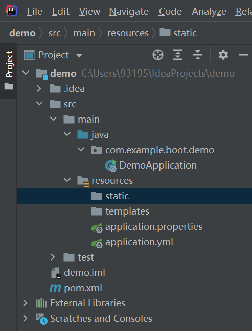
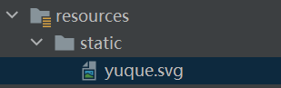
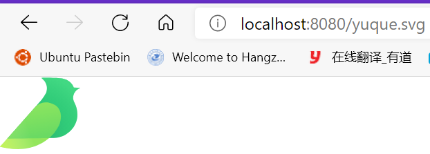
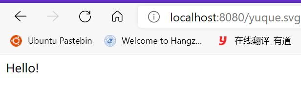
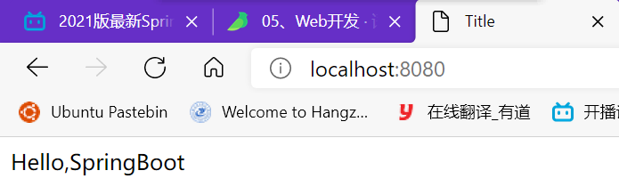
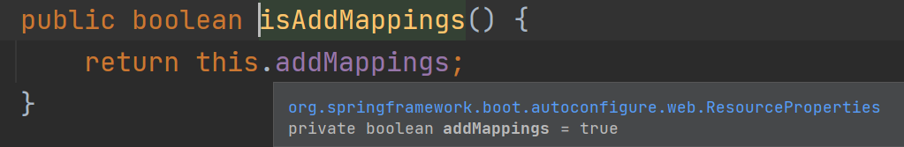
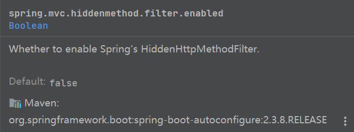
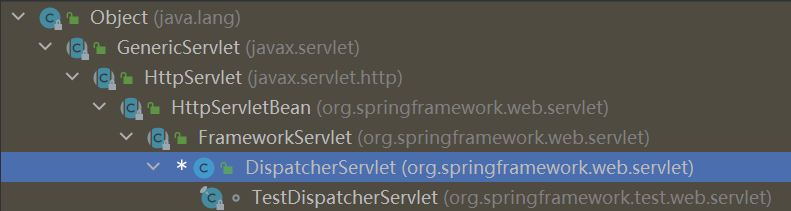

## 6.1	SpringMVC自动配置概览

Spring Boot provides auto-configuration for Spring MVC that **works well with most applications.(大多场景我们都无需自定义配置)**

The auto-configuration adds the following features on top of Spring’s defaults:

- Inclusion of `ContentNegotiatingViewResolver` and `BeanNameViewResolver` beans.

- - 内容协商视图解析器和BeanName视图解析器

- Support for serving static resources, including support for WebJars (covered [later in this document](https://docs.spring.io/spring-boot/docs/current/reference/html/spring-boot-features.html#boot-features-spring-mvc-static-content))).

- - 静态资源（包括webjars）

- Automatic registration of `Converter`, `GenericConverter`, and `Formatter` beans.

- - 自动注册 `Converter，GenericConverter，Formatter `

- Support for `HttpMessageConverters` (covered [later in this document](https://docs.spring.io/spring-boot/docs/current/reference/html/spring-boot-features.html#boot-features-spring-mvc-message-converters)).

- - 支持 `HttpMessageConverters` （后来我们配合内容协商理解原理）

- Automatic registration of `MessageCodesResolver` (covered [later in this document](https://docs.spring.io/spring-boot/docs/current/reference/html/spring-boot-features.html#boot-features-spring-message-codes)).

- - 自动注册 `MessageCodesResolver` （国际化用）

- Static `index.html` support.

- - 静态index.html 页支持

- Custom `Favicon` support (covered [later in this document](https://docs.spring.io/spring-boot/docs/current/reference/html/spring-boot-features.html#boot-features-spring-mvc-favicon)).

- - 自定义 `Favicon`  

- Automatic use of a `ConfigurableWebBindingInitializer` bean (covered [later in this document](https://docs.spring.io/spring-boot/docs/current/reference/html/spring-boot-features.html#boot-features-spring-mvc-web-binding-initializer)).

- - 自动使用 `ConfigurableWebBindingInitializer` ，（DataBinder负责将请求数据绑定到JavaBean上）

> If you want to keep those Spring Boot MVC customizations and make more [MVC customizations](https://docs.spring.io/spring/docs/5.2.9.RELEASE/spring-framework-reference/web.html#mvc) (interceptors, formatters, view controllers, and other features), you can add your own `@Configuration` class of type `WebMvcConfigurer` but **without** `@EnableWebMvc`.
>
> **不用@EnableWebMvc注解。使用** **`@Configuration`** **+** **`WebMvcConfigurer`** **自定义规则**


> If you want to provide custom instances of `RequestMappingHandlerMapping`, `RequestMappingHandlerAdapter`, or `ExceptionHandlerExceptionResolver`, and still keep the Spring Boot MVC customizations, you can declare a bean of type `WebMvcRegistrations` and use it to provide custom instances of those components.
>
> **声明** **`WebMvcRegistrations`** **改变默认底层组件**


> If you want to take complete control of Spring MVC, you can add your own `@Configuration` annotated with `@EnableWebMvc`, or alternatively add your own `@Configuration`-annotated `DelegatingWebMvcConfiguration` as described in the Javadoc of `@EnableWebMvc`.
>
> **使用** **`@EnableWebMvc+@Configuration+DelegatingWebMvcConfiguration 全面接管SpringMVC`**

## 

## 6.2	SpringMVC功能分析

### 6.2.1	静态资源访问

官方文档：https://docs.spring.io/spring-boot/docs/2.3.8.RELEASE/reference/html/spring-boot-features.html#boot-features-spring-mvc-static-content

> By default, Spring Boot serves static content from a directory called `/static` (or `/public` or `/resources` or `/META-INF/resources`) in the classpath or from the root of the `ServletContext`. 

SpringBoot默认支持访问类路径下/static` (or `/public` or `/resources` or `/META-INF/resources 目录下的静态资源

若我们使用了Spring Initilizr创建项目，则项目会自动为我们在resources目录下创建static目录，此时我们只需把静态资源放在static目录下就可以访问静态资源了：



将测试静态资源文件放在static目录下：




运行项目，直接访问项目根路径/静态资源名：




#### 6.2.1.1	静态资源访问原理

创建控制器，让控制器响应与静态资源同名的请求：

```java
@RestController
public class HelloController {
    @RequestMapping("/yuque.svg")
    public String handle01(){
        return "Hello!";
    }
}
```

运行程序：



此时，浏览器显示的是控制器处理的请求

在官方文档中提到：

> By default, resources are mapped on `/**`

即静态资源映射/**，当前端控制器收到浏览器发出的请求时，首先在控制器中寻找是否存在能处理当前请求的方法，若有则处理请求，若请求不能处理则交给静态资源处理器，若静态资源处理器能处理请求则显示静态资源，若不能处理则显示404错误


#### 6.2.1.2	修改静态资源路径前缀

> By default, resources are mapped on `/**`, but you can tune that with the `spring.mvc.static-path-pattern` property. For instance, relocating all resources to `/resources/**` can be achieved as follows:
>
> ```properties
> spring.mvc.static-path-pattern=/resources/**
> ```

在SpringBoot中，静态资源访问默认没有前缀，但我们可以通过修改`spring.mvc.static-path-pattern`来指定其前缀

如在application.yml中指定前缀为/res/**：

```yaml
spring:
  mvc:
    static-path-pattern: /res/**
```

此时静态资源路径为：当前项目根路径 + static-path-pattern + 静态资源名


#### 6.2.1.3	修改默认静态资源路径

> You can also customize the static resource locations by using the `spring.resources.static-locations` property (replacing the default values with a list of directory locations). The root Servlet context path, `"/"`, is automatically added as a location as well.

SpringBoot中可以通过修改`spring.resources.static-locations` 的值来指定默认静态资源路径：

```yaml
spring:
  resources:
    static-locations: classpath:/test
```


#### 6.2.1.4	访问WebJars资源

**什么是WebJars？**

> WebJars是将客户端（浏览器）资源（JavaScript，Css等）打成jar包文件，以对资源进行统一依赖管理。WebJars的jar包部署在Maven中央仓库上。

因此，我们可以在Maven中将各种前端静态资源作为依赖引入Maven项目：

```xml
<dependency>
    <groupId>org.webjars</groupId>
    <artifactId>jquery</artifactId>
    <version>3.5.1</version>
</dependency>
```

访问地址：[localhost:8080/webjars/**jquery/3.5.1/jquery.js**](localhost:8080/webjars/jquery/3.5.1/jquery.js)  （**后面地址要按照依赖里面的包路径**）


### 6.2.2	欢迎页Welcome Page

> Spring Boot supports both static and templated welcome pages. It first looks for an `index.html` file in the configured static content locations. If one is not found, it then looks for an `index` template. If either is found, it is automatically used as the welcome page of the application.

SpringBoot支持两种格式的欢迎页：静态欢迎页和模板欢迎页。SpringBoot首先会寻找index.html文件作为欢迎页，若没找到则寻找index模板作为欢迎页。


#### 6.2.2.1	静态欢迎页

在static文件夹下创建静态欢迎页index.html：

```html
<!DOCTYPE html>
<html lang="en">
<head>
    <meta charset="UTF-8">
    <title>Title</title>
</head>
<body>
Hello,SpringBoot
</body>
</html>
```




**注意：静态欢迎页可以配置静态资源路径，但是不可以配置静态资源的访问前缀。否则导致 index.html不能被默认访问**


### 6.2.3	自定义图标Custom Favicon

> As with other static resources, Spring Boot looks for a `favicon.ico` in the configured static content locations. If such a file is present, it is automatically used as the favicon of the application.

SpringBoot会将名为`favicon.ico` 的图标文件作为项目的图标，因此要为项目添加图标只需将图标命名为`favicon.ico` 并放入项目即可


## 6.3	静态资源配置原理

SpringBoot启动时默认加载各自动配置类AutoConfiguration

与SpringMVC自动配置有关的配置类：WebMvcAutoConfiguration：

```java
@Configuration(//声明配置类
    proxyBeanMethods = false
)
@ConditionalOnWebApplication(//若为Web应用且类型为Servlet则进行注入
    type = Type.SERVLET
)
//当有原生Servlet和SpringMVC时注入
@ConditionalOnClass({Servlet.class, DispatcherServlet.class, WebMvcConfigurer.class})
//当没有WebMvcConfigurationSupport类时注入，即全面接管SpringMVC，进行自动配置
@ConditionalOnMissingBean({WebMvcConfigurationSupport.class})
@AutoConfigureOrder(-2147483638)
@AutoConfigureAfter({DispatcherServletAutoConfiguration.class, TaskExecutionAutoConfiguration.class, ValidationAutoConfiguration.class})
public class WebMvcAutoConfiguration {
```

其中有子类WebMvcAutoConfigurationAdapte：

```java
@Configuration(
    proxyBeanMethods = false
)
@Import({WebMvcAutoConfiguration.EnableWebMvcConfiguration.class})
@EnableConfigurationProperties({WebMvcProperties.class, ResourceProperties.class})
//配置文件的相关属性与配置类进行了绑定，其中WebMvcProperties相当于spring.mvc, ResourceProperties相当于spring.resources
@Order(0)
public static class WebMvcAutoConfigurationAdapter implements WebMvcConfigurer {
    ...
    
    
    ...
}
```


### 6.3.1	配置类中只有一个有参构造器

```java
//在该配置类中，只有一个有参构造器，这样，有参构造器中所有值都会从容器中确定
//ResourceProperties resourceProperties；获取和spring.resources绑定的所有的值的对象
//WebMvcProperties mvcProperties 获取和spring.mvc绑定的所有的值的对象
//ListableBeanFactory beanFactory Spring的beanFactory
//HttpMessageConverters 找到所有的HttpMessageConverters
//ResourceHandlerRegistrationCustomizer 找到资源处理器的自定义器。
//DispatcherServletPath  
//ServletRegistrationBean   给应用注册Servlet、Filter....
    public WebMvcAutoConfigurationAdapter(WebMvcProperties mvcProperties, ListableBeanFactory beanFactory, ObjectProvider<HttpMessageConverters> messageConvertersProvider, ObjectProvider<WebMvcAutoConfiguration.ResourceHandlerRegistrationCustomizer> resourceHandlerRegistrationCustomizerProvider, ObjectProvider<DispatcherServletPath> dispatcherServletPath, ObjectProvider<ServletRegistrationBean<?>> servletRegistrations) {
            this.mvcProperties = mvcProperties;
            this.beanFactory = beanFactory;
            this.messageConvertersProvider = messageConvertersProvider;
            this.resourceHandlerRegistrationCustomizer = (WebMvcAutoConfiguration.ResourceHandlerRegistrationCustomizer)resourceHandlerRegistrationCustomizerProvider.getIfAvailable();
            this.dispatcherServletPath = dispatcherServletPath;
            this.servletRegistrations = servletRegistrations;
    }
```


### 6.3.2	资源处理规则

```java
protected void addResourceHandlers(ResourceHandlerRegistry registry) {
    super.addResourceHandlers(registry);
    //1.判断能否访问静态资源
    if (!this.resourceProperties.isAddMappings()) {
        logger.debug("Default resource handling disabled");
        return;
    }
    //添加有关webjars的资源处理器
    addResourceHandler(registry, "/webjars/**", "classpath:/META-INF/resources/webjars/");
    //添加静态资源处理器
    addResourceHandler(registry, this.mvcProperties.getStaticPathPattern(),/*映射模式*/
                       this.resourceProperties.getStaticLocations());/*资源路径*/
}
```

注释1：该方法对应spring.resources.add-mappings，默认值为true，若改为false则将禁用静态资源


### 6.3.3	欢迎页处理规则

HandlerMapping：处理器映射，其中保存了每个处理器能处理哪些请求

```java
@Bean
public WelcomePageHandlerMapping welcomePageHandlerMapping(ApplicationContext applicationContext,
      FormattingConversionService mvcConversionService, ResourceUrlProvider mvcResourceUrlProvider) {
   WelcomePageHandlerMapping welcomePageHandlerMapping = new WelcomePageHandlerMapping(
         new TemplateAvailabilityProviders(applicationContext), applicationContext, getWelcomePage(),
         this.mvcProperties.getStaticPathPattern());
   welcomePageHandlerMapping.setInterceptors(getInterceptors(mvcConversionService, mvcResourceUrlProvider));
   welcomePageHandlerMapping.setCorsConfigurations(getCorsConfigurations());
   return welcomePageHandlerMapping;
}

//WelcomePageHandlerMapping的构造函数
WelcomePageHandlerMapping(TemplateAvailabilityProviders templateAvailabilityProviders,
			ApplicationContext applicationContext, Resource welcomePage, String staticPathPattern) {
    //要使用欢迎页功能，要存在欢迎页且必须使用/**
    if (welcomePage != null && "/**".equals(staticPathPattern)) {
        logger.info("Adding welcome page: " + welcomePage);
        setRootViewName("forward:index.html");
    }
    //否则调用控制器 处理/index请求
    else if (welcomeTemplateExists(templateAvailabilityProviders, applicationContext)) {
        logger.info("Adding welcome page template: index");
        setRootViewName("index");
    }
}
```


### 6.3.4	Favicon处理规则

浏览器会发送/favicon.ico请求获取图标，整个session期间不再获取


## 6.4	请求参数处理

### 6.4.1	请求映射

1.通常我们使用@RequestMapping注解处理请求

2.SpringBoot支持REST风格的请求，使用HTTP的请求方式表示对资源的操作

*以前：**/getUser*  *获取用户*   */deleteUser* *删除用户*   */editUser*  *修改用户*    */saveUser* *保存用户*

*现在： /user*   *GET-**获取用户*   *DELETE-**删除用户*   *PUT-**修改用户*    *POST-**保存用户*


处理REST风格请求的核心是HiddenHttpMethodFilter

在控制器中添加测试方法：

```java
@RequestMapping(value = "/user",method = RequestMethod.GET)
public String getUser(){
    return "GET-张三";
}

@RequestMapping(value = "/user",method = RequestMethod.POST)
public String saveUser(){
    return "POST-张三";
}


@RequestMapping(value = "/user",method = RequestMethod.PUT)
public String putUser(){
    return "PUT-张三";
}

@RequestMapping(value = "/user",method = RequestMethod.DELETE)
public String deleteUser(){
    return "DELETE-张三";
}
```

#### 6.4.1.1	form表单发送GET、POST请求

要发送GET和POST请求，只需要直接在form表单的method属性使用get和post即可：

```html
<form action="/user" method="get">
    <input type="submit" value="GET-张三"/>
</form>

<form action="/user" method="post">
    <input type="submit" value="POST-张三"/>
</form>
```


#### 6.4.1.2	form表单发送DELETE、PUT请求

form表单的method属性不能使用delete和put值，因此不能直接指定

在HiddenHttpMethodFilter源码中：

```java
public class HiddenHttpMethodFilter extends OncePerRequestFilter {
    private static final List<String> ALLOWED_METHODS;
    public static final String DEFAULT_METHOD_PARAM = "_method";
    private String methodParam = "_method";
    
	...
        
    protected void doFilterInternal(HttpServletRequest request, HttpServletResponse response, FilterChain filterChain) throws ServletException, IOException {
        HttpServletRequest requestToUse = request;
        //method必须为POST
        if ("POST".equals(request.getMethod()) && request.getAttribute("javax.servlet.error.exception") == null) {
            String paramValue = request.getParameter(this.methodParam);
            if (StringUtils.hasLength(paramValue)) {
                String method = paramValue.toUpperCase(Locale.ENGLISH);
                if (ALLOWED_METHODS.contains(method)) {
                    requestToUse = new HiddenHttpMethodFilter.HttpMethodRequestWrapper(request, method);
                }
            }
        }

        filterChain.doFilter((ServletRequest)requestToUse, response);
    }
    
    ...
        
}
```

可以看到，HiddenHttpMethodFilter会处理名为`_method`的对象，并将其作为请求类型，因此我们只需在form表单中添加一个名为`_method`的标签：

```html
<form action="/user" method="post">
    <input type="hidden" name="_method" value="DELETE">
    <input type="submit" value="DELETE-张三"/>
</form>

<form action="/user" method="post">
    <input type="hidden" name="_method" value="PUT">
    <input type="submit" value="PUT-张三"/>
</form>
```

测试程序，此时发送的请求仍为POST，这是因为在SpringBoot的自动注入时：

```java
@Bean
//当容器中不存在HiddenHttpMethodFilter时注入
@ConditionalOnMissingBean(HiddenHttpMethodFilter.class)
//当有配置spring.mvc.hiddenmethod.filter时注入，若不匹配则不注入
@ConditionalOnProperty(prefix = "spring.mvc.hiddenmethod.filter", name = "enabled", matchIfMissing = false)
public OrderedHiddenHttpMethodFilter hiddenHttpMethodFilter() {
	return new OrderedHiddenHttpMethodFilter();
}
```

而在SpringBoot中，该配置默认值为false，即默认是不开启的：



因此要使用REST风格的请求就要手动开启该配置：

```yaml
spring:
  mvc:
    hiddenmethod:
      filter:
        enabled: true
```

在手动开启配置后，就可以通过_method标签发送DELETE和PUT类型请求了


#### 6.4.1.3	REST风格请求的实现原理

```java
protected void doFilterInternal(HttpServletRequest request, HttpServletResponse response, FilterChain filterChain) throws ServletException, IOException {
        HttpServletRequest requestToUse = request;
        //1.判断请求是否正确，且请求类型应为POST类型
        if ("POST".equals(request.getMethod()) && request.getAttribute("javax.servlet.error.exception") == null) {
            //2.获取_method的值，兼容以下请求:PUT,DELETE,PATCH
            String paramValue = request.getParameter(this.methodParam);
            if (StringUtils.hasLength(paramValue)) {//paramValue变量值非空
                String method = paramValue.toUpperCase(Locale.ENGLISH);//将类型名转为大写
                //3.原生request（post），包装模式requestWrapper重写了getMethod方法，返回的是传入的值,即_method的值
                if (ALLOWED_METHODS.contains(method)) {
                    requestToUse = new HiddenHttpMethodFilter.HttpMethodRequestWrapper(request, method);
                }
            }
        }
		//4.过滤器链放行的时候用wrapper。以后的方法调用getMethod是调用requestWrapper的,这样我们的请求类型method就转为了_method的值
        filterChain.doFilter((ServletRequest)requestToUse, response);
    }
```

当表单提交使用REST风格请求时，提交的表单中含有_method

请求被HiddenHttpMethodFilter拦截，判断：

- 请求是否正确，且请求类型应为POST类型

  - 获取_method的值，兼容以下请求；**PUT**.**DELETE**.**PATCH**

  - **原生request（post），包装模式requestWrapper重写了getMethod方法，返回的是传入的值，即_method的值**

  - **过滤器链放行的时候用wrapper。以后的方法调用getMethod是调用requestWrapper的，这样我们的请求类型method就转为了_method的值。**

    

#### 6.4.1.4	使用工具发送REST风格请求

如PostMan，直接发送Put、Delete等方式请求，无需Filter


#### 6.4.1.5	REST风格请求响应注解

在SpringBoot中，可以使用@GetMapping、@PostMapping、@PutMapping、@DeleteMapping和@PatchMapping分别对应@RequestMapping中的各种类型请求，其本质是@RequestMapping对不同类型请求的封装

```java
@GetMapping("/user")
public String getUser(){
    return "GET-张三";
}

@PostMapping("/user")
public String saveUser(){
    return "POST-张三";
}


@PutMapping("/user")
public String putUser(){
    return "PUT-张三";
}

@DeleteMapping("/user")
public String deleteUser(){
    return "DELETE-张三";
}

@PatchMapping("/user")
public String patchUser(){
    return "PATCH-张三";
}
```


#### 6.4.1.6	替换REST风格methodParam默认值_method

要替换methodParam默认值_method，只需要自定义一个HiddenHttpMethodFilter：

创建配置类WebConfig，创建自定义HiddenHttpMethodFilter：

```java
@Configuration
public class WebConfig {
    @Bean
    //自定义HiddenHttpMethodFilter，替换SpringBoot自动配置的HiddenHttpMethodFilter
    public HiddenHttpMethodFilter hiddenHttpMethodFilter(){
        HiddenHttpMethodFilter methodFilter = new HiddenHttpMethodFilter();
        //设置methodParam的值为_m，此时默认值从_method变为了_m
        methodFilter.setMethodParam("_m");
        return methodFilter;
    }
}
```


#### 6.4.1.7	请求映射原理



DispatcherServlet本质上是一个Servlet，因此它应当也有doGet和doPost方法

在其父类FrameworkServlet中有doGet和doPost方法的实现：

```java
protected final void doGet(HttpServletRequest request, HttpServletResponse response) throws ServletException, IOException {
    this.processRequest(request, response);
}

protected final void doPost(HttpServletRequest request, HttpServletResponse response) throws ServletException, IOException {
    this.processRequest(request, response);
}
```

其中doGet和doPost方法都直接调用了processRequest方法，因此processRequest方法中应当有SpringMVC处理请求的核心方法：

```java
protected final void processRequest(HttpServletRequest request, HttpServletResponse response) throws ServletException, IOException {
    
	...
        
    try {
        this.doService(request, response);
    } catch (IOException | ServletException var16) {
        
    ...
}
```

processRequest其中又调用了doService方法，因此我们主要关注doService方法，而在FrameworkServlet中doService方法是一个抽象方法，因此我们需要在DispatcherServlet中找到该方法的实现：

```java
protected void doService(HttpServletRequest request, HttpServletResponse response) throws Exception {
    
    ...

    try {
        this.doDispatch(request, response);
    } finally {
    
    ...

}
```

在doService中又调用了doDispatch方法，再转到doDispatch方法：

```java
protected void doDispatch(HttpServletRequest request, HttpServletResponse response) throws Exception {
		HttpServletRequest processedRequest = request;
		HandlerExecutionChain mappedHandler = null;
		boolean multipartRequestParsed = false;

		WebAsyncManager asyncManager = WebAsyncUtils.getAsyncManager(request);

		try {
			ModelAndView mv = null;
			Exception dispatchException = null;

			try {
                //检查请求是否为文件上传
				processedRequest = checkMultipart(request);
				multipartRequestParsed = (processedRequest != request);

				// 为当前请求决定使用哪个处理器
                //SpringMVC从HandlerMappings处理器映射中寻找能处理请求的处理器
                //其中第一个处理器映射为RequestMappingHandlerMapping，它存储了所有@RequestMapping对应的请求，SpringMVC会将请求与映射一一匹配，找到合适的处理器
                //当RequestMappingHandlerMapping有多个能处理请求的方法时会报错，因为SpringMVC规定同一个请求只能有一个响应方法
                //若当前HandlerMapping中找不到能响应请求的处理器就切换到下一个HandlerMapping
                
				mappedHandler = getHandler(processedRequest);
                //若没有找到能处理当前请求的处理器就返回
				if (mappedHandler == null) {
					noHandlerFound(processedRequest, response);
					return;
				}

				//为当前请求找到合适的处理器适配器
				HandlerAdapter ha = getHandlerAdapter(mappedHandler.getHandler());

				// Process last-modified header, if supported by the handler.
				String method = request.getMethod();
				boolean isGet = "GET".equals(method);
				if (isGet || "HEAD".equals(method)) {
					long lastModified = ha.getLastModified(request, mappedHandler.getHandler());
					if (new ServletWebRequest(request, response).checkNotModified(lastModified) && isGet) {
						return;
					}
				}

				if (!mappedHandler.applyPreHandle(processedRequest, response)) {
					return;
				}

				//真正执行处理器，执行目标方法
				mv = ha.handle(processedRequest, response, mappedHandler.getHandler());

				if (asyncManager.isConcurrentHandlingStarted()) {
					return;
				}

				applyDefaultViewName(processedRequest, mv);
				mappedHandler.applyPostHandle(processedRequest, response, mv);
			}
			catch (Exception ex) {
				dispatchException = ex;
			}
			catch (Throwable err) {
				// As of 4.3, we're processing Errors thrown from handler methods as well,
				// making them available for @ExceptionHandler methods and other scenarios.
				dispatchException = new NestedServletException("Handler dispatch failed", err);
			}
			processDispatchResult(processedRequest, response, mappedHandler, mv, dispatchException);
		}
		catch (Exception ex) {
			triggerAfterCompletion(processedRequest, response, mappedHandler, ex);
		}
		catch (Throwable err) {
			triggerAfterCompletion(processedRequest, response, mappedHandler,
					new NestedServletException("Handler processing failed", err));
		}
		finally {
			if (asyncManager.isConcurrentHandlingStarted()) {
				// Instead of postHandle and afterCompletion
				if (mappedHandler != null) {
					mappedHandler.applyAfterConcurrentHandlingStarted(processedRequest, response);
				}
			}
			else {
				// Clean up any resources used by a multipart request.
				if (multipartRequestParsed) {
					cleanupMultipart(processedRequest);
				}
			}
		}
	}
```


**RequestMappingHandlerMapping**：保存了所有@RequestMapping 和handler的映射规则。

所有的请求映射都在HandlerMapping中。

- SpringBoot自动配置欢迎页的 WelcomePageHandlerMapping 。访问 /能访问到index.html；
- SpringBoot自动配置了默认 的 RequestMappingHandlerMapping
- 请求进来，挨个尝试所有的HandlerMapping看是否有请求信息。

- - 如果有就找到这个请求对应的handler
  - 如果没有就是下一个 HandlerMapping

- 我们需要一些自定义的映射处理，我们也可以自己给容器中放**HandlerMapping**。自定义 **HandlerMapping**


## 6.5	普通参数与基本注解

### 6.5.1	注解

详见SpringMVC部分笔记，这里只作简单演示

@PathVariable、@RequestHeader、@ModelAttribute、@RequestParam、@MatrixVariable、@CookieValue、@RequestBody

```java
@RestController
public class ParameterTestController {


    //1.@PathVariable注解能从路径中获取对应信息，另外该注解还能自动将所有路径中的信息封装到<String,String>格式的Map对象中
    //  car/2/owner/zhangsan
    
    //2.@RequestHeader可以获取请求头，注解中的值可以获取请求头中的对应信息，类似的，该注解也能自动将所有请求头信息封装到<String,String>格式的Map对象中
    
    //3.@RequestParam可以获取请求参数，形如car/3/owner/zhangsan?age=18&interest=basketball,其中age和interest就可以作为请求参数获取，同时该注解也能自动将所有请求参数信息封装到<String,String>格式的Map对象中
    
    //4.@CookieValue可以获取到Cookie值，注解中赋值可以获取到特定Cookie的值，该注解还可以把Cookie信息封装到Cookie类型的对象中
    @GetMapping("/car/{id}/owner/{username}")
    public Map<String,Object> getCar(@PathVariable("id") Integer id,
                                     @PathVariable("username") String name,
                                     @PathVariable Map<String,String> pv,
                                     @RequestHeader("User-Agent") String userAgent,
                                     @RequestHeader Map<String,String> header,
                                     @RequestParam("age") Integer age,
                                     @RequestParam("inters") List<String> inters,
                                     @RequestParam Map<String,String> params,
                                     @CookieValue("_ga") String _ga,
                                     @CookieValue("_ga") Cookie cookie){


        Map<String,Object> map = new HashMap<>();

//        map.put("id",id);
//        map.put("name",name);
//        map.put("pv",pv);
//        map.put("userAgent",userAgent);
//        map.put("headers",header);
        map.put("age",age);
        map.put("inters",inters);
        map.put("params",params);
        map.put("_ga",_ga);
        System.out.println(cookie.getName()+"===>"+cookie.getValue());
        return map;
    }

    
	//5.@RequestBody可以将方法返回的数据传到请求体中，该注解也可以加在控制器类上，此时整个控制器类中的所有方法都会将返回的数据传到请求体，我们之前使用的@RestController注解中就包含@Controller和@RequestBody注解
    @PostMapping("/save")
    public Map postMethod(@RequestBody String content){
        Map<String,Object> map = new HashMap<>();
        map.put("content",content);
        return map;
    }
    
    //6.@RequestAttribute可以从Request请求域中以key获取到对应的value
    @RequestMapping("/goto")
    public String gotoPage(HttpServletRequest request){
        request.setAttribute("msg", "测试成功");
        return "success";
    }
    
    @RequestBody
    @RequestMapping("/success")
    public String success(@RequestAttribute("msg") String msg){
        return msg;
    }
    
    //这种方法相当于
    public String success(HttpServletRequest request){
        String msg = request.getAttribute("msg");
        return msg;
    }


    //7.@MatrixVariable可以从路径中获取矩阵变量
    //1、语法： 请求路径：/cars/sell;low=34;brand=byd,audi,yd
    //其中sell为路径,low、brand为矩阵变量，矩阵变量以分号分割，以K=V形式表示，当一个Key对应多个Value时用逗号分割不同的Value
    
    //2、SpringBoot默认是禁用了矩阵变量的功能
    //原理：SpringMVC中用UrlPathHelper对路径进行解析处理，其中有属性removeSemicolonContent=true，即默认移除URL分号后的内容，即禁用了矩阵变量
    //3、矩阵变量必须有url路径变量才能被解析
    @GetMapping("/cars/{path}")
    public Map carsSell(@MatrixVariable("low") Integer low,
                        @MatrixVariable("brand") List<String> brand,
                        @PathVariable("path") String path){
        Map<String,Object> map = new HashMap<>();

        map.put("low",low);
        map.put("brand",brand);
        map.put("path",path);
        return map;
    }

    // /boss/1;age=20/2;age=10
	//当使用矩阵变量时出现了同名矩阵变量，此时可以在(@MatrixVariable注解中的pathVar属性注明该矩阵变量来自哪个路径变量
    @GetMapping("/boss/{bossId}/{empId}")
    public Map boss(@MatrixVariable(value = "age",pathVar = "bossId") Integer bossAge,
                    @MatrixVariable(value = "age",pathVar = "empId") Integer empAge){
        Map<String,Object> map = new HashMap<>();

        map.put("bossAge",bossAge);
        map.put("empAge",empAge);
        return map;

    }

}
```


#### 6.5.1.1	启用矩阵变量功能

要启用矩阵变量功能，就要修改SpringMVC规则，则不能完全使用SpringBoot自动配置的SpringMVC

在官方文档中：

> If you want to keep those Spring Boot MVC customizations and make more [MVC customizations](https://docs.spring.io/spring/docs/5.2.9.RELEASE/spring-framework-reference/web.html#mvc) (interceptors, formatters, view controllers, and other features), you can add your own `@Configuration` class of type `WebMvcConfigurer` but **without** `@EnableWebMvc`.
>
> 要自定义SpringBoot的MVC规则，
>
> **不用@EnableWebMvc注解。使用** **`@Configuration`** **+** **`WebMvcConfigurer`** **自定义规则**

**`WebMvcConfigurer`**是SpringMVC的规则配置器，它的属性removeSemicolonContent移除分号内容默认值为true，因此要启用矩阵变量功能，就要自己实现WebMvcConfigurer接口：

在JDK1.8后，接口有默认实现，因此我们无需对所有方法进行实现，只需要修改removeSemicolonContent属性的默认值：

```java
@Configuration
public class WebConfig implements WebMvcConfigurer {
    @Override
    public void configurePathMatch(PathMatchConfigurer configurer){
        UrlPathHelper urlPathHelper = new UrlPathHelper();
        //不移除分号后内容
        urlPathHelper.setRemoveSemicolonContent(false);
        configurer.setUrlPathHelper(urlPathHelper);
    }
}
```


除了这种方法，我们还可以在配置类中直接返回一个WebMvcConfigurer类型的Bean：

```java
@Configuration
public class WebConfig{
    @Bean
    public WebMvcConfigurer getWebMvcConfigurer(){
        return new WebMvcConfigurer() {
            @Override
            public void configurePathMatch(PathMatchConfigurer configurer){
                UrlPathHelper urlPathHelper = new UrlPathHelper();
                //不移除分号后内容
                urlPathHelper.setRemoveSemicolonContent(false);
                configurer.setUrlPathHelper(urlPathHelper);
            }
        };
    }
}
```


### 6.5.2	参数解析原理

#### 6.5.2.1	处理器适配器HandlerAdapter

- HandlerMapping中找到能处理请求的Handler（Controller.method()）

- 为当前Handler 找一个适配器 HandlerAdapter； **RequestMappingHandlerAdapter**

- 适配器执行目标方法并确定方法参数的每一个值

  

  

0 - 支持方法上标注@RequestMapping 

1 - 支持函数式编程的


#### 6.5.2.2	参数解析器HandlerMethodArgumentResolver

在处理器适配器HandlerAdapter中调用了参数解析器HandlerMethodArgumentResolver

确定将要执行的目标方法的每一个参数的值是什么;

SpringMVC目标方法能写多少种参数类型。取决于参数解析器


- 当前解析器是否支持解析这种参数

- 支持就调用 resolveArgument


#### 6.5.2.3	返回值处理器ReturnValueHandler

返回值处理器决定了处理器中响应请求的方法可以返回的数据类型：


#### 6.5.2.4	确定目标方法参数值

```java
============InvocableHandlerMethod==========================
protected Object[] getMethodArgumentValues(NativeWebRequest request, @Nullable ModelAndViewContainer mavContainer,Object... providedArgs) throws Exception {
		//获取方法参数
		MethodParameter[] parameters = getMethodParameters();
    	//判断方法有无参数，若无参数则直接返回
		if (ObjectUtils.isEmpty(parameters)) {
			return EMPTY_ARGS;
		}
		
		Object[] args = new Object[parameters.length];
		for (int i = 0; i < parameters.length; i++) {
            //循环逐个获取方法参数
			MethodParameter parameter = parameters[i];
            //使用参数名发现器parameterNameDiscoverer获取参数名
			parameter.initParameterNameDiscovery(this.parameterNameDiscoverer);
            //将传入的参数赋值给方法参数
			args[i] = findProvidedArgument(parameter, providedArgs);
			if (args[i] != null) {
				continue;
			}
            //判断解析器能否支持当前参数类型，详见下方代码块
			if (!this.resolvers.supportsParameter(parameter)) {
				throw new IllegalStateException(formatArgumentError(parameter, "No suitable resolver"));
			}
			try {
                //参数解析器调用resolveArgument方法解析参数，进行数据绑定
				args[i] = this.resolvers.resolveArgument(parameter, mavContainer, request, this.dataBinderFactory);
			}
			catch (Exception ex) {
				// Leave stack trace for later, exception may actually be resolved and handled...
				if (logger.isDebugEnabled()) {
					String exMsg = ex.getMessage();
					if (exMsg != null && !exMsg.contains(parameter.getExecutable().toGenericString())) {
						logger.debug(formatArgumentError(parameter, exMsg));
					}
				}
				throw ex;
			}
		}
		return args;
	}
```


```java
@Nullable
    private HandlerMethodArgumentResolver getArgumentResolver(MethodParameter parameter) {
        HandlerMethodArgumentResolver result = this.argumentResolverCache.get(parameter);
        if (result == null) {
            //遍历参数解析器，逐个判断哪个解析器能解析这个参数
            for (HandlerMethodArgumentResolver resolver : this.argumentResolvers) {
                if (resolver.supportsParameter(parameter)) {
                    result = resolver;
                    //将参数解析器加入缓存，加快参数解析速度
                    this.argumentResolverCache.put(parameter, result);
                    break;
                }
            }
        }
        return result;
    }
```


### 6.5.3	Servlet API

WebRequest、ServletRequest、MultipartRequest、 HttpSession、javax.servlet.http.PushBuilder、Principal、InputStream、Reader、HttpMethod、Locale、TimeZone、ZoneId

这些参数在SpringMVC中由**ServletRequestMethodArgumentResolver**来解析获取和处理


### 6.5.4	复杂参数

**Map**、**Model（map、model里面的数据会被放在request请求域中）**、Errors/BindingResult、**RedirectAttributes（ 重定向携带数据）**、**ServletResponse（response）**、SessionStatus、UriComponentsBuilder、ServletUriComponentsBuilder


#### 6.5.4.1	Map和Model

在SpringMVC中，控制器响应方法中的Model和Map中的存储的K-V最终都会被放在Request请求域中，效果等同于放在HttpServletRequest对象中


其实质是对Map和Model类型的参数，会返回mavContainer(**ModelAndView Container 模型和视图容器**)对象的getModel()方法，获取BindingAwareModelMap对象，它既是Model也是Map，它将Map和Model类型参数存储的数据全部存放到BindingAwareModelMap对象中，而该对象就存放在mavContainer中


当目标方法执行完成后，此时所有数据都存放在mavContainer中，包括要去的页面地址(即视图名View)和Model数据，再将mavContainer封装到ModelAndView对象中去，mavContainer中BindingAwareModelMap存放的K-V数据在ModelAndView对象中存放在ModelMap对象中

在转发时，视图解析器InternalViewResolver调用了exposeModelAsRequestAttribute方法，将ModelAndView中的ModelMap暴露出来，作为Request请求域的属性


### 6.5.5	数据绑定

在SpringMVC中，表单提交的数据可以自动封装到同名的方法参数中，还可以封装到POJO对象中

#### 6.5.5.1	POJO对象封装

在SpringMVC中，ServletModelAttributeMethodProcessor首先判断封装对象是否为简单类型：

```java
public static boolean isSimpleValueType(Class<?> type) {
		return (Void.class != type && void.class != type &&
				(ClassUtils.isPrimitiveOrWrapper(type) ||
				Enum.class.isAssignableFrom(type) ||
				CharSequence.class.isAssignableFrom(type) ||
				Number.class.isAssignableFrom(type) ||
				Date.class.isAssignableFrom(type) ||
				Temporal.class.isAssignableFrom(type) ||
				URI.class == type ||
				URL.class == type ||
				Locale.class == type ||
				Class.class == type));
	}
```

```java
@Override
@Nullable
public final Object resolveArgument(MethodParameter parameter, @Nullable ModelAndViewContainer mavContainer,NativeWebRequest webRequest, @Nullable WebDataBinderFactory binderFactory) throws Exception {

		Assert.state(mavContainer != null, "ModelAttributeMethodProcessor requires ModelAndViewContainer");
		Assert.state(binderFactory != null, "ModelAttributeMethodProcessor requires WebDataBinderFactory");
		//获取参数名
		String name = ModelFactory.getNameForParameter(parameter);
    	//获取@ModelAttribute标注的参数
		ModelAttribute ann = parameter.getParameterAnnotation(ModelAttribute.class);
		if (ann != null) {
			mavContainer.setBinding(name, ann.binding());
		}
    
		Object attribute = null;
		BindingResult bindingResult = null;

		if (mavContainer.containsAttribute(name)) {
			attribute = mavContainer.getModel().get(name);
		}
		else {
			//创建属性实例
			try {
				attribute = createAttribute(name, parameter, binderFactory, webRequest);
			}
			catch (BindException ex) {
				if (isBindExceptionRequired(parameter)) {
					// No BindingResult parameter -> fail with BindException
					throw ex;
				}
				// Otherwise, expose null/empty value and associated BindingResult
				if (parameter.getParameterType() == Optional.class) {
					attribute = Optional.empty();
				}
				bindingResult = ex.getBindingResult();
			}
		}

		if (bindingResult == null) {
			// Bean property binding and validation;
			// skipped in case of binding failure on construction.
            //WebDataBinder：Web数据绑定器，负责将请求参数的值绑定到指定的JavaBean里面
			WebDataBinder binder = binderFactory.createBinder(webRequest, attribute, name);
            //WebDataBinder先获取目标对象，将指定的JavaBean存放到WebDataBinder的Target中，此时Target就是目标JavaBean，只是值都为null
			if (binder.getTarget() != null) {
				if (!mavContainer.isBindingDisabled(name)) {
                    //WebDataBinder 利用它里面的 转换器Converters 将请求数据转成指定的数据类型，封装到Target中的JavaBean中
                    //我们也可以向WebDataBinder中加入自定义的Converter，实现自定义数据类型转换
					bindRequestParameters(binder, webRequest);
				}
				validateIfApplicable(binder, parameter);
				if (binder.getBindingResult().hasErrors() && isBindExceptionRequired(binder, parameter)) {
					throw new BindException(binder.getBindingResult());
				}
			}
			// Value type adaptation, also covering java.util.Optional
			if (!parameter.getParameterType().isInstance(attribute)) {
				attribute = binder.convertIfNecessary(binder.getTarget(), parameter.getParameterType(), parameter);
			}
			bindingResult = binder.getBindingResult();
		}

		// Add resolved attribute and BindingResult at the end of the model
		Map<String, Object> bindingResultModel = bindingResult.getModel();
		mavContainer.removeAttributes(bindingResultModel);
		mavContainer.addAllAttributes(bindingResultModel);

		return attribute;
	}
```


#### 6.5.5.2	自定义转换器Converter

```java
    //1、WebMvcConfigurer定制化SpringMVC的功能
    @Bean
    public WebMvcConfigurer webMvcConfigurer(){
        return new WebMvcConfigurer() {
            //重写了WebMvcConfigure接口的addFormatters方法
            @Override
            public void addFormatters(FormatterRegistry registry) {
                registry.addConverter(new Converter<String, Pet>() {
                    @Override
                    public Pet convert(String source) {
                        // 啊猫,3
                        if(!StringUtils.isEmpty(source)){
                            Pet pet = new Pet();
                            String[] split = source.split(",");
                            pet.setName(split[0]);
                            pet.setAge(Integer.parseInt(split[1]));
                            return pet;
                        }
                        return null;
                    }
                });
            }
        };
    }
```


### 6.5.6	返回值处理器ReturnValueHandler

在SpringMVC中，使用返回值处理器ReturnValueHandler处理返回值结果：


```java
try {
			this.returnValueHandlers.handleReturnValue(
					returnValue, getReturnValueType(returnValue), mavContainer, webRequest);
}

@Override
public void handleReturnValue(@Nullable Object returnValue, MethodParameter returnType,
ModelAndViewContainer mavContainer, NativeWebRequest webRequest) throws Exception {
	//根据返回值类型选择合适的返回值处理器
	HandlerMethodReturnValueHandler handler = selectHandler(returnValue, returnType);
	if (handler == null) {
		throw new IllegalArgumentException("Unknown return value type: " + 			returnType.getParameterType().getName());
	}
    //使用处理器处理返回值
	handler.handleReturnValue(returnValue, returnType, mavContainer, webRequest);
}

@Override
    public void handleReturnValue(@Nullable Object returnValue, MethodParameter returnType,
            ModelAndViewContainer mavContainer, NativeWebRequest webRequest)
            throws IOException, HttpMediaTypeNotAcceptableException, HttpMessageNotWritableException {

    mavContainer.setRequestHandled(true);
    ServletServerHttpRequest inputMessage = createInputMessage(webRequest);
    ServletServerHttpResponse outputMessage = createOutputMessage(webRequest);

    // Try even with null return value. ResponseBodyAdvice could get involved.
    // 使用消息转换器进行写出操作
    writeWithMessageConverters(returnValue, returnType, inputMessage, outputMessage);
}
```


- 1、返回值处理器判断是否支持这种类型返回值 supportsReturnType
- 2、返回值处理器调用 handleReturnValue 进行处理
- 3、RequestResponseBodyMethodProcessor 可以处理返回值标了@ResponseBody 注解的。

- - 1. 利用 MessageConverters 进行处理 将数据写为json

- - - 1、内容协商（浏览器默认会以请求头的方式告诉服务器他能接受什么样的内容类型）
    - 数字代表权重，数值越大表示浏览器越倾向于接收这种类型的数据
    - 2、服务器最终根据自己自身的能力，决定服务器能生产出什么样内容类型的数据

#### 6.5.6.1	HttpMessageConverter

- - - 3、SpringMVC会逐个遍历所有容器底层的 HttpMessageConverter ，看谁能处理？

  - - HttpMessageConverter: 看是否支持将 此 Class类型的对象，转为MediaType类型的数据。

      例子：Person对象转为JSON。或者 JSON转为Person

    - 1、得到MappingJackson2HttpMessageConverter可以将对象写为json

- - - 2、利用MappingJackson2HttpMessageConverter将对象转为json再写出去。

    - **默认的MessageConverter：**


0 - 只支持Byte类型的

1 - String

2 - String

3 - Resource

4 - ResourceRegion

5 - DOMSource.**class \** SAXSource.**class**) \ StAXSource.**class \**StreamSource.**class \**Source.**class**

**6 -** MultiValueMap

7 - **true** 

**8 - true**

**9 - 支持注解方式xml处理的。**

最终 MappingJackson2HttpMessageConverter  把对象转为JSON（利用底层的jackson的objectMapper转换的）


#### 6.5.6.2	内容协商

根据客户端接收能力不同，返回不同媒体类型的数据。

##### 6.5.6.2.1	引入依赖

引入XML依赖：

```xml
 <dependency>
     <groupId>com.fasterxml.jackson.dataformat</groupId>
     <artifactId>jackson-dataformat-xml</artifactId>
</dependency>
```


##### 6.5.6.2.2	开启浏览器参数方式内容协商功能

为了方便内容协商，开启基于请求参数的内容协商功能：

```yaml
spring:
    contentnegotiation:
      favor-parameter: true  #开启请求参数内容协商模式
```

发请求： 在请求后加上format表示要接受的媒体内容类型，能写什么类型取决于服务器能处理什么样的类型

[localhost:8080/test/person?format=json](localhost:8080/test/person?format=json)

[localhost:8080/test/person?format=xml](localhost:8080/test/person?format=xml)


开启基于请求参数的内容协商功能后，contentNegotiationManager内容协商管理器的策略strategies中，会多出一个基于参数的内容协商策略ParameterContentNegotiationStrategy，且优先级高于请求头内容协商策略HeaderContentNegotiationStrategy，即优先响应URL中携带的媒体类型。

在基于参数的内容协商策略ParameterContentNegotiationStrategy中，支持的媒体类型只有xml和json两种，即只支持携带的format使用xml和json类型


确定客户端接收什么样的内容类型；

1、Parameter策略优先确定是要返回json数据（获取请求头中的format的值）


2、最终进行内容协商返回给客户端json即可。


##### 6.5.6.2.3	内容协商原理

1、判断当前响应头中是否已经有确定的媒体类型MediaType

**2、获取客户端（PostMan、浏览器）支持接收的内容类型。（获取客户端发送的请求头的Accept字段）【application/xml】**

**contentNegotiationManager 内容协商管理器 默认使用基于请求头的策略**


**HeaderContentNegotiationStrategy  确定客户端可以接收的内容类型** 


3、遍历循环所有当前系统的 **MessageConverter**，看谁支持操作这个对象（Person）

4、找到支持操作Person的converter，把converter支持的媒体类型统计出来。

5、客户端需要的媒体类型为【application/xml】。服务端支持的媒体类型【10种、json、xml】


6、进行内容协商的匹配最佳媒体类型

7、用 支持 将对象转为 最佳匹配媒体类型 的converter。调用它进行转化 。


##### 6.5.6.2.4	自定义信息转换器MessageConverter

返回值处理的流程：

**0、**@ResponseBody 响应数据出去 调用 **RequestResponseBodyMethodProcessor** 处理

1、Processor 处理方法返回值。通过 **MessageConverter** 处理

2、所有 **MessageConverter** 合起来可以支持各种媒体类型数据的操作（读、写）

3、内容协商找到最终的 **messageConverter**；


如果要返回自定义类型协议的数据，就要添加自定义的信息转换器MessageConverter到系统底层

要添加自定义的MessageConverter，只需要实现WebMvcConfigurer接口的extendMessageConverter方法：

```java
//自定义协议要传输的实体类
@Data
public class Person {
    private String name;
    private String age;
}

//WebMvcConfigurer接口的实现类
@Bean
public WebMvcConfigurer webMvcConfigurer(){
    return new WebMvcConfigurer() {
        @Override
        public void extendMessageConverters(List<HttpMessageConverter<?>> converters) {
			converters.add(new MyConverter());
        }
    }
}

//自定义MessageConverter
public class MyConverter implements HttpMessageConverter<Person> {
    @Override
    public boolean canRead(Class aClass, MediaType mediaType) {
        return false;
    }
    
    @Override
    //若该对象属于Person类则能写
    public boolean canWrite(Class aClass, MediaType mediaType) {
        return aClass.isAssignableFrom(Person.class);
    }

    @Override
    //告诉服务器该Converter支持的协议类型
    public List<MediaType> getSupportedMediaTypes() {
        return MediaType.parseMediaTypes("application/x-test");
    }

    @Override
    public Person read(Class aClass, HttpInputMessage httpInputMessage) throws IOException, HttpMessageNotReadableException {
        return null;
    }

    @Override
    public void write(Person person, MediaType mediaType, HttpOutputMessage httpOutputMessage) throws IOException, HttpMessageNotWritableException {
        //自定义协议的数据写出
        String data = person.getName() + ";" + person.getAge();

        //写出数据
        OutputStream body = httpOutputMessage.getBody();
        body.write(data.getBytes());
    }
}
```


##### 6.5.6.2.5	自定义基于参数的内容协商

要实现自定义基于参数的内容协商支持的媒体类型，就要实现WebMvcConfigurer接口的configureContentNegotiation方法：

```java
@Configuration
public class WebConfig{
    @Bean
    public WebMvcConfigurer getWebMvcConfigurer(){
        return new WebMvcConfigurer() {
            @Override
            public void configurePathMatch(PathMatchConfigurer configurer){
                UrlPathHelper urlPathHelper = new UrlPathHelper();
                //不移除分号后内容
                urlPathHelper.setRemoveSemicolonContent(false);
                configurer.setUrlPathHelper(urlPathHelper);
            }

            @Override
            public void extendMessageConverters(List<HttpMessageConverter<?>> converters) {
                converters.add(new MyConverter());
            }

            @Override
            public void configureContentNegotiation(ContentNegotiationConfigurer configurer) {
                Map<String, MediaType> mediaTypeMap = new HashMap<>();
                mediaTypeMap.put("json", MediaType.APPLICATION_JSON);
                mediaTypeMap.put("xml", MediaType.APPLICATION_XML);
                mediaTypeMap.put("test", MediaType.parseMediaType("application/x-test"));
                //指定支持解析哪些参数对应的哪些类型
                ParameterContentNegotiationStrategy parameterStrategy = new ParameterContentNegotiationStrategy(mediaTypeMap);
                configurer.strategies(Arrays.asList(parameterStrategy));
            }
        };
    }
}
```

**注意：有可能我们添加的自定义的功能会覆盖默认很多功能，导致一些默认的功能失效。**

我们可以参照官方文档进行更简单的修改：https://docs.spring.io/spring-boot/docs/2.3.8.RELEASE/reference/html/spring-boot-features.html#boot-features-spring-mvc-pathmatch

> SpringBoot官方文档中介绍内容协商功能提到：
>
> ```properties
> # 开启基于参数的内容协商策略
> spring.mvc.contentnegotiation.favor-parameter=true
> 
> # 我们可以替换参数名，参数名默认为format
> # We can change the parameter name, which is "format" by default:
> spring.mvc.contentnegotiation.parameter-name=myparam
> 
> # 我们还可以注册额外的媒体类型：
> # We can also register additional file extensions/media types with:
> spring.mvc.contentnegotiation.media-types.markdown=text/markdown
> ```
>
> Suffix pattern matching is deprecated and will be removed in a future release. 
>
> 后缀模式匹配已弃用，并将在未来版本中删除。
>
> If you understand the caveats and would still like your application to use suffix pattern matching, the following configuration is required:
>
> 如果你理解了这些注意事项，并且仍然希望你的应用程序使用后缀模式匹配，那么需要以下配置:
>
> ```properties
> spring.mvc.contentnegotiation.favor-path-extension=true
> spring.mvc.pathmatch.use-suffix-pattern=true
> ```
>
> Alternatively, rather than open all suffix patterns, it’s more secure to only support registered suffix patterns:
>
> 或者，与其打开所有后缀模式，不如只支持注册后缀模式更安全:
>
> ```properties
> spring.mvc.contentnegotiation.favor-path-extension=true
> spring.mvc.pathmatch.use-registered-suffix-pattern=true
> 
> # 你也可以注册额外的文件扩展名/媒体类型:
> # You can also register additional file extensions/media types with:
> # spring.mvc.contentnegotiation.media-types.adoc=text/asciidoc
> ```
>
> 


