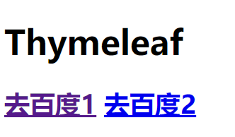

# 7.	Thymeleaf

由于SpringBoot默认不支持JSP，因此要实现页面就要使用第三方视图模板，常见的表现层技术有JSP、Freemarker、Velocity和Thymeleaf，本次学习我们选择使用的是Thymeleaf。

> Thymeleaf是一个用于Web和独立Java环境的模板引擎，能够处理HTML、XML、JavaScript、CSS甚至纯文本。能轻易的与Spring MVC等Web框架进行集成作为Web应用的模板引擎。与其它模板引擎（比如FreeMaker）相比，Thymeleaf最大的特点是能够直接在浏览器中打开并正确显示模板页面，而不需要启动整个Web应用（更加方便前后端分离,比如方便类似VUE前端设计页面），抛弃JSP吧。

## 7.0	Thymeleaf的优缺点

Thymeleaf优点：静态html嵌入标签属性，浏览器可以直接打开模板文件，便于前后端联调。是SpringBoot官方推荐方案。

Thymeleaf缺点：模板必须符合xml规范，开发时使用不便；同时相较于其他视图模板，Thymeleaf的性能明显弱于其他模板


## 7.1	Thymeleaf语法

### 7.1.1	Thymeleaf表达式


| 表达式名字 |  语法  |                     用途                      |
| :--------: | :----: | :-------------------------------------------: |
|  变量取值  | ${...} |        获取请求域、session域、对象等值        |
|  选择变量  | *{...} |               获取上下文对象值                |
|    消息    | #{...} |                获取国际化等值                 |
|    链接    | @{...} |                   生成链接                    |
| 片段表达式 | ~{...} | 作用等同于<jsp:include>，用于引入公共页面片段 |


### 7.1.2	Thymeleaf字面量

文本值: **'one text'** **,** **'Another one!'** **,…**

数字: **0** **,** **34** **,** **3.0** **,** **12.3** **,…**

布尔值: **true** **,** **false**

空值: **null**

变量： one，two，.... 变量不能有空格


### 7.1.3	Thymeleaf文本操作

字符串拼接: **+**

变量替换: **|The name is ${name}|** 


### 7.1.4	Thymeleaf符号运算

数学运算符: + , - , * , / , %

布尔运算符：  二元运算符:  **and** **,** **or**

​						一元运算: **!** **,** **not** 

比较运算: **>** **,** **<** **,** **>=** **,** **<=** **(** **gt** **,** **lt** **,** **ge** **,** **le** **)**等式: **==** **,** **!=** **(** **eq** **,** **ne** **)**

条件运算：If-then: **(if) ? (then)**

​				  If-then-else: **(if) ? (then) : (else)**

​				  Default: (value) **?: (defaultvalue)** 


### 7.1.5	Thymeleaf设置属性值th:attr

1、设置单个值

```html
<form action="subscribe.html" th:attr="action=@{/subscribe}">
  <fieldset>
    <input type="text" name="email" />
    <input type="submit" value="Subscribe!" th:attr="value=#{subscribe.submit}"/>
  </fieldset>
</form>
```

2、设置多个值

```html

```

3、以上两个的代替写法 th:xxxx

```html
<input type="submit" value="Subscribe!" th:value="#{subscribe.submit}"/>
<form action="subscribe.html" th:action="@{/subscribe}">
```

4、所有h5兼容的标签写法

https://www.thymeleaf.org/doc/tutorials/3.0/usingthymeleaf.html#setting-value-to-specific-attributes


### 7.1.6	Thymeleaf迭代

```html
<tr th:each="prod : ${prods}">
        <td th:text="${prod.name}">Onions</td>
        <td th:text="${prod.price}">2.41</td>
        <td th:text="${prod.inStock}? #{true} : #{false}">yes</td>
</tr>

<tr th:each="prod,iterStat : ${prods}" th:class="${iterStat.odd}? 'odd'">
  <td th:text="${prod.name}">Onions</td>
  <td th:text="${prod.price}">2.41</td>
  <td th:text="${prod.inStock}? #{true} : #{false}">yes</td>
</tr>
```


### 7.1.7	Thymeleaf条件运算

```html
<a href="comments.html"
th:href="@{/product/comments(prodId=${prod.id})}"
th:if="${not #lists.isEmpty(prod.comments)}">view</a>

<div th:switch="${user.role}">
  <p th:case="'admin'">User is an administrator</p>
  <p th:case="#{roles.manager}">User is a manager</p>
  <p th:case="*">User is some other thing</p>
</div>
```


### 7.1.8	Thymeleaf属性优先级


## 7.2	Thymeleaf使用

### 7.2.1	引入Thymeleaf依赖

```xml
<dependency>
	<groupId>org.springframework.boot</groupId>
	<artifactId>spring-boot-starter-thymeleaf</artifactId>
</dependency>
```

SpringBoot已经为我们配置好了Thymeleaf：

```java
@Configuration(proxyBeanMethods = false)
//将配置策略全部放在ThymeleafProperties中
@EnableConfigurationProperties(ThymeleafProperties.class)
//配置了SpringTemplateEngine模板引擎和ThymeleafViewResolver视图解析器
@ConditionalOnClass({ TemplateMode.class, SpringTemplateEngine.class })
@AutoConfigureAfter({ WebMvcAutoConfiguration.class, WebFluxAutoConfiguration.class })
public class ThymeleafAutoConfiguration { }
```

在ThymeleafProperties中：

```java
public static final String DEFAULT_PREFIX = "classpath:/templates/";

public static final String DEFAULT_SUFFIX = ".html";  //xxx.html
```

SpringBoot默认使用Thymeleaf作为模板引擎时，将html文件放在templates文件夹中


### 7.2.2	测试Thymeleaf

创建前端页面success.html，将其放在templates文件夹下：

```html
<!DOCTYPE html>
<!--引入Thymeleaf-->
<html lang="zh" xmlns:th="http://www.thymeleaf.org">
<head>
    <meta charset="UTF-8">
    <title>Thymeleaf测试</title>
</head>
<body>
<h1 th:text="${msg}">Hello</h1>
<h2>
    <a th:href="${link}">去百度1</a>
    <a th:href="@{/link}">去百度2</a>
</h2>
</body>
</html>
```

创建对应的控制器响应方法：

```java
@GetMapping("/success")
public String handle01(Model model){
    model.addAttribute("link", "http://www.baidu.com");
    model.addAttribute("msg", "Thymeleaf");
    return "success";
}
```

运行项目：



点击去百度1链接，成功跳转到百度页面：


点击去百度2链接，弹出的则是错误页面：


查看网页源代码：


我们发现，只有使用${}表达式才能正确取出请求域中的值，而使用@{}表达式时，link被直接视为了一个链接，它访问了项目的相对路径http://localhost:8080/link，我们并没有对这个请求提供响应方法，因此不能访问页面


## 7.3	后台管理系统

创建新的SpringBoot项目，版本使用2.4.2，依赖使用Lombok、Thymeleaf、SpringWeb、SpringBoot Devtools、SpringConfigurationProcessor

创建首页login.html：

```html
<!DOCTYPE html>
<html lang="en" xmlns:th="http://www.thymeleaf.org">
<head>
    <meta charset="UTF-8">
    <title>登录</title>
</head>
<body>
    <!--使用@{}表达式可以自动将相对路径拼接到项目根路径上-->
<form th:action="@{/login}" method="post">
    <h1>登录</h1><br/>
    用户名：<input type="text" name="userName" /><br/>
    密码：<input type="password" name="password"/><br/>
    <input type="submit" value="登录">

</form>
</body>
</html>
```

创建首页main.html：

```html
<!DOCTYPE html>
<html lang="en" xmlns:th="http://www.thymeleaf.org">>
<head>
    <meta charset="UTF-8">
    <title>主页</title>
</head>
<body>
<h1>首页</h1>
</body>
</html>
```

创建控制器IndexController：

```java
@Controller
public class IndexController {
    @GetMapping({"/", "/login"})
    public String loginPage(){
        return "login";
    }
    @PostMapping("/login")
    public String toMain(String userName, String password){

        return "main";
    }
}
```

运行程序：


### 7.3.1	表单重复提交问题

此时存在一个问题：当刷新主页时会出现提示：


因为我们是从login页面提交表单跳转到的主页，为了避免这个问题，我们可以使用页面重定向：

将跳转到主页的逻辑改为：

```java
@PostMapping("/login")
public String toMain(String userName, String password){
    return "redirect:/main.html";
}

@GetMapping("/main.html")
public String redirectToMain(){
    return "main";
}
```

此时再运行程序就不会出现之前的表单重复提交问题了：


### 7.3.2	登录系统

为了更好地模拟真实登录场景，创建实体类User：

```java
@Data
public class User {
    private String userName;
    private String password;
}
```

将登录检查逻辑改为：

```java
@PostMapping("/login")
//提交的表单数据将自动封装到User对象中
public String toMain(User user, Model model, HttpSession session){
    //若用户名不为空或只有空格且密码为123就视为登录成功
    if(!StringUtils.isEmptyOrWhitespace(user.getUserName())&&user.getPassword().equals("123")){
        //将登录用户保存到Session中
        session.setAttribute("loginUser", user);
        return "redirect:/main.html";
    }else{
        model.addAttribute("msg", "账号或密码错误");
        return "login";
    }
}
```

为表单添加错误提示：

```html
<form th:action="@{/login}" method="post">
    <h1>登录</h1><br/>
    <label style="color: red" th:text="${msg}"></label><br/>
    用户名：<input type="text" name="userName" /><br/>
    密码：<input type="password" name="password"/><br/>
    <input type="submit" value="登录">
</form>
```


#### 7.3.2.1	Thymeleaf行内写法

假设我们想在主页展示登录用户的userName，在JSP中我们可以直接使用${loginUser.userName}，但在Thymeleaf中这样的写法会直接被作为文本展示，除了上述的<label>标签外，我们可以使用Thymeleaf的行内写法，即直接将表达式放在双重中括号中：

```html
Hi,[[${session.loginUser.userName}]]!
```

再次登录：


#### 7.3.2.2	Thymeleaf内容引用

在Thymeleaf中，要在一个页面引用另一个页面的内容，可以使用th:insert/replace/include三种方法

```html
<!--要引用test.html中的内容-->
<div th:fragment="copy" id="origin">
	There are something.
</div>

<!--在demo.html中引用-->
<div th:insert="~{test :: copy}"></div>
<div th:insert="test :: copy"></div>
<div th:insert="test :: #origin"></div>
<div th:insert="~{test :: #origin}"></div>
<!--引用格式为~{引用文件名 :: th:fragment} 或 引用文件名 :: th:fragment-->
<!--或 引用文件名 :: #id 或 ~{引用文件名 :: #id}-->
```

th:insert/replace/include三种方法的引用格式相同，区别在于它们的效果：

```html
<!--test.xml中的公共片段-->
<footer>
	Something here.
</footer>

<!--th:insert引用-->
<div th:insert="test :: copy"></div>
<!--th:replace引用-->
<div th:replace="test :: copy"></div>
<!--th:include引用-->
<div th:include="test :: copy"></div>

<!--th:insert效果-->
<div>
    <footer>
    	Something here.
    </footer>
</div>

<!--th:replace效果-->
<footer>
    	Something here.
</footer>

<!--th:include效果-->
<div>
    Something here.
</div>
```

**注意：自Thymeleaf3.0开始，不推荐使用th:include**


#### 7.3.2.3	拦截器Interceptor

在登录系统中，我们要求用户必须登录才能访问其他页面，因此我们需要使用SpringMVC提供的拦截器Interceptor

要使用自定义拦截器，就要实现HandlerInterceptor接口：

```java
public class LoginInterceptor implements HandlerInterceptor {
    @Override
    public boolean preHandle(HttpServletRequest request, HttpServletResponse response, Object handler) throws Exception {
        HttpSession session = request. getSession();
        Object loginUser = session.getAttribute("loginUser");
        if (loginUser!=null){
            return true;
        }
        else{
            request.setAttribute("msg", "请先登录！");
            request.getRequestDispatcher("/").forward(request, response);
            return false;
        }
    }
}
```

要使用拦截器，还需要配置拦截器：

```java
@Configuration
public class WebConfig implements WebMvcConfigurer {
    @Override
    public void addInterceptors(InterceptorRegistry registry) {
        //拦截器将拦截除登录页以外的所有页面
        registry.addInterceptor(new LoginInterceptor()).addPathPatterns("/**").excludePathPatterns("/","/login");
        //注意：拦截器还会拦截静态资源，导致页面显示不正常，因此如果有静态资源还需要在excludePathPatterns中添加静态资源路径
    }
}
```

重新启动项目，此时未登录的用户将只能访问登录页面


##### 7.3.2.3.1	拦截器原理

1、根据当前请求，找到**拦截器执行链HandlerExecutionChain【**可以处理请求的handler以及handler的所有 拦截器】

2、先来**顺序执行** 所有拦截器的 preHandle方法

- 1、如果当前拦截器prehandler返回为true，则执行下一个拦截器的preHandle
- 2、如果当前拦截器返回为false，直接倒序执行所有已经执行了的拦截器的  afterCompletion；

**3、如果任何一个拦截器返回false。直接跳出不执行目标方法**

**4、所有拦截器都返回True。执行目标方法**

**5、倒序执行所有拦截器的postHandle方法。**

**6、前面的步骤有任何异常都会直接倒序触发** afterCompletion

7、页面成功渲染完成以后，也会倒序触发 afterCompletion


### 7.3.3	Thymeleaf迭代

假设在主页展示表格，显示一些用户信息，服务器传递一个List数组：

```java
@GetMapping("/main.html")
public String redirectToMain(Model model){
    List<User> users = Arrays.asList(
        new User("123", "456"),
        new User("abc", "def"),
        new User("zhangsan", "aaa")
    );
    model.addAttribute("users", users);
    return "main";
}
```

那么前端就要对数组进行迭代：

```html
<table>
    <thead>
    <tr>
        <th>序号</th>
        <th>用户名</th>
        <th>密码</th>
    </tr>
    </thead>
    <tbody>
    <tr th:each="user,stats:${users}">
        <td th:text="${stats.count}"></td>
        <td th:text="${user.userName}"></td>
        <td th:text="${user.password}"></td>
    </tr>
    </tbody>
</table>
```


### 7.3.4	文件上传

#### 7.3.4.1	单文件上传

添加测试表单：

```html
<form method="post" th:action="@{/upload}" enctype="multipart/form-data">
    <input name="file" type="file"><br/>
    <input value="提交" type="submit">
</form>
```

添加响应方法：

```
@PostMapping("/upload")
//SpringBoot会自动将上传的文件封装到@RequestPart注解标注的MultipartFile类型对象中
public String uploadHandler(@RequestPart("file") MultipartFile file) throws IOException {
    log.info(String.valueOf(file.getSize()));
    return "main";
}
```

##### 7.3.4.1.1	@RequestPart和@RequestParam

一般用@RequestPart注解标注MultipartFile类型对象，

1.@RequestPart这个注解用在multipart/form-data表单提交请求的方法上。
2.支持的请求方法的方式MultipartFile，属于Spring的MultipartResolver类。这个请求是通过http协议传输的。
3.@RequestParam也同样支持multipart/form-data请求。
4.他们最大的不同是，当请求方法的请求参数类型不再是String类型的时候。
5.@RequestParam适用于name-valueString类型的请求域，@RequestPart适用于复杂的请求域（像JSON，XML）。

##### 7.3.4.1.2	最大上传大小限制


SpringBoot默认限制单文件大小不超过1MB，所有文件总大小不超过10MB，我们可以直接在配置文件中进行修改：

```yaml
spring:
  servlet:
    multipart:
      max-file-size: 100MB
      max-request-size: 1000MB
```

修改后就解决了上传大小限制的问题


#### 7.3.4.2 	多文件上传

多文件上传相比单文件上传，只需要在标签中加入关键字multiple：

```
<form role="form" method="post" th:action="@{/upload}" enctype="multipart/form-data">
    <input name="file" type="file" multiple><br/>
    <input value="提交" type="submit">
</form>
```

添加测试响应方法：

```java
@PostMapping("/upload")
//SpringBoot会自动将上传的文件封装到@RequestPart注解标注的MultipartFile类型对象中
public String uploadHandler(@RequestPart("file") MultipartFile[] files) throws IOException {
    log.info(String.valueOf(files.length));
    return "main";
}
```


#### 7.3.4.3	文件上传原理

SpringBoot使用MultipartAutoConfiguration配置类和MultipartProperties配置文件为我们自动配置好了文件上传功能：

```java
@Configuration(
    proxyBeanMethods = false
)
//自动注入StandardServletMultipartResolver文件上传解析器
@ConditionalOnClass({Servlet.class, StandardServletMultipartResolver.class, MultipartConfigElement.class})
@ConditionalOnProperty(
    prefix = "spring.servlet.multipart",
    name = {"enabled"},
    matchIfMissing = true
)
@ConditionalOnWebApplication(
    type = Type.SERVLET
)
//有关文件上传的配置信息保存在MultipartProperties中
@EnableConfigurationProperties({MultipartProperties.class})
public class MultipartAutoConfiguration {
```

- **原理步骤**

- - **1、请求进来使用文件上传解析器MultipartResolver判断（**isMultipart**）并封装（**resolveMultipart，**返回**MultipartHttpServletRequest**）文件上传请求**
  - **2、参数解析器来解析请求中的文件内容封装成MultipartFile**
  - **3、将request中文件信息封装为一个Map；**MultiValueMap<String, MultipartFile>

**FileCopyUtils**实现文件流的拷贝

