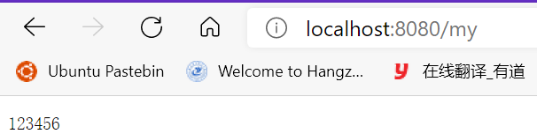
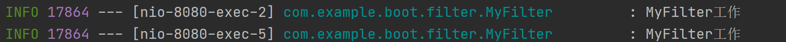
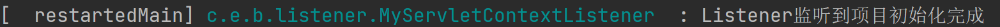

# 9.	Web原生组件注入

Web原生组件，指的是Servlet、Listener和Filter

在SpringBoot官方文档中：

> When using an embedded container, automatic registration of classes annotated with `@WebServlet`, `@WebFilter`, and `@WebListener` can be enabled by using `@ServletComponentScan`.
>
> 当使用嵌入式容器时，可以通过使用@ServletComponentScan来启用带有@WebServlet、@WebFilter和@WebListener注释的类的自动注册。

## 9.1	注解注入Web原生组件

根据官方文档介绍，要注入Web原生组件，首先要在主应用类中开启@ServletComponentScan注解：

```java
//指定扫描Servlet组件的包路径，若不指定默认为主应用类所在包及其子包
@ServletComponentScan("com.example.boot")
@SpringBootApplication
public class DemoApplication {

    public static void main(String[] args) {
        SpringApplication.run(DemoApplication.class, args);
    }

}
```

再使用@WebServlet、@WebListener、@WebFilter注入组件：

### 9.1.1	注入Servlet

```java
@WebServlet(urlPatterns = "/my")
//标记这是一个Servlet类
//要实现Servlet就要继承HttpServlet类
public class MyServlet extends HttpServlet {
    @Override
    protected void doGet(HttpServletRequest req, HttpServletResponse resp) throws ServletException, IOException {
        resp.getWriter().write("123456");
    }
}
```

运行程序，此时即使不登录，拦截器也不会拦截/my请求：



### 

### 9.1.2	注入Filter

```java
@Slf4j
@WebFilter(urlPatterns = {"/img/*"})//标明这是一个Filter urlPattern表示拦截的路径
public class MyFilter extends HttpFilter {

    @Override
    public void doFilter(ServletRequest request, ServletResponse response, FilterChain chain) throws IOException, ServletException {
        log.info("MyFilter工作");
        super.doFilter(request, response, chain);
    }

    @Override
    public void init(FilterConfig filterConfig) throws ServletException {
        log.info("MyFilter初始化");
        super.init(filterConfig);
    }

    @Override
    public void destroy() {
        log.info("MyFilter销毁");
    }
}
```

当访问内容被过滤器Filter拦截时，控制台就会打印信息：




### 9.1.3	注入Listener

例如实现ServletContextListener的自定义Listener：

```java
@Slf4j
@WebListener
public class MyServletContextListener implements ServletContextListener {
    @Override
    public void contextInitialized(ServletContextEvent sce) {
        log.info("Listener监听到项目初始化完成");
    }

    @Override
    public void contextDestroyed(ServletContextEvent sce) {
        log.info("Listener监听到项目销毁完成");
    }
}
```




## 9.2	RegistrationBean注入Web原生组件

在SpringBoot中还有一种更推荐的方式注入Web原生组件：

> If convention-based mapping is not flexible enough, you can use the `ServletRegistrationBean`, `FilterRegistrationBean`, and `ServletListenerRegistrationBean` classes for complete control.

根据SpringBoot官方文档介绍，我们可以分别使用ServletRegistrationBean、FilterRegistrationBean和ServletRegistrationBean分别注册Servlet、Filter和Listener：

```java
@Configuration
public class RegistrationConfig {
    @Bean
    public ServletRegistrationBean myServlet(){
        MyServlet myServlet = new MyServlet();
        return new ServletRegistrationBean(myServlet, "/my");
    }

    @Bean
    public FilterRegistrationBean myFilter(){
        MyFilter myFilter = new MyFilter();
        FilterRegistrationBean filterRegistrationBean = new FilterRegistrationBean(myFilter);
        filterRegistrationBean.setUrlPatterns(Arrays.asList("/img/*"));
        return filterRegistrationBean;
    }

    @Bean
    public ServletListenerRegistrationBean myListener(){
        MyServletContextListener myListener = new MyServletContextListener();
        return new ServletListenerRegistrationBean(myListener);
    }
}
```


## 9.3	DispatcherServlet注册原理

在SpringBoot中，前端控制器DispatcherServlet由DispatcherServletAutoConfiguration类自动配置：

```java
@Bean(
    name = {"dispatcherServlet"}
)//将DispatcherServlet注入容器，且名称为dispatcherServlet
//配置信息存放在WebMvcProperties中，对应配置项为spring.mvc
public DispatcherServlet dispatcherServlet(WebMvcProperties webMvcProperties) {
            DispatcherServlet dispatcherServlet = new DispatcherServlet();
            dispatcherServlet.setDispatchOptionsRequest(webMvcProperties.isDispatchOptionsRequest());
            dispatcherServlet.setDispatchTraceRequest(webMvcProperties.isDispatchTraceRequest());      dispatcherServlet.setThrowExceptionIfNoHandlerFound(webMvcProperties.isThrowExceptionIfNoHandlerFound());
            dispatcherServlet.setPublishEvents(webMvcProperties.isPublishRequestHandledEvents());
            dispatcherServlet.setEnableLoggingRequestDetails(webMvcProperties.isLogRequestDetails());
            return dispatcherServlet;
}
```

**通过** **ServletRegistrationBean**<DispatcherServlet> 把 DispatcherServlet  配置进来。

DispatcherServlet默认映射的是 / 路径，可以在配置文件中修改：

```yaml
spring:
  mvc:
    servlet:
      path: /
```

