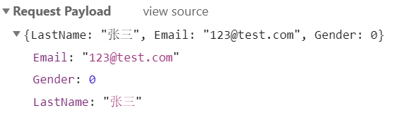
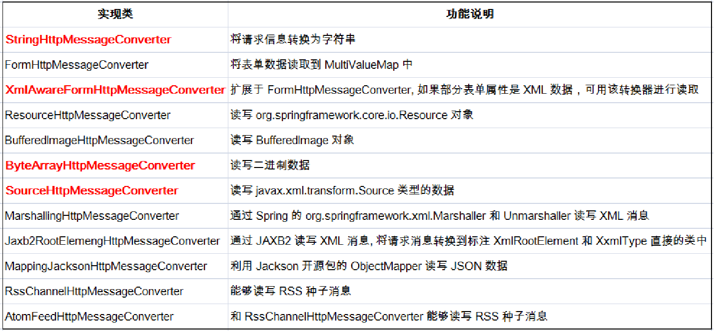

[TOC]


# 10.	SpringMVC实现Ajax

> （1）SpringMVC如何完成Ajax功能？
>
> ​		1）返回数据为json
>
> ​		2）配置环境
>
> ​		3）在页面上使用$.ajax();
>
> （2）原生JavaWeb如何实现Ajax？
>
> ​		1）导入GSON
>
> ​		2）返回数据用GSON转换为JSON
>
> ​		3）在页面使用Ajax

## 10.1	SpringMVC-Ajax

（1）导入依赖Jackson：

```xml
<!-- https://mvnrepository.com/artifact/com.fasterxml.jackson.core/jackson-core -->
<dependency>
    <groupId>com.fasterxml.jackson.core</groupId>
    <artifactId>jackson-core</artifactId>
    <version>2.11.3</version>
</dependency>

<!-- https://mvnrepository.com/artifact/com.fasterxml.jackson.core/jackson-annotations -->
<dependency>
    <groupId>com.fasterxml.jackson.core</groupId>
    <artifactId>jackson-annotations</artifactId>
    <version>2.11.3</version>
</dependency>

<!-- https://mvnrepository.com/artifact/com.fasterxml.jackson.core/jackson-databind -->
<dependency>
    <groupId>com.fasterxml.jackson.core</groupId>
    <artifactId>jackson-databind</artifactId>
    <version>2.11.3</version>
</dependency>
```

（2）配置测试环境：

创建Ajax测试类AjaxTestController：

```java
@Controller
public class AjaxTestController {
    @Autowired
    EmployeeDao employeeDao;

    //将返回数据放在响应体中
    //如果是对象，Jackson自动将对象转为json格式
    @ResponseBody
    @RequestMapping("/getallajax")
    public Collection<Employee> ajaxGetAll(){
        Collection<Employee> all = employeeDao.getAll();
        return all;
    }

}
```

运行程序，发送getallajax请求：


## 10.2	Jackson

Jackson中常用的注解：

（1）@ResponseBody：将返回数据放在响应体中，若数据为对象，Jackson会自动将对象转换为JSON格式

（2）@JsonIgnore：被标注的对象将不会被转换为JSON数据

（3）@JsonFormat：通过pattern属性规定数据转换格式，被标注的对象将按规定格式转换为JSON数据


将Employee类中的Department对象标注为@JsonIgnore：

```java
@JsonIgnore
private Department department;
```

将Employee类中的Date对象标注为@JsonFormat：

```java
@JsonFormat(pattern = "yyyy-mm-dd")
@DateTimeFormat(pattern = "yyyy-mm-dd")
@Past(message = "必须是过去的时间点")
private Date birth;
```

在emps.jsp中实现发送Ajax请求获取全部员工：

```jsp
<%@ page import="java.util.Date" %>
<%@ page contentType="text/html;charset=UTF-8" language="java" %>
<html>
<head>
    <title>员工列表</title>
    <%
        pageContext.setAttribute("ctp",request.getContextPath());
    %>
    <script type="text/javascript" src="${ctp}/js/jquery-1.9.1.min.js"></script>
    <!--引入JQuery-->
</head>
<body>
<%=new Date()%><br/><!--显示时间-->
<a href="${ctp}/getallajax">Ajax获取所有员工</a><br/>

<div>
<!--JQuery将获取到的对象信息在这里输出-->
</div>

<script type="text/javascript">
    var t = "${ctp}";//在JQuery外用t记录相对路径，因为JQuery内"$"表示JQuery，因此不能使用EL表达式
    $("a:first").click(function (){//当点击链接时
        //1.发送Ajax请求获取所有员工
        $.ajax({
            url:t+"/getallajax",//地址为$ {ctp}+/getallajax请求
            type:"GET",//请求类型为GET
            success:function (data) {//若获取成功
                $.each(data,function (){//遍历获取到的数据
                    //格式化数据
                    var empInfo = "LastName："+this.lastName+"->"+"Birth:"+this.birth+"->"+"Gender:"+this.gender+"->"+"Department:"+this.department;
                    $("div").append(empInfo+"<br/>");//向div添加数据
                });
            }
        });
        return false;
    });

</script>

</body>
</html>

```

运行程序：

可以看到Birth按我们需要的格式输出，由于取值逻辑错误，月份没有正常显示，这里暂不作处理，至少数据格式与@JsonFormat标注的格式一致；Department由于被标注为@JsonIgnore，因此没有传递对象，显示为undefined


## 10.3	@RequestBody

@RequestBody注解用于参数，可以直接获取请求体信息

添加测试方法testRequestBody：

```java
@RequestMapping("/testRequestBody")
    public String testRequestBody(@RequestBody String body){
        System.out.println(body);
        return "success";
}
```

添加测试表单：

```jsp
<form action="${ctp}/testRequestBody" method="post"><!--只有post提交才有请求体-->
    <input name="username" value="Tomcat"/><br/>
    <input name="password" value="123456"/><br/>
    <input type="submit"/><br/>
</form>
```

运行结果：


可以看到，body字符串正常获取到了请求体信息。


更改表单，添加上传文件功能：

```jsp
<form action="${ctp}/testRequestBody" method="post" enctype="multipart/form-data"><!--只有post提交才有请求体-->
    <input name="username" value="Tomcat"/><br/>
    <input name="password" value="123456"/><br/>
    <input type="file" name="file"/><br/>
    <input type="submit"/><br/>
</form>
```

编写测试文件：

运行结果：

```
------WebKitFormBoundaryWcbZnUjzUzkrhqol
Content-Disposition: form-data; name="username"

Tomcat
------WebKitFormBoundaryWcbZnUjzUzkrhqol
Content-Disposition: form-data; name="password"

123456
------WebKitFormBoundaryWcbZnUjzUzkrhqol
Content-Disposition: form-data; name="file"; filename="123.txt"
Content-Type: text/plain

123
Hello
这是一段测试信息
------WebKitFormBoundaryWcbZnUjzUzkrhqol--
```


## 10.4	发送JSON数据给服务器

在Controller中修改响应方法：

```java
@RequestMapping(value = "/testRequestBody")
public String testRequestBody(){
    return "success";
}
```

在emps.jsp中添加测试请求：

```jsp
<script type="text/javascript">
    var t = "${ctp}";
    $("#test").click(function () {
        //点击发送Ajax请求，请求带的数据是JSON
        var emp = {LastName:"张三",Email:"123@test.com",Gender:0}//js对象
        var empStr = JSON.stringify(emp);//将js对象转为json
        $.ajax({
            url:t+"/testRequestBody",
            type: "POST",
            data:empStr,//向控制器传递json对象
            contentType:"application/json",//数据类型为json
            success:function (data){//若传递成功，接收控制器传回的页面
                alert(data);
            }
        });
        return false;
    });

</script>
```


运行程序：

### 

### 10.4.1	@ResponseBody和@RequestBody传递数据

@ResponseBody注解可以将对象转为JSON数据，发送给浏览器

@RequestBody注解可以接收浏览器发送的JSON数据，封装为对象

将这两个注解结合使用，我们就可以实现向服务器收发JSON数据


#### 10.4.1.1	@RequestBody

在控制器中使用@RequestBody获取请求体：

```java
@RequestMapping("/test01")
public String test01(@RequestBody String str){
    System.out.println("请求体："+str);
    return "success";
}
```

运行程序：

```xml
请求体：------WebKitFormBoundarypnSXBZdjoTfDBwxB
Content-Disposition: form-data; name="username"

Tomcat
------WebKitFormBoundarypnSXBZdjoTfDBwxB
Content-Disposition: form-data; name="password"

123456
------WebKitFormBoundarypnSXBZdjoTfDBwxB
Content-Disposition: form-data; name="file"; filename=""
Content-Type: application/octet-stream


------WebKitFormBoundarypnSXBZdjoTfDBwxB--
```


##### 10.4.1.1.1	HttpEntity

将10.4.1.1中@RequestBody改为HttpEntity：

```java
@RequestMapping("/test01")
public String test01(HttpEntity<String> str){
    System.out.println(str);
    return "success";
}
```

运行程序：

```xml
<------WebKitFormBoundaryPfpzR4zCw8uTEyxi
Content-Disposition: form-data; name="username"

Tomcat
------WebKitFormBoundaryPfpzR4zCw8uTEyxi
Content-Disposition: form-data; name="password"

123456
------WebKitFormBoundaryPfpzR4zCw8uTEyxi
Content-Disposition: form-data; name="file"; filename=""
Content-Type: application/octet-stream


------WebKitFormBoundaryPfpzR4zCw8uTEyxi--
,[host:"localhost:8080", connection:"keep-alive", content-length:"390", cache-control:"max-age=0", upgrade-insecure-requests:"1", origin:"http://localhost:8080", user-agent:"Mozilla/5.0 (Windows NT 10.0; Win64; x64) AppleWebKit/537.36 (KHTML, like Gecko) Chrome/87.0.4280.67 Safari/537.36 Edg/87.0.664.47", accept:"text/html,application/xhtml+xml,application/xml;q=0.9,image/webp,image/apng,*/*;q=0.8,application/signed-exchange;v=b3;q=0.9", sec-fetch-site:"same-origin", sec-fetch-mode:"navigate", sec-fetch-user:"?1", sec-fetch-dest:"document", referer:"http://localhost:8080/crud_war_exploded/", accept-encoding:"gzip, deflate, br", accept-language:"zh-CN,zh;q=0.9,en-US;q=0.8,en;q=0.7,en-GB;q=0.6", cookie:"JSESSIONID=56CD91B1D803EA9C880FC6C7AFEA5FBD", Content-Type:"multipart/form-data;boundary=----WebKitFormBoundaryPfpzR4zCw8uTEyxi;charset=UTF-8"]>
```

与@RequestBody返回的数据相比，HttpEntity还可以获取到请求头，获取到的数据更多


#### 10.4.1.2	@ResponseBody

@ResponseBody注解用于方法上，它将返回的数据转为JSON格式，存入响应体ResponseBody中

在Controller中添加响应方法：

```java
@ResponseBody
@RequestMapping("/test02")
public String test01(){
    System.out.println("test02");
    return "success";
}
```

运行程序，直接通过URL发送test02请求：


可以看到，浏览器并没有跳转到success.jsp页面，而是直接打印出了success

响应方法将返回值success存入了响应体：


修改返回值为""<h1>success</h1>"":

```java
return "<h1>success</h1>";
```

再次运行程序：


##### 10.4.1.2.1	ResponseEntity

将10.4.1.3中方法返回值改为ResponseEntity<String>：

```java
@RequestMapping("/test02")
public ResponseEntity<String> test01(){
    //ResponseEntity<String>指的是响应体中内容类型
    String body;//响应体
    MultiValueMap<String,String> headers = new HttpHeaders();//响应头
    body="<h1>ResponseEntityTest</h1>";
    headers.add("Set-Cookie","username=Tomcat");
    return new ResponseEntity<String>(body,headers,HttpStatus.OK/*状态码*/);
}
```

运行程序：


相较于@ResponseBody注解，ResponseEntity除了能向响应体传递数据外，还可以传递响应头和状态码。


## 10.5 	HttpMessageConverter

HttpMessageConverter是Spring3新添加的接口（最新版本为Spring5 2020/12/1），负责将请求信息转换为一个对象（类型为T），将对象（类型为T）输出为响应信息。


### 10.5.1	HttpMessageConverter的方法

```java
Boolean canRead(Class<?> clazz,MediaType mediaType)//根据MediaType类型判断是否能读取该类型的数据，即转换器是否可将请求信息转换为 clazz 类型的对象，同时指定支持 MIME 类型(text/html,applaiction/json等)
Boolean canWrite(Class<?> clazz,MediaType mediaType)//指定转换器是否可将 clazz 类型的对象写到响应流中，响应流支持的媒体类型在MediaType 中定义。
List<MediaType> getSupportMediaTypes()//该转换器支持的媒体类型
T read(Class<? extends T> clazz,HttpInputMessage inputMessage)//将请求信息流转换为 T 类型的对象。
void write(T t,MediaType contnetType,HttpOutputMessgae outputMessage)//将T类型的对象写到响应流中，同时指定相应的媒体类型为 contentType。
```

其中，对于HttpInputMessage的定义：

```java
public interface HttpInputMessage extends HttpMessage {
   InputStream getBody() throws IOException;//可见，HttpInputMessage就是一个输入流
}
```

而对于HttpOutputMessgae的定义：

```java
public interface HttpOutputMessage extends HttpMessage {
   OutputStream getBody() throws IOException;//HttpOutputMessage是一个输出流
}
```


### 10.5.2	HttpMessageConverter的作用：

在控制器和用户间负责数据与对象转换：

将用户发送的信息转为Java对象传递给SpringMVC；将SpringMVC传回的Java对象转为信息发送给用户


### 10.5.3	HttpMessageConverter的实现类




### 10.5.4	HttpMessageConverter的工作机制

（1）DispatcherServlet 默认装配 RequestMappingHandlerAdapter ，而 RequestMappingHandlerAdapter 默认装配如下 HttpMessageConverter：


（2）加入Jackson包后， RequestMappingHandlerAdapter  装配的 HttpMessageConverter  如下：


### 10.5.5	HttpMessageConverter的使用方法

使用 HttpMessageConverter将请求信息转化并绑定到处理方法的入参中或将响应结果转为对应类型的响应信息，Spring 提供了两种途径：
（1）使用 @RequestBody / @ResponseBody 对处理方法进行标注
（2）使用 HttpEntity/ ResponseEntity作为处理方法的入参或返回值

当控制器处理方法使用到 @RequestBody/@ResponseBody 或 HttpEntity/ResponseEntity时, Spring 首先根据请求头或响应头的 Accept 属性选择匹配的 HttpMessageConverter,  进而根据参数类型或泛型类型的过滤得到匹配的HttpMessageConverter, 若找不到可用的 HttpMessageConverter 将报错