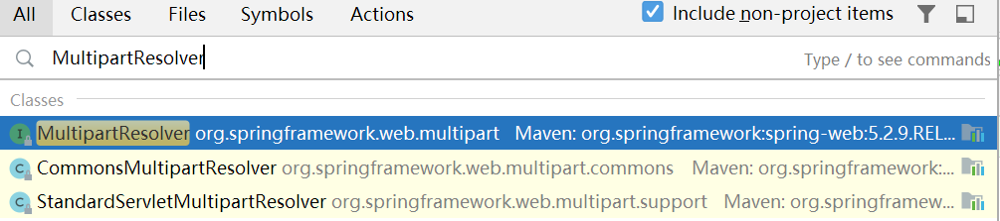
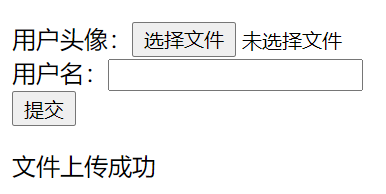
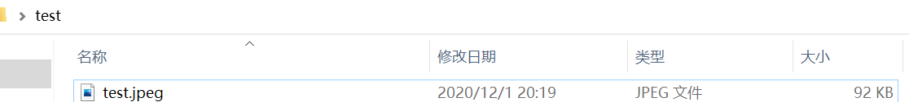
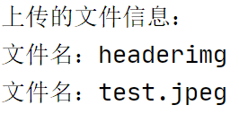
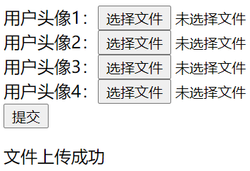
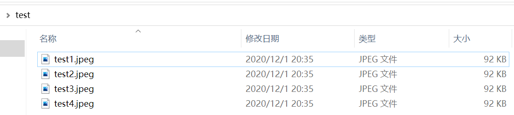

[TOC]


# 11.	文件上传和文件下载

## 11.1	文件下载

### 11.1.1	JavaWeb文件下载（非SpringMVC内容）

在使用JavaWeb文件的下载的时候，默认情况下，如果我们不指定内容类型content-type的时候 浏览器是无法判断如何去解析这个页面的，同时我们应当指定文件名filename，否则浏览器将默认下载当前静态网页的源码。

#### 11.1.1.1	@WebServlet

在Servlet中，设置了@WebServlet注解,当请求该Servlet时,服务器就会自动读取当中的信息。

若没有设置@WebServlet的name属性，默认值会是Servlet的类完整名称。

如果注解@WebServlet("/category")，则表示该Servlet默认的请求路径为…/category，这里省略了urlPatterns属性名,完整的写法应该是:@WebServlet(urlPatterns = “/category”)。

|     属性名     |      类型      |                             描述                             |
| :------------: | :------------: | :----------------------------------------------------------: |
|      name      |     String     | 指定Servlet 的 name 属性，等价于 `<servlet-name>`。如果没有显式指定，则该 Servlet 的取值即为类的全限定名。 |
|     value      |    String[]    |    该属性等价于 urlPatterns 属性。两个属性不能同时使用。     |
|  urlPatterns   |    String[]    | 指定一组 Servlet 的 URL 匹配模式。等价于`<url-pattern>`标签。 |
| loadOnStartup  |      int       |  指定 Servlet 的加载顺序，等价于 `<load-on-startup>`标签。   |
|   initParams   | WebInitParam[] |   指定一组 Servlet 初始化参数，等价于`<init-param>`标签。    |
| asyncSupported |    boolean     | 声明 Servlet 是否支持异步操作模式，等价于`<async-supported>` 标签。 |
|  description   |     String     |     该 Servlet 的描述信息，等价于 `<description>`标签。      |
|  displayName   |     String     | 该 Servlet 的显示名，通常配合工具使用，等价于 `<display-name>`标签。 |


#### 11.1.1.2	JavaWeb文件下载

```java
@RequestMapping("/download02")
public void download02(HttpServletRequest request,HttpServletResponse response) throws IOException {
    String filename="jquery-1.9.1.min.js";//指定文件名
    //当文件名不是英文名时，使用url解码器编码，
    filename= URLEncoder.encode(filename,"UTF-8");
    //将响应类型设为二进制流，即下载文件类型未知
    response.setContentType("application/octet-stream");
    //在响应头中设置Content-Type和filename
    response.setHeader("Content-Disposition", "attachment;filename=" + filename);
    //通过IO流来传送数据
    //输入流从文件获取信息

    InputStream input=request.getServletContext().getResourceAsStream("/js/jquery-1.9.1.min.js");
    //输出流向response域输出信息
    OutputStream output = response.getOutputStream();
    //下载文件时，数据为字节流，因此使用字节数组byte[]
    byte[]buff=new byte[1024*10];//指定缓冲区的大小
    int len=0;
    while((len=input.read(buff))>-1) {//输入流读取文件信息
        output.write(buff,0,len);//将输入流中信息写入输出流
    }
    //关闭输入输出流
    input.close();
    output.close();
}
```


### 11.1.2	SpringMVC文件下载

在SpringMVC中，对于文件下载的支持不是很好，应慎重使用

在Controller中添加下载请求的响应方法：

```java
@RequestMapping("/download")
public ResponseEntity<byte[]> download(HttpServletRequest request) throws IOException {//传入原生API
    //1.得到要下载文件的地址
    //找到要下载文件的真实路径
    ServletContext context = request.getSession().getServletContext();
    String realPath = context.getRealPath("/js/jquery-1.9.1.min.js");//获取文件路径
    FileInputStream is = new FileInputStream(realPath);//获取文件流
    byte[] temp = new byte[is.available()];//字节数组大小与文件流大小相同
    is.read(temp);//读取文件流到字节数组中
    is.close();
    //2.将要下载的文件流返回
    HttpHeaders headers = new HttpHeaders();//配置响应头为下载
    headers.set("Content-Disposition","attachment;filename="+"jquery-1.9.1.min");
    return new ResponseEntity<byte[]>(temp,headers, HttpStatus.OK);
}
```

运行程序：


## 11.2	文件上传

文件上传的步骤：

（1）导入fileupload

（2）在SpringMVC中配置文件上传解析器

（3）上传表单准备：enctype="multipart/form-data"

（4）文件上传请求处理

### 11.2.1	SpringMVC文件上传

#### 11.2.1.1	导入依赖

```xml
<!-- https://mvnrepository.com/artifact/commons-io/commons-io -->
<dependency>
  <groupId>commons-io</groupId>
  <artifactId>commons-io</artifactId>
  <version>2.8.0</version>
</dependency>

<!-- https://mvnrepository.com/artifact/commons-fileupload/commons-fileupload -->
<dependency>
  <groupId>commons-fileupload</groupId>
  <artifactId>commons-fileupload</artifactId>
  <version>1.4</version>
</dependency>
```

#### 11.2.1.2	配置文件上传解析器MultipartResolver

在SpringMVC配置文件中配置文件上传解析器MultipartResolver（九大组件之一）：



由于我们导入的是Commons包，因此我们配置的解析器应为CommonsMultipartResolver

查看MultipartResolver的初始化方法initMultipartResolver()：

```java
private void initMultipartResolver(ApplicationContext context) {
   try {
      this.multipartResolver = context.getBean(MULTIPART_RESOLVER_BEAN_NAME, MultipartResolver.class);//getBean获取MultipartResolver对象，因此getBean传入的参数是关键
      if (logger.isTraceEnabled()) {
         logger.trace("Detected " + this.multipartResolver);
      }
      else if (logger.isDebugEnabled()) {
         logger.debug("Detected " + this.multipartResolver.getClass().getSimpleName());
      }
   }//若无对应Bean则返回null
   catch (NoSuchBeanDefinitionException ex) {
      // Default is no multipart resolver.
      this.multipartResolver = null;
      if (logger.isTraceEnabled()) {
         logger.trace("No MultipartResolver '" + MULTIPART_RESOLVER_BEAN_NAME + "' declared");
      }
   }
}
```

查看getBean()方法传入的常量MULTIPART_RESOLVER_BEAN_NAME：

```java
/** Well-known name for the MultipartResolver object in the bean factory for this namespace. */
public static final String MULTIPART_RESOLVER_BEAN_NAME = "multipartResolver";
```

因此，我们在SpringMVC配置文件中配置MultipartResolver时应使用id"multipartResolver"：

```xml
<!--配置文件上传解析器 id必须为"multipartResolver"-->
<bean id="multipartResolver" class="org.springframework.web.multipart.commons.CommonsMultipartResolver">
    <property name="maxUploadSize" value="#{1024*1024*20}"/><!--限制上传最大文件大小为20MB-->
    <property name="defaultEncoding" value="utf-8"/><!--设置默认编码格式-->
</bean>
```


#### 11.2.1.3	文件上传表单

##### 11.2.1.3.1	enctype

enctype属性是HTML中<form>表单标签中的属性，它规定了提交数据的格式

enctype 属性规定在将表单数据发送到服务器之前如何对其进行编码。

**注意：**只有 method="post" 时才使用 enctype 属性。

|                值                 |                             描述                             |
| :-------------------------------: | :----------------------------------------------------------: |
| application/x-www-form-urlencoded | 默认。在发送前对所有字符进行编码（将空格转换为 "+" 符号，特殊字符转换为 ASCII HEX 值）。 |
|        multipart/form-data        |  不对字符编码。当使用有文件上传控件的表单时，该值是必需的。  |
|            text/plain             |          将空格转换为 "+" 符号，但不编码特殊字符。           |


##### 11.2.1.3.2	文件上传表单

文件上传表单对应的enctype属性应为"multipart/form-data"，要提交信息，因此请求类型method为"post"

```jsp
<form action="${ctp}/singleupload" method="post" enctype="multipart/form-data">
    用户头像：<input type="file" name="headerimg"/>(上传的图片大小不超过20MB)<br/>
    用户名：<input type="text" name="username"/><br/>
    <input type="submit"/>
</form>

${msg}<!--接收Controller返回的信息-->
```


#### 11.2.1.4	文件上传请求处理

创建控制器类FileUploadController：

```java
 //单文件上传
@RequestMapping("/singleupload")
public String singleUpload(@RequestParam(value = "username",required = false)String username,
                           @RequestParam("headerimg") MultipartFile file,
                           Model model){
    System.out.println("上传的文件信息：");
    System.out.println("文件名："+file.getName());
    System.out.println("文件名："+file.getOriginalFilename());
    //文件保存
    try {
        file.transferTo(new File("C:\\Users\\93195\\Desktop\\test\\"+file.getOriginalFilename()));
        model.addAttribute("msg","文件上传成功");
    } catch (IOException e) {
        model.addAttribute("msg","文件上传失败"+e.getMessage());
    }

    return "forward:/index.jsp";
}
```

运行程序：



根据控制台输出的信息可知，file对应的getName()方法获取到的是表单中对应的name属性，而getOriginalFilename()方法获取到的才是真正的文件名


## 11.3	多文件上传

在index.jsp中添加测试多文件上传请求的表单：

```jsp
<form action="${ctp}/multiupload" method="post" enctype="multipart/form-data">
    用户头像1：<input type="file" name="headerimg"/><br/>
    用户头像2：<input type="file" name="headerimg"/><br/>
    用户头像3：<input type="file" name="headerimg"/><br/>
    用户头像4：<input type="file" name="headerimg"/><br/>
    <input type="submit"/>
</form>
<!--若要上传的多个文件的文件项name不都相同时，需要在处理方法中添加参数并用@RequestParam注解标注-->
```

在Controller中添加多文件上传请求的处理方法：

```java
//多文件上传
@RequestMapping("/multiupload")
public String multiUpload(@RequestParam(value = "username",required = false)String username,
                     @RequestParam("headerimg") MultipartFile[] files,
                     Model model){
    //上传多个文件，需要用MultipartFile[]数组对象接收数据
    System.out.println("上传的文件信息：");
    for (MultipartFile file:files) {
        if(!file.isEmpty()){//判断上传的文件是否为空
            System.out.println("文件名："+file.getName());
            System.out.println("文件名："+file.getOriginalFilename());
            //文件保存
            try {
                file.transferTo(new File("C:\\Users\\93195\\Desktop\\test\\"+file.getOriginalFilename()));
                model.addAttribute("msg","文件上传成功");
            } catch (IOException e) {
                model.addAttribute("msg","文件上传失败"+e.getMessage());
            }
        }
    }
    return "forward:/index.jsp";
}
```

运行程序：