[TOC]


# 13.	异常处理

SpringMVC通过HandlerExceptionResolver处理程序的异常，包括Handler映射、数据绑定以及目标方法执行时发生的异常。

SpringMVC提供的HandlerExceptionResolver的实现类：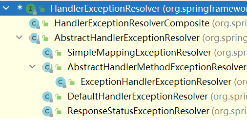

在默认情况下，SpringMVC使用以下HandlerExceptionResolver：

ExceptionHandlerExceptionResolver：与@ExceptionHandler注解配合使用

ResponseStatusExceptionResolver：与@ResponseStatus注解配合使用

DefaultHandlerExceptionResolver：判断是否为SpringMVC自带的异常

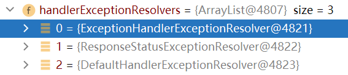


## 13.1	异常处理流程（源码）

尝试用请求发送除零异常：

```java
private void processDispatchResult(HttpServletRequest request, HttpServletResponse response,
      @Nullable HandlerExecutionChain mappedHandler, @Nullable ModelAndView mv,
      @Nullable Exception exception) throws Exception {

   boolean errorView = false;
	//若存在异常
   if (exception != null) {
       //若为ModelAndView异常
      if (exception instanceof ModelAndViewDefiningException) {
         logger.debug("ModelAndViewDefiningException encountered", exception);
         mv = ((ModelAndViewDefiningException) exception).getModelAndView();
      }
      else {//处理异常
          //用各异常处理器逐个尝试解析异常
          //由于默认没有配置这些默认异常处理器能处理的异常，并且我们请求携带的除零异常不属于SpringMVC自带的异常，因此默认异常处理器无法解析异常
         Object handler = (mappedHandler != null ? mappedHandler.getHandler() : null);
         mv = processHandlerException(request, response, handler, exception);
         errorView = (mv != null);
      }
   }
    //若已有的异常解析器都不能处理当前异常，则直接抛出异常

   // Did the handler return a view to render?
   if (mv != null && !mv.wasCleared()) {
       //来到页面,进行页面渲染
      render(mv, request, response);
      if (errorView) {
         WebUtils.clearErrorRequestAttributes(request);
      }
   }
   else {
      if (logger.isTraceEnabled()) {
         logger.trace("No view rendering, null ModelAndView returned.");
      }
   }

   if (WebAsyncUtils.getAsyncManager(request).isConcurrentHandlingStarted()) {
      // Concurrent handling started during a forward
      return;
   }

   if (mappedHandler != null) {
      // Exception (if any) is already handled..
      mappedHandler.triggerAfterCompletion(request, response, null);
   }
}
```


## 13.2	@ExceptionHandler

@ExceptionHandler注解用于标注方法，表示这个方法能处理该方法所在类发生的异常

当一个Exception有多个异常处理方法可以处理时，SpringMVC会优先匹配最精确的对应处理


### 13.2.1	发送请求引发异常

在index.jsp中通过传递0值，在处理器中引发除零异常：

在index.jsp中：

```jsp
<a href="${ctp}/test01?i=0">test01</a>
```

在处理器中：

```java
@RequestMapping("/test01")
public String test01(Integer i){
    System.out.println(10/i);
    return "success";
}
```


### 13.2.2	添加异常处理方法

在处理器中：

```java
@ExceptionHandler(value={ArithmeticException.class,NullPointerException.class})//数学异常、空指针异常
    //告诉SpringMVC这个方法专门用于处理这个类发生的异常
    public String handleException01(Exception e){
        //要接收异常信息，在参数位置写一个Exception对象即可获取对应异常
        //要携带异常信息不能在参数位置写Model对象，否则无法获取异常
        System.out.println("handleException01："+e);//获取异常信息
        //视图解析器也能进行拼串
        return "error";
    }
```

运行程序：

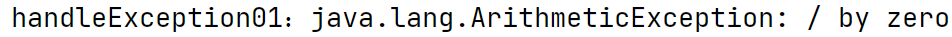

可以看到，我们添加的异常处理方法已经可以正常接收到异常信息了。


### 13.2.3	返回异常信息

在异常处理方法中使用Model对象携带异常信息：

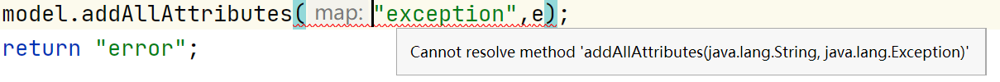

可以看到，Model对象不支持携带异常信息，因此不能通过Model对象传递异常信息


要想将异常信息传递到页面上，我们需要将方法返回值类型改为ModelAndView，通过ModelAndView对象返回异常信息：

```java
@ExceptionHandler(value={ArithmeticException.class,NullPointerException.class})
public ModelAndView handleException01(Exception e, Model model){
    System.out.println("handleException01："+e);
    ModelAndView mv = new ModelAndView("error");
    mv.addObject("exception",e);//通过ModelAndView对象传递异常信息
    return mv;
}
```

添加错误展示页面error.jsp，用EL表达式获取异常处理方法传递的异常信息：

```jsp
<h1>出错啦！</h1>
<h2>错误信息：${exception}</h2>
```

运行程序：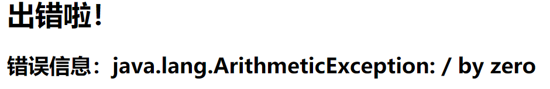

可以看到，现在页面可以正常接收到异常信息了。


### 13.2.4	解决全局异常

@ExceptionHandler注解标注的方法只能解决当前类下的异常，如果我们要处理每个类中的异常就要为每个类都添加异常处理方法，非常繁琐。

为了解决这个问题，我们可以建立异常处理类，集中处理全局异常。

解决全局异常的步骤：

（1）将异常处理类添加到IOC容器中：使用@ControllerAdvice，表示该类专门用于异常处理

（2）

**注意：当全局和本类都能处理异常时，不论精度如何，本类优先处理异常**


#### 13.2.4.1	全局和本类异常处理的优先度

建立异常处理类CentralExceptionHandler，集中处理全局异常：

```java
@ControllerAdvice
public class CentralExceptionHandler {

    @ExceptionHandler(value=ArithmeticException.class)
    public ModelAndView handleException01(Exception e, Model model){
        System.out.println("全局的：handleException01："+e);
        ModelAndView mv = new ModelAndView("error");
        mv.addObject("exception",e);
        return mv;
    }

    @ExceptionHandler(value=Exception.class)
    public ModelAndView handleException02(Exception e, Model model){
        System.out.println("全局的：handleException02："+e);
        ModelAndView mv = new ModelAndView("error");
        mv.addObject("exception",e);
        return mv;
    }
}
```

同时将13.2.3中的异常处理方法改为：

```java
@ExceptionHandler(value=ArithmeticException.class)
public ModelAndView handleException01(Exception e, Model model){
    System.out.println("本类的：handleException01："+e);
    ModelAndView mv = new ModelAndView("error");
    mv.addObject("exception",e);
    return mv;
}
```

运行程序：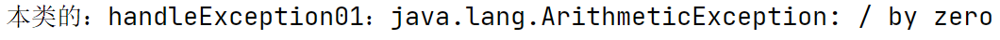

可以看到，异常信息被本类下的异常处理方法拦截，因此**当全局和本类都能处理相同精度的异常时，本类优先处理**


将本类下的异常处理方法能处理的异常改为Exception.class：

```java
@ExceptionHandler(value=Exception.class)
```

运行程序：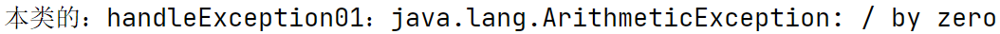

可以看到，**当全局和本类都能处理异常时，不论精度如何，本类优先处理异常**


## 13.3	@ResponseStatus

@ResponseStatus注解用于标注自定义的异常，不能为方法标注

| 属性值 |         作用         |
| :----: | :------------------: |
| reason |  表示异常产生的原因  |
| value  | 指定状态码StatusCode |


### 13.3.1	作用在方法上

为13.2.1中处理器方法标注@ResponseStatus注解：

```java
@ResponseStatus(reason = "反正就是错了",value = HttpStatus.NOT_FOUND)
@RequestMapping("/test01")
public String test01(Integer i){
    System.out.println(10/i);
    return "success";
}
```

运行程序，不传递0值引发除零异常：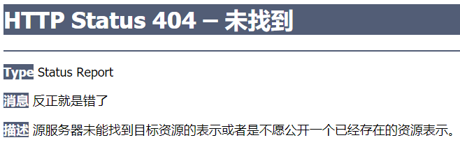


### 13.3.2	作用在自定义异常上

在index.jsp中通过请求传递username值：

```jsp
<a href="${ctp}/test02?username=user">test02</a>
```

创建自定义异常类UserNameNotFoundException：

```java
@ResponseStatus(reason = "用户被拒绝登录",value= HttpStatus.NOT_ACCEPTABLE)
public class UserNameNotFoundException extends RuntimeException{
}
```

在控制器中添加响应方法，若登录失败则抛出异常：

```
@RequestMapping("/test02")
public String test02(@RequestParam("username")String username){
    if(!"admin".equals(username)){//若请求传递的username不是admin
        System.out.println("登录失败");
        throw new UserNameNotFoundException();//抛出自定义异常
    }
    System.out.println("登录成功");
    return "success";
}
```

将能处理Exception异常的异常处理方法注释，运行程序：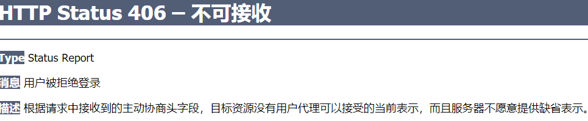

因此，当我们想快速建立自定义异常类型时，可以使用@ResponseStatus注解来实现


## 13.4	DefaultHandlerExceptionResolver

在index.jsp中发送GET请求：

```java
<a href="${ctp}/test03">test03</a>
```

在控制器中添加响应方法，但只处理POST类型请求：

```java
@RequestMapping(value = "/test03",method = RequestMethod.POST)
public String test03(){
    return "success";
}
```

运行程序：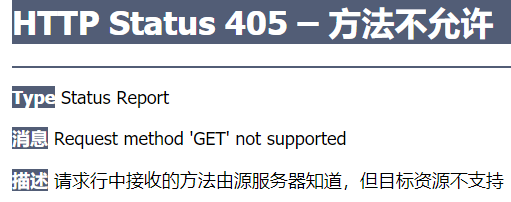

控制台输出的异常信息为：

```java
org.springframework.web.servlet.handler.AbstractHandlerExceptionResolver.logException Resolved [org.springframework.web.HttpRequestMethodNotSupportedException: Request method 'GET' not supported]
```

从中可以看出：

异常类型为：HttpRequestMethodNotSupportedException

该异常所属包路径为org.springframework.web，显然是SpringWeb的默认异常类型

因此，对于SpringWeb的默认异常类型，若没有异常处理方法，则使用DefaultHandlerExceptionResolver处理异常

```java
	DefaultHandlerExceptionResolver能对一些特殊的异常进行处理，比如：
	NoSuchRequestHandlingMethodException、
	HttpRequestMethodNotSupportedException、
	HttpMediaTypeNotSupportedException、
	HttpMediaTypeNotAcceptableException等。
```


## 13.5	DefaultHandler源码

```java
private void processDispatchResult(HttpServletRequest request, HttpServletResponse response,
      @Nullable HandlerExecutionChain mappedHandler, @Nullable ModelAndView mv,
      @Nullable Exception exception) throws Exception {

   boolean errorView = false;

   if (exception != null) {
      if (exception instanceof ModelAndViewDefiningException) {
         logger.debug("ModelAndViewDefiningException encountered", exception);
         mv = ((ModelAndViewDefiningException) exception).getModelAndView();
      }
      else {
          //获取异常处理器
         Object handler = (mappedHandler != null ? mappedHandler.getHandler() : null);
          //处理异常->接13.5.1
         mv = processHandlerException(request, response, handler, exception);
         errorView = (mv != null);
      }
   }

   // Did the handler return a view to render?
   if (mv != null && !mv.wasCleared()) {
      render(mv, request, response);
      if (errorView) {
         WebUtils.clearErrorRequestAttributes(request);
      }
   }
   else {
      if (logger.isTraceEnabled()) {
         logger.trace("No view rendering, null ModelAndView returned.");
      }
   }

   if (WebAsyncUtils.getAsyncManager(request).isConcurrentHandlingStarted()) {
      // Concurrent handling started during a forward
      return;
   }

   if (mappedHandler != null) {
      // Exception (if any) is already handled..
      mappedHandler.triggerAfterCompletion(request, response, null);
   }
}
```

### 

### 13.5.1	processHandlerException()

```java
protected ModelAndView processHandlerException(HttpServletRequest request, HttpServletResponse response,
      @Nullable Object handler, Exception ex) throws Exception {

   // Success and error responses may use different content types
   request.removeAttribute(HandlerMapping.PRODUCIBLE_MEDIA_TYPES_ATTRIBUTE);

   // Check registered HandlerExceptionResolvers...
   ModelAndView exMv = null;
    //若存在异常处理器
   if (this.handlerExceptionResolvers != null) {
       //逐异常处理器尝试处理异常
      for (HandlerExceptionResolver resolver : this.handlerExceptionResolvers) {
         exMv = resolver.resolveException(request, response, handler, ex);
         if (exMv != null) {//若处理器能处理则结束循环
            break;//HandlerExceptionResolver中默认情况下有三个异常处理器：
         }//首先判断ExceptionHandlerExceptionResolver能否处理，即寻找有无@ExceptionHandler注解标注的异常处理方法，若没有则不能处理该异常
      }//其次判断ResponseStatusExceptionResolver能否处理，即寻找有无@ResponseStatus注解标注的异常，若没有则不能处理
   }//最后判断DefaultHandlerExceptionResolver，
   if (exMv != null) {
      if (exMv.isEmpty()) {
         request.setAttribute(EXCEPTION_ATTRIBUTE, ex);
         return null;
      }
      // We might still need view name translation for a plain error model...
      if (!exMv.hasView()) {
         String defaultViewName = getDefaultViewName(request);
         if (defaultViewName != null) {
            exMv.setViewName(defaultViewName);
         }
      }
      if (logger.isTraceEnabled()) {
         logger.trace("Using resolved error view: " + exMv, ex);
      }
      else if (logger.isDebugEnabled()) {
         logger.debug("Using resolved error view: " + exMv);
      }
      WebUtils.exposeErrorRequestAttributes(request, ex, getServletName());
      return exMv;
   }

   throw ex;
}
```


## 13.6	SimpleMappingExceptionResolver

根据13.图中的实现类，还有一种异常处理器SimpleMappingExceptionResolver

SimpleMappingExceptionResolver能通过配置的方式进行异常处理


在SpringMVC配置文件中配置SimpleMappingExceptionResolver：

```xml
 <bean class="org.springframework.web.servlet.handler.SimpleMappingExceptionResolver">
        <!--exceptionMappings：能配置哪些异常去什么页面-->
        <property name="exceptionMappings">
            <props>
                <!--key：异常全类名 value:要去的页面对应视图名-->
                <prop key="java.lang.NullPointerException">error</prop>
            </props><!--当出现空指针异常时，跳转到error.jsp页面-->
        </property>
        <!--指定取出错误信息时对应的key，若不指定则默认值为"exception"-->
        <!--<property name="exceptionAttribute" value="ex"></property>-->
</bean>
```

在控制器中注释掉出SimpleMappingExceptionResolver外所有能处理空指针异常的异常处理器，添加空指针异常测试方法：

```java
@RequestMapping(value = "/test04")
public String test04(){
    System.out.println("test04");
    String str=null;
    System.out.println(str.charAt(0));
    return "success";
}
```

运行程序：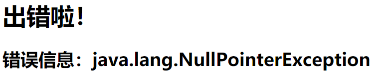


在Debug模式下运行程序：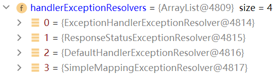

可以看到SimpleMappingExceptionResolver处理异常的优先级最低

