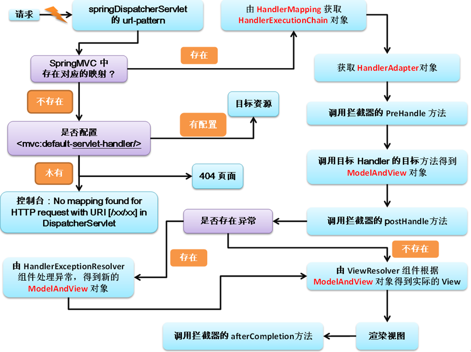

[TOC]


# 14.	SpringMVC运行流程

## 14.1	SpringMVC的运行流程

1.当用户（浏览器）发出请求后，前端控制器FrontController首先收到请求，调用doDispatch()方法进行处理

2.根据HandlerMapping中保存的请求映射信息，找到能处理当前请求的处理器执行链（包含拦截器）

3.根据当前处理器，找到对应的适配器HandlerAdapter

4.执行拦截器的preHandle()方法

5.适配器执行目标方法，返回ModelAndView对象：

​		1）@ModelAttribute注解标注的方法提前运行

​		2）执行目标方法时，确定目标方法需要的参数

> 在填充Handler的入参过程中，根据你的配置，Spring将帮你做一些额外的工作：
>
> ①    HttpMessageConveter： 将请求消息（如Json、xml等数据）转换成一个对象，将对象转换为指定的响应信息
>
> ②    数据转换：对请求消息进行数据转换。如String转换成Integer、Double等
>
> ③    数据根式化：对请求消息进行数据格式化。 如将字符串转换成格式化数字或格式化日期等
>
> ④    数据验证： 验证数据的有效性（长度、格式等），验证结果存储到BindingResult或Error中

​				I.参数有注解

​				II.参数无注解：

​						①看是否为Model、Map及其他

​						②若为自定义类型

​								A.从隐含模型中看有没有，若有就从隐含模型中取值

​								B.若隐含模型中没有，再看是否为@SessionAttributes标注的属性，若是就从Session中取值，若拿不到则抛出异常

​								C.若都不是，就根据反射创建对象

6.拦截器执行postHandle()方法

7.处理结果（页面渲染）

​		1）若有异常，使用异常解析器处理异常，处理完成后返回ModelAndView对象

​		2）调用render()方法进行页面渲染：

​				I.视图解析器ViewResolver根据视图名得到视图View对象

​				II.视图对象调用render()方法

​		3）拦截器执行afterCompletion()方法


## 14.2	SpringMVC运行流程源码

```java
//SpringMVC运行流程，结合代码参照
//1.当用户（浏览器）发出请求后，前端控制器FrontController首先收到请求，调用doDispatch()方法进行处理
protected void doDispatch(HttpServletRequest request, HttpServletResponse response) throws Exception {
   HttpServletRequest processedRequest = request;
   HandlerExecutionChain mappedHandler = null;
   boolean multipartRequestParsed = false;

   WebAsyncManager asyncManager = WebAsyncUtils.getAsyncManager(request);

   try {
      ModelAndView mv = null;
      Exception dispatchException = null;

      try {
         processedRequest = checkMultipart(request);
         multipartRequestParsed = (processedRequest != request);

         // Determine handler for the current request.
         //2.根据HandlerMapping中保存的请求映射信息，找到能处理当前请求的处理器执行链（包含拦截器）
         mappedHandler = getHandler(processedRequest);
         if (mappedHandler == null) {
            noHandlerFound(processedRequest, response);
            return;
         }

         // Determine handler adapter for the current request.
         //3.根据当前处理器，找到对应的适配器HandlerAdapter
         HandlerAdapter ha = getHandlerAdapter(mappedHandler.getHandler());

         // Process last-modified header, if supported by the handler.
         String method = request.getMethod();
         boolean isGet = "GET".equals(method);
         if (isGet || "HEAD".equals(method)) {
            long lastModified = ha.getLastModified(request, mappedHandler.getHandler());
            if (new ServletWebRequest(request, response).checkNotModified(lastModified) && isGet) {
               return;
            }
         }
		//4.执行拦截器的preHandle()方法
         if (!mappedHandler.applyPreHandle(processedRequest, response)) {
            return;
         }

         // Actually invoke the handler.
         //5.适配器执行目标方法，返回ModelAndView对象
         mv = ha.handle(processedRequest, response, mappedHandler.getHandler());

         if (asyncManager.isConcurrentHandlingStarted()) {
            return;
         }
		//若无视图名则使用默认视图名
         applyDefaultViewName(processedRequest, mv);
         //6.拦截器执行postHandle()方法
         mappedHandler.applyPostHandle(processedRequest, response, mv);
      }
      catch (Exception ex) {
         dispatchException = ex;
      }
      catch (Throwable err) {
         // As of 4.3, we're processing Errors thrown from handler methods as well,
         // making them available for @ExceptionHandler methods and other scenarios.
         dispatchException = new NestedServletException("Handler dispatch failed", err);
      }
       //7.处理结果（页面渲染）
      processDispatchResult(processedRequest, response, mappedHandler, mv, dispatchException);
   }
   catch (Exception ex) {
      triggerAfterCompletion(processedRequest, response, mappedHandler, ex);
   }
   catch (Throwable err) {
      triggerAfterCompletion(processedRequest, response, mappedHandler,
            new NestedServletException("Handler processing failed", err));
   }
   finally {
      if (asyncManager.isConcurrentHandlingStarted()) {
         // Instead of postHandle and afterCompletion
         if (mappedHandler != null) {
            mappedHandler.applyAfterConcurrentHandlingStarted(processedRequest, response);
         }
      }
      else {
         // Clean up any resources used by a multipart request.
         if (multipartRequestParsed) {
            cleanupMultipart(processedRequest);
         }
      }
   }
}
```


## 14.3	SpringMVC运行流程图



