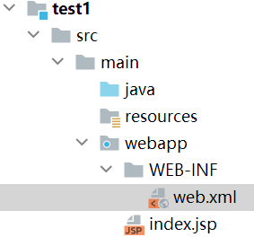
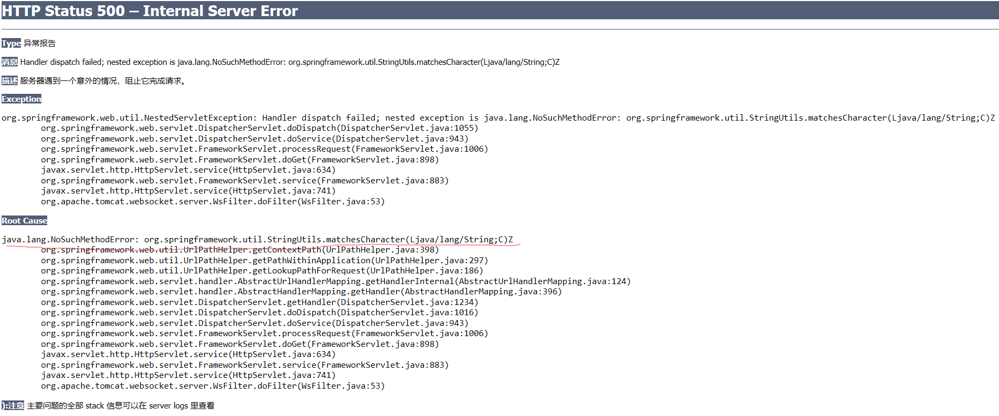

[TOC]


# 2. Hello World

## 2.0	导入依赖JAR包

SpringMVC是Spring的Web模块，所有模块的运行都要依赖核心模块（IOC模块），因此要导入的包分为：

1. 核心容器模块（IOC模块）
2. Web模块

**详见SpringMVC-0.导入依赖JAR包**

## 2.1	XML配置

在src- main - webapp - WEB-INF - web.xml中配置：

```xml
<?xml version="1.0" encoding="UTF-8"?>
<web-app xmlns="http://xmlns.jcp.org/xml/ns/javaee"
         xmlns:xsi="http://www.w3.org/2001/XMLSchema-instance"
         xsi:schemaLocation="http://xmlns.jcp.org/xml/ns/javaee http://xmlns.jcp.org/xml/ns/javaee/web-app_4_0.xsd"
         version="4.0">
</web-app>
<!--正常配置应如上 若有不同则参照此代码-->
```

SpringMVC的思想是通过前端控制器拦截所有请求，再由前端控制器智能派发

这里的前端控制器是一个servlet，我们需要在web.xml中配置这个servlet来拦截所有请求：

我们在web.xml中要实现：

1. 配置SpringMVC前端控制器
2. 指定SpringMVC配置文件位置

```xml
<!--创建前端控制器-->
    <servlet>
        <servlet-name>FrontController</servlet-name>
        <servlet-class>org.springframework.web.servlet.DispatcherServlet</servlet-class>
        <!--标明这是servlet中的前端控制器-->
        <init-param><!--初始化前端控制器-->
            <!--contextConfigLocation：指定SpringMVC配置文件位置-->
            <param-name>contextConfigLocation</param-name>
            <param-value>classpath:springmvc.xml</param-value>
            <!--需要在resources文件夹下建立对应名称的SpringConfig类型XML文件-->
        </init-param>
        <!--servlet启动加载，servlet原本是第一次访问创建对象
        load-on-startup表示服务器启动时创建对象
        标签中的值表示优先级，数值越小，优先级越高，越先创建对象-->
        <load-on-startup>1</load-on-startup>

    </servlet>
<!--servlet的路径映射配置-->
    <servlet-mapping>
        <servlet-name>FrontController</servlet-name>
        <url-pattern>/</url-pattern>
<!--标明当前前端控制器可以拦截哪些请求
    "/"或"/*"表示拦截所有请求
    但/*还会拦截*.jsp请求，一旦拦截jsp页面将不能显示
    而/则可以保证jsp访问正常-->
    </servlet-mapping>
```

再到springmvc.xml中进行SpringMVC的配置：

```xml
<?xml version="1.0" encoding="UTF-8"?>
<beans xmlns="http://www.springframework.org/schema/beans"
       xmlns:xsi="http://www.w3.org/2001/XMLSchema-instance"
       xmlns:context="http://www.springframework.org/schema/context"
       xsi:schemaLocation="http://www.springframework.org/schema/beans http://www.springframework.org/schema/beans/spring-beans.xsd http://www.springframework.org/schema/context https://www.springframework.org/schema/context/spring-context.xsd">
</beans>
<!--这是默认生成的SpringConfig文件内容，若不同按以上代码为准-->
```

通过XML配置扫描组件：

```xml
<!--扫描所有组件-->
<context:component-scan base-package="com.example"/>
```

## 2.2	JSP配置

在webapp-index.jsp中添加测试代码：

```xml
<body>
    <a href="hello">Hello</a>
</body><!--这里的<a>标签href属性会发出对应请求，这里就是发出hello请求-->
```

在WEB-INF下创建目录pages，用于存放展示页面

在pages中创建success.jsp文件，用于响应hello请求：

```xml
<body>
    <h1>访问成功！</h1>
</body>
```

## 2.3	控制器类配置

创建一个控制器类UserController：

```java
@Controller//标志这是一个Controller控制器组件
public class UserController {

    @RequestMapping("/hello")
    //表示该方法会处理当前项目下的hello请求
    public String hello(){
        System.out.println("已经收到请求");
        return "/WEB-INF/pages/success.jsp";
    }
}
```

## 2.4	NoSuchMethod错误及解决

运行程序：



这里出现了错误：

```java
java.lang.NoSuchMethodError: org.springframework.util.StringUtils.matchesCharacter(Ljava/lang/String;C)Z
```

经过检查后发现问题出现在依赖spring-core包中，原包版本为5.2.1，我们更换到5.2.9后问题得以解决，之前的pom配置代码已经更正过来了。


## 2.5	视图解析器配置

回到控制器类UserController中，可以看到，响应hello请求的hello()函数返回的字符串很长，但对于响应不同请求需要展示的页面只有.jsp之前的文件名不同。

因此我们可以在SpringMVC的配置文件springmvc.xml中，配置一个视图解析器，用来帮我们缩短书写的路径长度：

```xml
<!--配置视图解析器 可以简化方法返回值，返回值就作为目标页面地址
    prefix属性表示前缀
    suffix属性表示后缀-->
<bean class="org.springframework.web.servlet.view.InternalResourceViewResolver">
    <property name="prefix" value="/WEB-INF/pages/"/>
    <property name="suffix" value=".jsp"/>
</bean>
```

相较于之前返回的字符串"/WEB-INF/pages/success.jsp"，在配置好视图解析器后，只需要返回"success"即可。


## 2.6	总结

### 2.6.1	运行流程

​	（1）客户端点击链接hello，发送http://localhost:8080/springmvc/hello请求

​	（2）来到Tomcat服务器

​	（3）SpringMVC前端控制器收到请求

​	（4）前端控制器查看请求地址并匹配对应的RequestMapping标注的方法

​	（5）前端控制器找到目标处理器类和目标方法，直接利用返回执行目标方法

​	（6）方法执行完成后产生返回值，SpringMVC会认为该返回值就是要去的页面地址

​	（7）拿到方法返回值后，通过视图解析器拼串，得到完整的页面地址

​	（8）获取到完整页面地址后，前端控制器帮我们转发到页面


### 2.6.2	@RequestMapping

#### 2.6.2.1	@RequestMapping的value属性

@RequestMapping注解告诉SpringMVC，这个方法用来处理对应的请求，如@RequestMapping("/hello")可以处理hello请求，这里的"/"可以不写，但为了保持与网页URL的对应，我们习惯把它加上。

#### 2.6.2.2	@RequestMapping的标注位置

要注意，@RequestMapping注解可以标注在类上。

​	当标注在类上时，它表示为当前类的所有方法的请求地址指定一个基准路径；

​	而标注在方法上时，它表示该方法响应对应的请求。

如：

```java
@RequestMapping("/haha")//在类上使用@RequestMapping注解
class UserController{
	@RequestMapping("/hello")
	public void hello(){
	}//这里表示能响应/haha/hello请求
	
	@RequestMapping("/bye")
	public void bye(){
	}//这里表示能响应/haha/bye请求
}
```

```java
class UserController{//不在类上使用@RequestMapping注解
	@RequestMapping("/hello")
	public void hello(){
	}//这里表示能响应/hello请求
}
```

#### 2.6.2.3	@RequestMapping的其他属性

@RequestMapping注解还拥有其他的属性：

1.method：限定请求方式（GET、POST等），默认状态为接收全部方式的请求。

> ​	当method=RequestMethod.POST时，只接受POST类型的请求

> ​	注意:当不是规定的方式报错：错误代码4XX：都是客户端错误

2.params：规定请求参数

​	params和headers支持简单的表达式：

> 1. ​		param1：表示请求必须包含名为param1的请求参数
>
>    > eg：params={"username"}表示发送请求时必须带上一个名为username的参数，若没有则404报错
>
>       
>
> 2. ​       !param1：表示请求不能包含名为param1的请求参数
>
>    > eg：params={"!username"}表示发送请求时不能有名为username的参数，若有则404报错
>
>    ​      
>
> 3. ​       param1 != value1：表示请求可以包含名为param1的请求参数，但其值不能为1
>
>    > eg1：params={"username = 123"}表示发送请求时必须要有名为username的参数且值为123，否则404报错
>    >
>    > eg2：params={"username != 123"}表示发送请求时可以有名为username的参数但其值不能为123，否则404报错（没有username或username不为123时不会报错）
>
> 4. ​      {"param1 = value1", "param2"}表示请求必须包含名为param1和param2的请求参数，且param1值必须为value1
>
>    > eg：params={"username != 123", "pwd"}表示请求的username不能是123且必须有pwd

3.headers：规定请求头，也与params相近，能写简单的表达式

比如可以规定请求头中的User-Agent字段的参数，来限定可以访问页面的浏览器种类

4.consumes：只接受内容类型是哪种的请求，规定请求头的Content-Type

5.produces：告诉浏览器返回的内容类型是什么，给响应头加上Content-Type：text/html;charset=utf-8


#### 2.6.2.4	@RequestMapping模糊匹配功能

URL地址可以写模糊的通配符：

?：能替代任一字符

*：能替代任意多个字符，和一层路径

**：能替代多层路径

```java
@Controller
public class RequestMappingController {
    //注意：同时有精确和模糊多种情况时，精确匹配优先，模糊匹配中越精确越优先
    //精确匹配
    @RequestMapping("/antTest01")
    public String antTest1(){
        System.out.println("antTest01");
        return "success";
    }

    //?代替一个字符 0个或多个都不行
    @RequestMapping("/antTest0?")
    public String antTest2(){
        System.out.println("antTest02");
        return "success";
    }

    //*代替任意多个字符
    @RequestMapping("/antTest0*")
    public String antTest3(){
        System.out.println("antTest03");
        return "success";
    }

    //*匹配一层路径
    @RequestMapping("/a*/antTest04")
    public String antTest4(){
        System.out.println("antTest04");
        return "success";
    }

    //**匹配任意多层路径
    @RequestMapping("/a/**/antTest05")
    public String antTest5(){
        System.out.println("antTest05");
        return "success";
    }
}
```


### 2.6.3	SpringMVC默认配置文件

​	在SpringMVC中，如果在web.xml中没有指定对应的配置文件，则会默认去WEB-INF下找一个对应的默认配置文件：xxx-servlet.xml，xxx是配置的前端控制器的name属性。

​	因此，如果不想指定对应配置文件，应当在WEB-INF下建立名为前端控制器name属性-servlet.xml的配置文件


### 2.6.4	url-pattern

```xml
<servlet-mapping>
        <servlet-name>FrontController</servlet-name>
        <url-pattern>/</url-pattern>
</servlet-mapping><!--前端控制器的路径映射配置-->
```

1.在<url-pattern>标签中，"/"表示拦截所有请求，但不拦截jsp页面和*.jsp请求

"/*"会拦截所有请求，包括jsp页面和*.jsp请求


2.在Tomcat中有一个web.xml，它是项目中web.xml的父类，它的url-pattern值为"/"。

Tomcat中有一个DefaultServlet类，用于处理静态资源

> 静态资源就是除了jsp和Servlet之外的其他所有资源

当我们配置前端控制器的url-pattern值为"/"时，前端控制器会禁用Tomcat中的DefaultServlet类，此时Tomcat无法处理静态资源，此时静态资源来到前端控制器DispatcherServlet，寻找与其请求对应的@RequestMapping注解。

同时Tomcat中还有一个JSPServlet类用于处理JSP资源，此时前端控制器url-pattern值为"/"时，前端控制器没有覆盖掉Tomcat中的JSPServlet类配置，因此JSP资源可以正常访问。