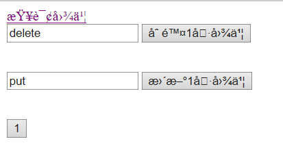
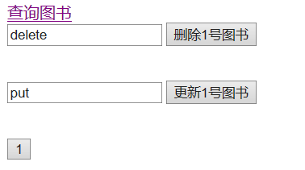
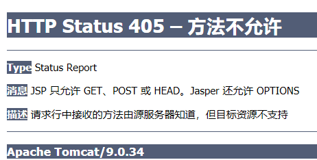

[TOC]


# 3.	REST风格的URL

## 3.1	@PathVariable

@PathVariable能映射URL绑定的占位符，通过@PathVariable可以将URL中占位符参数绑定到控制器处理方法的入参中

> 带占位符的URL是Spring3新增功能

```java
//URL路径上可以使用占位符，格式为{变量名}
//路径上的占位符只能表示一层路径
@RequestMapping("/user/{id}")
public String pathVariableTest(@PathVariable("id") String id){
    System.out.println(id);
    return "success";
}
```

## 3.2	REST

### 3.2.1	REST风格的URL

REST,即表述性状态传递（Representational State Transfer）

> REST由三个名词组成：Resources、Representation、State Transfer
>
> 1.Resources（资源）：每种资源对应一个特定的URI（统一资源定位符），因此URI就是每个资源独一无二的识别符
>
> 2.Representation（表现层）：把资源具体呈现出来的形式
>
> 3.State Transfer（状态转化）：每发出一个请求，就代表客户端和服务器的一次交互。HTTP协议中，四种操作方式：GET（获取资源）、POST（新建资源）、PUT（更新资源）、DELETE（删除资源）

REST希望用简洁的URL发送请求，实现对资源的增删改查：

|     普通URL      | REST风格的URL | 请求类型 |    意图     |
| :--------------: | :-----------: | :------: | :---------: |
|  /getBook?id=1   |    /book/1    |   GET    | 查询1号图书 |
| /deleteBook?id=1 |    /book/1    |  DELETE  | 删除1号图书 |
| /updateBook?id=1 |    /book/1    |   PUT    | 更新1号图书 |
|     /addBook     |     /book     |   POST   |  添加图书   |

REST风格的URL以简洁的URL提交请求，以请求方式区分对资源的操作。

### 3.2.2	使用REST进行增删改查

#### 3.2.2.1	SpringMVC配置

新建一个项目，在web.xml中配置前端控制器：

```xml
<?xml version="1.0" encoding="UTF-8"?>
<web-app xmlns="http://xmlns.jcp.org/xml/ns/javaee"
         xmlns:xsi="http://www.w3.org/2001/XMLSchema-instance"
         xsi:schemaLocation="http://xmlns.jcp.org/xml/ns/javaee http://xmlns.jcp.org/xml/ns/javaee/web-app_4_0.xsd"
         version="4.0">
  <servlet>
    <servlet-name>springmvc</servlet-name>
      <!--省略SpringMVC配置文件位置，则默认寻找名为<servlet-name>-servlet.xml的配置文件-->
    <servlet-class>org.springframework.web.servlet.DispatcherServlet</servlet-class>
    <load-on-startup>1</load-on-startup>
  </servlet>
  <servlet-mapping>
    <servlet-name>springmvc</servlet-name>
    <url-pattern>/</url-pattern>
  </servlet-mapping>
</web-app>
```

在web.xml中定义的springmvc-servlet.xml中配置组件扫描和视图解析器：

```xml
<?xml version="1.0" encoding="UTF-8"?>
<beans xmlns="http://www.springframework.org/schema/beans"
       xmlns:xsi="http://www.w3.org/2001/XMLSchema-instance"
       xmlns:context="http://www.springframework.org/schema/context"
       xsi:schemaLocation="http://www.springframework.org/schema/beans http://www.springframework.org/schema/beans/spring-beans.xsd http://www.springframework.org/schema/context https://www.springframework.org/schema/context/spring-context.xsd">
    <context:component-scan base-package="com.example"/>
    <bean class="org.springframework.web.servlet.view.InternalResourceViewResolver">
        <property name="prefix" value="/WEB-INF/pages"/>
        <property name="suffix" value=".jsp"/>
    </bean>
</beans>
```

#### 3.2.2.2	页面配置

在index.jsp中加入测试请求：

```jsp
<html>
<body>
<%--发起图书的增删改查请求:使用REST风格的URL地址--%>
<%--/book/1 GET请求：查询1号图书--%>
<a href="book/1">查询图书</a><br/>
<%--/book POST请求：新增1号图书--%>
<form action="book" method="post">
    <input type="submit" value="1">
</form>
</body>
</html>
```

在WEB-INF下创建目录pages，并在pages中建立文件success.jsp：

```jsp
<%@ page contentType="text/html;charset=UTF-8" language="java" %>
<html>
<head>
    <title>Title</title>
</head>
<body>
    访问成功
</body>
</html>
```

#### 3.2.2.3	控制器类配置

创建控制器类BookController：

```java
@Controller
public class BookController {
    @RequestMapping(value = "/book/{bid}",method = RequestMethod.POST)//使用占位符简化代码
    public String addBook(@PathVariable("bid") String bid){//使用method限定响应的请求类型
        System.out.println("新增了图书");
        return "success";
    }//新增图书

    @RequestMapping(value = "/book/{bid}",method = RequestMethod.DELETE)
    public String deleteBook(@PathVariable("bid") String bid){
        System.out.println("删除了"+bid+"号图书");
        return "success";
    }//删除图书

    @RequestMapping(value = "/book/{bid}",method = RequestMethod.PUT)
    public String updateBook(@PathVariable("bid") String bid){
        System.out.println("更新了"+bid+"号图书");
        return "success";
    }//更新图书

    @RequestMapping(value = "/book/{bid}",method = RequestMethod.GET)
    public String getBook(@PathVariable("bid") String bid){
        System.out.println("查询到了"+bid+"号图书");
        return "success";
    }//查询图书
}
```

#### 3.2.2.4	Spring对REST的支持

```jsp
<%--/book/1 DELETE请求：删除1号图书--%>
<a href="book/1">删除图书</a><br/>
<%--/book/1 PUT请求：更新1号图书--%>
<a href="book/1">更新图书</a><br/>
```

对于以上代码，我们没有指定<a>标签的method属性，因此它们都将向服务器发送GET请求，这显然不符合我们的要求。

为了更好地实现REST风格的URL，Spring提供了支持：

（1）SpringMVC提供了一种填充器，可以把普通的请求转为规定形式的请求，要使用这个filter，我们需要在web.xml中进行配置：

```xml
<filter>
    <filter-name>HiddenHttpMethodFilter</filter-name>
    <filter-class>org.springframework.web.filter.HiddenHttpMethodFilter</filter-class>
</filter>
<filter-mapping>
    <filter-name>HiddenHttpMethodFilter</filter-name>
    <url-pattern>/*</url-pattern>
</filter-mapping>
```

查看**HiddenHttpMethodFilter**类的源码，其中有方法doFilterInternal()：

```java
protected void doFilterInternal(HttpServletRequest request, HttpServletResponse response, FilterChain filterChain) throws ServletException, IOException {
    HttpServletRequest requestToUse = request;
    //判断是否为POST表单，且servlet不报错
    if ("POST".equals(request.getMethod()) && request.getAttribute("javax.servlet.error.exception") == null) {
        //获取表单上_method的值
        String paramValue = request.getParameter(this.methodParam);
        
        if (StringUtils.hasLength(paramValue)) {
            //转为PUT、DELETE
            String method = paramValue.toUpperCase(Locale.ENGLISH);
            if (ALLOWED_METHODS.contains(method)) {
                //重写了requestToUse.getMethod()方法
                requestToUse = new HiddenHttpMethodFilter.HttpMethodRequestWrapper(request, method);
            }
        }
    }
	//requestToUse.getMethod()==PUT/DELETE
    filterChain.doFilter((ServletRequest)requestToUse, response);
}//若不满足这些if判断条件，则filter直接放行，即只处理POST表单
```

（2）如何发送其他形式的请求？

​		1）创建一个post类型的<form>表单

​		2）表单中携带一个_method参数

​		3）_method的值为DELETE、PUT

将上述代码修改为：

```jsp
<%--/book/1 DELETE请求：删除1号图书--%>
<form action="book/1" method="post">
    <input name="_method" value="delete"><!--不区分大小写-->
    <input type="submit" value="删除1号图书">
</form><br/>
<%--/book/1 PUT请求：更新1号图书--%>
<form action="book/1" method="post">
    <input name="_method" value="put"><!--不区分大小写-->
    <input type="submit" value="更新1号图书">
</form><br/>
```

运行结果为：



#### 3.2.2.5	更改页面编码格式

可以看到，index页面出现了乱码，我们有几种方法可以解决：

（1）在展示页面更改页面编码：

```jsp
<%@ page contentType="text/html;charset=UTF-8" language="java" %>
<meta http-equiv="Content-Type" content="text/html;charset=UTF-8"/>
<%将index.jsp的编码格式改变为utf-8%>
```

（2）修改Tomcat根目录下conf文件夹中server.xml中配置

```xml
<Connector port="8080" protocol="HTTP/1.1" <!--这里添加编码格式URIEncoding="utf-8"-->
               connectionTimeout="20000"
               redirectPort="8443" />
```

（3）在web.xml中配置Spring的编码过滤器，防止SpringMVC中post方式提交的时候中文乱码

```xml-dtd
<!-- 配置编码方式过滤器,注意一点:要配置在所有过滤器的前面 -->
<filter>
  <filter-name>CharacterEncodingFilter</filter-name>
  <filter-class>org.springframework.web.filter.CharacterEncodingFilter</filter-class>
  <init-param>
    <param-name>encoding</param-name>
    <param-value>utf-8</param-value>
  </init-param>
</filter>
<filter-mapping>
  <filter-name>CharacterEncodingFilter</filter-name>
  <url-pattern>/*</url-pattern>
</filter-mapping>
```

再次运行：



#### 3.2.2.6	Tomcat8+拒绝PUT、DELETE请求

选择删除1号图书或更新1号图书时，会出现

这个错误是由于Tomcat8及以上版本会拒绝DELETE和PUT请求

改正方法：在要访问的页面添加配置属性isErrorpage="true"即可：

```jsp
<%@ page contentType="text/html;charset=UTF-8" language="java"
isErrorPage="true" %>
```