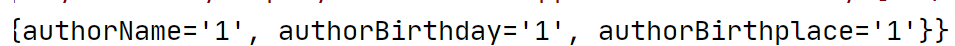

[TOC]


# 4.	请求处理

## 4.1	SpringMVC如何获取请求带来的信息

### 4.1.1	@RequestParam

#### 4.1.1.1	@RequestParam的使用

@RequestParam用于获取请求参数

默认方式获取请求参数：直接给方法入参上写一个和请求参数名相同的变量，这个变量来接收请求参数的值

若带参数则变量有值，若不带则变量值为null

> 例：使用@RequestParam注解
>
> 在index.jsp中添加测试：
>
> ```jsp
> <a href="hello01?username=tomcat">hello01</a>
> ```
>
> 在HelloController中添加相应方法：
>
> ```java
> @RequestMapping("/hello01")
> public String hello01(String username){
>     System.out.println("参数为"+username);
>     return "success";
> }
> ```
>
> 我们也可以在方法形参前加上@RequestParam注解来为我们的变量起别名或简称：
>
> ```java
> public String hello01(@RequestParam("user") String username)
>     //即 username = request.getParam("user");
> ```
>
> **注意：@RequestParam注解默认URL必须携带参数，否则报错**

#### 4.1.1.2	@RequestParam注解源码

在@RequestParam注解源码中有以下变量：

|    变量名    |                         作用                         |
| :----------: | :--------------------------------------------------: |
|    value     |                指定要获取的参数的key                 |
|   required   |  要获取的该参数是否必须，默认为true，即不带参则报错  |
| defaultVaule | 默认值。若不设置则不带参为null，指定后不带参为默认值 |


#### 4.1.1.3	@RequestParam与@PathVariable的区别

@RequestParam用于获取请求参数，@PathVariable用于获取路径中的占位符

URL通过在路径后加?和入参来传递参数，@RequestParam只能获取到?后的值，而@PathVariable只能获取到路径上的占位符。

例：username/{id}?username=admin

@RequestParam只能获取到username=admin，而@PathVariable只能获取到id


### 4.1.2	@RequestHeader

@RequestHeader用于获取请求头中某个key的值，

使用@RequestHeader注解：

```java
@RequestMapping("/hello01")//获取请求头中的浏览器信息(User-Agent)
public String hello01(@RequestHeader("User-Agent") String useragent ){
    System.out.println("请求头中的浏览器信息为"+useragent);
    return "success";
}
//传统获取方式request.getHeader("User-Agent")

//@RequestHeader("User-Agent") String useragent相当于
//useragent = request.getHeader("User-Agent")
```


### 4.1.3	@CookieValue

#### 4.1.3.1	@CookieValue的使用

@CookieValue用于获取某个Cookie的值

传统操作：

```java
Cookie[] cookies = request.getCookies();//获取全部Cookie
for(Cookie c:cookies){//遍历Cookie
	if(c.getName.equals("JSESSIONID")){//若找到了对应Cookie
		String cookieValue = c.getValue();//获取Cookie值
	}
}
```

使用@CookieValue：

```java
@RequestMapping("/hello01")
public String hello01(@CookieValue("JSESSIONID") String jid){
    System.out.println("Cookie中JSESSIONID为"+jid);
    return "success";
}
```

#### 4.1.3.2	@CookieValue注解源码

在注解源码中有以下变量：value、required、defaultValue，使用方法与@RequestParam相同，这里不多赘述。


## 4.2	传入POJO

### 4.2.1	传入POJO

在index.jsp中添加测试代码：

```jsp
<form action="book" method="post">
    书名：<input type="text" name="bookName"><br/>
    价格：<input type="text" name="price"><br/>
    作者：<input type="text" name="author"><br/>
    库存：<input type="text" name="stock"><br/>
    销量：<input type="text" name="sales"><br/>
    <input type="submit">
</form>
```

可以看到要传入的数据很多，如果只通过对应的变量传入会很麻烦，因此我们可以建立一个Book类，将书的各种属性放在里面，并生成对应的get和set方法：

```java
public class Book {
    private String bookName;
    private String author;
    private Double price;
    private Integer stock;
    private Integer sales;
}
```

这样我们只需要传入一个Book对象就可以获取各项属性了，在HelloController中添加对应方法：

```java
@RequestMapping("/book")
public String addBook(Book book){//直接传入Book对象
    System.out.println("要添加的书："+book);
    return "success";
}
```

运行结果如图：

### 4.2.2	POJO类型请求参数

如果我们的请求参数为POJO，那么SpringMVC会自动为这个POJO进行赋值。

（1）对POJO中的每一个属性，SpringMVC会尝试将其从request参数中获取出来并封装

（2）SpringMVC还支持级联封装属性的属性

> 例：
>
> 将表单内容改为：
>
> ```jsp
> <form action="book" method="post">
>     书名：<input type="text" name="bookName"><br/>
>     价格：<input type="text" name="price"><br/>
>     作者：<input type="text" name="author"><br/>
>     库存：<input type="text" name="stock"><br/>
>     销量：<input type="text" name="sales"><br/>
>     <hr/><!--这里的authorInfo指的是Book类中的authorInfo变量-->
>     作者姓名：<input type="text" name="authorInfo.authorName"><br/>
>     作者生日：<input type="text" name="authorInfo.authorBirthday"><br/>
>     作者籍贯：<input type="text" name="authorInfo.authorBirthplace"><br/>
>     <input type="submit">
> </form>
> ```
>
> 创建作者信息AuthorInfo类，并生成get和set，toString方法
>
> ```java
> public class AuthorInfo {
>     private String authorName;
>     private String authorBirthday;
>     private String authorBirthplace;
> }
> ```
>
> 在Book类中修改：
>
> ```java
>  private AuthorInfo authorInfo;
> ```
>
> 并在Book类中生成authorInfo的get和set方法，重新生成toString()方法
>
> 运行结果如图：
>
> 


## 4.3	原生API

SpringMVC可以直接在参数上写原生API，MVC能接受的ServletAPI类型参数：	

（1）HttpServletRequest

（2）HttpSession

（3）HttpServletResponse

上面三种比较常用，其他的不常用：

（4）java.security.Principal：安全有关，这里不做解释

（5）Locale：国际化有关的区域信息

（6）InputStream：输入字节流

```java
ServletInputStream inputStream = request.getInputStream();
```

（7）OutputStream：输出字节流		

```java
ServletOutputStream outputStream = response.getOutputStream();
```

（8）Reader：读取字符流

```java
BufferedReader reader = request.getReader();
```

（9）Writer

```java
PrintWriter writer = response.getWriter();
```

导入JAR包servlet-api：

```xml
<dependency>
    <groupId>javax.servlet</groupId>
    <artifactId>servlet-api</artifactId>
    <version>2.4</version>
    <scope>provided</scope>
</dependency>
```

### 4.3.1	HttpServletRequest和HttpSession

在控制器类HelloController中添加方法：

```java
@RequestMapping("hello01")
public String hello01(HttpSession session, HttpServletRequest request){
    request.setAttribute("reqParam","我是请求域中的");
    session.setAttribute("sessionParam","我是Session域中的");
    return "success";
}
```

在success.jsp中使用EL表达式：

```jsp
session：${sessionScope.sessionParam}
请求:${requestScope.reqParam}
```
