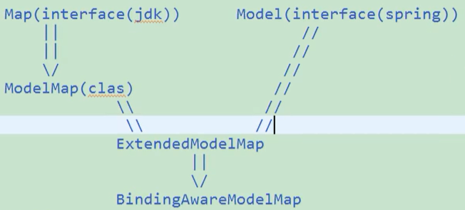
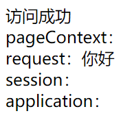
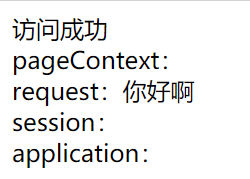
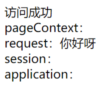
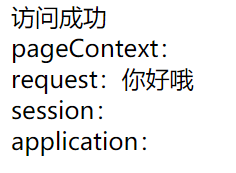
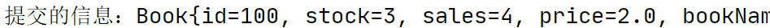
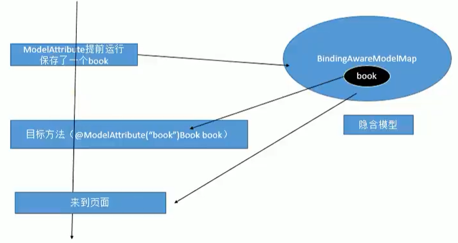
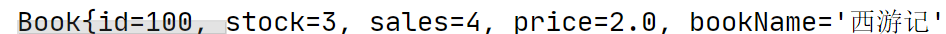

[TOC]


# 5.	数据输出

数据输出就是把数据带给页面

传统方法是使用原生API，用Request和Session将数据带个页面

使用SpringMVC还有其他的方法：

（1）可以在方法传入Map、Model或者ModelMap，这些参数里保存的数据都会放在***Request域***中

> 在使用Map、Model、ModelMap时，最终工作的都是BindingAwareModelMap，相当于向BindingAwareModelMap保存的数据都放在了Request请求域中
>
> 他们的关系如图：

（2）方法的返回值可以变为ModelAndView类型，数据传递到***Request请求域***中

> ModelAndView类既包含视图信息（页面地址），又包含模型数据（向页面传递的数据）

（3）SpringMVC中提供了可以临时向Session域保存数据的方式：@SessionAttributes注解

## 5.1	用Map、Model和ModelMap传递数据

### 5.1.1	用Map传递数据

在index.jsp中添加请求：

```jsp
<a href="handle01">handle01</a><br/>
```

建立OutputController，添加handle01的响应方法：

```java
@Controller
public class OutputController {
    @RequestMapping("/handle01")
    public String handle01(Map<String,Object> map){
        map.put("msg","你好");//使用Map输出数据
        return "success";
    }
}
```

在success.jsp中获取四个域的值，看看Map传递的值在哪个域：

```jsp
<!--在四个域中访问 看看值传递到了哪里-->
pageContext：${pageScope.msg}<br/>
request：${requestScope.msg}<br/>
session：${sessionScope.msg}<br/>
application：${applicationScope.msg}<br/>
```

运行结果：，可以看出，Map传递的值到了request域

### 5.1.2	Model

Model是一个接口，我们可以使用addAttribute()方法向其中存储数据，可以使用S-O键值对，也可以使用Map传参

在OutputController中添加测试用响应方法：

```java
@RequestMapping("/handle02")
public String handle01(Model model){
    model.addAttribute("msg","你好啊");
    return "success";
}
```

可见，Model传递的数据也到了request域


### 5.1.3	ModelMap

测试代码同上：

```java
@RequestMapping("/handle03")
public String handle02(ModelMap modelMap){
    modelMap.addAttribute("msg","你好呀");
    return "success";
}
```

ModelMap传递的值也到了Request域

## 

## 5.2	用ModelAndView传递数据

ModelAndView类既包含视图信息（页面地址），又包含模型数据（向页面传递的数据）

添加请求回应方法：

```java
@RequestMapping("/handle04")
//响应方法返回值类型为ModelAndView时可以传递数据
public ModelAndView handle02(){
    //之前返回的字符串就是ModelAndView构造函数传入的视图名viewName
    //视图解析器最终会将视图名拼串得到页面的真实地址
    ModelAndView modelAndView = new ModelAndView("success");
    //可以通过有参构造函数传递视图名来跳转页面
    //也可以先使用无参构造函数实例化ModelAndView对象，再使用setViewName(String str)方法设置视图名
    modelAndView.addObject("msg","你好哦");
    return modelAndView;
}
```

可以看到，数据也传递到了Request请求域中


## 5.3	用@SessionAttributes注解传递数据（已过时）

@SessionAttributes注解需要标记在类上使用

@SessionAttributes注解用于向Session域临时保存数据

@SessionAttributes注解有两个值value、types，通过这两个值指定传递到Session域的数据

被指定的数据除了传递到Session域也会传递到Request域

（1）value指定保存数据时，要向Session域传递的数据的key

```java
@SessionAttributes(value={"msg","haha"})
//此时传递的数据key为"msg","haha"的都将传递到Session域，不在value中的不会被传递到Session域
```

（2）types指定保存数据时，要向Session域传递的数据的类型

```java
@SessionAttributes(types={String.class})
//此时传递的类型为String的数据会被传递到Session域
```

要注意：

@SessionAttributes注解已经过时，使用该注解传递数据可能会导致异常。

要向Session域传递数据请使用Servlet原生API


## 5.4	@ModelAttribute（已过时）

方法入参标注@ModelAttribute注解后，入参对象就会放入数据模型中。

```java
/*
    测试ModelAttribute注解：
    使用场景：书城的图书修改为例
    1)页面端:
        显示要修改的图书信息，图书的所有字段都在

    2)Servlet收到修改请求，调用DAO：
    String sql = "update bs_book set title=?,author=?,price=?
    sales=?,stock=?,img_path=?,where id=?";
 */
```

### 5.4.1	直接通过传递对象来传递数据

在index.jsp中添加测试表单：

```jsp
<form action="updateBook" method="post">
    <input type="hidden" name="id" value="100"/>
    书名：西游记<br/>
    作者：<input type="text" name="author"/>
    价格：<input type="text" name="price"/>
    库存：<input type="text" name="stock"/>
    销量：<input type="text" name="sales"/>
    <input type="submit" value="提交修改信息"/>
</form>
```

建立Book类，并生成对应的get、set方法和toString方法

```java
public class Book {
    private Integer id;
    private Integer stock;
    private Integer sales;
    private Double price;
    private String bookName;
    private String author;
}
```

建立控制器类ModelAttributeTestController，并添加对应的响应方法：

```java
@Controller
public class ModelAttributeTestController {
    @RequestMapping("/updateBook")
    public String updateBook(Book book){//直接传递Book对象
        System.out.println("提交的信息："+book);
        return "success";
    }
}
```

运行结果：

```java
 /*
 3)实际上并不需要修改全字段，只需要修改部分字段
        1.不想修改的字段，不要在页面中展示；如果想要展示，不要提供修改输入框
        2.为简单起见，Controller直接在参数位置写Book对象
        3.Spring为我们自动封装了book(没有带的值是null)
        4.如果接下来调用了一个全字段更新的DAO操作，会将其他操作可能变为null。
        因为有些值没有获取，传递回来的值为null，直接更新会用null替换掉原值
        可以对book内的数据进行判空：
        	sql = "update bs_book set";
        	if(book.getBookName()){ sql+="bookName=?," }
        这种方法太麻烦了
4)如何能保证全字段更新的时候，只更新页面携带的数据？
        1.修改DAO代价很大
        2.Book对象是如何封装的？
            (1)SpringMVC创建一个Book对象，每个属性都有默认值，bookName就是null
                I.可以先让SpringMVC不创建Book对象，直接从数据库中取出id=100的Book对象信息
                II.Book{id=100, stock=3, sales=4, price=2.0, bookName='null', author='1'}
            (2)将请求中所有与book对应的属性一一设置
                III.使用刚才从数据库取出的book对象，给其中设置值（即只覆盖请求参数中携带的值）
                IV.携带的字段就改为携带的值，没携带的字段保持原值
            (3)全字段更新就有问题：
                V.将之前从数据库中查到的，并且封装了请求参数的对象，进行保存
       这就是@ModelAttribute的工作原理
 */
```

### 5.4.2	使用@ModelAttribute解决问题

> 1.SpringMVC要封装的请求参数的Book对象，不是自己new出来的Book对象，而是***从数据库中拿到的***已经准备好的对象
>
> 2.拿到对象后，使用这个对象封装请求参数

@ModelAttribute注解可以在参数和方法上标注

​	（1）在参数上标注：取出保存的数据

​	（2）在方法上标注：这个方法将会提前于目标方法先运行

​				1）提前使用这个方法调用数据库，从数据库中得到对应的信息

​				2）将这个方法保存起来，方便下一个方法还能使用

> 例：
>
> 首先我们应使用一个有@ModelAttribute标注的方法，在页面请求响应方法运行之前，先运行被标注方法，使用数据库查询对应对象：
>
> ```java
> @ModelAttribute
> public void preModelAttribute(Map<String,Object> map){
>  Book book = new Book(100,1,2,3.0,"西游记","吴承恩");
>  System.out.println("从数据库中得到的图书："+book);
>  //通过有参构造方法，假装这里使用了数据库查询
>  map.put("book",book);
>  System.out.println("ModelAttribute方法查询了图书并进行了保存");
>  //假装对查询到的信息进行了保存
> }
> ```
>
> 现在我们需要告诉SpringMVC，不要new一个Book对象，而是使用我们查询到的Book对象
>
> 这时需要使用@ModelAttribute标注控制器类的参数Book对象
>
> ```java
> @Controller
> public class ModelAttributeTestController {
>     @RequestMapping("/updateBook")
>     public String updateBook(@ModelAttribute("book") Book book){//直接传递Book对象
>         //这里@ModelAttribute中的book指的是被@ModelAttribute标注的方法中
>         //Map传递的数据中的"book"key
>         System.out.println("提交的信息："+book);
>         return "success";
>     }
> ```


### 5.4.3	@ModelAttribute的原理



1.@ModelAttribute标注的方法提前运行，在BindingAwareModelMap中保存了一个book对象

2.目标方法通过@ModelAttribute标注的参数取出在BindingAwareModelMap中保存的book对象

3.在页面中可以获取到book对象

4.从过程1-3中，我们始终在使用同一个book对象，这保证了全字段更新不会影响到不需要修改的字段

这里的BindingAwareModelMap被称为隐含模型

### 5.4.4	@ModelAttribute的其他使用方法

1.当@ModelAttribute注解的方法返回的对象对应的key与处理器对应方法中的参数名相同时，可以省略处理器方法中参数前的@ModelAttribute标注：

```java
@RequestMapping("/updateBook")
public String updateBook(Book book){//参数不使用@ModelAttribute注解标注时
    System.out.println(book);//SpringMVC会去@ModelAttribute注解标注的方法中寻找有无同名对象
    //若有则直接使用，若无则new一个对象
    return "success";
}
@ModelAttribute
public void preModelAttribute(Map<String,Object> map){
    Book book = new Book(100,1,2,3.0,"西游记","吴承恩");
    map.put("book",book);//不使用@ModelAttribute注解标注的参数名必须与key值对应
}
```



2.@ModelAttribute注解标注的方法可以添加value并直接用返回值返回对象来替代Map传递对象，在处理器方法中用@ModelAttribute标注的对应key的参数中获取：

```java
@RequestMapping("/updateBook")
public String updateBook(@ModelAttribute("haha") Book book){
    System.out.println(book);//@ModelAttribute标注的对应key的参数会获取到返回的对象
    return "success";
}
@ModelAttribute("haha")//添加注解value"haha"
public Book preModelAttribute(Map<String,Object> map){
    Book book = new Book(100,1,2,3.0,"西游记","吴承恩");
    //map.put("book",book); 不使用Map传递对象
    return book;//直接用返回值返回对象
}
```


我们更推荐使用Map传递对象，而不是用返回值传递，因为Map能传递多个对象，而返回值只能传递一个。

@ModelAttribute注解标注的方法会提前运行，并把方法的运行结果放在隐含模型中。

隐含模型中方法的运行结果对应了一个key：

​	（1）指定key：如@ModelAttribute("haha")，"haha"就是对应的key

​	（2）未指定：key为返回值类型首字母小写，如返回值类型为Book则key为"book"

