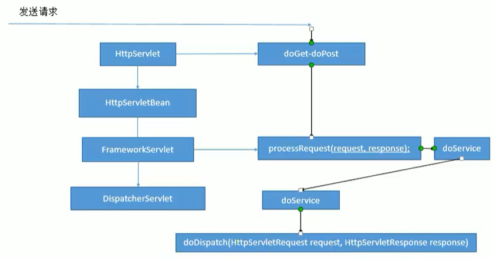

[TOC]


# 6.	SpringMVC源码（未完成 -P165）

## 6.1	前端控制器DispatcherServlet

> 
>
> DispatcherServlet继承于FrameworkServlet，FrameworkServlet继承于HttpServletBean，而HttpServletBean又继承于HttpServlet，因此处理请求时，先使用HttpServlet类中的doGet和doPost方法。
>
> HttpServletBean中没有重写这两种方法，因此再看FrameworkServlet类中，它重写了doGet和doPost方法，在其中使用processRequest()方法解决，而processRequest()方法调用了doService方法解决，但doService方法是抽象类，因此还需要在DispatcherServlet中找到重写的doService方法。
>
> 在DispatcherServlet中重写的doService方法使用了doDispatch方法解决，因此要知道如何处理请求只需要看该方法即可。
>
> 

### 6.1.1 	doDispatch方法

#### 6.1.1.1	doDispatch源码

```java
protected void doDispatch(HttpServletRequest request, HttpServletResponse response) throws Exception {
    HttpServletRequest processedRequest = request;
    HandlerExecutionChain mappedHandler = null;
    boolean multipartRequestParsed = false;
    WebAsyncManager asyncManager = WebAsyncUtils.getAsyncManager(request);

    try {
        try {
            ModelAndView mv = null;
            Object dispatchException = null;

            try {
                //1.检查当前请求是否为文件上传请求
                processedRequest = this.checkMultipart(request);
                multipartRequestParsed = processedRequest != request;
                //2.为当前请求决定使用哪个Handler处理器（根据@RequestMapping标注的控制器寻找）
                //如hello请求我们使用HelloController处理请求
                mappedHandler = this.getHandler(processedRequest);
                //3.如果没有找到能处理该请求的对应处理器，则抛出异常或404
                if (mappedHandler == null) {
                    this.noHandlerFound(processedRequest, response);
                    return;
                }
			   //4.拿到能执行这个类的所有方法的适配器(一种反射工具)
                HandlerAdapter ha = this.getHandlerAdapter(mappedHandler.getHandler());
                String method = request.getMethod();
                boolean isGet = "GET".equals(method);
                if (isGet || "HEAD".equals(method)) {
                    long lastModified = ha.getLastModified(request, mappedHandler.getHandler());
                    if ((new ServletWebRequest(request, response)).checkNotModified(lastModified) && isGet) {
                        return;
                    }
                }

                if (!mappedHandler.applyPreHandle(processedRequest, response)) {
                    return;
                }
				//处理器Handler（控制器Controller）的方法被调用
                //此时执行了响应请求的目标方法
                //5.适配器执行目标方法，返回值为ModelAndView对象，将目标方法执行后的返回值设为视图名
                //即无论目标方法如何，最终适配器都会将执行后的信息封装为ModelAndView对象
                mv = ha.handle(processedRequest, response, mappedHandler.getHandler());
                if (asyncManager.isConcurrentHandlingStarted()) {
                    return;
                }
				//若没有视图名则设置一个默认视图名
                this.applyDefaultViewName(processedRequest, mv);
                mappedHandler.applyPostHandle(processedRequest, response, mv);
            } catch (Exception var20) {
                dispatchException = var20;
            } catch (Throwable var21) {
                dispatchException = new NestedServletException("Handler dispatch failed", var21);
            }
			//转发到目标页面
            //根据目标方法执行完后封装的ModelAndView对象，转发到对应页面，并且ModelAndView中的数据可以从
            //请求域中获取
            this.processDispatchResult(processedRequest, response, mappedHandler, mv, (Exception)dispatchException);
        } catch (Exception var22) {
            this.triggerAfterCompletion(processedRequest, response, mappedHandler, var22);
        } catch (Throwable var23) {
            this.triggerAfterCompletion(processedRequest, response, mappedHandler, new NestedServletException("Handler processing failed", var23));
        }

    } finally {
        if (asyncManager.isConcurrentHandlingStarted()) {
            if (mappedHandler != null) {
                mappedHandler.applyAfterConcurrentHandlingStarted(processedRequest, response);
            }
        } else if (multipartRequestParsed) {
            this.cleanupMultipart(processedRequest);
        }

    }
}
```

#### 6.1.1.2	doDispatch执行流程

（1）所有请求被DispatcherServlet拦截

（2）调用doDispatch方法进行处理：

​		1）调用getHandler()方法：根据当前请求地址，找到能处理当前请求的目标处理器类，即@RequestMapping标注的对应类。

更准确的说法：根据当前请求，在HandlerMapping中找到这个请求的映射信息，获取到目标处理器类

> ​		getHandler()细节：怎么根据当前请求找到对应的处理器类
>
> （1）getHandler()方法将处理器执行链（HandlerExecutionChain）传递给HandlerExecutionChain类的实例对象mappedHandler
>
> （2）在getHandler()方法中：
>
> ```java
> protected HandlerExecutionChain getHandler(HttpServletRequest request) throws Exception {
>     //HandlerMapping(处理器映射)：其中保存了每个处理器能处理哪些请求的映射信息
>     if (this.handlerMappings != null) {
>         //使用迭代器，遍历处理器映射
>         Iterator var2 = this.handlerMappings.iterator();
> 		//迭代返回处理器
>         while(var2.hasNext()) {
>             HandlerMapping mapping = (HandlerMapping)var2.next();
>             HandlerExecutionChain handler = mapping.getHandler(request);
>             if (handler != null) {
>                 return handler;//若handler不为空，则表示有可用的处理器
>             }
>         }
>     }
> 
>     return null;//若handler为空则返回null
> }
> ```
> IOC容器启动创建Controller对象时，会扫描各处理器都能响应什么请求，并保存在HandlerMapping的handlerMap属性中，当接收到请求时，只需要在HandlerMapping中寻找这个请求对应的映射信息即可。


​		2）调用getHandlerAdapter()方法：根据当前处理器类，获取能执行这个处理器类中方法的适配器

更准确的说法：根据当前处理器类，找到当前类的HandlerAdapter（适配器）

> 在getHandlerAdapter()方法中：
>
> ```java
> protected HandlerAdapter getHandlerAdapter(Object handler) throws ServletException {
>  if (this.handlerAdapters != null) {
>      Iterator var2 = this.handlerAdapters.iterator();
> 
>      while(var2.hasNext()) {
>          HandlerAdapter adapter = (HandlerAdapter)var2.next();
>          if (adapter.supports(handler)) {
>              return adapter;
>          }
>      }
>  }
> 
>  throw new ServletException("No adapter for handler [" + handler + "]: The DispatcherServlet configuration needs to include a HandlerAdapter that supports this handler");
> }
> ```
> 
>
> **AnnotationMethodHandlerAdapter**：能解析注解方法的适配器
>
> 处理器类中只要有这些注解标志的方法就能使用

​		3）使用刚才获取到的适配器AnnotationMethodHandlerAdapter，执行目标方法

> 难点在于如何反射
>
> 对之前的处理器类：
>
> ```java
> public String updateBook(@RequestParam("author") String author,
>          Map<String,Object> map, HttpServletRequest request,
>          @ModelAttribute("book") Book book){
>      System.out.println("提交的信息："+book);
>      return "success";
> }
> ```
> 现在类中有四种参数：被注解标注的参数，Map对象，自定义对象（Book对象）和Servlet原生API
>
> ```java
>  mv = ha.handle(processedRequest, response, mappedHandler.getHandler());
> ```
>
> 适配器执行目标方法的过程：
>
> ​	（1）取得方法解析器
>
> ​	（2）使用方法解析器，根据当前请求地址，找到真正的目标方法
>
> ​	（3）创建方法执行器
>
> ​	（4）包装原生的request, response
>
> ​	（5）创建BindingAwareModelMap隐含模型
>
> ​	（6）执行目标方法：
>
> ​		I.目标方法利用反射确定参数值：
>
> ​			创建一个Object数组，数组长度与参数个数相同，将参数依次赋值后返回Object数组
>
> ​		II.@ModelAttribute注解标注的提前运行的方法都在这里执行


​		4）目标方法执行结束后返回ModelAndView对象

​		5）根据ModelAndView对象中的视图名转发到对应页面，并可以在请求域中取出ModelAndView中的模型数据

### 6.1.2	SpringMVC九大组件

在DispatcherServlet中有几个引用属性的组件，被称为SpringMVC的九大组件

SpringMVC在工作时，关键位置都是由这些组件完成的。

共同点：九大组件都是接口：接口就是规范，提供了强大的可扩展性

```java
//文件上传解析器(多部件解析器)
private MultipartResolver multipartResolver;

//区域信息解析器：与国际化有关
private LocaleResolver localeResolver;

//主题解析器：强大的主题效果更换(不常用)
private ThemeResolver themeResolver;

//Handler映射信息：HandlerMapping
private List<HandlerMapping> handlerMappings;

//Handler的适配器
private List<HandlerAdapter> handlerAdapters;

//Handler异常解析器：实现了SpringMVC强大的异常解析功能
private List<HandlerExceptionResolver> handlerExceptionResolvers;

//(不用了解)请求到视图名的解析器：当处理方法没有返回值时，将请求地址作为视图名(不用了解)
private RequestToViewNameTranslator viewNameTranslator;

//FlashMap管理器
//FlashMap是SpringMVC中运行重定向携带数据的功能
private FlashMapManager flashMapManager;

//视图解析器
private List<ViewResolver> viewResolvers;
```

#### 6.1.2.1	九大组件的初始化

在SpringMVC中，服务器启动时使用onRefresh()方法初始化组件，而方法中调用了initStrategies方法：

```java
protected void onRefresh(ApplicationContext context) {
    this.initStrategies(context);
}
```

```java
protected void initStrategies(ApplicationContext context) {
    this.initMultipartResolver(context);
    this.initLocaleResolver(context);
    this.initThemeResolver(context);
    this.initHandlerMappings(context);
    this.initHandlerAdapters(context);
    this.initHandlerExceptionResolvers(context);
    this.initRequestToViewNameTranslator(context);
    this.initViewResolvers(context);
    this.initFlashMapManager(context);
}//initStrategies()方法在服务器启动时初始化了九大组件
```


例：初始化HandlerMappings：

```java
private void initHandlerMappings(ApplicationContext context) {
    this.handlerMappings = null;
    //在IOC容器中探测全部HandlerMappings
    //可以在web.xml中修改DispatcherServlet中修改某些属性的默认配置
    if (this.detectAllHandlerMappings) {
        Map<String, HandlerMapping> matchingBeans = BeanFactoryUtils.beansOfTypeIncludingAncestors(context, HandlerMapping.class, true, false);
        if (!matchingBeans.isEmpty()) {
            this.handlerMappings = new ArrayList(matchingBeans.values());
            AnnotationAwareOrderComparator.sort(this.handlerMappings);
        }
    } 
    else {//若不探测全部HandlerMappings
        try {//则在容器中寻找id为"handlerMapping"的HandlerMapping
            HandlerMapping hm = (HandlerMapping)context.getBean("handlerMapping", HandlerMapping.class);
            this.handlerMappings = Collections.singletonList(hm);
        } catch (NoSuchBeanDefinitionException var3) {
        }
    }
	//若HandlerMappings为空
    if (this.handlerMappings == null) {//则获取默认策略，即按默认配置获取一个HandlerMappings
        this.handlerMappings = this.getDefaultStrategies(context, HandlerMapping.class);
        if (this.logger.isTraceEnabled()) {
            this.logger.trace("No HandlerMappings declared for servlet '" + this.getServletName() + "': using default strategies from DispatcherServlet.properties");
        }
    }

}
```

组件的初始化：就是去容器中找对应的组件，如果没有找到这个组件，则使用默认配置

有些组件在容器中是使用类型找的，有些组件则使用id找