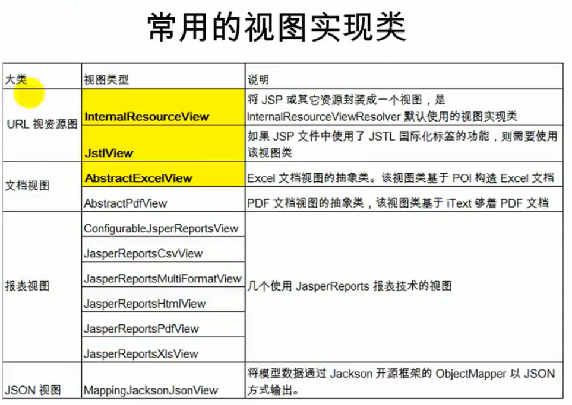
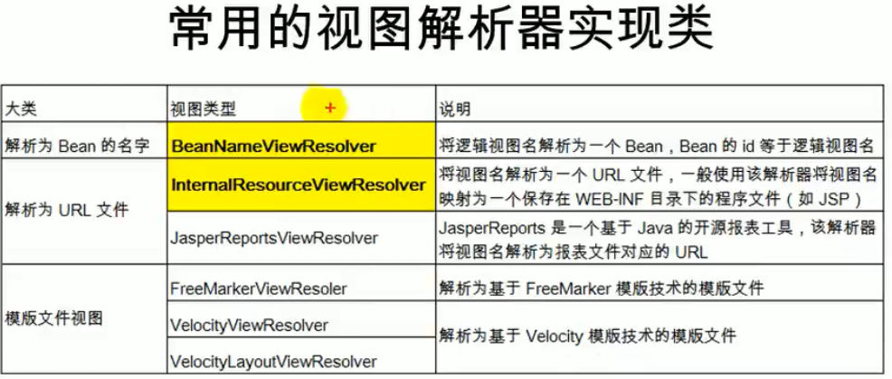
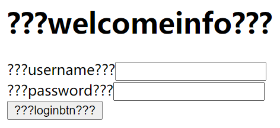
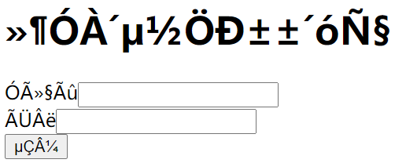
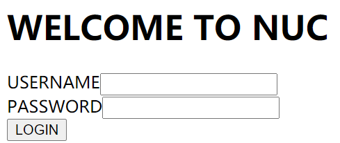
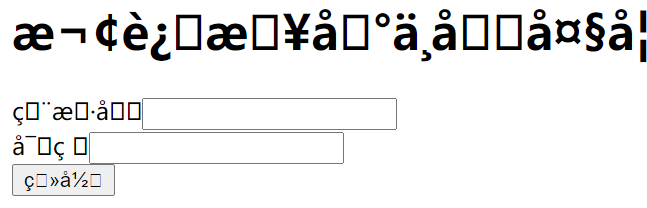

[TOC]


# 7.	视图解析

## 7.0	项目配置

创建新项目，在WEB-INF下创建目录pages

在web.xml中配置字符编码过滤器和前端控制器：

```xml
<?xml version="1.0" encoding="UTF-8"?>
<web-app xmlns="http://xmlns.jcp.org/xml/ns/javaee"
         xmlns:xsi="http://www.w3.org/2001/XMLSchema-instance"
         xsi:schemaLocation="http://xmlns.jcp.org/xml/ns/javaee http://xmlns.jcp.org/xml/ns/javaee/web-app_4_0.xsd"
         version="4.0">
    <servlet><!--配置前端控制器-->
        <servlet-name>springmvc</servlet-name>
        <servlet-class>org.springframework.web.servlet.DispatcherServlet</servlet-class>
        <load-on-startup>1</load-on-startup>
    </servlet>
    <servlet-mapping>
        <servlet-name>springmvc</servlet-name>
        <url-pattern>/*</url-pattern>
    </servlet-mapping>

    <filter><!--配置字符编码过滤器-->
        <filter-name>CharacterEncodingFilter</filter-name>
        <filter-class>org.springframework.web.filter.CharacterEncodingFilter</filter-class>
        <init-param>
            <param-name>encoding</param-name>
            <param-value>UTF-8</param-value>
        </init-param>
        <init-param>
            <param-name>forceEncoding</param-name>
            <param-value>true</param-value>
        </init-param>
    </filter>
    <filter-mapping>
        <filter-name>CharacterEncodingFilter</filter-name>
        <url-pattern>/*</url-pattern>
    </filter-mapping>
</web-app>
```

在springmvc-servlet.xml中配置组件扫描和视图解析器：

```xml
<?xml version="1.0" encoding="UTF-8"?>
<beans xmlns="http://www.springframework.org/schema/beans"
       xmlns:context="http://www.springframework.org/schema/context"
       xmlns:xsi="http://www.w3.org/2001/XMLSchema-instance"
       xsi:schemaLocation="http://www.springframework.org/schema/beans
       http://www.springframework.org/schema/beans/spring-beans.xsd
       http://www.springframework.org/schema/context
       http://www.springframework.org/schema/context/spring-context.xsd">
    <context:component-scan base-package="com.example"/>
    <bean class="org.springframework.web.servlet.view.InternalResourceViewResolver">
        <property name="prefix" value="/WEB-INF/pages/"/>
        <property name="suffix" value=".jsp"/>
    </bean>

</beans>
```


## 7.1	forward转发

假设目录webapp下有一页面hello.jsp，要想在控制器中访问这一页面，

传统方法是使用相对路径：

```java
@RequestMapping("/hello")
public String hello(){
    return "../../hello";
}
```

现在我们可以使用forward前缀快速访问该页面：

```java
@RequestMapping("/handle01")
public String handle01(){
    return "forward:/hello.jsp";
}
```

forward前缀用于转发到另一页面

我们使用的/hello.jsp，使SpringMVC转发到当前项目下的hello

并且有前缀的返回路径不会由视图解析器拼串，而是另外解析


假设我们有另一请求handle02，但仍希望跳转到hello页面，此时我们可以使用forward前缀，跳转到handle01，从handle01再跳转到hello页面，实现多次派发：

```java
@RequestMapping("/handle02")
public String hello(){
    return "forward:/handle01";//先跳转到handle01，再由处理handle01的处理器派发到hello页面
}
```

## 

## 7.2	redirect重定向

假设有请求handle03，希望实现重定向

在原生的Servlet中，实现重定向需要加上项目名：

```java
response.sendRedirect("/hello.jsp");
```

而在SpringMVC中，使用重定向时，/"hello.jsp"就代表从当前项目下开始，SpringMVC会自动为路径拼接项目名：

```java
@RequestMapping("/handle03")
public String hello(){
    return "redirect:/hello.jsp";//重定向到hello页面
}
```

还可以使用重定向跳转到其它请求的处理方法：

```java
@RequestMapping("/handle04")
public String handle04(){
    System.out.println("handle04");
    return "redirect:/handle03";//重定向到handle03
}
```

## 

## 7.3	SpringMVC视图解析

1.方法执行后返回值会作为页面地址参考，转发或者重定向到页面

2.视图解析器可能会进行页面地址的拼串（没有前缀时会进行拼串）


在DispatcherServlet源码中：

1.任何请求处理方法的返回值，最终都会被包装成ModelAndView对象，它包含逻辑名和模型对象的视图

2.processDispatchResult(request, response,  mappedHandler,  mv, exception) 是跳转到页面的方法

视图渲染流程：将域中的数据在页面中展示，页面就是用来渲染模型数据的

3.调用render(mv, request, response)方法：渲染页面

4.View与ViewResolver：

​	ViewResolver作用是根据视图名（方法的返回值）得到View对象

5.如何根据视图名（方法的返回值）得到View对象？

​	（1）遍历全部的ViewResolver

​	（2）ViewResolver视图解析器根据方法的返回值，得到一个View对象

​	（3）判断视图名是否包含前缀，

​		若包含前缀，判断前缀类型：

​			1）若为redirect前缀，创建RedirectView对象

​			2）若为forward前缀，创建InternalResourceView对象

​		若不包含前缀，则使用父类默认创建View对象

​	（4）返回View对象：

​			1）所有配置的视图解析器都尝试根据视图名（返回值）得到View对象，若能得到View对象，则返回这个View对象；否则更换下一个视图解析器

​			2）调用View对象的render()方法，

​	（5）将模型中的所有数据取出，放在request请求域中


总结：视图解析器只是为了得到视图对象，视图对象才能转发（将模型数据全部放在请求域中）或重定向到指定页面。视图对象才能**渲染视图**。

## 

## 7.4	视图

1.视图的作用是渲染模型数据，将模型中的数据以某种形式展示给客户。

2.**视图对象由视图解析器负责实例化**。由于视图是**无状态**的，因此**不存在线程安全问题**。

3.所有的视图对象都必须实现View接口



## 

## 7.5	视图解析器

1.SpringMVC为逻辑视图名的解析提供了不同的策略，可以在SpringWEB上下文中**配置一种或多种解析策略，并制定它们的先后顺序。**每种映射策略对应一个具体的视图解析器实现类。

2.每个视图解析器都实现了Ordered接口并开放出order属性，可以**通过order属性来指定解析器的先后顺序**，order越小优先级越高。

3.SpringMVC会按视图解析器顺序的优先顺序对逻辑视图名进行解析，直到解析成功并返回视图对象，否则将抛出ServletException异常

4.视图解析器作用单一：将逻辑视图解析为一个具体的视图对象

5.所有视图解析器都必须实现ViewResolver接口



## 

## 7.6	JstlView

导入依赖JAR包：

```xml
<!-- https://mvnrepository.com/artifact/org.apache.taglibs/taglibs-standard-impl -->
<dependency>
    <groupId>org.apache.taglibs</groupId>
    <artifactId>taglibs-standard-impl</artifactId>
    <version>1.2.5</version>
</dependency>

<!-- https://mvnrepository.com/artifact/org.apache.taglibs/taglibs-standard-spec -->
<dependency>
    <groupId>org.apache.taglibs</groupId>
    <artifactId>taglibs-standard-spec</artifactId>
    <version>1.2.5</version>
</dependency>
```

在SpringMVC配置文件中视图解析器InternalResourceViewResolver内配置JstlView：

```xml
<!--导入Jstl依赖JAR包后，InternalResourceViewSolver会自动创建一个JstlView对象-->
<bean class="org.springframework.web.servlet.view.InternalResourceViewResolver">
    <property name="prefix" value="/WEB-INF/pages/"/>
    <property name="suffix" value=".jsp"/>
    <property name="viewClass" value="org.springframework.web.servlet.view.JstlView"/>
</bean><!--可以在InternalResourceViewResolver中手动创建JstlView对象-->
```

在webapp目录下创建登录页面login.jsp：

```jsp
<form action="">
    用户名：<input /><br/>
    密码：<input/><br/>
    <input type="submit" value="登录">
</form>
```

在index.jsp中创建跳转到登录页面的请求：

```jsp
<a href="toLoginPage">我要登录</a><br/>
```

显然，这样的页面只能展示给中文用户，而要展示给英文用户，就需要重新制作一套页面。因此，我们需要借助JstlView来实现国际化功能。

### 7.6.1	JstlView的作用

1.JstlView可以快速方便地支持国际化功能

2.JavaWeb支持国际化：

​	（1）得到Locale对象，

​	（2）使用ResourceBundle绑定国际化资源文件

​	（3）使用ResourceBundle.getString("key")获取国际化配置文件中的值

​	（4）web页面的国际化，使用fmt标签库：

​			1）<fmt:setLocale>

​			2）<fmt:setBundle>

​			3）<fmt:message>

3.有了JstlView之后，可以让Spring管理国际化资源，直接去页面使用<fmt:message>标签：

在resources文件夹下创建国际化配置文件i18n_en_US.properties：

```properties
welcomeinfo = WELCOME TO NUC
username = USERNAME
password = PASSWORD
loginbtn = LOGIN
```

创建国际化配置文件i18n_zh_CN.properties：

```properties
welcomeinfo = 欢迎来到中北大学
username = 用户名
password = 密码
loginbtn = 登录
```

在SpringMVC配置文件中配置国际化资源文件管理器：

```xml
<!--让SpringMVC管理国际化资源文件：配置一个资源文件管理器-->
<!--注意：这里的id必须为"messageSource"-->
<bean id="messageSource" class="org.springframework.context.support.ResourceBundleMessageSource">
    <!--basename用于指定配置文件的基础名-->
    <property name="basename" value="i18n"/>
</bean>
```

在login.jsp中引入fmt标签库并使用fmt:message标签实现国际化功能：

```jsp
<%@ page contentType="text/html;charset=UTF-8" language="java" %>
<%@ taglib prefix="fmt" uri="http://java.sun.com/jsp/jstl/fmt" %>
<!--引入fmt标签库-->
<html>
<head>
    <title>Title</title>
</head>
<body><!--使用fmt:message标签实现国际化功能-->
<h1> <fmt:message key="welcomeinfo"/> </h1>
<form action="">
    <fmt:message key="username"/><input /><br/>
    <fmt:message key="password"/><input /><br/>
    <input type="submit" value='<fmt:message key="loginbtn"/>'/>
</form>
</body>
</html>
```

### 7.6.2	国际化页面显示异常

运行发现login.jsp页面显示异常，并且切换语言也不能改变显示内容，这意味着我们的国际化功能没有正常工作：



检查代码：

```java
@RequestMapping("/toLoginPage")
public String toLogin(){
    return "forward:/login.jsp";
}
```

在控制器中我们使用forward前缀跳转到了login.jsp页面，因此跳过了视图解析流程，没有实现国际化功能。

### 7.6.3	显示异常的原因和解决方案

一定要经过SpringMVC的视图解析流程，这样才能通过JstlView实现快速国际化

并且使用forward前缀会创建一个不包含Locale对象的InternalResourceViewResolver，而不是JstlView，因此forward前缀不能实现国际化

#### 7.6.3.1	view-controller

在控制器中，我们的响应方法仅用于响应请求并跳转到指定页面，除此之外没有任何操作：

```java
@RequestMapping("/toLoginPage")
public String toLogin(){
    return "forward:/login.jsp";
}
```

这样的代码毫无意义，为了减少这种空方法，我们可以在SpringMVC中引入mvc名称空间，使用<mvc:view-controller>标签实现相同的功能：

```xml
<!--发送一个请求(toLoginPage)：直接来到WEB-INF/pages下的该页面-->
<!--在mvc名称空间下有一个请求映射标签-->
<!--path用于指定哪个请求
    view-name用于指定映射哪个视图
-->
<mvc:view-controller path="/toLoginPage" view-name="login"/>
<!--开启MVC注解驱动 避免因为mvc:view-controller造成其他响应方法失效-->
<mvc:annotation-driven/>
```

除了mvc:view-controller标签外，我们还需要使用mvc:annotation-driven标签来开启MVC注解驱动，避免因为mvc:view-controller造成其他响应方法失效


### 7.6.4	国际化页面中文显示异常（未解决）

运行后发现中文页面有乱码，而英文页面则显示正常：



由于除了中文页面显示异常以外其他一切正常，因此我推测是properties配置文件的字符编码格式有问题：

查看properties配置文件，发现文件编码格式为GBK，看来确实是配置文件的字符编码格式与页面使用的编码格式冲突导致，在设置中将项目全部文件的字符编码格式都改为UTF-8，再次运行：



显然，页面的中文依旧显示异常，暂时我还没有找到合适的解决方案

## 

## 7.7 	自定义视图和自定义视图解析器

创建自定义视图和自定义视图解析器的步骤：

（1）编写自定义的视图和视图解析器实现类

（2）视图解析器必须放在IOC容器中

例：

创建自定义视图解析器的控制器类MyViewResolverController：

```java
//自定义视图解析器和视图对象
@Controller
public class MyViewResolverController {
}
```

在index.jsp中添加测试请求：

```jsp
<a href="handleplus">资源下载</a><br/>
```

在控制器中添加响应方法：

```java
@RequestMapping("/handlePlus")
    public String handlePlus(Map map){
        List<String> vname = new ArrayList<String>();//要获取的视频名
        vname.add("变形金刚");
        vname.add("黑猫警长");
        List<String> imgname = new ArrayList<String>();//要获取的图片名
        imgname.add("校园风景");
        map.put("video",vname);//假设要获取视频
        map.put("image",imgname);//假设要获取图片
        return "download:/resource";//假设要实现下载功能
        //使用自定义前缀
}
```

要能对自定义前缀响应，我们需要建立自定义视图解析器，而视图解析器将会返回一个我们自定义的视图对象，因此我们需要先建立自定义视图类MyView：

再建立自定义视图解析器MyResourceViewResolver：

```java
//要自定义视图解析器，首先必须实现ViewResolver接口
//实现Ordered接口，是为了能改变自定义视图解析器的优先级
public class MyResourceViewResolver implements ViewResolver, Ordered {
    private Integer order=0;
    @Override
    //根据视图名返回视图对象
    public View resolveViewName(String viewName, Locale locale) throws Exception {
        if (viewName.startsWith("download:")){
            //判断视图名前缀是否为"download:"，若是则处理
            return new MyView();
        }else{//若不能处理请求则返回null
            return null;
        }
    }

    @Override
    public int getOrder() {
        return 0;
    }
    //改变视图解析器的优先级
    public void setOrder(Integer order){
        this.order=order;
    }
}
```

在SpringMVC配置文件中放入自定义的视图解析器：

```xml
<!--自定义视图解析器-->
<bean class="com.example.view.MyResourceViewResolver">
    <!--order表示视图解析器的优先级 值越小优先级越高-->
    <property name="order" value="1"/>
</bean><!--使自定义视图解析器优先级高于InternalResourceViewResolver才能正常解析我们自定义的前缀-->
<!--实际上InternalResourceViewResolver默认优先级为MAX，即最低优先级，因此我们只需略作调整优先级即可-->
```

执行流程：

（1）自定义视图解析器工作

（2）得到自定义视图对象

（3）视图对象自定义渲染页面
