[TOC]


# 8.	RestfulCRUD

> CRUD，即增删改查
>
> C：Create（创建）
>
> R：Retrieve（查询）
>
> U：Update（更新）
>
> D：Delete（删除）

## 8.1	符合Rest风格的CRUD系统

### 8.1.0	环境搭建

在web.xml中配置前端控制器、字符编码过滤器和支持Rest风格的过滤器

```xml
<?xml version="1.0" encoding="UTF-8"?>
<web-app xmlns="http://xmlns.jcp.org/xml/ns/javaee"
         xmlns:xsi="http://www.w3.org/2001/XMLSchema-instance"
         xsi:schemaLocation="http://xmlns.jcp.org/xml/ns/javaee http://xmlns.jcp.org/xml/ns/javaee/web-app_4_0.xsd"
         version="4.0">
    
    <servlet><!--前端控制器-->
        <servlet-name>DispatcherServlet</servlet-name>
        <servlet-class>org.springframework.web.servlet.DispatcherServlet</servlet-class>
        <init-param><!--指定SpringMVC配置文件位置-->
            <param-name>contextConfigLocation</param-name>
            <param-value>classpath:springmvc.xml</param-value>
        </init-param>
        <load-on-startup>1</load-on-startup>
    </servlet>
    <servlet-mapping>
        <servlet-name>DispatcherServlet</servlet-name>
        <url-pattern>/</url-pattern>
    </servlet-mapping>

    <filter><!--字符编码过滤器-->
        <filter-name>CharacterEncodingFilter</filter-name>
        <filter-class>org.springframework.web.filter.CharacterEncodingFilter</filter-class>
        <init-param>
            <param-name>encoding</param-name>
            <param-value>UTF-8</param-value>
        </init-param>
        <init-param>
            <param-name>forceEncoding</param-name>
            <param-value>true</param-value>
        </init-param>
    </filter>
    <filter-mapping>
        <filter-name>CharacterEncodingFilter</filter-name>
        <url-pattern>/*</url-pattern>
    </filter-mapping>

    <!--支持Rest风格转换的filter-->
    <filter>
        <filter-name>HiddenHttpMethodFilter</filter-name>
        <filter-class>org.springframework.web.filter.HiddenHttpMethodFilter</filter-class>
    </filter>
    <filter-mapping>
        <filter-name>HiddenHttpMethodFilter</filter-name>
        <url-pattern>/*</url-pattern>
    </filter-mapping>
</web-app>
```

在SpringMVC配置文件中添加组件扫描，配置视图过滤器：

```xml
<?xml version="1.0" encoding="UTF-8"?>
<beans xmlns="http://www.springframework.org/schema/beans"
       xmlns:context="http://www.springframework.org/schema/context"
       xmlns:xsi="http://www.w3.org/2001/XMLSchema-instance"
       xsi:schemaLocation="http://www.springframework.org/schema/beans
       http://www.springframework.org/schema/beans/spring-beans.xsd
       http://www.springframework.org/schema/context
       http://www.springframework.org/schema/context/spring-context.xsd">
    <!--添加组件扫描-->
    <context:component-scan base-package="com.example"/>
    <!--配置视图过滤器-->
    <bean class="org.springframework.web.servlet.view.InternalResourceViewResolver">
        <property name="prefix" value="/WEB-INF/pages/"/>
        <property name="suffix" value=".jsp"/>
    </bean>
</beans>
```

#### 8.1.0.1	项目测试

在WEB-INF/pages文件夹下创建访问成功页面success.jsp：

```jsp
<%@ page contentType="text/html;charset=UTF-8" language="java" %>
<html>
<head>
    <title>Success</title>
</head>
<body>
<h1>访问成功！</h1>
</body>
</html>
```

在index.jsp中添加测试请求：

```jsp
<a href="hello">Hello</a>
```

创建测试控制器类HelloController，并添加回应hello请求的响应方法：

```java
@Controller
public class HelloController {
    @RequestMapping("/hello")
    private String hello(){
        return "success";
    }
}
```

测试结果如下：


#### 8.1.0.2	文件导入

见8.08.0系统配套文件.md


#### 8.1.0.3	预期效果

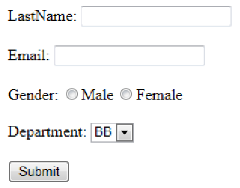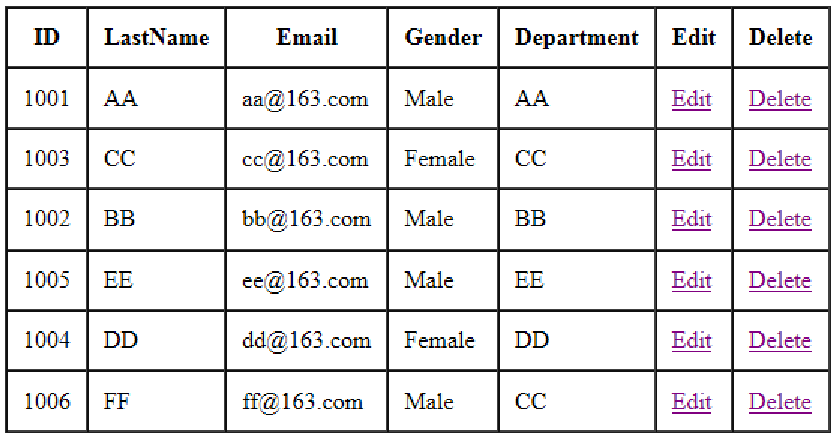

实现对员工的增删改查


#### 8.1.0.4	实现思路

Rest风格的CRUD：

增删改查的URL地址：/资源名/资源标识

如：

/emp/1	GET：查询id为1的员工

/emp/1	PUT：更新id为1的员工

/emp	   POST：添加员工

/emp/1	DELETE：删除id为1的员工


### 8.1.1	员工列表展示

如：/emps	GET：查询所有员工

按我们的预期，系统首个页面就要展示全部员工信息，

工作流程：

访问项目->访问index.jsp->发送/emps请求->在控制器类中响应请求->将查询结果放在请求域中->转发到emps页面展示

因此要在index.jsp中修改：

```jsp
<%@ page contentType="text/html;charset=UTF-8" language="java" %>
<%--一访问项目就展示员工列表页面--%>
<jsp:forward page="/emps"></jsp:forward>
```

在com.example.controller下创建员工控制器类EmployeeController：

```java
@Controller
public class EmployeeController {

    @Autowired
    EmployeeDao employeeDao;

    //查询所有员工
    @RequestMapping("/emps")
    public String getEmps(Model model){
        Collection<Employee> emps = employeeDao.getAll();
        model.addAttribute("emps",emps);
        return "emps";
    }
}
```

在emps.jsp下显示全部员工信息：

```jsp
<%@ page contentType="text/html;charset=UTF-8" language="java" %>
<%@taglib prefix="c" uri="http://java.sun.com/jsp/jstl/core" %>
<!--导入Jstl的核心库-->
<html>
<head>
    <title>员工列表</title>
</head>
<body>
<h1>员工列表</h1>
<table border="1" cellpadding="5" cellspacing="0">
    <tr>
        <th>ID</th>
        <th>LastName</th>
        <th>Email</th>
        <th>Gender</th>
        <th>Department</th>
        <th>Edit</th>
        <th>Delete</th>
    </tr>
    <c:forEach items="${emps}" var="emp">
        <tr>
            <td>${emp.id}</td>
            <td>${emp.lastName}</td>
            <td>${emp.email}</td>
            <td>${emp.gender==0?"女":"男"}</td>
            <td>${emp.department.departmentName}</td>
        </tr>
    </c:forEach>
</table>
</body>
</html>
```

运行结果如图：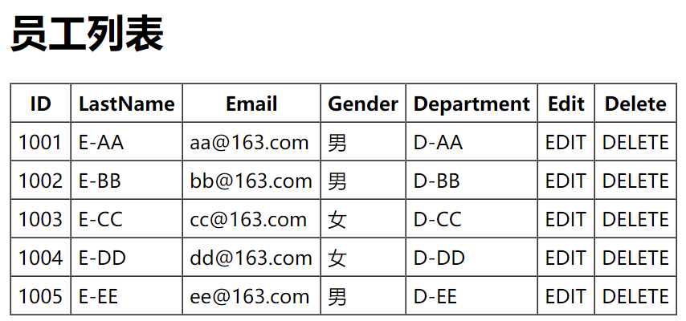

### 8.1.2	员工添加

工作流程：

点击"添加员工"->（查询所有部门信息）->跳转到add.jsp页面->输入员工数据->点击"提交"按钮存储员工信息->控制器收到保存员工信息请求->回到员工列表页面

要添加添加员工，首先要从首页跳转，因此在emps.jsp中添加超链接：

```jsp
<a href="toAddPage">添加员工</a>
```

在控制器类EmployeeController中添加方法：

```java
@Autowired
DepartmentDao departmentDao;//借助DepartmentDao查询部门信息

//添加员工
//跳转到添加员工页面之前，需要先查询到全部的部门
@RequestMapping("/toAddPage")
public String toAddPage(Model model){
    //1.先查询全部部门
    Collection<Department> depts = departmentDao.getDepartments();
    //2.将查询信息放到请求域中
    model.addAttribute("depts",depts);
    //3.跳转到添加员工页面
    return "add";
}
```

创建add.jsp页面：

```jsp
<%@ page contentType="text/html;charset=UTF-8" language="java" %>
<%@ taglib prefix="c" uri="http://java.sun.com/jsp/jstl/core" %>
<!--引入Jstl核心库-->
<html>
<head>
    <title>添加员工</title>
</head>
<body>
<h1>添加员工</h1>
<form action="">
    LastName：<input type="text" name="lastName"/><br/>
    Email：<input type="text" name="email"/><br/>
    Gender：<br/><!--性别应当为单选框-->
        Male：<input type="radio" name="gender" value="1"/><br/>
        Female：<input type="radio" name="gender" value="0"/><br/>
    Dept：<!--部门应为下拉列表-->
        <select name="department.id"><!--标签体中的是页面的提示选项信息，而value值才是下拉列表提交的值-->
            <c:forEach items="${depts}" var="dept">
                <option value="${dept.id}">${dept.departmentName}</option>
            </c:forEach>
        </select>
</form>
</body>
</html>
```

运行结果如图：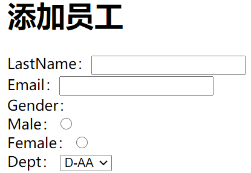

#### 8.1.2.1	SpringMVC表单标签

> SpringMVC的表单标签可以实现将模型数据中的属性和HTML中的表单元素相绑定，以实现表单数据更便捷编辑和表单值的回显。

修改add.jsp：

```jsp
<%@ page contentType="text/html;charset=UTF-8" language="java" %>
<%@ taglib prefix="c" uri="http://java.sun.com/jsp/jstl/core" %>
<%@ taglib prefix="form" uri="http://www.springframework.org/tags/form" %>
<!--引入SpringMVC表单标签库-->
<html>
<head>
    <title>添加员工</title>
</head>
<body>
<h1>添加员工</h1>
<form:form action="">
    <!--path属性相当于原来HTML中input标签的name属性-->
    <!--path的作用：
    (1)可以当做原生的name属性
    (2)自动回显隐含模型中某个对象对应的这个属性的值 -->
    LastName：<form:input path="lastName"/><br/>
    Email：<form:input path="email"/><br/>
    Gender：<br/>
        Male：<form:radiobutton path="gender" value="1"/><br/>
        Female：<form:radiobutton path="gender" value="0"/><br/>
    Dept:
    <!--
    items:指定要遍历的集合，遍历出的每个元素是一个Department对象
    itemLabel:指定遍历出的Department对象的哪个属性来作为option标签体的值
    itemValue:指定遍历出的Department对象的哪个属性来作为下拉列表提交的value值-->
        <form:select path="department.id"
                     items="${depts}"
                     itemLabel="departmentName"
                     itemValue="id"></form:select><br/>
    <input type="submit" value="保存">
</form:form>
</body>
</html>
```

运行结果：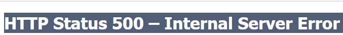

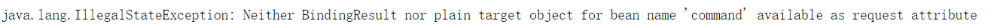

#### 8.1.2.2	非法状态异常

由8.1.2.1末尾异常可知，错误信息为：在请求域中没有名为"command"的类

造成异常的原因：

（1）在SpringMVC中认为，表达数据的每一项都要回显；path属性指定的是一个属性，这个属性是从隐含模型（请求域中取出的某个对象中的属性）取出。因此path指定的每个属性，请求域中都必须有一个对象，拥有这个属性。这个对象就是请求域中的command

尝试向请求域中自定义一个command对象：

```java
model.addAttribute("command",new Employee(null,"小明","test@163.com",0,departmentDao.getDepartment(101))) ;
```

运行：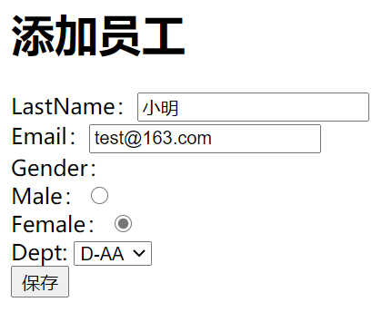

可以看到我们传入的command对象的各项属性值都回显到了添加员工页面，这与我们的期望实现的功能不符。

##### 8.1.2.2.1	modelAttribute

为了解决上述问题，我们可以在表单标签中添加modelAttribute属性：

```jsp
<!--表单标签需要从请求域中获取一个command对象，将command对象中各属性对应显示在页面上
使用modelAttribute属性可以使表单标签不再从请求域中获取command对象，而是获取modelAttribute指定的对象
modelAttribute的值是它指定对象的key
-->
<form:form action="" modelAttribute="employee">
```

在EmployeeController中添加modelAttribute属性对应key的model，将无参构造的Employee对象放入model：

```java
model.addAttribute("employee",new Employee());
```

运行如图：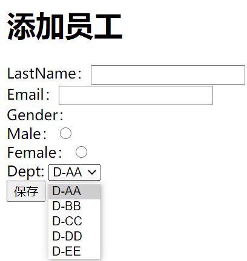

这样，之前的问题就解决了


#### 8.1.2.3	使用表单标签添加员工

在add.jsp中，为表单标签添加请求名action和请求类型method：

```jsp
<%
    pageContext.setAttribute("ctp",request.getContextPath())
%>
<%--添加员工应发送POST类型请求 请求名为request.getContextPath()/emp--%>
<form:form action="${ctp}/emp" modelAttribute="employee" method="post">
```

在EmployeeController中实现添加员工的方法：

```java
//添加员工的方法实现，只响应POST类型的emp请求，实现REST
@RequestMapping(value="/emp",method= RequestMethod.POST)
public String addEmp(Employee employee){
    employeeDao.save(employee);//保存新员工信息
    //返回列表页面:重定向到查询所有员工的请求
    return "redirect:/emps";
}
```

运行程序，填写信息：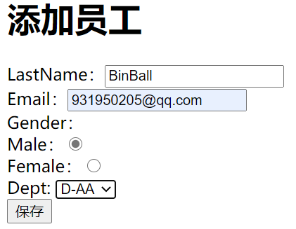

点击保存后跳转到全部员工列表：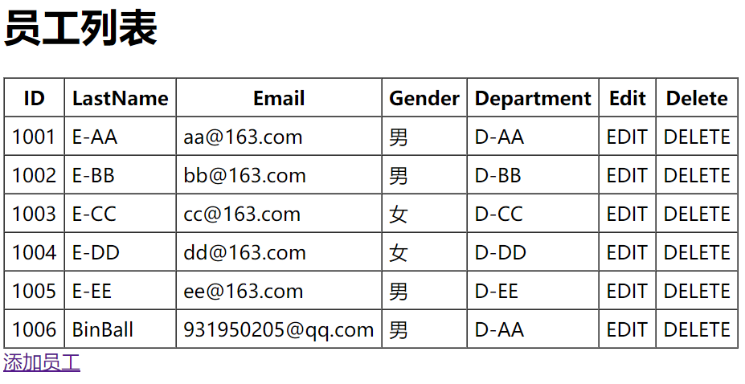

可以看到，成功添加了新的员工信息。


### 8.1.3	员工修改

实现思路：

点击员工X所在行的EDIT按钮->（查询要修改的员工信息，放在请求域中）->跳转到edit.jsp->显示对应员工信息->

输入员工信息点击修改按钮->（发送修改请求/emp/id	PUT）->（@ModelAttribute提前查出员工信息）

在emps.jsp中获取绝对路径：

```jsp
<%
    pageContext.setAttribute("ctp",request.getContextPath());
%>
```

要修改指定员工信息，就要传入对应员工id：

```jsp
<td>
    <a href="${ctp}/emp/${emp.id}">EDIT</a>
</td>
```

在EmployeeController中实现按id查询员工的方法：

```java
//按动态获取员工id，处理的请求类型为GET
//按id查询员工
@RequestMapping(value = "/emp/{id}",method = RequestMethod.GET)
public String getEmp(@PathVariable("id") Integer id,Model model) {
    //1.查询员工信息并放在请求域中
    Employee employee = employeeDao.get(id);
    model.addAttribute("emp",employee);
    //2.将部门信息放在请求域中
    Collection<Department> departments=departmentDao.getDepartments();
    model.addAttribute("depts",departments);
    return "edit";
}
```

创建edit.jsp，实现修改员工信息的页面：

```jsp
<%@ page contentType="text/html;charset=UTF-8" language="java" %>
<%@ taglib prefix="form" uri="http://www.springframework.org/tags/form" %>
<!--引入表单标签-->
<html>
<head>
    <title>修改员工信息</title>
</head>
<body>
<%
    pageContext.setAttribute("ctp",request.getContextPath());
%>
<h1>员工修改</h1>
<!--表单中显示的信息全部来自modelAttribute的key对应的对象的值
即根据id查询到的员工对象的信息-->
<form:form action="${ctp}/emp/${emp.id}" modelAttribute="emp" method="post">
    <input type="hidden" name="_method" value="put"><!--使用隐藏域发送PUT类型请求-->
    <input type="hidden" name="id" value="${emp.id}"/><!--使用隐藏域携带id，防止id被修改-->
    Email：<form:input path="email"/><br/>
    Gender：&nbsp;&nbsp;&nbsp;<!--"&nbsp;"表示空格-->
        男：<form:radiobutton path="gender" value="1"/>&nbsp;&nbsp;&nbsp;
        女：<form:radiobutton path="gender" value="0"/><br/>
    Dept：<form:select path="department.id" items="${depts}"
                      itemValue="id" itemLabel="departmentName"/><br/>
    <input type="submit" value="修改"/><br/>
</form:form>
</body>
</html>
```

在EmployeeController中实现修改员工方法：

```java
//修改员工，处理的请求类型为PUT
@RequestMapping(value="/emp/{id}",method = RequestMethod.PUT)
public String updateEmp(@PathVariable("id") Integer id, @ModelAttribute("employee") Employee employee){
    //@PathVariable动态获取id，@ModelAttribute从对应注解方法获取Employee对象
    employeeDao.save(employee);
    return "redirect:/emps";//返回全部员工信息页面
}

@ModelAttribute//提前查出员工信息
//@RequestParam从请求域中获取员工id
public void MyModelAttribute(@RequestParam(value = "id",required = false) Integer id,Model model){
        if(id!=null){
            Employee employee = employeeDao.get(id);
            model.addAttribute("employee",employee);
        }
}
```

运行程序，测试修改：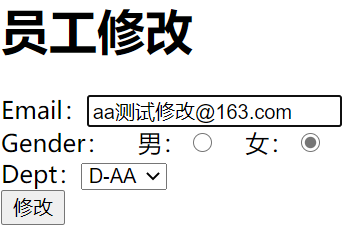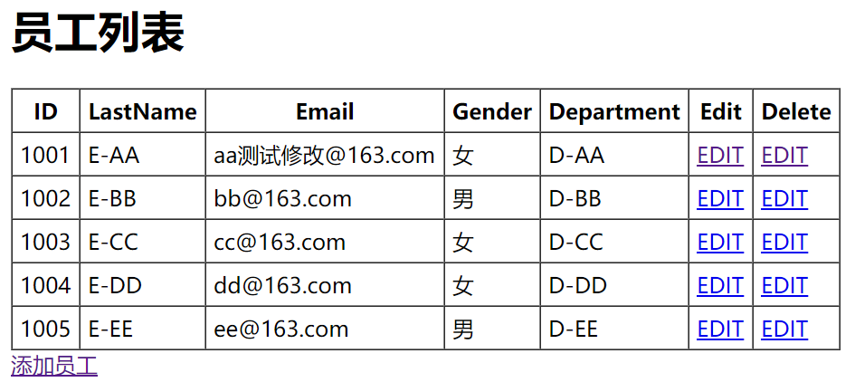

可以看到，员工修改功能正常工作。


### 8.1.4	员工删除

工作思路：

点击删除->（发送删除请求/emp/id	DELETE）->删除员工->跳转到员工列表页面

在emps.jsp中添加删除员工链接：

```jsp
<td>
    <form action="${ctp}/emp/${emp.id}" method="post">
        <input type="hidden" name="_method" value="DELETE">
        <input type="submit" value="DELETE">
    </form><!--通过表单隐藏域发送delete请求-->
</td>
```

在EmployeeController中实现删除员工方法：

```java
@RequestMapping(value = "/emp/{id}", method = RequestMethod.DELETE)
public String deleteEmp(@PathVariable("id")Integer id){
    employeeDao.delete(id);//按id删除员工
    return "redirect:/emps";
}
```

运行结果：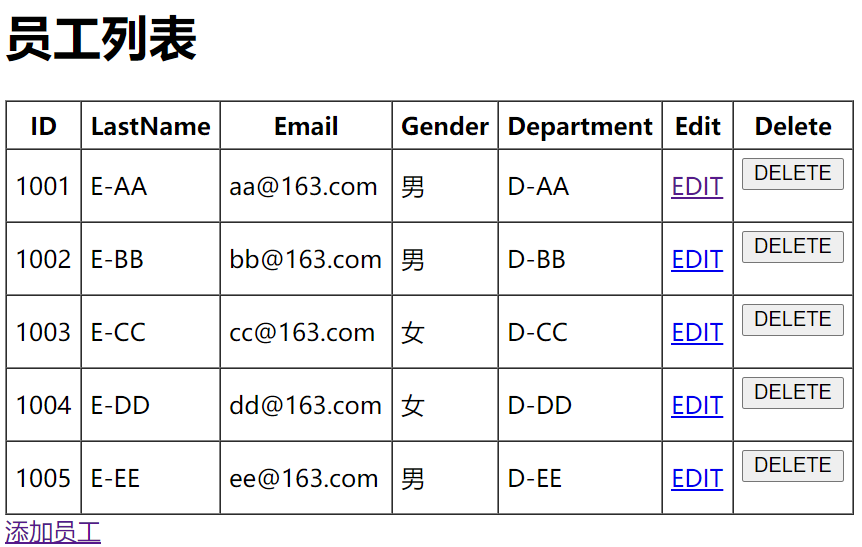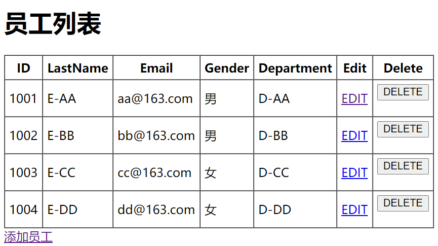