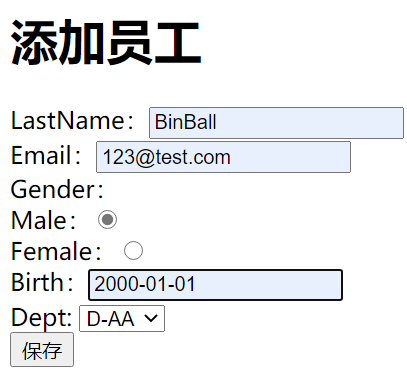
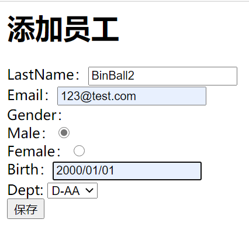

# 0.	数据绑定

> 提出问题：
>
> SpringMVC如何封装自定义类型对象？
>
> （1）JavaBean要和页面提交的数据一一绑定：
>
> ​		页面提交的所有数据都是字符串：
>
> ​			1）数据绑定期间的数据类型转换，如String->Integer
>
> ​			2）数据绑定期间的数据格式化，如：birth="2017-12-15"->Date(2017/12/15)
>
> ​			3）数据校验：
>
> ​					提交的数据必须是合法数据：
>
> ​						I.前端校验：JS+正则表达式（浏览器可以禁用JS，导致前端校验失效）
>
> ​						II.后端校验
>
> ​							校验成功->数据合法
>
> ​							校验失败->？

------


## 0.1	WebDataBinder

在SpringMVC中，这些问题都有组件可以解决：

WebDataBinder：数据绑定器，负责数据绑定工作	

可以解决在数据绑定期间产生的类型转换、格式化、数据校验等问题

在WebDataBinder类中，有conversionService负责类型转换，validators负责数据校验，bindingResult负责保存以及解析数据绑定期间，数据校验产生的错误。在数据绑定工作中，核心是DataBinder。


# 1.	自定义类型转换

## 1.1	快速添加员工

在emps.jsp中添加快速添加员工的功能：

```jsp
<form action="${ctp}/quickadd">
    <!--写上员工全部信息，自动封装对象-->
    <input name="empinfo" value="empTest-test@qq.com-1-101">
    <input type="submit" value="快速添加"/>
</form>
```

在EmployeeController中实现快速添加员工的方法：

```java
//快速添加员工
@RequestMapping("/quickadd")
public String quickAddEmp(@RequestParam("empinfo") Employee employee){
    System.out.println(employee);
    return "redirect:/emps";
}
```

运行结果：


错误信息：没有找到匹配的编辑器或转换器策略

看来，页面出现错误的原因是没有合适的转换器，能将我们获取到的"empinfo"字符串封装成Employee对象。

因此，要实现快速添加对象功能，需要实现自定义转换器：


## 1.2	自定义转换器

### 1.2.1	数据类型转换

在SpringMVC中，由ConversionService组件负责数据类型的转换以及格式化功能。

实际上，在ConversionService组件中还有许多Converter，每个Converter各自负责不同的类型转换和格式化

#### 

### 1.2.2	实现自定义转换器

要实现自定义转换器：

（1）实现Converter接口，实现自定义类型转换器：

```java
//Converter<S,T>:
//S--Source T--Target
//Converter作用是将S转为T
public class MyStringToEmployeeConverter implements Converter<String, Employee> {

    @Autowired
    DepartmentDao departmentDao;

    @Override//自定义String->Employee的转换规则
    public Employee convert(String s) {
        //数据样例：empTest-test@qq.com-1-101
        Employee employee = new Employee();
        if(s.contains("-")) {//字符串必须包含"-"才能转换
            String[] split =s.split("-");
            employee.setLastName(split[0]);
            employee.setEmail(split[1]);
            employee.setGender(Integer.parseInt(split[2]));
            employee.setDepartment(departmentDao.getDepartment(Integer.parseInt(split[3])));
        }
        return employee;
    }
}
```

> Converter是ConversionService的组件，Converter只有放在ConversionService中才能正常工作

（2）配置加入自定义的Converter的ConversionService：

```xml
<!--自定义ConversionService组件-->
<bean id="conversionService" class="org.springframework.context.support.ConversionServiceFactoryBean">
    <!--在converters中添加自定义类型转换器MyStringToEmployeeConverter-->
    <property name="converters">
        <set>
            <bean class="com.example.component.MyStringToEmployeeConverter"></bean>
        </set>
    </property>
</bean>
```

（3）将WebDataBinder中的ConversionService设为配置加入自定义的Converter的ConversionService：

```xml
<!--conversion-service="conversionService"使用自定义的ConversionService组件-->
<mvc:annotation-driven conversion-service="conversionService"/>
```

（4）在EmployeeController中重新实现快速添加方法：

```java
//快速添加员工
@RequestMapping("/quickadd")
public String quickAddEmp(@RequestParam("empinfo") Employee employee){
    employeeDao.save(employee);
    return "redirect:/emps";
}
```

运行结果：


总结实现步骤：

（1）实现Converter接口，实现自定义转换器

（2）自定义ConversionService，加入自定义的Converter

（3）让SpringMVC的WebDataBinder使用自定义的ConversionService

------


## 1.3	mvc:annotation-driven

### 1.3.1	mvc:annotation-driven的功能

（1）<mvc:annotation-driven /> 会自动注册：

**RequestMappingHandlerMapping** 、***RequestMappingHandlerAdapter*** 与

**ExceptionHandlerExceptionResolver**三个bean。

（2）支持使用 ***ConversionService*** 实例对表单参数进行类型转换

（3）支持使用 ***@NumberFormat、@DateTimeFormat*** 注解完成数据类型的格式化

（4）支持使用 ***@Valid*** 注解对 JavaBean 实例进行 JSR 303 验证

（5）支持使用 ***@RequestBody*** 和 ***@ResponseBody*** 注解


### 1.3.2	mvc:annotation-driven使用场合

（1）直接配置响应的页面：无需经过控制器来执行结果 ；但会导致其他请求路径失效，需要配置mvc:annotation-driven标签

```xml
<mvc:view-controller path="/success" view-name="success"/>
```

（2）RESTful-CRUD操作，删除时，通过jQuery执行delete请求时，找不到静态资源，需要配置mvc:annotation-driven标签  

> <mvc:default-servlet-handler /> 将在 SpringMVC 上下文中定义一个DefaultServletHttpRequestHandler
>
> 它会对进入 DispatcherServlet 的请求进行筛查
>
> 如果发现是没有经过映射的请求，就将该请求交由 WEB 应用服务器默认的 Servlet 处理，如果不是静态资源的请求，才由 DispatcherServlet 继续处理。

（3）配置类型转换器服务时，需要指定转换器服务引用<mvc:annotation-driven conversion-service=“conversionService”/> 会将自定义的ConversionService 注册到 Spring MVC 的上下文中

（4）JSR 303数据验证


### 1.3.3	mvc:default-servlet-handler与mvc:annotation-driven

（1）当两种标签都不使用时，可以访问动态资源（@RequestMapping映射的资源），不能访问静态资源（.html，.js，.img）

此时只有DefaultAnnotationHandlerMapping工作，在DefaultAnnotationHandlerMapping中的handlerMap保存了每个资源的映射信息，而handlerMap中没有保存静态资源映射信息，因此不能访问静态资源

在handlerAdapter中有AnnotationMethodHandlerAdapter

这个对象负责执行目标方法

------

（2）只引入mvc:default-servlet-handler时，可以访问静态资源，不能访问动态资源

在HandlerMapping中，没有了DefaultAnnotationHandlerMapping，因此不能处理动态资源请求；而在HandleMapping用SimpleUrlHandlerMapping替代，它的作用是将所有请求直接交给Tomcat处理，因此可以访问静态资源

由于缺少了DefaultAnnotationHandlerMapping，因此没有AnnotationMethodHandlerAdapter，不能执行目标方法，因此不能访问动态资源。

------

（3）同时使用两种标签时，两种资源都可以访问

在HandlerMapping中，有SimpleUrlHandlerMapping和RequestMappingHandlerMapping。

并且执行顺序是RequestMappingHandlerMapping在前，先由RequestMappingHandlerMapping处理请求，因此可以访问动态资源；当RequestMappingHandlerMapping不能处理时交给SimpleUrlHandlerMapping处理，此时可以访问静态资源，因此动态资源和静态资源都可以访问。


# 2.	数据格式化

假设要在员工数据中添加生日，在add.jsp的表单中添加生日信息：

```jsp
Birth：<form:input path="birth"/><br/>
```

在Employee类中添加生日信息，用Date类储存生日，并生成对应的get和set方法，重新生成toString方法

```java
private Date birth;
```

在emps.jsp中更新员工信息列表的输出：

```jsp
<table border="1" cellpadding="5" cellspacing="0">
    <tr>
        <th>ID</th>
        <th>LastName</th>
        <th>Email</th>
        <th>Gender</th>
        <th>Birth</th><!--添加生日表头-->
        <th>Department</th>
        <th>Edit</th>
        <th>Delete</th>
    </tr>
    <c:forEach items="${emps}" var="emp">
        <tr>
            <td>${emp.id}</td>
            <td>${emp.lastName}</td>
            <td>${emp.email}</td>
            <td>${emp.gender==0?"女":"男"}</td>
            <td>${emp.birth}</td><!--输出生日信息-->
            <td>${emp.department.departmentName}</td>
            <td><a href="${ctp}/emp/${emp.id}">EDIT</a></td>
            <td><form action="${ctp}/emp/${emp.id}" method="post">
                <input type="hidden" name="_method" value="DELETE">
                <input type="submit" value="DELETE">
            </form></td>
        </tr>
    </c:forEach>
</table>
```

运行程序：


尝试添加新员工信息：


可以看到，输入信息只支持我们使用年/月/日的格式来输入，下面我们将逐步解决这个问题

------


## 2.1	日期格式化

ConversionService中的FormattingConversionServiceFactoryBean中提供了两种格式化Factory：

|                   Factory                    |        作用        |      对应注解       |
| :------------------------------------------: | :----------------: | :-----------------: |
|    NumberFormatAnnotationFormatterFactory    | 格式化数字类型属性 |  **@NumberFormat**  |
| JodaDateTimeFormatAnnotationFormatterFactory | 格式化日期类型属性 | **@DateTimeFormat** |

------


### 2.1.1	@DateTimeFormat

>  ***@DateTimeFormat 注解可对 java.util.Date、java.util.Calendar、java.long.Long 时间类型进行标注***：
>
>  ***pattern 属性***：类型为字符串。指定解析/格式化字段数据的模式，如：”***yyyy-MM-dd hh:mm:ss***”
>
>  iso 属性：类型为 DateTimeFormat.ISO。指定解析/格式化字段数据的ISO模式，包括四种：ISO.NONE（不使用） -- 默认、ISO.DATE(yyyy-MM-dd) 、ISO.TIME(hh:mm:ss.SSSZ)、  ISO.DATE_TIME(yyyy-MM-dd hh:mm:ss.SSSZ)
>
>  style 属性：字符串类型。通过样式指定日期时间的格式，由两位字符组成，第一位表示日期的格式，第二位表示时间的格式：S：短日期/时间格式、M：中日期/时间格式、L：长日期/时间格式、F：完整日期/时间格式、-：忽略日期或时间格式

为Employee类中的birth变量添加**@DateTimeFormat**注解：

```java
@DateTimeFormat(pattern = "yyyy-mm-dd")
private Date birth;
```

运行程序：


可以看到，我们依然不能使用自定义的格式输入日期。

原因在于，我们使用的是自定义的ConversionService，在自定义的ConversionService中只有Converter转换器，没有Formatter格式化器，因此不能正常进行数据格式化。

解决方法：使用默认的ConversionService或使用FormattingConversionService

------


### 2.1.2	FormattingConversionService

相比于ConversionService的FactoryBean只能构造Converter转换器；

FormattingConversionService的FactoryBean还可以构造Formatter格式化器，因此使用FormattingConversionService不仅可以实现之前的功能，还可以完成数据格式化工作。

在SpringMVC配置文件中改用FormattingConversionService：

```xml
<!--改用FormattingConversionService实现自定义类型转换器，既能实现类型转换，还能实现格式化-->
<bean id="conversionService2" class="org.springframework.format.support.FormattingConversionServiceFactoryBean">
    <property name="converters">
        <set>
            <bean class="com.example.component.MyStringToEmployeeConverter"></bean>
        </set>
    </property>
</bean>
```

运行程序：




可以看到，我们自定义的日期类型可以正常格式化，而之前默认的日期类型反而不能提交了。

要注意：**@DateTimeFormat注解会规定页面提交的日期类型，只有按注解规定提交的日期格式才能正常格式化**

------


## 2.2	数字格式化

***@NumberFormat 可对类似数字类型的属性进行标注***，它拥有两个互斥的属性：

style：类型为 NumberFormat.Style。用于指定样式类型，包括三种：***Style.NUMBER***（正常数字类型）、 ***Style.CURRENCY***（货币类型）、 ***Style.PERCENT***（百分数类型）

**pattern**：类型为 String，自定义样式，如pattern="***#,###***"；


# 3.	数据校验

对于重要数据的提交，只做前端校验是不安全的（当浏览器禁用JS时前端校验会失效，还可以通过URL直接绕过前端校验）。对于重要数据，后端校验是必要的。

后端校验思路：

（1）将提交的数据逐个取出，进行校验。如果校验失败则直接回到添加页面，提示用户重新提交数据

（2）在SpringMVC中，可以通过JSR303进行数据校验

------


## 3.1	JSR303

> JSR是Java Specification Requests的缩写，意思是Java 规范提案。
>
> JSR303是Java为Bean数据合法性校验提供的标准框架。

JSR303通过在Bean属性上标注类似于@NotNull、@Max等标准注解指定校验规则，并通过标准的验证接口对Bean进行验证。

JSR303是一个Java规范，而它对应的实现框架，如Hibernate Validator可以为我们提供快速的数据校验。

------

## 3.2	快速数据校验

要实现快速数据校验：

​	（1）导入校验框架（如Hibernate Validator）

导入校验框架Hibernate Validator：

```xml
<!-- https://mvnrepository.com/artifact/org.hibernate.validator/hibernate-validator -->
<dependency>
    <groupId>org.hibernate.validator</groupId>
    <artifactId>hibernate-validator</artifactId>
    <version>6.1.6.Final</version>
</dependency>

<!-- https://mvnrepository.com/artifact/org.hibernate.validator/hibernate-validator-annotation-processor -->
<dependency>
    <groupId>org.hibernate.validator</groupId>
    <artifactId>hibernate-validator-annotation-processor</artifactId>
    <version>6.1.6.Final</version>
</dependency>
```

导入数据校验其他组件：

```xml
<!-- https://mvnrepository.com/artifact/org.hibernate.validator/hibernate-validator -->
<dependency>
    <groupId>org.hibernate.validator</groupId>
    <artifactId>hibernate-validator</artifactId>
    <version>6.1.6.Final</version>
</dependency>

<!-- https://mvnrepository.com/artifact/org.hibernate.validator/hibernate-validator-annotation-processor -->
<dependency>
    <groupId>org.hibernate.validator</groupId>
    <artifactId>hibernate-validator-annotation-processor</artifactId>
    <version>6.1.6.Final</version>
</dependency>

<!-- https://mvnrepository.com/artifact/com.fasterxml/classmate -->
<dependency>
    <groupId>com.fasterxml</groupId>
    <artifactId>classmate</artifactId>
    <version>1.5.1</version>
</dependency>

<!-- https://mvnrepository.com/artifact/org.jboss.logging/jboss-logging -->
<dependency>
    <groupId>org.jboss.logging</groupId>
    <artifactId>jboss-logging</artifactId>
    <version>3.4.1.Final</version>
</dependency>

<!-- https://mvnrepository.com/artifact/javax.validation/validation-api -->
<dependency>
    <groupId>javax.validation</groupId>
    <artifactId>validation-api</artifactId>
    <version>2.0.1.Final</version>
</dependency>
```

（2）给JavaBean的属性添加校验注解

为Employee类的属性添加校验注解：

```java
private Integer id;

@NotEmpty//字符串既不能为null也不能为空串
@Length(min=6,max=18)//名字长度为6-18个字符
private String lastName;

@DateTimeFormat(pattern = "yyyy-mm-dd")
@Past//必须是过去的时间 相对应的还有@Future
private Date birth;

@Email
private String email;
//1 male, 0 female
private Integer gender;

private Department department;
```

（3）在SpringMVC封装对象时，告诉SpringMVC，这个JavaBean需要校验

实现方法：在EmployeeController中，为需要获取Employee对象的方法，在获取Employee对象对应位置添加@Valid注解

```java
public String addEmp(@Valid Employee employee)
```

（4）对于校验结果，要给需要校验的JavaBean后**紧跟**一个BindingResult，这个BindingResult就会封装前一个JavaBean的校验结果：

```java
public String addEmp(@Valid Employee employee, BindingResult result)
```

（5）根据BindingResult中的校验结果决定数据是否保存：

```java
@RequestMapping(value="/emp",method= RequestMethod.POST)
public String addEmp(@Valid Employee employee, BindingResult result){
    //获取数据校验结果
    boolean hasError= result.hasErrors();
    if(hasError) {
        return "add";
    }else{
        employeeDao.save(employee);
        return "redirect:/emps";
    }

}
```

（6)当用户输入数据出现错误时可以使用form:errors提示判断错误的条件：

```jsp
<form:form action="${ctp}/emp" modelAttribute="employee" method="post">
    LastName：<form:input path="lastName"/><form:errors path="lastName"/> <br/>
    Email：<form:input path="email"/><form:errors path="email"/><br/>
    Gender：<br/>
        Male：<form:radiobutton path="gender" value="1"/><br/>
        Female：<form:radiobutton path="gender" value="0"/><br/>
    Birth：<form:input path="birth"/><form:errors path="birth"/><br/>
    Dept:
        <form:select path="department.id"
                     items="${depts}"
                     itemLabel="departmentName"
                     itemValue="id"></form:select><br/>
    <input type="submit" value="保存">
</form:form>
```


------


## 3.3	数据校验的常见问题

### 3.3.1	使用原生表单时提示错误信息

可以在请求响应方法中将错误信息传入请求域中，在页面中从请求域中获取

在EmployeeController中将错误信息传入请求域：

```java
@RequestMapping(value="/emp",method= RequestMethod.POST)
public String addEmp(@Valid Employee employee, BindingResult result,Model model){
    Map<String,Object> errorMap = new HashMap<String, Object>();
    boolean hasError= result.hasErrors();
    if(hasError) {
        //获取各字段的错误信息
        List<FieldError> errors = result.getFieldErrors();
        for(FieldError error:errors) {//遍历错误
            errorMap.put(error.getField(), error.getDefaultMessage());
        }
        model.addAttribute("error",errorMap);
        return "add";
    }else{
        employeeDao.save(employee);
        return "redirect:/emps";
    }

}
```

在add.jsp中获取错误信息：

```jsp
<form:form action="${ctp}/emp" modelAttribute="employee" method="post">
    LastName：<form:input path="lastName"/>---${error.lastName}<br/>
    Email：<form:input path="email"/>---${error.email}<br/>
    Gender：<br/>
        Male：<form:radiobutton path="gender" value="1"/><br/>
        Female：<form:radiobutton path="gender" value="0"/><br/>
    Birth：<form:input path="birth"/>---${error.birth}<br/>
    Dept:
        <form:select path="department.id"
                     items="${depts}"
                     itemLabel="departmentName"
                     itemValue="id"></form:select><br/>
    <input type="submit" value="保存">
</form:form>
```

运行程序：


可以看到，我们依然可以正常获取到错误信息

但我们注意到：

当提交的数据校验失败，返回页面时部门信息没有正常回显。

这是因为我们在校验错误时直接跳转到添加页面而没有重新查询部门信息。

为了能正常显示，我们可以直接将查询部门步骤放在@ModelAttribute标注的方法中，保证每次操作都能获取到部门：

```java
@ModelAttribute//提前查出员工信息
//@RequestParam从请求域中获取员工id
public void MyModelAttribute(@RequestParam(value = "id",required = false) Integer id,Model model){
    if(id!=null){
        Employee employee = employeeDao.get(id);
        model.addAttribute("employee",employee);
    }
    Collection<Department> departments=departmentDao.getDepartments();
    model.addAttribute("depts",departments);
}
```

再次运行程序：

可以看到，当提交的数据校验失败返回页面时，我们已经可以正常获取到部门信息了。

------

### 3.3.2	国际化自定义错误消息显示

实现国际化自定义错误消息显示的步骤：

（1）编写国际化资源文件

（2）让SpringMVC管理国际化资源文件

（3）在页面取出错误信息

在提交的数据发生错误后，每个字段都会产生各自的错误代码，因此在国际化资源文件中，错误信息的key必须对应一个错误代码，因此要实现错误信息国际化就必须知道每个字段错误对应的错误代码。

如Email字段对应返回的错误代码：

```java
Code[
    
Email.employee.email//校验规则.隐含模型中该对象的key.对象的属性（发生校验错误）
//即隐含模型中的employee对象的email属性字段发生校验错误产生
    
Email.email//校验规则.属性名（发生校验错误）
//所有的email属性，只要发生校验错误
    
Email.java.lang.String//校验规则.属性类型（发生校验错误）
//只要是String类型发生了@Email校验错误
    
Email//校验规则（发生校验错误）
//只要发生了@Email校验错误
];
```

因此我们可以按以上几种错误代码编写自定义的国际化错误信息资源文件：

（1）编写国际化错误信息资源文件：

在errors_zh_CN.properties中：

```properties
Email.email=邮箱格式错误
NotEmpty=此处不能为空
Length.java.lang.String=长度不符合要求
Past=请填写过去的时间点
typeMismatch.birth=生日格式不正确
```

在errors_en_US.properties中：

```properties
Email.email=Email format error
NotEmpty=This can't be empty
Length.java.lang.String=The length does not meet the requirement
Past=Please fill in the past time
typeMismatch.birth=Incorrect birthday format
```

（2）在SpringMVC配置文件中注册国际化资源文件：

```xml
<!--管理国际化资源文件-->
<bean id="messageSource" class="org.springframework.context.support.ResourceBundleMessageSource">
    <property name="basename" value="errors.properties"/>
</bean>
```

（3）在页面取出错误信息，即在请求域中取出响应方法传递的错误信息或直接用form:error标签输出：

```jsp
<form:form action="${ctp}/emp" modelAttribute="employee" method="post">
    LastName：<form:input path="lastName"/><form:errors path="lastName"/>---${error.lastName} <br/>
    Email：<form:input path="email"/><form:errors path="email"/>---${error.email}<br/>
    Gender：<br/>
        Male：<form:radiobutton path="gender" value="1"/><br/>
        Female：<form:radiobutton path="gender" value="0"/><br/>
    Birth：<form:input path="birth"/><form:errors path="birth"/>---${error.birth} <br/>
    Dept:
        <form:select path="department.id"
                     items="${depts}"
                     itemLabel="departmentName"
                     itemValue="id"></form:select><br/>
    <input type="submit" value="保存">
</form:form>
```

------


### 3.3.3	高级国际化

动态传入消息参数：

在配置文件中，用{0}，{1}可以获取到传入的错误信息值

其中{0}为当前属性名，之后的值按注解中属性英文升序排序

如长度的国际化错误信息：

```properties
Length=The length should be between {1} and {0} characters
```

显示结果应为：The length should be between 6 and 18 characters，因为排序后max属性先于min属性

------

### 3.3.4	message指定错误信息

在校验注解中有message属性，可以指定发生错误后传递的错误信息，但这样会导致国际化不能使用：

```java
@NotEmpty(message = "不能为空")
@Length(min=6,max=18,message = "长度为6-18个字符")
@Past(message = "必须是过去的时间点")
@Email(message ="邮箱格式不正确")
```