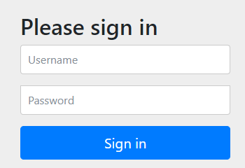
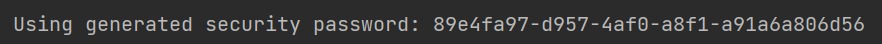
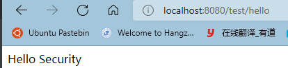

# 1.	概述

SpringSecurity基于Spring框架，提供了一套Web应用安全性的完整解决方案。

Web应用的安全性包括**用户认证(Authentication)**和**用户授权(Authorization)**两个部分，也是SpringSecurity的重要核心功能

> - 用户认证：验证某用户是否为系统中的合法主体，即用户能否访问该系统，一般要求用户提供用户名和密码，系统通过校验用户名和和密码来完成认证过程，简单地说就是系统认为用户是否能登录
> - 用户授权：验证某用户是否有权限执行某操作，简单地说就是系统判断用户是否有权限去做某些事情

## 1.1	与Shiro的横向对比

- SpringSecurity是重量级框架，Shiro是轻量级框架
- SpringSecurity旧版本只能用于Web环境，而新版本可以脱离Web环境；Shiro不局限于Web环境，但在Web环境下，一些特定需求要求手动编写代码定制


一般来说，常见的安全管理技术栈组合为

- SSM+Shiro（SSM框架整合SpringSecurity很麻烦）
- SpringBoot/SpringCloud + SpringSecurity


## 1.2	测试

新建一个SpringBoot项目，在POM中引入SpringWeb和SpringSecurity：

```xml
<dependency>
    <groupId>org.springframework.boot</groupId>
    <artifactId>spring-boot-starter-web</artifactId>
</dependency>

<dependency>
    <groupId>org.springframework.boot</groupId>
    <artifactId>spring-boot-starter-security</artifactId>
</dependency>
```

创建一个测试控制器类：

```java
@RestController
@RequestMapping("/test")
public class TestController {

    @GetMapping("hello")
    public String hello(){
        return "Hello Security";
    }
}
```

运行项目，访问localhost:8080/test/hello，发现被跳转到了localhost:8080/login页面，并且被要求登录：




这说明SpringSecurity已经正常工作，在控制台有生成的密码：



使用密码和用户名user即可登录并跳转到刚才的页面：

