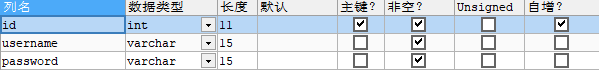

# 3.	Web权限方案

## 3.1	用户认证

### 3.1.1	设置登录的用户名和密码

#### 3.1.1.1	通过配置文件实现

我们可以在application.properties或.yml全局配置文件中配置用户名和密码：

```yaml
spring:
  security:
    user:
      name: admin
      password: admin
```


#### 3.1.1.2	通过配置类实现

我们也可以使用配置类配置用户名和密码，配置类需要继承WebSecurityConfigurerAdapter类，并重写方法：

```java
@Configuration
public class SecurityConfig extends WebSecurityConfigurerAdapter {
    @Override
    protected void configure(AuthenticationManagerBuilder auth) throws Exception {
        //使用PasswordEncoder接口对密码进行加密
        BCryptPasswordEncoder passwordEncoder = new BCryptPasswordEncoder();
        String password = passwordEncoder.encode("123");
        //配置用户名、密码、角色
        auth.inMemoryAuthentication().withUser("public").password(password).roles("admin");
    }

    @Bean
    //使用PasswordEncoder接口就需要PasswordEncoder对象
    public PasswordEncoder passwordEncoder() {
        //BCryptPasswordEncoder是基于BCrypt加密的PasswordEncoder对象
        return new BCryptPasswordEncoder();
    }
}
```


#### 3.1.1.3	自定义编写实现类

无论是配置类还是配置文件，其配置的用户名和密码都是硬编码，灵活性差，为了实现从数据库查找用户名和密码并使用，我们应当自定义编写实现类

1. 实现UserDetailsService接口，重写用户认证处理逻辑，返回User对象，User对象有用户名密码和操作权限
2. 创建配置类，设置使用我们自定义的UserDetailsService实现类

```java
//自定义实现UserDetailsService接口
@Service("userDetailsService")
public class MyUserDetailsService implements UserDetailsService {
    @Override
    //实现UserDetailsService接口必须实现方法loadUserByUsername
    //该方法需要返回一个UserDetails对象，实际上就是一个User对象，其中记录了用户名、密码和权限
    public UserDetails loadUserByUsername(String username) throws UsernameNotFoundException {
        //根据K-V获取对应权限
        List<GrantedAuthority> auths = AuthorityUtils.commaSeparatedStringToAuthorityList("role");
        return new User("public", new BCryptPasswordEncoder().encode("123"), auths);
    }
}

//创建配置类，设置自定义的UserDetailsService实现类
@Configuration
public class SecurityConfig extends WebSecurityConfigurerAdapter {

    @Autowired
    private UserDetailsService userDetailsService;

    @Override
    protected void configure(AuthenticationManagerBuilder auth) throws Exception {
        //设置UserDetailsService接口实现类和对应的PasswordEncoder接口实现类
        auth.userDetailsService(userDetailsService).passwordEncoder(passwordEncoder());
    }

    @Bean
    //使用PasswordEncoder接口就需要PasswordEncoder对象
    public PasswordEncoder passwordEncoder() {
        //BCryptPasswordEncoder是基于BCrypt加密的PasswordEncoder对象
        return new BCryptPasswordEncoder();
    }
}
```


#### 3.1.1.4	整合数据库完成用户认证

引入依赖MyBatisPlus、Lombok、MySQL驱动：

```xml
<dependency>
    <groupId>com.baomidou</groupId>
    <artifactId>mybatis-plus-boot-starter</artifactId>
    <version>3.4.3.4</version>
</dependency>
<dependency>
    <groupId>org.projectlombok</groupId>
    <artifactId>lombok</artifactId>
</dependency>
<dependency>
    <groupId>mysql</groupId>
    <artifactId>mysql-connector-java</artifactId>
    <version>8.0.27</version>
</dependency>
```

创建数据库表User：



创建实体类User：

```java
@Data
public class User {
    private Integer id;
    private String username;
    private String password;
}
```

在application配置文件中配置数据库：

```yaml
spring:
  datasource:
    driver-class-name: com.mysql.cj.jdbc.Driver
    url: jdbc:mysql://localhost:3306/m_db?severTimeZone=GMT%2B8
    username: root
    password: root
```

创建MyBatis接口：

```java
@Repository
public interface UserMapper extends BaseMapper<User> {
}
```

整合MyBatis：在SpringBoot启动类上添加注解@MapperScan，扫描mapper包下的mapper：

```java
@SpringBootApplication
@MapperScan("com.example.security_demo.mapper")
public class SecurityDemoApplication {
    public static void main(String[] args) {
        SpringApplication.run(SecurityDemoApplication.class, args);
    }
}
```

重写UserDetailsService接口：

```java
@Service("userDetailsService")
public class MyUserDetailsService implements UserDetailsService {

    @Autowired
    private UserMapper userMapper;

    @Override
    public UserDetails loadUserByUsername(String username) throws UsernameNotFoundException {
        //调用UserMapper，根据用户名查询数据库
        QueryWrapper<User> wrapper = new QueryWrapper<>();
        //根据username列查询，返回User对象
        wrapper.eq("username", username);
        User user = userMapper.selectOne(wrapper);
        if(user == null){//数据库不存在该用户名，用户认证失败
            throw new UsernameNotFoundException("用户名不存在");
        }

        List<GrantedAuthority> auths = AuthorityUtils.commaSeparatedStringToAuthorityList("role");
        return new org.springframework.security.core.userdetails.User("public", new BCryptPasswordEncoder().encode("123"), auths);
    }
}
```

