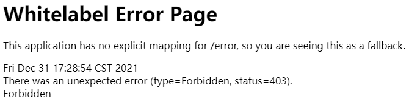
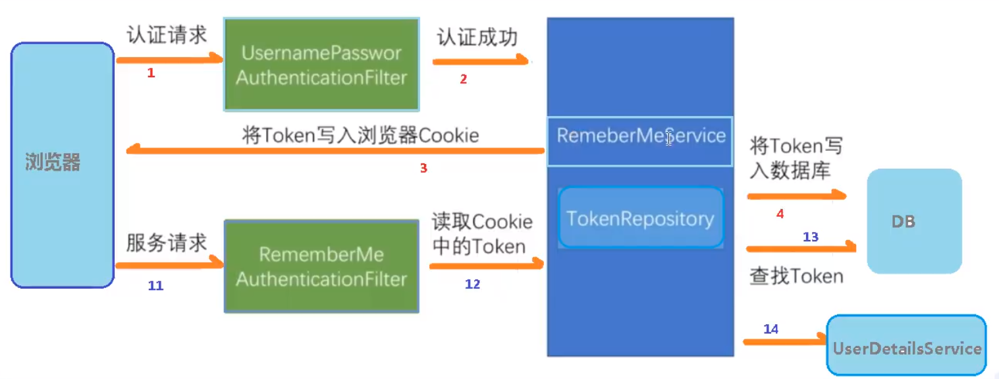
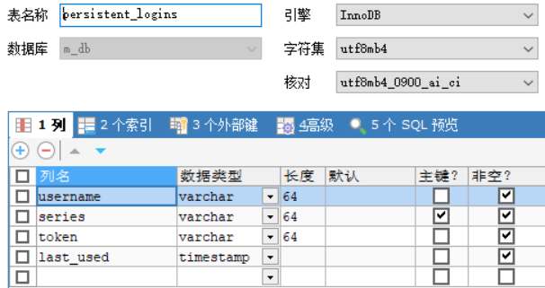
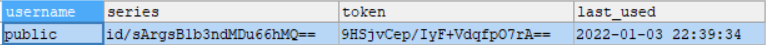

# 3.	Web权限方案

## 3.1	用户认证

### 3.1.1	设置登录的用户名和密码

#### 3.1.1.1	通过配置文件实现

我们可以在application.properties或.yml全局配置文件中配置用户名和密码：

```yaml
spring:
  security:
    user:
      name: admin
      password: admin
```


#### 3.1.1.2	通过配置类实现

我们也可以使用配置类配置用户名和密码，配置类需要继承WebSecurityConfigurerAdapter类，并重写方法：

```java
@Configuration
public class SecurityConfig extends WebSecurityConfigurerAdapter {
    @Override
    protected void configure(AuthenticationManagerBuilder auth) throws Exception {
        //使用PasswordEncoder接口对密码进行加密
        BCryptPasswordEncoder passwordEncoder = new BCryptPasswordEncoder();
        String password = passwordEncoder.encode("123");
        //配置用户名、密码、角色
        auth.inMemoryAuthentication().withUser("public").password(password).roles("admin");
    }

    @Bean
    //使用PasswordEncoder接口就需要PasswordEncoder对象
    public PasswordEncoder passwordEncoder() {
        //BCryptPasswordEncoder是基于BCrypt加密的PasswordEncoder对象
        return new BCryptPasswordEncoder();
    }
}
```


#### 3.1.1.3	自定义编写实现类

无论是配置类还是配置文件，其配置的用户名和密码都是硬编码，灵活性差，为了实现从数据库查找用户名和密码并使用，我们应当自定义编写实现类

1. 实现UserDetailsService接口，重写用户认证处理逻辑，返回User对象，User对象有用户名密码和操作权限
2. 创建配置类，设置使用我们自定义的UserDetailsService实现类

```java
//自定义实现UserDetailsService接口
@Service("userDetailsService")
public class MyUserDetailsService implements UserDetailsService {
    @Override
    //实现UserDetailsService接口必须实现方法loadUserByUsername
    //该方法需要返回一个UserDetails对象，实际上就是一个User对象，其中记录了用户名、密码和权限
    public UserDetails loadUserByUsername(String username) throws UsernameNotFoundException {
        //根据K-V获取对应权限
        List<GrantedAuthority> auths = AuthorityUtils.commaSeparatedStringToAuthorityList("role");
        return new User("public", new BCryptPasswordEncoder().encode("123"), auths);
    }
}

//创建配置类，设置自定义的UserDetailsService实现类
@Configuration
public class SecurityConfig extends WebSecurityConfigurerAdapter {

    @Autowired
    private UserDetailsService userDetailsService;

    @Override
    protected void configure(AuthenticationManagerBuilder auth) throws Exception {
        //设置UserDetailsService接口实现类和对应的PasswordEncoder接口实现类
        auth.userDetailsService(userDetailsService).passwordEncoder(passwordEncoder());
    }

    @Bean
    //使用PasswordEncoder接口就需要PasswordEncoder对象
    public PasswordEncoder passwordEncoder() {
        //BCryptPasswordEncoder是基于BCrypt加密的PasswordEncoder对象
        return new BCryptPasswordEncoder();
    }
}
```


#### 3.1.1.4	整合数据库完成用户认证

引入依赖MyBatisPlus、Lombok、MySQL驱动：

```xml
<dependency>
    <groupId>com.baomidou</groupId>
    <artifactId>mybatis-plus-boot-starter</artifactId>
    <version>3.4.3.4</version>
</dependency>
<dependency>
    <groupId>org.projectlombok</groupId>
    <artifactId>lombok</artifactId>
</dependency>
<dependency>
    <groupId>mysql</groupId>
    <artifactId>mysql-connector-java</artifactId>
    <version>8.0.27</version>
</dependency>
```

创建数据库表User：


创建实体类User：

```java
@Data
public class User {
    private Integer id;
    private String username;
    private String password;
}
```

在application配置文件中配置数据库：

```yaml
spring:
  datasource:
    driver-class-name: com.mysql.cj.jdbc.Driver
    url: jdbc:mysql://localhost:3306/m_db?severTimeZone=GMT%2B8
    username: root
    password: root
```

创建MyBatis接口：

```java
@Repository
public interface UserMapper extends BaseMapper<User> {
}
```

整合MyBatis：在SpringBoot启动类上添加注解@MapperScan，扫描mapper包下的mapper：

```java
@SpringBootApplication
@MapperScan("com.example.security_demo.mapper")
public class SecurityDemoApplication {
    public static void main(String[] args) {
        SpringApplication.run(SecurityDemoApplication.class, args);
    }
}
```

重写UserDetailsService接口：

```java
@Service("userDetailsService")
public class MyUserDetailsService implements UserDetailsService {

    @Autowired
    private UserMapper userMapper;

    @Override
    public UserDetails loadUserByUsername(String username) throws UsernameNotFoundException {
        //调用UserMapper，根据用户名查询数据库
        QueryWrapper<User> wrapper = new QueryWrapper<>();
        //根据username列查询，返回User对象
        wrapper.eq("username", username);
        User user = userMapper.selectOne(wrapper);
        if(user == null){//数据库不存在该用户名，用户认证失败
            throw new UsernameNotFoundException("用户名不存在");
        }

        List<GrantedAuthority> auths = AuthorityUtils.commaSeparatedStringToAuthorityList("role");
        return new org.springframework.security.core.userdetails.User("public", new BCryptPasswordEncoder().encode("123"), auths);
    }
}
```


#### 3.1.1.5	自定义登录界面

要定义登录界面，需要重写Config配置类的configure()方法：

```java
@Override
protected void configure(HttpSecurity http) throws Exception {
    http.formLogin()//自定义登录页面
            .loginPage("/login.html")//设置登录页面
            .loginProcessingUrl("/user/login")//设置登录请求对应的路径
            .defaultSuccessUrl("/test/index").permitAll()//设置访问成功跳转的路径
        .and().authorizeRequests()
        	.antMatchers("/", "/test/hello", "/user/login").permitAll()//设置不需要用户认证的路径
        .anyRequest().authenticated()
        .and().csrf().disable();//关闭csrf防护
}
```

创建login.html：

```html
<!DOCTYPE html>
<html lang="en">
<head>
    <meta charset="UTF-8">
    <title>Login</title>
</head>
<body>
    <form method="post" action="/user/login" class="form">
        用户名：<input type="text" name="username"/><br/>
        密码：<input type="password" name="password"><br/>
        <input type="submit" value="login">
    </form>
</body>
</html>
```


## 3.2	用户授权

### 3.2.1	基于权限的访问控制

#### 3.2.1.1	hasAuthority()

hasAuthority()方法会检查登录用户是否**具有指定权限**，否则拒绝访问（403 Forbidden）

```java
@Override
protected void configure(HttpSecurity http) throws Exception {
    http.formLogin()
            .loginPage("/login.html")
            .loginProcessingUrl("/user/login")
            .defaultSuccessUrl("/test/index").permitAll()
        .and().authorizeRequests().antMatchers("/", "/test/hello", "/user/login").permitAll()
            .antMatchers("/test/index").hasAuthority("test")//要求访问/test/index路径的用户必须具有test权限
        .anyRequest().authenticated()
        .and().csrf().disable();
}
```

当不具有指定权限的用户访问受限路径时，会被服务器禁止访问：




#### 3.2.1.2	hasAnyAuthority()

与hasAuthority()方法类似，hasAnyAuthority()方法要求登录用户具有指定权限中的一种才可访问：

```java
.antMatchers("/test/index").hasAnyAuthority("admin", "user", "visitor")
```


### 3.2.2	基于角色的访问控制

#### 3.2.2.1	hasRole()

与hasAuthority()方法类似，hasRole()方法要求登录用户角色必须为指定角色

```java
.antMatchers("/test/index").hasRole("admin")
```

**需要注意的是**，hasRole()源码中要求**定义的角色名必须以ROLE_为前缀**：

```java
public ExpressionUrlAuthorizationConfigurer(ApplicationContext context) {
    String[] grantedAuthorityDefaultsBeanNames = context.getBeanNamesForType(GrantedAuthorityDefaults.class);
    if (grantedAuthorityDefaultsBeanNames.length == 1) {
        GrantedAuthorityDefaults grantedAuthorityDefaults = (GrantedAuthorityDefaults)context.getBean(grantedAuthorityDefaultsBeanNames[0], GrantedAuthorityDefaults.class);
        this.rolePrefix = grantedAuthorityDefaults.getRolePrefix();
    } else {
        this.rolePrefix = "ROLE_";//定义的角色名必须以ROLE_为前缀：
    }

    this.REGISTRY = new ExpressionUrlAuthorizationConfigurer.ExpressionInterceptUrlRegistry(context);
}
```


#### 3.2.2.2	hasAnyRole()

与hasAnyAuthority()类似，不多赘述


### 3.2.3	基于权限和基于角色访问控制的问题

在SpringSecurity源码中，基于权限访问使用hasAuthority()、hasAnyAuthority()方法，基于角色访问使用hasRole()、hasAnyRole()方法，但它们在判断逻辑上是几乎完全一致的，只是基于角色访问时要求角色名必须以ROLE_为前缀

因此在判断上它们没有区别，只是在系统权限和角色划分的逻辑上作区分


### 3.2.4	自定义403页面

要自定义403页面，只需要在Config配置类中进行配置：

```java
@Override
protected void configure(HttpSecurity http) throws Exception {
    //配置没有权限访问跳转到的页面(403)
    http.exceptionHandling().accessDeniedPage("/unauth.html");
}
```

创建自定义403页面unauth.html：

```html
<!DOCTYPE html>
<html lang="en">
<head>
    <meta charset="UTF-8">
    <title>Title</title>
</head>
<body>
    <h1>没有访问权限</h1>
</body>
</html>
```


## 3.3	使用注解进行认证授权

### 3.3.1	@Secured

**@Secured注解**判断登录用户是否具有指定角色，同样**要求角色名前缀为"ROLE_"**

```java
@GetMapping("/update")
@Secured({"ROLE_update", "ROLE_admin"})
public String update() {
    return "Hello Update";
}
```

要使用@Secured注解，必须在启动类上添加注解@EnableGlobalMethodSecurity(securedEnabled=true)，启动注解功能：

```java
@EnableGlobalMethodSecurity(securedEnabled = true)
public class DemoApplication {
```


### 3.3.2	@PreAuthorize

**@PreAuthorize注解**在**进入方法前**进行权限验证，可以将登录用户的角色或权限参数传入到方法中：

```java
@GetMapping("/update")
@PreAuthorize("hasAnyAuthority('admins')")
public String update() {
    return "Hello Update";
}
```

要使用@PreAuthorize注解，必须在启动器类上添加注解：

```java
@EnableGlobalMethodSecurity(securedEnabled = true, prePostEnabled = true)
```


### 3.3.3	@PostAuthorize

**@PostAuthorize注解**在**方法执行之后**进行权限验证：

```java
@GetMapping("/update")
@PostAuthorize("hasAnyAuthority('admins')")
public String update() {
    return "Hello Update";
}
```

要使用@PreAuthorize注解，必须在启动器类上添加注解：

```java
@EnableGlobalMethodSecurity(securedEnabled = true, prePostEnabled = true)
```


### 3.3.4	@PostFilter

@PostFilter注解在**权限验证之后对数据进行过滤**，即**对返回数据进行过滤**，只留下指定数据：


```java
@GetMapping("/getAll")
@PreAuthorize("hasRole('ROLE_admin')")
@PostFilter("filterObject.username == 'admin1'")
//filterObject引用的是方法返回值list中的某个元素，这里只留下用户名为admin1的数据
public List<UserInfo> getAllUser(){
	ArrayList<UserInfo> list = new ArrayList<>();
	list.add(new UserInfo(1l, "admin1", "666"));
	list.add(new UserInfo(2l, "admin2", "888"));
	return list;
}
```


### 3.3.5	@PreFilter

@PreFilter在**进入控制器前对数据进行过滤**，即**对传入方法的数据进行过滤**：

```java
@GetMapping("/getAll")
@PreAuthorize("hasRole('ROLE_admin')")
@PreFilter(value = "filterObject.id%2==0")
public List<UserInfo> getAllUser(){
	ArrayList<UserInfo> list = new ArrayList<>();
	list.add(new UserInfo(1l, "admin1", "666"));
	list.add(new UserInfo(2l, "admin2", "888"));
	return list;
}
```


## 3.4	用户注销

要进行用户注销，首先需要在Config配置类中设置用户注销对应的路径：

```java
@Override
protected void configure(HttpSecurity http) throws Exception {
    //配置用户注销路径
    http.logout().logoutUrl("/logout").logoutSuccessUrl("/test/hello").permitAll();
```


## 3.5	自动登录

传统的自动登录可以基于Cookie实现，但Cookie是保存在本地的文本文件，存放用户名和密码容易造成信息泄露，安全性较差

为了解决安全性问题，同时实现自动登录，我们可以通过SpringSecurity实现基于Token的自动登录


### 3.5.1	源码和原理解析

#### 3.5.1.1	首次登录



①用户在进行登录（用户认证）时，浏览器发送认证请求，用户名密码认证过滤器UsernamePasswordAuthenticationFilter接收

②在用户名密码认证过滤器UsernamePasswordAuthenticationFilter的父类AbstractAuthenticationProcessingFilter中，有方法实现successfulAuthentication()，调用RememberMeService，执行自动登录操作逻辑：

```java
protected void successfulAuthentication(HttpServletRequest request, HttpServletResponse response, FilterChain chain, Authentication authResult) throws IOException, ServletException {
	
    ...
        
    this.rememberMeServices.loginSuccess(request, response, authResult);

    ...
}
```

③RememberMeService是一个自动登录接口，其中有实现类PersistentTokenBasedRememberMeServices，当调用RememberMeService对象的loginSuccess()方法时，执行方法onLoginSuccess()，通过TokenRepository对象管理token：

```java
protected void onLoginSuccess(HttpServletRequest request, HttpServletResponse response, Authentication successfulAuthentication) {
	...
    try {
        //创建Token，交由TokenRepository对象管理
        this.tokenRepository.createNewToken(persistentToken);
        //将Token存入Cookie
        this.addCookie(persistentToken, request, response);
    } catch (Exception var7) {
        ...
    }
}

//另外，RememberMeService的实现类PersistentTokenBasedRememberMeServices中还有方法logout()，当用户注销(退出登录)时，Token将被移除，防止下次访问时还自动登录
public void logout(HttpServletRequest request, HttpServletResponse response, Authentication authentication) {
    super.logout(request, response, authentication);
    if (authentication != null) {
        this.tokenRepository.removeUserTokens(authentication.getName());
    }
}
```

④另外，SpringSecurity还通过类JdbcTokenRepositoryImpl将刚刚生成的Token写入数据库：

```java
public void createNewToken(PersistentRememberMeToken token) {
    this.getJdbcTemplate().update(this.insertTokenSql, new Object[]{token.getUsername(), token.getSeries(), token.getTokenValue(), token.getDate()});
}
```


#### 3.5.1.2	再次登录(自动登录)

⑤当用户再次登入时，服务请求将由RememberMeAuthenticationFilter处理，执行doFilter()方法：

```java
private void doFilter(HttpServletRequest request, HttpServletResponse response, FilterChain chain) throws IOException, ServletException {
    if (SecurityContextHolder.getContext().getAuthentication() != null) {
        ...
    } else {
        //调用RememberMeService对象，执行自动登录
        Authentication rememberMeAuth = this.rememberMeServices.autoLogin(request, response);
		...
    }
}
```

⑥在RemeberMeService接口的实现类AbstractRememberMeServices中可以看到autoLogin()方法的实现：

```java
public final Authentication autoLogin(HttpServletRequest request, HttpServletResponse response) {
    String rememberMeCookie = this.extractRememberMeCookie(request);
    if (rememberMeCookie == null) {
        return null;
    } else {
        this.logger.debug("Remember-me cookie detected");
        if (rememberMeCookie.length() == 0) {
            this.logger.debug("Cookie was empty");
            this.cancelCookie(request, response);
            return null;
        } else {
            try {
                //从Cookie中解密得到Token
                String[] cookieTokens = this.decodeCookie(rememberMeCookie);
                //通过Token验证用户身份，进行用户认证，实现自动登录
                UserDetails user = this.processAutoLoginCookie(cookieTokens, request, response);
                this.userDetailsChecker.check(user);
                this.logger.debug("Remember-me cookie accepted");
                return this.createSuccessfulAuthentication(request, user);
            } catch (CookieTheftException var6) {
                ...
        }
    }
}
```

⑦在AbstractRememberMeServices的子类PersistentTokenBasedRememberMeServices中，实现了⑥中调用的方法processAutoLoginCookie()，验证Cookie中的Token是否合法：

```java
protected UserDetails processAutoLoginCookie(String[] cookieTokens, HttpServletRequest request, HttpServletResponse response) {
    //判断Token合法
    if (cookieTokens.length != 2) {
        throw new InvalidCookieException("Cookie token did not contain 2 tokens, but contained '" + Arrays.asList(cookieTokens) + "'");
    } else {
        String presentedSeries = cookieTokens[0];
        String presentedToken = cookieTokens[1];
        PersistentRememberMeToken token = this.tokenRepository.getTokenForSeries(presentedSeries);
        //若Token不存在
        if (token == null) {
            throw new RememberMeAuthenticationException("No persistent token found for series id: " + presentedSeries);
            //若Cookie中Token与数据库中Token值不一致
        } else if (!presentedToken.equals(token.getTokenValue())) {
            this.tokenRepository.removeUserTokens(token.getUsername());
            throw new CookieTheftException(this.messages.getMessage("PersistentTokenBasedRememberMeServices.cookieStolen", "Invalid remember-me token (Series/token) mismatch. Implies previous cookie theft attack."));
            //若Token过期
        } else if (token.getDate().getTime() + (long)this.getTokenValiditySeconds() * 1000L < System.currentTimeMillis()) {
            throw new RememberMeAuthenticationException("Remember-me login has expired");
        } else {
            this.logger.debug(LogMessage.format("Refreshing persistent login token for user '%s', series '%s'", token.getUsername(), token.getSeries()));
            PersistentRememberMeToken newToken = new PersistentRememberMeToken(token.getUsername(), token.getSeries(), this.generateTokenData(), new Date());

            try {//若Token验证成功，则更新Token并存入Cookie
                this.tokenRepository.updateToken(newToken.getSeries(), newToken.getTokenValue(), newToken.getDate());
                this.addCookie(newToken, request, response);
            } catch (Exception var9) {
                this.logger.error("Failed to update token: ", var9);
                throw new RememberMeAuthenticationException("Autologin failed due to data access problem");
            }

            return this.getUserDetailsService().loadUserByUsername(token.getUsername());
        }
    }
}
```


### 3.5.2	功能实现

3.5.1.1中提到，SpringSecurity通过类**JdbcTokenRepositoryImpl**管理数据库中的Token，其中使用数据库表**persistent_logins**，其创建SQL语句为：

```sql
create table persistent_logins (username varchar(64) not null, series varchar(64) primary key, token varchar(64) not null, last_used timestamp not null)
```

要实现自动登录功能，我们可以根据该SQL语句创建自己的**persistent_logins**表：



在Config配置类中注入数据源：

```java
//注入数据源
@Autowired
private DataSource dataSource;

@Bean
public PersistentTokenRepository persistentTokenRepository(){
    JdbcTokenRepositoryImpl jdbcTokenRepositoryImpl = new JdbcTokenRepositoryImpl();
    jdbcTokenRepositoryImpl.setDataSource(dataSource);
    return jdbcTokenRepositoryImpl;
}
```

在配置类的configure()方法中启用自动登录：

```java
//配置自动登录
.and().rememberMe().tokenRepository(persistentTokenRepository())
.tokenValiditySeconds(7*86400)//设置Token有效期，单位为秒
.userDetailsService(userDetailsService)//自定义用户认证逻辑
```

在登录页面添加用于自动登录的复选框：

```html
<input type="checkbox" name="remember-me">自动登录<br/>
```

启动SpringBoot，登录账号并勾选自动登录，刷新数据库，可以看到已经添加了相应数据：



重启服务器，直接访问/test/index也不会被SpringSecurity拦截，证明已经实现了自动登录

删除数据库相应数据，再次重启服务器，再访问/test/index时就被要求登录


## 3.6	CSRF

**跨站请求伪造(Cross-site requet forgery，CSRF)**，也称为one-click attack或session riding，通常缩写为CSRF或XSRF，是一种挟制用户在当前已登录的Web应用程序上执行非本意操作的攻击方法，与跨网站脚本(XSS)相比，XSS利用的是用户对指定网站的信任，而CSRF利用的是网站对用户网页浏览器的信任。

跨站请求攻击，简单地说，是攻击者通过技术手段欺骗用户的浏览器去访问自己曾认证过的网站并运行一些操作，如发邮件、发消息甚至财产操作如转账和购买商品。由于浏览器曾认证过，因此被访问的网站会认为是真正的用户操作而运行。这利用了Web中用户身份验证的一个漏洞：**简单的身份验证只能保证请求发自某个用户的浏览器，而不能保证请求本身是用户自愿发出的**

从SpringSecurity4.0开始，默认情况下会启用CSRF防护，**针对PATCH、POST、PUT和DELETE方法进行防护**

另外，**SpringSecurity默认放行GET,HEAD,TRACE,OPTIONS方式的请求， 不需要通过CsrfFilter过滤器检测**：

```java
private static final class DefaultRequiresCsrfMatcher implements RequestMatcher {
    private final HashSet<String> allowedMethods = new HashSet<>(
        Arrays.asList("GET", "HEAD", "TRACE", "OPTIONS"));
    @Override
    public boolean matches(HttpServletRequest request) {
        return !this.allowedMethods.contains(request.getMethod());
    }
}
```

> 之所以会默认放行GET,HEAD,TRACE,OPTIONS方式的请求，是因为：
>
> 1. 如果这个请求是通过GET方式发起的请求，意味着它只是访问服务器资源，只查询而不更新，所以SpringSecurity的防御策略是允许的；
> 2. 如果这个请求是通过POST请求发起的， 那么SpringSecurity是默认拦截这类请求的
>    因为这类请求是带有更新服务器资源的危险操作，如果恶意第三方可以通过劫持session id来更新 服务器资源，那会造成服务器数据被非法的篡改，所以这类请求是会被SpringSecurity拦截的，在默认的情况下，SpringSecurity是启用CSRF拦截功能的，这会造成在跨域的情况下，POST方式提交的请求都会被拦截无法被处理（包括合理的post请求），前端发起的post请求后端无法正常处理，虽然保证了跨域的安全性，但影响了正常使用，如果关闭csrf防护功能，虽然可以正常处理post请求，但是无法防范通过劫持session id的非法的post请求，所以SpringSecurity为了正确的区别合法的post请求，采用了token的机制 。
>

要启动CSRF防护，需要在之前配置类重写的configure()方法中解除对CSRF防护的关闭：

```java
//.and().csrf().disable();
```

CSRF防护 为了保证不是其他第三方网站访问，要求**访问时携带参数名为_csrf 值为 token(token 在服务端产生)的内容**，如果token 和服务端的 token 匹配成功，则正常访问

在使用时，我们可以采用Header或Param的方式添加csrf_token：

```HTML
<form action="/executeLogin" method="post">
    <div class="lowin-group">
        <label>用户名 <a href="#" class="login-back-link">Sign in?</a></label>
        <input type="text" name="username" class="lowin-input">
    </div>
    <div class="lowin-group password-group">
        <label>密码 <a href="#" class="forgot-link">Forgot Password?</a></label>
        <input type="password" name="password" class="lowin-input">
    </div>
    <div class="lowin-group">
        <label>验证码</label>
        <input type="text" name="kaptcha" class="lowin-input">
        
    </div>
    <div class="lowin-group">
        <label>记住我</label>
        <input name="remember-me" type="checkbox" value="true" />
    </div>
    <input type="hidden" name="_csrf">
    <input class="lowin-btn login-btn" type="submit">
</form>

<script src="https://cdnjs.cloudflare.com/ajax/libs/jquery/3.2.1/jquery.min.js"></script>   
<script>
    $(function () {
        var aCookie = document.cookie.split("; ");
        console.log(aCookie);
        for (var i=0; i < aCookie.length; i++)
        {
            var aCrumb = aCookie[i].split("=");
            if ("XSRF-TOKEN" == aCrumb[0])
                $("input[name='_csrf']").val(aCrumb[1]);
        }
    });
</script>
```

或：

```html
<form action ="/login"  method= "post">
    <input type="hidden"  th:value="${_csrf.token}"  name="_csrf"  th:if="${_csrf}"/>
    用户名：<input  type="text"  name= "username"/>< br/>
    密码:<input  type="password"  name= "password"/>< br/>
    <input  type="submit"  value="登录"/>
</form>
```

CsrfFilter中对CSRF防护的代码：

```java
protected void doFilterInternal(HttpServletRequest request, HttpServletResponse response, FilterChain filterChain) throws ServletException, IOException {
    request.setAttribute(HttpServletResponse.class.getName(), response);
    //生成Token并存入Session
    CsrfToken csrfToken = this.tokenRepository.loadToken(request);
    boolean missingToken = csrfToken == null;
    if (missingToken) {
        csrfToken = this.tokenRepository.generateToken(request);
        this.tokenRepository.saveToken(csrfToken, request, response);
    }

    request.setAttribute(CsrfToken.class.getName(), csrfToken);
    //添加CsrfToken到Request域，这里的ParameterName即上方的"_csrf"
    request.setAttribute(csrfToken.getParameterName(), csrfToken);
    //判断服务器Token和请求携带的Token是否一致，否则抛异常
    if (!this.requireCsrfProtectionMatcher.matches(request)) {
        if (this.logger.isTraceEnabled()) {
            this.logger.trace("Did not protect against CSRF since request did not match " + this.requireCsrfProtectionMatcher);
        }
		
        filterChain.doFilter(request, response);
    } else {
        String actualToken = request.getHeader(csrfToken.getHeaderName());
        if (actualToken == null) {
            actualToken = request.getParameter(csrfToken.getParameterName());
        }

        if (!equalsConstantTime(csrfToken.getToken(), actualToken)) {
            this.logger.debug(LogMessage.of(() -> {
                return "Invalid CSRF token found for " + UrlUtils.buildFullRequestUrl(request);
            }));
            AccessDeniedException exception = !missingToken ? new InvalidCsrfTokenException(csrfToken, actualToken) : new MissingCsrfTokenException(actualToken);
            this.accessDeniedHandler.handle(request, response, (AccessDeniedException)exception);
        } else {
            filterChain.doFilter(request, response);
        }
    }
}
```

