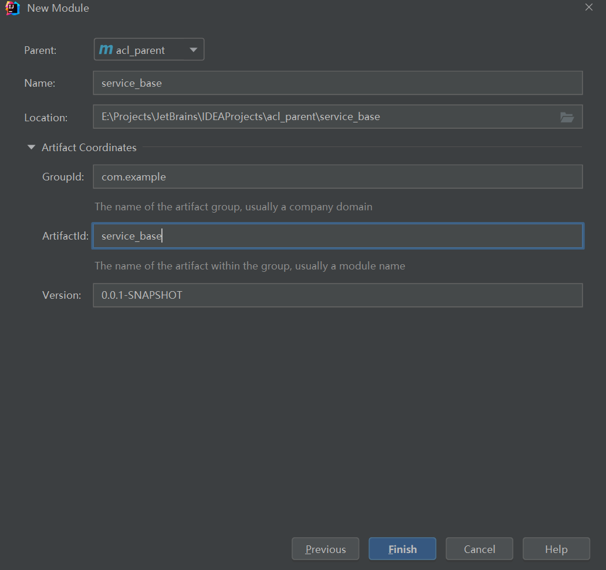

# 4.	微服务权限方案

##  4.0	微服务背景

### 4.0.1	概念

单点登录(SSO, Single Sign On)：在多个系统中，用户只需一次登录，即可登录该系统相关的所有系统

 在微服务中，为了实现单点登录，我们一般基于Token实现认证和授权，而不是基于Session


注意，第四步中，将Token存入Header


微服务权限管理主要功能：

1. 登录(用户认证)
2. 添加角色
3. 为角色分配权限
4. 添加用户
5. 为用户分配角色


### 4.0.2	权限管理数据模型

权限管理所需的数据库表：


### 4.0.3	环境搭建

#### 4.0.3.1	项目创建

搭建项目工程：

​	创建父工程 acl_parent：管理依赖版本


在pom.xml中添加：

```xml
<artifactId>acl_parent</artifactId>
<packaging>pom</packaging>
<version>0.0.1-SNAPSHOT</version>
```

由于父工程只管理模块和依赖版本，不编写代码，因此删去src文件夹即可

​	在父工程中创建子模块：

​		(1)common


修改pom.xml：

```xml
<artifactId>common</artifactId>
<packaging>pom</packaging>
```

​				

​				service_base：工具类



​				spring_security：权限配置

​		(2)infrastructure

​				api_gateway：网关

​		(3)service

​				service_acl：权限管理微服务模块


在各pom中使用<modules>体现层次关系：

```xml
<modules>
    <module>common</module>
    <module>infrastructure</module>
    <module>service</module>
</modules>
```


#### 4.0.3.2	POM管理依赖

在父项目acl_parent的pom.xml中添加项目依赖版本管理：

```xml
<!--规定使用的依赖版本-->
<properties>
    <java.version>1.8</java.version>
    <mybatis-plus.version>3.5.0</mybatis-plus.version>
    <velocity.version>2.0</velocity.version>
    <swagger.version>2.7.0</swagger.version>
    <jwt.version>0.7.0</jwt.version>
    <fastjson.version>1.2.28</fastjson.version>
    <gson.version>2.8.2</gson.version>
    <json.version>20170516</json.version>
    <cloud-alibaba.version>0.2.2.RELEASE</cloud-alibaba.version>
</properties>


<!--这里使用的依赖版本直接从properties标签中取值-->
<dependencyManagement>
    <dependencies>
        <!--Spring Cloud-->
        <dependency>
            <groupId>org.springframework.cloud</groupId>
            <artifactId>spring-cloud-dependencies</artifactId>
            <version>Hoxton.RELEASE</version>
            <type>pom</type>
            <scope>import</scope>
        </dependency>

        <dependency>
            <groupId>org.springframework.cloud</groupId>
            <artifactId>spring-cloud-alibaba-dependencies</artifactId>
            <version>${cloud-alibaba.version}</version>
            <type>pom</type>
            <scope>import</scope>
        </dependency>

        <!--mybatis-plus持久层-->
        <dependency>
            <groupId>com.baomidou</groupId>
            <artifactId>mybatis-plus-boot-starter</artifactId>
            <version>${mybatis-plus.version}</version>
        </dependency>

        <!-- velocity模板引擎, Mybatis Plus 代码生成器需要-->
        <dependency>
            <groupId>org.apache.velocity</groupId>
            <artifactId>velocity-engine-core</artifactId>
            <version>${velocity.version}</version>
        </dependency>

        <dependency>
            <groupId>com.google.code.gson</groupId>
            <artifactId>gson</artifactId>
            <version>${gson.version}</version>
        </dependency>

        <!--swagger-->
        <dependency>
            <groupId>io.springfox</groupId>
            <artifactId>springfox-swagger2</artifactId>
            <version>${swagger.version}</version>
        </dependency>

        <!--swagger ui-->
        <dependency>
            <groupId>io.springfox</groupId>
            <artifactId>springfox-swagger-ui</artifactId>
            <version>${swagger.version}</version>
        </dependency>

        <!-- JWT -->
        <dependency>
            <groupId>io.jsonwebtoken</groupId>
            <artifactId>jjwt</artifactId>
            <version>${jwt.version}</version>
        </dependency>

        <dependency>
            <groupId>com.alibaba</groupId>
            <artifactId>fastjson</artifactId>
            <version>${fastjson.version}</version>
        </dependency>
        <dependency>
            <groupId>org.json</groupId>
            <artifactId>json</artifactId>
            <version>${json.version}</version>
        </dependency>
    </dependencies>
</dependencyManagement>
```


修改common中的pom.xml的依赖：

```xml
<dependencies>
    <dependency>
        <groupId>org.springframework.boot</groupId>
        <artifactId>spring-boot-starter-web</artifactId>
        <scope>provided </scope>
    </dependency>

    <dependency>
        <groupId>com.baomidou</groupId>
        <artifactId>mybatis-plus-boot-starter</artifactId>
        <scope>provided </scope>
    </dependency>

    <dependency>
        <groupId>org.projectlombok</groupId>
        <artifactId>lombok</artifactId>
        <scope>provided </scope>
    </dependency>
    <!--swagger-->
    <dependency>
        <groupId>io.springfox</groupId>
        <artifactId>springfox-swagger2</artifactId>
        <scope>provided </scope>
    </dependency>
    <dependency>
        <groupId>io.springfox</groupId>
        <artifactId>springfox-swagger-ui</artifactId>
        <scope>provided </scope>
    </dependency>
    <!-- redis -->
    <dependency>
        <groupId>org.springframework.boot</groupId>
        <artifactId>spring-boot-starter-data-redis</artifactId>
    </dependency>

    <dependency>
        <groupId>org.apache.commons</groupId>
        <artifactId>commons-pool2</artifactId>
        <version>2.6.0</version>
    </dependency>
</dependencies>
```


修改spring_security中pom.xml依赖：

```xml
<dependencies>
    <dependency>
        <groupId>com.example</groupId>
        <artifactId>service_base</artifactId>
        <version>0.0.1-SNAPSHOT</version>
    </dependency>

    <dependency>
        <groupId>org.springframework.boot</groupId>
        <artifactId>spring-boot-starter-security</artifactId>
    </dependency>

    <dependency>
        <groupId>io.jsonwebtoken</groupId>
        <artifactId>jjwt</artifactId>
    </dependency>
</dependencies>
```


修改api_gateway中pom.xml依赖：

```xml
<dependencies>
    <dependency>
        <groupId>com.example</groupId>
        <artifactId>service_base</artifactId>
        <version>0.0.1-SNAPSHOT</version>
    </dependency>
	<dependency>
        <groupId>org.springframework.cloud</groupId>
        <artifactId>spring-cloud-starter-alibaba-nacos-discovery</artifactId>
    </dependency>

    <dependency>
        <groupId>org.springframework.cloud</groupId>
        <artifactId>spring-cloud-starter-gateway</artifactId>
    </dependency>

    <!--gson-->
    <dependency>
        <groupId>com.google.code.gson</groupId>
        <artifactId>gson</artifactId>
    </dependency>

    <dependency>
        <groupId>org.springframework.cloud</groupId>
        <artifactId>spring-cloud-starter-openfeign</artifactId>
    </dependency>
</dependencies>
```
修改service中pom.xml依赖：

```xml
<dependencies>
    <dependency>
        <groupId>com.example</groupId>
        <artifactId>service_base</artifactId>
        <version>0.0.1-SNAPSHOT</version>
    </dependency>

    <dependency>
        <groupId>org.springframework.cloud</groupId>
        <artifactId>spring-cloud-starter-alibaba-nacos-discovery</artifactId>
    </dependency>

    <dependency>
        <groupId>org.springframework.cloud</groupId>
        <artifactId>spring-cloud-starter-openfeign</artifactId>
    </dependency>

    <dependency>
        <groupId>org.springframework.boot</groupId>
        <artifactId>spring-boot-starter-web</artifactId>
    </dependency>

    <!--mybatis-plus-->
    <dependency>
        <groupId>com.baomidou</groupId>
        <artifactId>mybatis-plus-boot-starter</artifactId>
    </dependency>
    <!--swagger-->
    <dependency>
        <groupId>io.springfox</groupId>
        <artifactId>springfox-swagger2</artifactId>
    </dependency>
    <dependency>
        <groupId>io.springfox</groupId>
        <artifactId>springfox-swagger-ui</artifactId>
    </dependency>
    <!--mysql-->
    <dependency>
        <groupId>mysql</groupId>
        <artifactId>mysql-connector-java</artifactId>
    </dependency>

    <dependency>
        <groupId>org.apache.velocity</groupId>
        <artifactId>velocity-engine-core</artifactId>
    </dependency>

    <dependency>
        <groupId>org.projectlombok</groupId>
        <artifactId>lombok</artifactId>
    </dependency>
    <!--gson-->
    <dependency>
        <groupId>com.google.code.gson</groupId>
        <artifactId>gson</artifactId>
    </dependency>
</dependencies>
```


修改service_acl中依赖：

```xml
<dependencies>
    <dependency>
        <groupId>com.example</groupId>
        <artifactId>spring_security</artifactId>
        <version>0.0.1-SNAPSHOT</version>
    </dependency>
    <dependency>
        <groupId>com.alibaba</groupId>
        <artifactId>fastjson</artifactId>
    </dependency>
</dependencies>
```


#### 4.0.3.3	启动Redis和Nacos

安装、配置和启动Redis、Nacos


Nacos负责服务的发现和注册，访问地址为localhost:8848/nacos，登录用户名和密码都为nacos


### 4.0.4	编写Common工具类

编写service_base模块：


代码见微服务源码

编写spring_security模块：


### 4.0.5	编写service服务类


### 4.0.6	编写api_gateway网关配置类

跨域(Cross-Origin)：通信协议、IP地址、端口号三者任一不同即为跨域

我们要解决前后端端口号不一致导致的跨域问题


### 4.0.7	整合前端

将前端项目中config/dev.env.js中端口号与网关模块application配置文件中配置的端口号修改为相同